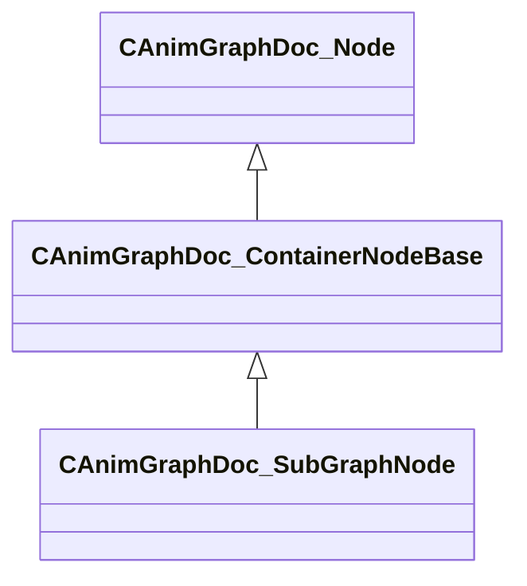

[Schemas](../../schemas.md) / [animgraphdoclib](../animgraphdoclib.md) / CAnimGraphDoc_SubGraphNode

# CAnimGraphDoc_SubGraphNode

**Kind:** class · **Size:** 176 bytes (`0xb0`) · **Align:** 8 · **Module:** animgraphdoclib

**Inherits from:** [CAnimGraphDoc_ContainerNodeBase](../animgraphdoclib/CAnimGraphDoc_ContainerNodeBase.md)

**Metadata:** `MPropertyFriendlyName SubGraph`

**Relationships:**

## Memory layout

10 fields (2 declared here, 8 inherited). Offsets are absolute from the object base.

| Offset | Field | Type | From | Annotations |
|--------|-------|------|------|-------------|
| `0x20` | `m_sName` | CUtlString | [CAnimGraphDoc_Node](../animgraphdoclib/CAnimGraphDoc_Node.md) | `MPropertyFriendlyName Name` `MPropertySortPriority 100` |
| `0x28` | `m_vecPosition` | Vector2D | [CAnimGraphDoc_Node](../animgraphdoclib/CAnimGraphDoc_Node.md) | `MPropertyGroupName Debug` `MPropertySortPriority -100` |
| `0x30` | `m_nNodeID` | [AnimNodeID](../modellib/AnimNodeID.md) | [CAnimGraphDoc_Node](../animgraphdoclib/CAnimGraphDoc_Node.md) | `MPropertyGroupName Debug` `MPropertySortPriority -100` |
| `0x34` | `m_bDebugThisNode` | bool | [CAnimGraphDoc_Node](../animgraphdoclib/CAnimGraphDoc_Node.md) | `MPropertyFriendlyName Debug This Node` `MPropertyGroupName Debug` `MPropertySortPriority -100` |
| `0x38` | `m_networkMode` | [AnimNodeNetworkMode](../!GlobalTypes/AnimNodeNetworkMode.md) | [CAnimGraphDoc_Node](../animgraphdoclib/CAnimGraphDoc_Node.md) | `MPropertyFriendlyName Network Mode` `MPropertySortPriority -110` |
| `0x48` | `m_inputNodeID` | [AnimNodeID](../modellib/AnimNodeID.md) | [CAnimGraphDoc_ContainerNodeBase](../animgraphdoclib/CAnimGraphDoc_ContainerNodeBase.md) | `MPropertySuppressField` |
| `0x4c` | `m_outputNodeID` | [AnimNodeID](../modellib/AnimNodeID.md) | [CAnimGraphDoc_ContainerNodeBase](../animgraphdoclib/CAnimGraphDoc_ContainerNodeBase.md) | `MPropertySuppressField` |
| `0x50` | `m_inputConnectionMap` | CUtlHashtable< [AnimNodeOutputID](../modellib/AnimNodeOutputID.md), [CAnimGraphDoc_NodeConnection](../animgraphdoclib/CAnimGraphDoc_NodeConnection.md) > | [CAnimGraphDoc_ContainerNodeBase](../animgraphdoclib/CAnimGraphDoc_ContainerNodeBase.md) | `MPropertySuppressField` |
| `0x70` | `m_subGraphFilename` | CUtlString |  | `MPropertyAttributeEditor AssetBrowse( vsubgrph, *requiredoubleclick  )` `MPropertyFriendlyName SubGraph File` |
| `0x78` | `m_animNameMap` | CUtlHashtable< CUtlString, CUtlString > |  | `MPropertySuppressField` |

KV3 class defaults

<pre>{
	&quot;_class&quot;: &quot;CAnimGraphDoc_SubGraphNode&quot;,
	&quot;m_sName&quot;: &quot;Unnamed&quot;,
	&quot;m_vecPosition&quot;:
	[
		0.000000,
		0.000000
	],
	&quot;m_nNodeID&quot;:
	{
		&quot;m_id&quot;: &lt;HIDDEN FOR DIFF&gt;,
	},
	&quot;m_bDebugThisNode&quot;: false,
	&quot;m_networkMode&quot;: &quot;ServerAuthoritative&quot;,
	&quot;m_inputNodeID&quot;:
	{
		&quot;m_id&quot;: &lt;HIDDEN FOR DIFF&gt;,
	},
	&quot;m_outputNodeID&quot;:
	{
		&quot;m_id&quot;: &lt;HIDDEN FOR DIFF&gt;,
	},
	&quot;m_inputConnectionMap&quot;:
	[
	],
	&quot;m_subGraphFilename&quot;: &quot;&quot;,
	&quot;m_animNameMap&quot;:
	{
	}
}</pre>

