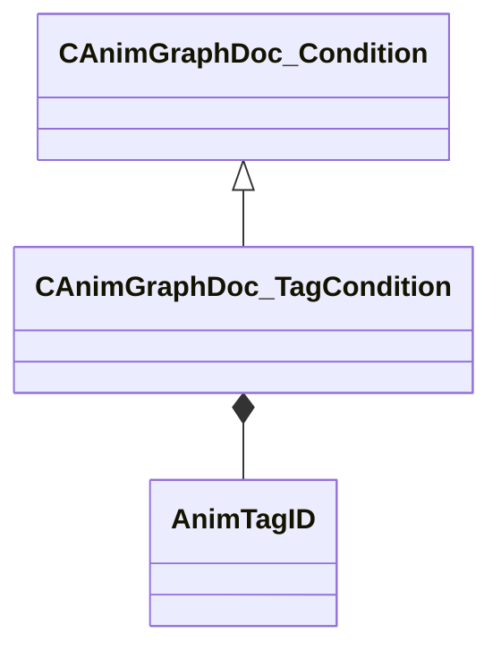

[Schemas](../../schemas.md) / [animgraphdoclib](../animgraphdoclib.md) / CAnimGraphDoc_TagCondition

# CAnimGraphDoc_TagCondition

> Source: **Build 25000182** · 2026-08-28 · `windows-x86_64` · schema `0.10.0`

**Kind:** class · **Size:** 48 bytes (`0x30`) · **Align:** 8 · **Module:** animgraphdoclib

**Inherits from:** [CAnimGraphDoc_Condition](../animgraphdoclib/CAnimGraphDoc_Condition.md)

**Metadata:** `MPropertyFriendlyName Tag Condition`

**Relationships:**

## Memory layout

3 fields (3 declared here, 0 inherited). Offsets are absolute from the object base.

| Offset | Field | Type | From | Annotations |
|--------|-------|------|------|-------------|
| `0x28` | `m_tagID` | [AnimTagID](../modellib/AnimTagID.md) |  | `MPropertyAttributeChoiceName Tag` `MPropertyFriendlyName Tag` |
| `0x2c` | `m_comparisonValue` | bool |  | `MPropertyFriendlyName Value` |
| `0x2d` | `m_latestValue` | bool |  | `MPropertyFriendlyName Lastest Value` |

KV3 class defaults

<pre>{
	&quot;_class&quot;: &quot;CAnimGraphDoc_TagCondition&quot;,
	&quot;m_tagID&quot;:
	{
		&quot;m_id&quot;: &lt;HIDDEN FOR DIFF&gt;,
	},
	&quot;m_comparisonValue&quot;: true,
	&quot;m_latestValue&quot;: false
}</pre>

