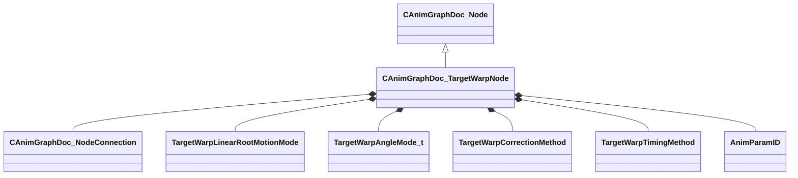

[Schemas](../../schemas.md) / [animgraphdoclib](../animgraphdoclib.md) / CAnimGraphDoc_TargetWarpNode

# CAnimGraphDoc_TargetWarpNode

**Kind:** class · **Size:** 128 bytes (`0x80`) · **Align:** 8 · **Module:** animgraphdoclib

**Inherits from:** [CAnimGraphDoc_Node](../animgraphdoclib/CAnimGraphDoc_Node.md)

**Metadata:** `MPropertyFriendlyName Target Warp`

**Relationships:**

## Memory layout

21 fields (16 declared here, 5 inherited). Offsets are absolute from the object base.

| Offset | Field | Type | From | Annotations |
|--------|-------|------|------|-------------|
| `0x20` | `m_sName` | CUtlString | [CAnimGraphDoc_Node](../animgraphdoclib/CAnimGraphDoc_Node.md) | `MPropertyFriendlyName Name` `MPropertySortPriority 100` |
| `0x28` | `m_vecPosition` | Vector2D | [CAnimGraphDoc_Node](../animgraphdoclib/CAnimGraphDoc_Node.md) | `MPropertyGroupName Debug` `MPropertySortPriority -100` |
| `0x30` | `m_nNodeID` | [AnimNodeID](../modellib/AnimNodeID.md) | [CAnimGraphDoc_Node](../animgraphdoclib/CAnimGraphDoc_Node.md) | `MPropertyGroupName Debug` `MPropertySortPriority -100` |
| `0x34` | `m_bDebugThisNode` | bool | [CAnimGraphDoc_Node](../animgraphdoclib/CAnimGraphDoc_Node.md) | `MPropertyFriendlyName Debug This Node` `MPropertyGroupName Debug` `MPropertySortPriority -100` |
| `0x38` | `m_networkMode` | [AnimNodeNetworkMode](../animgraphlib/AnimNodeNetworkMode.md) | [CAnimGraphDoc_Node](../animgraphdoclib/CAnimGraphDoc_Node.md) | `MPropertyFriendlyName Network Mode` `MPropertySortPriority -110` |
| `0x40` | `m_inputConnection` | [CAnimGraphDoc_NodeConnection](../animgraphdoclib/CAnimGraphDoc_NodeConnection.md) |  | `MPropertySuppressField` |
| `0x48` | `m_eLinearRootMotionMode` | [TargetWarpLinearRootMotionMode](../animgraphdoclib/TargetWarpLinearRootMotionMode.md) |  | `MPropertyAutoRebuildOnChange` `MPropertyFriendlyName Linear Root Motion Mode` |
| `0x4c` | `m_eAngleMode` | [TargetWarpAngleMode_t](../animgraphlib/TargetWarpAngleMode_t.md) |  | `MPropertyFriendlyName Angle Mode` |
| `0x50` | `m_eCorrectionMethod` | [TargetWarpCorrectionMethod](../animgraphlib/TargetWarpCorrectionMethod.md) |  | `MPropertyFriendlyName Correction Method` |
| `0x54` | `m_eTargetWarpTimingMethod` | [TargetWarpTimingMethod](../animgraphlib/TargetWarpTimingMethod.md) |  | `MPropertyFriendlyName Timing Method` |
| `0x58` | `m_moveHeadingParamID` | [AnimParamID](../modellib/AnimParamID.md) |  | `MPropertyAttributeChoiceName FloatParameter` `MPropertyFriendlyName Move Heading` |
| `0x5c` | `m_desiredMoveHeadingParamID` | [AnimParamID](../modellib/AnimParamID.md) |  | `MPropertyAttributeChoiceName FloatParameter` `MPropertyFriendlyName Desired Move Heading` |
| `0x60` | `m_targetPositionParamID` | [AnimParamID](../modellib/AnimParamID.md) |  | `MPropertyAttrStateCallback` `MPropertyAttributeChoiceName VectorParameter` `MPropertyFriendlyName Target Position` |
| `0x64` | `m_bTargetPositionIsWorldSpace` | bool |  | `MPropertyAttrStateCallback` `MPropertyFriendlyName Target Position Is World Space` |
| `0x68` | `m_targetFacePositionParamID` | [AnimParamID](../modellib/AnimParamID.md) |  | `MPropertyAttributeChoiceName VectorParameter` `MPropertyFriendlyName Target Face Position` |
| `0x6c` | `m_bTargetFacePositionIsWorldSpace` | bool |  | `MPropertyFriendlyName Target Face Position Is World Space` |
| `0x70` | `m_targetUpVectorParamID` | [AnimParamID](../modellib/AnimParamID.md) |  | `MPropertyAttributeChoiceName VectorParameter` `MPropertyFriendlyName Target Up Vector (World Space)` |
| `0x74` | `m_bOnlyWarpWhenTagIsFound` | bool |  | `MPropertyDescription Only warp if there is a warp tag active. Otherwise this node will warp whenever it's active` `MPropertyFriendlyName Require warp tag` |
| `0x75` | `m_bWarpOrientationDuringTranslation` | bool |  | `MPropertyDescription If the source animation has no rotation root motion and there is no tag present that specifies rotation warp section, rotation will be introduced only during linear root motion.` `MPropertyFriendlyName Warp orientation during translation` |
| `0x78` | `m_flMaxAngle` | float32 |  | `MPropertyDescription If the angle delta between the current face direction and the target face direction is more than this angle, no warping will occur.` `MPropertyFriendlyName Max Angle` |
| `0x7c` | `m_bWarpAroundCenter` | bool |  | `MPropertyDescription If set, orientation warp pivots around the model center instead of abs origin.` `MPropertyFriendlyName Warp orientation around center` |

KV3 class defaults

<pre>{
	&quot;_class&quot;: &quot;CAnimGraphDoc_TargetWarpNode&quot;,
	&quot;m_sName&quot;: &quot;Unnamed&quot;,
	&quot;m_vecPosition&quot;:
	[
		0.000000,
		0.000000
	],
	&quot;m_nNodeID&quot;:
	{
		&quot;m_id&quot;: &lt;HIDDEN FOR DIFF&gt;,
	},
	&quot;m_bDebugThisNode&quot;: false,
	&quot;m_networkMode&quot;: &quot;ServerAuthoritative&quot;,
	&quot;m_inputConnection&quot;:
	{
		&quot;m_nodeID&quot;:
		{
			&quot;m_id&quot;: &lt;HIDDEN FOR DIFF&gt;,
		},
		&quot;m_outputID&quot;:
		{
			&quot;m_id&quot;: &lt;HIDDEN FOR DIFF&gt;,
		}
	},
	&quot;m_eLinearRootMotionMode&quot;: &quot;TargetWarpLinearRootMotionMode_Default&quot;,
	&quot;m_eAngleMode&quot;: &quot;eFacingHeading&quot;,
	&quot;m_eCorrectionMethod&quot;: &quot;ScaleMotion&quot;,
	&quot;m_eTargetWarpTimingMethod&quot;: &quot;ReachDestinationOnRootMotionEnd&quot;,
	&quot;m_moveHeadingParamID&quot;:
	{
		&quot;m_id&quot;: &lt;HIDDEN FOR DIFF&gt;,
	},
	&quot;m_desiredMoveHeadingParamID&quot;:
	{
		&quot;m_id&quot;: &lt;HIDDEN FOR DIFF&gt;,
	},
	&quot;m_targetPositionParamID&quot;:
	{
		&quot;m_id&quot;: &lt;HIDDEN FOR DIFF&gt;,
	},
	&quot;m_bTargetPositionIsWorldSpace&quot;: false,
	&quot;m_targetFacePositionParamID&quot;:
	{
		&quot;m_id&quot;: &lt;HIDDEN FOR DIFF&gt;,
	},
	&quot;m_bTargetFacePositionIsWorldSpace&quot;: false,
	&quot;m_targetUpVectorParamID&quot;:
	{
		&quot;m_id&quot;: &lt;HIDDEN FOR DIFF&gt;,
	},
	&quot;m_bOnlyWarpWhenTagIsFound&quot;: false,
	&quot;m_bWarpOrientationDuringTranslation&quot;: false,
	&quot;m_flMaxAngle&quot;: 180.000000,
	&quot;m_bWarpAroundCenter&quot;: false
}</pre>

