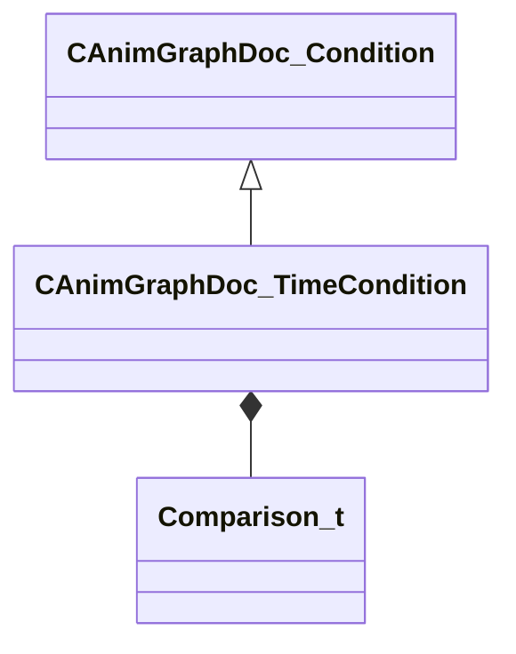

[Schemas](../../schemas.md) / [animgraphdoclib](../animgraphdoclib.md) / CAnimGraphDoc_TimeCondition

# CAnimGraphDoc_TimeCondition

**Kind:** class · **Size:** 56 bytes (`0x38`) · **Align:** 8 · **Module:** animgraphdoclib

**Inherits from:** [CAnimGraphDoc_Condition](../animgraphdoclib/CAnimGraphDoc_Condition.md)

**Metadata:** `MPropertyFriendlyName Time Condition`

**Relationships:**

## Memory layout

2 fields (2 declared here, 0 inherited). Offsets are absolute from the object base.

| Offset | Field | Type | From | Annotations |
|--------|-------|------|------|-------------|
| `0x28` | `m_comparisonOp` | [Comparison_t](../!GlobalTypes/Comparison_t.md) |  |  |
| `0x30` | `m_comparisonString` | CUtlString |  |  |

KV3 class defaults

<pre>{
	&quot;_class&quot;: &quot;CAnimGraphDoc_TimeCondition&quot;,
	&quot;m_comparisonOp&quot;: &quot;COMPARISON_GREATER_OR_EQUAL&quot;,
	&quot;m_comparisonString&quot;: &quot;&quot;
}</pre>

