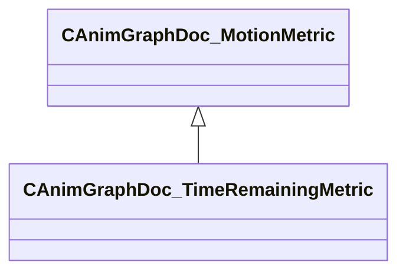

[Schemas](../../schemas.md) / [animgraphdoclib](../animgraphdoclib.md) / CAnimGraphDoc_TimeRemainingMetric

# CAnimGraphDoc_TimeRemainingMetric

> Source: **Build 25000182** · 2026-08-28 · `windows-x86_64` · schema `0.10.0`

**Kind:** class · **Size:** 56 bytes (`0x38`) · **Align:** 8 · **Module:** animgraphdoclib

**Inherits from:** [CAnimGraphDoc_MotionMetric](../animgraphdoclib/CAnimGraphDoc_MotionMetric.md)

**Metadata:** `MPropertyFriendlyName Time Remaining Metric`

**Relationships:**

## Memory layout

5 fields (4 declared here, 1 inherited). Offsets are absolute from the object base.

| Offset | Field | Type | From | Annotations |
|--------|-------|------|------|-------------|
| `0x20` | `m_flWeight` | float32 | [CAnimGraphDoc_MotionMetric](../animgraphdoclib/CAnimGraphDoc_MotionMetric.md) | `MPropertySuppressField` |
| `0x28` | `m_bMatchByTimeRemaining` | bool |  | `MPropertyAutoRebuildOnChange` `MPropertyFriendlyName Match Time Remaining` `MPropertyGroupName` |
| `0x2c` | `m_flMaxTimeRemaining` | float32 |  | `MPropertyAttrStateCallback` `MPropertyFriendlyName Max Time Remaining` |
| `0x30` | `m_bFilterByTimeRemaining` | bool |  | `MPropertyAutoRebuildOnChange` `MPropertyFriendlyName Filter By Time Remaining` |
| `0x34` | `m_flMinTimeRemaining` | float32 |  | `MPropertyAttrStateCallback` `MPropertyFriendlyName Min Time Remaining` |

KV3 class defaults

<pre>{
	&quot;_class&quot;: &quot;CAnimGraphDoc_TimeRemainingMetric&quot;,
	&quot;m_flWeight&quot;: 1.000000,
	&quot;m_bMatchByTimeRemaining&quot;: false,
	&quot;m_flMaxTimeRemaining&quot;: 1.000000,
	&quot;m_bFilterByTimeRemaining&quot;: true,
	&quot;m_flMinTimeRemaining&quot;: 0.300000
}</pre>

