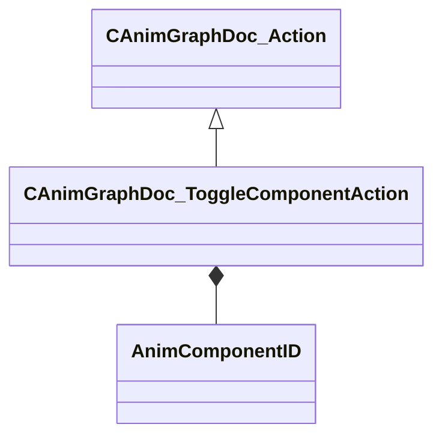

[Schemas](../../schemas.md) / [animgraphdoclib](../animgraphdoclib.md) / CAnimGraphDoc_ToggleComponentAction

# CAnimGraphDoc_ToggleComponentAction

> Source: **Build 25000182** · 2026-08-28 · `windows-x86_64` · schema `0.10.0`

**Kind:** class · **Size:** 48 bytes (`0x30`) · **Align:** 8 · **Module:** animgraphdoclib

**Inherits from:** [CAnimGraphDoc_Action](../animgraphdoclib/CAnimGraphDoc_Action.md)

**Relationships:**

## Memory layout

2 fields (2 declared here, 0 inherited). Offsets are absolute from the object base.

| Offset | Field | Type | From | Annotations |
|--------|-------|------|------|-------------|
| `0x28` | `m_componentID` | [AnimComponentID](../modellib/AnimComponentID.md) |  | `MPropertyAttributeChoiceName Component` `MPropertyFriendlyName Component` |
| `0x2c` | `m_bSetEnabled` | bool |  | `MPropertyFriendlyName Set Enabled` |

KV3 class defaults

<pre>{
	&quot;_class&quot;: &quot;CAnimGraphDoc_ToggleComponentAction&quot;,
	&quot;m_componentID&quot;:
	{
		&quot;m_id&quot;: &lt;HIDDEN FOR DIFF&gt;,
	},
	&quot;m_bSetEnabled&quot;: true
}</pre>

