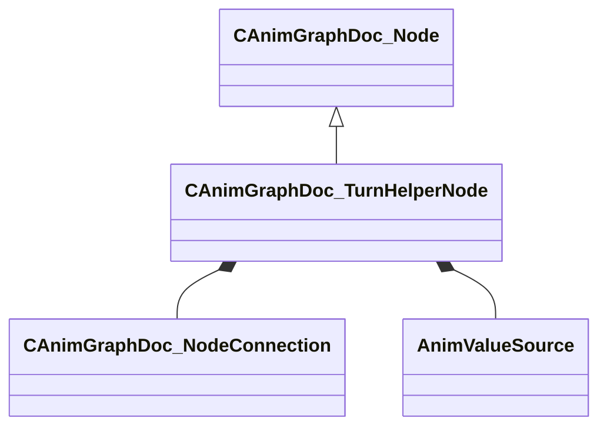

[Schemas](../../schemas.md) / [animgraphdoclib](../animgraphdoclib.md) / CAnimGraphDoc_TurnHelperNode

# CAnimGraphDoc_TurnHelperNode

**Kind:** class · **Size:** 96 bytes (`0x60`) · **Align:** 8 · **Module:** animgraphdoclib

**Inherits from:** [CAnimGraphDoc_Node](../animgraphdoclib/CAnimGraphDoc_Node.md)

**Metadata:** `MPropertyFriendlyName Turn Helper`

**Relationships:**

## Memory layout

12 fields (7 declared here, 5 inherited). Offsets are absolute from the object base.

| Offset | Field | Type | From | Annotations |
|--------|-------|------|------|-------------|
| `0x20` | `m_sName` | CUtlString | [CAnimGraphDoc_Node](../animgraphdoclib/CAnimGraphDoc_Node.md) | `MPropertyFriendlyName Name` `MPropertySortPriority 100` |
| `0x28` | `m_vecPosition` | Vector2D | [CAnimGraphDoc_Node](../animgraphdoclib/CAnimGraphDoc_Node.md) | `MPropertyGroupName Debug` `MPropertySortPriority -100` |
| `0x30` | `m_nNodeID` | [AnimNodeID](../modellib/AnimNodeID.md) | [CAnimGraphDoc_Node](../animgraphdoclib/CAnimGraphDoc_Node.md) | `MPropertyGroupName Debug` `MPropertySortPriority -100` |
| `0x34` | `m_bDebugThisNode` | bool | [CAnimGraphDoc_Node](../animgraphdoclib/CAnimGraphDoc_Node.md) | `MPropertyFriendlyName Debug This Node` `MPropertyGroupName Debug` `MPropertySortPriority -100` |
| `0x38` | `m_networkMode` | [AnimNodeNetworkMode](../animgraphlib/AnimNodeNetworkMode.md) | [CAnimGraphDoc_Node](../animgraphdoclib/CAnimGraphDoc_Node.md) | `MPropertyFriendlyName Network Mode` `MPropertySortPriority -110` |
| `0x40` | `m_inputConnection` | [CAnimGraphDoc_NodeConnection](../animgraphdoclib/CAnimGraphDoc_NodeConnection.md) |  | `MPropertySuppressField` |
| `0x48` | `m_facingTarget` | [AnimValueSource](../animgraphlib/AnimValueSource.md) |  | `MPropertyFriendlyName Turn to Face` |
| `0x4c` | `m_turnStartTime` | float32 |  | `MPropertyFriendlyName Turn Start Time` |
| `0x50` | `m_turnDuration` | float32 |  | `MPropertyFriendlyName Turn Duration` |
| `0x54` | `m_bMatchChildDuration` | bool |  | `MPropertyFriendlyName Match Child Duration` |
| `0x55` | `m_bUseManualTurnOffset` | bool |  | `MPropertyFriendlyName Use Manual Turn Offset` |
| `0x58` | `m_manualTurnOffset` | float32 |  | `MPropertyFriendlyName Manual Turn Offset` |

KV3 class defaults

<pre>{
	&quot;_class&quot;: &quot;CAnimGraphDoc_TurnHelperNode&quot;,
	&quot;m_sName&quot;: &quot;Unnamed&quot;,
	&quot;m_vecPosition&quot;:
	[
		0.000000,
		0.000000
	],
	&quot;m_nNodeID&quot;:
	{
		&quot;m_id&quot;: &lt;HIDDEN FOR DIFF&gt;,
	},
	&quot;m_bDebugThisNode&quot;: false,
	&quot;m_networkMode&quot;: &quot;ServerAuthoritative&quot;,
	&quot;m_inputConnection&quot;:
	{
		&quot;m_nodeID&quot;:
		{
			&quot;m_id&quot;: &lt;HIDDEN FOR DIFF&gt;,
		},
		&quot;m_outputID&quot;:
		{
			&quot;m_id&quot;: &lt;HIDDEN FOR DIFF&gt;,
		}
	},
	&quot;m_facingTarget&quot;: &quot;LookHeading&quot;,
	&quot;m_turnStartTime&quot;: 0.000000,
	&quot;m_turnDuration&quot;: 1.000000,
	&quot;m_bMatchChildDuration&quot;: true,
	&quot;m_bUseManualTurnOffset&quot;: false,
	&quot;m_manualTurnOffset&quot;: 0.000000
}</pre>

