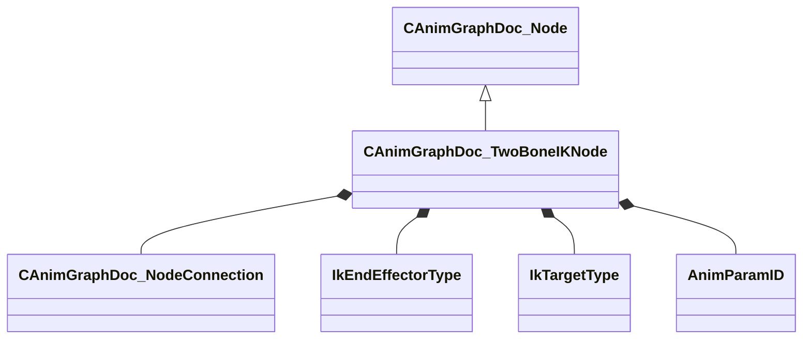

[Schemas](../../schemas.md) / [animgraphdoclib](../animgraphdoclib.md) / CAnimGraphDoc_TwoBoneIKNode

# CAnimGraphDoc_TwoBoneIKNode

**Kind:** class · **Size:** 160 bytes (`0xa0`) · **Align:** 8 · **Module:** animgraphdoclib

**Inherits from:** [CAnimGraphDoc_Node](../animgraphdoclib/CAnimGraphDoc_Node.md)

**Metadata:** `MPropertyFriendlyName Two-Bone IK`

**Relationships:**

## Memory layout

20 fields (15 declared here, 5 inherited). Offsets are absolute from the object base.

| Offset | Field | Type | From | Annotations |
|--------|-------|------|------|-------------|
| `0x20` | `m_sName` | CUtlString | [CAnimGraphDoc_Node](../animgraphdoclib/CAnimGraphDoc_Node.md) | `MPropertyFriendlyName Name` `MPropertySortPriority 100` |
| `0x28` | `m_vecPosition` | Vector2D | [CAnimGraphDoc_Node](../animgraphdoclib/CAnimGraphDoc_Node.md) | `MPropertyGroupName Debug` `MPropertySortPriority -100` |
| `0x30` | `m_nNodeID` | [AnimNodeID](../modellib/AnimNodeID.md) | [CAnimGraphDoc_Node](../animgraphdoclib/CAnimGraphDoc_Node.md) | `MPropertyGroupName Debug` `MPropertySortPriority -100` |
| `0x34` | `m_bDebugThisNode` | bool | [CAnimGraphDoc_Node](../animgraphdoclib/CAnimGraphDoc_Node.md) | `MPropertyFriendlyName Debug This Node` `MPropertyGroupName Debug` `MPropertySortPriority -100` |
| `0x38` | `m_networkMode` | [AnimNodeNetworkMode](../!GlobalTypes/AnimNodeNetworkMode.md) | [CAnimGraphDoc_Node](../animgraphdoclib/CAnimGraphDoc_Node.md) | `MPropertyFriendlyName Network Mode` `MPropertySortPriority -110` |
| `0x40` | `m_inputConnection` | [CAnimGraphDoc_NodeConnection](../animgraphdoclib/CAnimGraphDoc_NodeConnection.md) |  | `MPropertySuppressField` |
| `0x48` | `m_ikChainName` | CUtlString |  | `MPropertyAttributeChoiceName IKChain` `MPropertyFriendlyName IK Chain` |
| `0x50` | `m_bAutoDetectHingeAxis` | bool |  | `MPropertyFriendlyName Auto-Detect Hinge Axis` |
| `0x54` | `m_endEffectorType` | [IkEndEffectorType](../!GlobalTypes/IkEndEffectorType.md) |  | `MPropertyAutoRebuildOnChange` `MPropertyFriendlyName End Effector Type` `MPropertyGroupName End Effector` |
| `0x58` | `m_endEffectorAttachmentName` | CUtlString |  | `MPropertyAttrStateCallback` `MPropertyAttributeChoiceName Attachment` `MPropertyFriendlyName Attachment` `MPropertyGroupName End Effector` |
| `0x60` | `m_targetType` | [IkTargetType](../!GlobalTypes/IkTargetType.md) |  | `MPropertyAutoRebuildOnChange` `MPropertyFriendlyName Target Type` `MPropertyGroupName Target` |
| `0x68` | `m_attachmentName` | CUtlString |  | `MPropertyAttrStateCallback` `MPropertyAttributeChoiceName Attachment` `MPropertyFriendlyName Attachment` `MPropertyGroupName Target` |
| `0x70` | `m_targetBoneName` | CUtlString |  | `MPropertyAttrStateCallback` `MPropertyAttributeChoiceName Bone` `MPropertyFriendlyName Bone` `MPropertyGroupName Target` |
| `0x78` | `m_targetParamName` | CUtlString |  | `MPropertySuppressField` |
| `0x80` | `m_targetParam` | [AnimParamID](../modellib/AnimParamID.md) |  | `MPropertyAttrStateCallback` `MPropertyAttributeChoiceName VectorParameter` `MPropertyFriendlyName Position Parameter` `MPropertyGroupName Target` |
| `0x84` | `m_bMatchTargetOrientation` | bool |  | `MPropertyAutoRebuildOnChange` `MPropertyFriendlyName Match Target Orientation` `MPropertyGroupName Target` |
| `0x88` | `m_rotationParamName` | CUtlString |  | `MPropertySuppressField` |
| `0x90` | `m_rotationParam` | [AnimParamID](../modellib/AnimParamID.md) |  | `MPropertyAttrStateCallback` `MPropertyAttributeChoiceName QuaternionParameter` `MPropertyFriendlyName Rotation Parameter` `MPropertyGroupName Target` |
| `0x94` | `m_bConstrainTwist` | bool |  | `MPropertyAttrStateCallback` `MPropertyFriendlyName Constrain Twist` `MPropertyGroupName Target` |
| `0x98` | `m_flMaxTwist` | float32 |  | `MPropertyAttrStateCallback` `MPropertyFriendlyName Max Twist` `MPropertyGroupName Target` |

KV3 class defaults

<pre>{
	&quot;_class&quot;: &quot;CAnimGraphDoc_TwoBoneIKNode&quot;,
	&quot;m_sName&quot;: &quot;Unnamed&quot;,
	&quot;m_vecPosition&quot;:
	[
		0.000000,
		0.000000
	],
	&quot;m_nNodeID&quot;:
	{
		&quot;m_id&quot;: &lt;HIDDEN FOR DIFF&gt;,
	},
	&quot;m_bDebugThisNode&quot;: false,
	&quot;m_networkMode&quot;: &quot;ServerAuthoritative&quot;,
	&quot;m_inputConnection&quot;:
	{
		&quot;m_nodeID&quot;:
		{
			&quot;m_id&quot;: &lt;HIDDEN FOR DIFF&gt;,
		},
		&quot;m_outputID&quot;:
		{
			&quot;m_id&quot;: &lt;HIDDEN FOR DIFF&gt;,
		}
	},
	&quot;m_ikChainName&quot;: &quot;&quot;,
	&quot;m_bAutoDetectHingeAxis&quot;: true,
	&quot;m_endEffectorType&quot;: &quot;IkEndEffector_Bone&quot;,
	&quot;m_endEffectorAttachmentName&quot;: &quot;&quot;,
	&quot;m_targetType&quot;: &quot;IkTarget_Attachment&quot;,
	&quot;m_attachmentName&quot;: &quot;&quot;,
	&quot;m_targetBoneName&quot;: &quot;&quot;,
	&quot;m_targetParamName&quot;: &quot;&quot;,
	&quot;m_targetParam&quot;:
	{
		&quot;m_id&quot;: &lt;HIDDEN FOR DIFF&gt;,
	},
	&quot;m_bMatchTargetOrientation&quot;: false,
	&quot;m_rotationParamName&quot;: &quot;&quot;,
	&quot;m_rotationParam&quot;:
	{
		&quot;m_id&quot;: &lt;HIDDEN FOR DIFF&gt;,
	},
	&quot;m_bConstrainTwist&quot;: false,
	&quot;m_flMaxTwist&quot;: 15.000000
}</pre>

