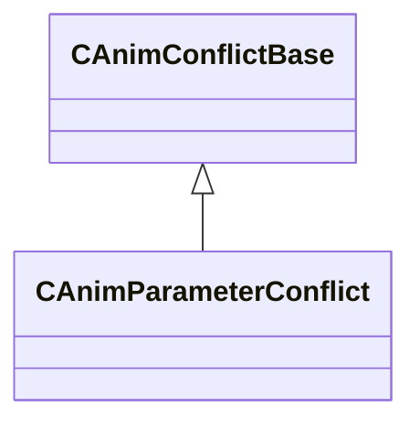

[Schemas](../../schemas.md) / [animgraphdoclib](../animgraphdoclib.md) / CAnimParameterConflict

# CAnimParameterConflict

**Kind:** class · **Size:** 112 bytes (`0x70`) · **Align:** 8 · **Module:** animgraphdoclib

**Inherits from:** [CAnimConflictBase](../animgraphdoclib/CAnimConflictBase.md)

**Relationships:**

## Memory layout

4 fields (0 declared here, 4 inherited). Offsets are absolute from the object base.

| Offset | Field | Type | From | Annotations |
|--------|-------|------|------|-------------|
| `0x18` | `m_sConflictDesc` | CUtlString | [CAnimConflictBase](../animgraphdoclib/CAnimConflictBase.md) |  |
| `0x20` | `m_nResolveIdx` | int32 | [CAnimConflictBase](../animgraphdoclib/CAnimConflictBase.md) |  |
| `0x28` | `m_conflictData` | [CAnimConflictInfo_t](../animgraphdoclib/CAnimConflictInfo_t.md)[2] | [CAnimConflictBase](../animgraphdoclib/CAnimConflictBase.md) |  |
| `0x68` | `m_eConflictType` | [AnimConflictType_t](../animgraphdoclib/AnimConflictType_t.md) | [CAnimConflictBase](../animgraphdoclib/CAnimConflictBase.md) |  |

KV3 class defaults

<pre>{
	&quot;_class&quot;: &quot;CAnimParameterConflict&quot;,
	&quot;m_sConflictDesc&quot;: &quot;&quot;,
	&quot;m_nResolveIdx&quot;: 2,
	&quot;m_conflictData&quot;:
	[
		{
			&quot;m_name&quot;: &quot;&quot;,
			&quot;m_groupName&quot;: &quot;&quot;,
			&quot;m_subgraphName&quot;: &quot;&quot;,
			&quot;m_id&quot;: &lt;HIDDEN FOR DIFF&gt;,
		},
		{
			&quot;m_name&quot;: &quot;&quot;,
			&quot;m_groupName&quot;: &quot;&quot;,
			&quot;m_subgraphName&quot;: &quot;&quot;,
			&quot;m_id&quot;: &lt;HIDDEN FOR DIFF&gt;,
		}
	],
	&quot;m_eConflictType&quot;: &quot;NONE&quot;
}</pre>

