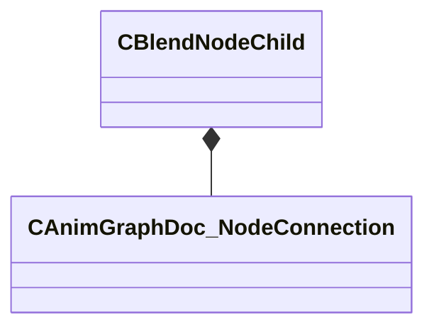

[Schemas](../../schemas.md) / [animgraphdoclib](../animgraphdoclib.md) / CBlendNodeChild

# CBlendNodeChild

**Kind:** class · **Size:** 32 bytes (`0x20`) · **Align:** 8 · **Module:** animgraphdoclib

**Metadata:** `MPropertyFriendlyName Blend Item`

**Relationships:**

## Memory layout

3 fields (3 declared here, 0 inherited). Offsets are absolute from the object base.

| Offset | Field | Type | From | Annotations |
|--------|-------|------|------|-------------|
| `0x8` | `m_inputConnection` | [CAnimGraphDoc_NodeConnection](../animgraphdoclib/CAnimGraphDoc_NodeConnection.md) |  | `MPropertySuppressField` |
| `0x10` | `m_name` | CUtlString |  | `MPropertyFriendlyName Name` |
| `0x18` | `m_blendValue` | float32 |  | `MPropertyFriendlyName Blend Value` |

KV3 class defaults

<pre>{
	&quot;_class&quot;: &quot;CBlendNodeChild&quot;,
	&quot;m_inputConnection&quot;:
	{
		&quot;m_nodeID&quot;:
		{
			&quot;m_id&quot;: &lt;HIDDEN FOR DIFF&gt;,
		},
		&quot;m_outputID&quot;:
		{
			&quot;m_id&quot;: &lt;HIDDEN FOR DIFF&gt;,
		}
	},
	&quot;m_name&quot;: &quot;Unnamed&quot;,
	&quot;m_blendValue&quot;: 0.000000
}</pre>

