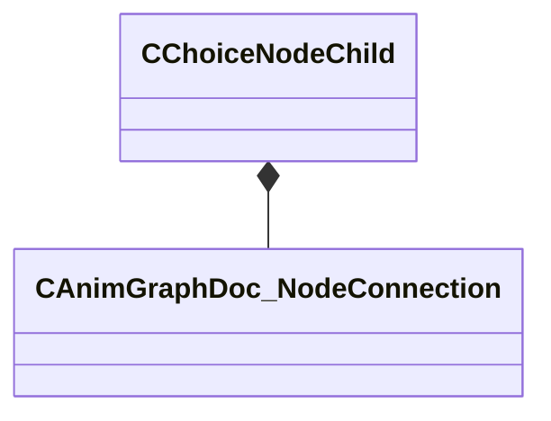

[Schemas](../../schemas.md) / [animgraphdoclib](../animgraphdoclib.md) / CChoiceNodeChild

# CChoiceNodeChild

> Source: **Build 25000182** · 2026-08-28 · `windows-x86_64` · schema `0.10.0`

**Kind:** class · **Size:** 24 bytes (`0x18`) · **Align:** 8 · **Module:** animgraphdoclib

**Metadata:** `MPropertyElementNameFn`, `MPropertyFriendlyName Choice Item`

**Relationships:**

## Memory layout

4 fields (4 declared here, 0 inherited). Offsets are absolute from the object base.

| Offset | Field | Type | From | Annotations |
|--------|-------|------|------|-------------|
| `0x0` | `m_inputConnection` | [CAnimGraphDoc_NodeConnection](../animgraphdoclib/CAnimGraphDoc_NodeConnection.md) |  | `MPropertySuppressField` |
| `0x8` | `m_name` | CUtlString |  | `MPropertyFriendlyName Name` |
| `0x10` | `m_weight` | float32 |  | `MPropertyFriendlyName Weight` |
| `0x14` | `m_blendTime` | float32 |  | `MPropertyFriendlyName Blend Time` |

KV3 class defaults

<pre>{
	&quot;m_inputConnection&quot;:
	{
		&quot;m_nodeID&quot;:
		{
			&quot;m_id&quot;: &lt;HIDDEN FOR DIFF&gt;,
		},
		&quot;m_outputID&quot;:
		{
			&quot;m_id&quot;: &lt;HIDDEN FOR DIFF&gt;,
		}
	},
	&quot;m_name&quot;: &quot;&quot;,
	&quot;m_weight&quot;: 0.000000,
	&quot;m_blendTime&quot;: 0.200000
}</pre>

