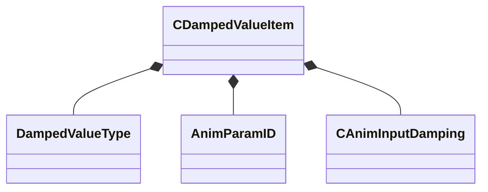

[Schemas](../../schemas.md) / [animgraphdoclib](../animgraphdoclib.md) / CDampedValueItem

# CDampedValueItem

**Kind:** class · **Size:** 80 bytes (`0x50`) · **Align:** 8 · **Module:** animgraphdoclib

**Metadata:** `MPropertyFriendlyName Damped Value`

**Relationships:**

## Memory layout

10 fields (10 declared here, 0 inherited). Offsets are absolute from the object base.

| Offset | Field | Type | From | Annotations |
|--------|-------|------|------|-------------|
| `0x0` | `m_valueType` | [DampedValueType](../!GlobalTypes/DampedValueType.md) |  | `MPropertyAutoRebuildOnChange` `MPropertyFriendlyName Value Type` |
| `0x8` | `m_floatParamNameIn` | CUtlString |  | `MPropertySuppressField` |
| `0x10` | `m_floatParamNameOut` | CUtlString |  | `MPropertySuppressField` |
| `0x18` | `m_vectorParamNameIn` | CUtlString |  | `MPropertySuppressField` |
| `0x20` | `m_vectorParamNameOut` | CUtlString |  | `MPropertySuppressField` |
| `0x28` | `m_floatParamIn` | [AnimParamID](../modellib/AnimParamID.md) |  | `MPropertyAttrStateCallback` `MPropertyAttributeChoiceName FloatParameter` `MPropertyFriendlyName Parameter In` |
| `0x2c` | `m_floatParamOut` | [AnimParamID](../modellib/AnimParamID.md) |  | `MPropertyAttrStateCallback` `MPropertyAttributeChoiceName PrivateFloatParameter` `MPropertyFriendlyName Parameter Out` |
| `0x30` | `m_vectorParamIn` | [AnimParamID](../modellib/AnimParamID.md) |  | `MPropertyAttrStateCallback` `MPropertyAttributeChoiceName VectorParameter` `MPropertyFriendlyName Parameter In` |
| `0x34` | `m_vectorParamOut` | [AnimParamID](../modellib/AnimParamID.md) |  | `MPropertyAttrStateCallback` `MPropertyAttributeChoiceName PrivateVectorParameter` `MPropertyFriendlyName Parameter Out` |
| `0x38` | `m_damping` | [CAnimInputDamping](../animgraphlib/CAnimInputDamping.md) |  | `MPropertyFriendlyName Damping` |

KV3 class defaults

<pre>{
	&quot;m_valueType&quot;: &quot;FloatParameter&quot;,
	&quot;m_floatParamNameIn&quot;: &quot;&quot;,
	&quot;m_floatParamNameOut&quot;: &quot;&quot;,
	&quot;m_vectorParamNameIn&quot;: &quot;&quot;,
	&quot;m_vectorParamNameOut&quot;: &quot;&quot;,
	&quot;m_floatParamIn&quot;:
	{
		&quot;m_id&quot;: &lt;HIDDEN FOR DIFF&gt;,
	},
	&quot;m_floatParamOut&quot;:
	{
		&quot;m_id&quot;: &lt;HIDDEN FOR DIFF&gt;,
	},
	&quot;m_vectorParamIn&quot;:
	{
		&quot;m_id&quot;: &lt;HIDDEN FOR DIFF&gt;,
	},
	&quot;m_vectorParamOut&quot;:
	{
		&quot;m_id&quot;: &lt;HIDDEN FOR DIFF&gt;,
	},
	&quot;m_damping&quot;:
	{
		&quot;_class&quot;: &quot;CAnimInputDamping&quot;,
		&quot;m_speedFunction&quot;: &quot;NoDamping&quot;,
		&quot;m_fSpeedScale&quot;: 1.000000,
		&quot;m_fFallingSpeedScale&quot;: 1.000000
	}
}</pre>

