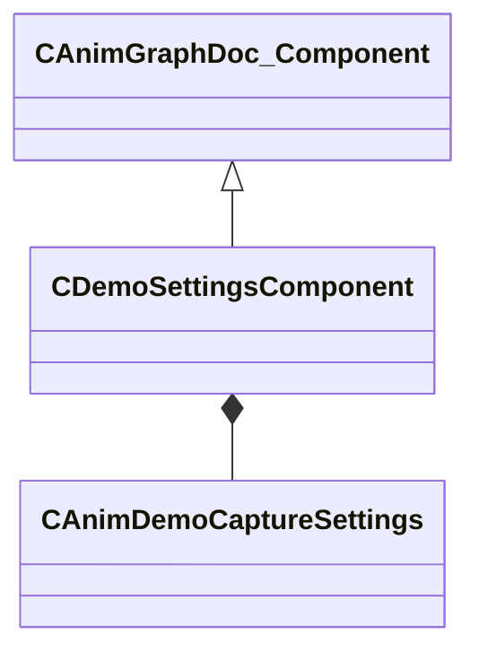

[Schemas](../../schemas.md) / [animgraphdoclib](../animgraphdoclib.md) / CDemoSettingsComponent

# CDemoSettingsComponent

> Source: **Build 25000182** · 2026-08-28 · `windows-x86_64` · schema `0.10.0`

**Kind:** class · **Size:** 184 bytes (`0xb8`) · **Align:** 8 · **Module:** animgraphdoclib

**Inherits from:** [CAnimGraphDoc_Component](../animgraphdoclib/CAnimGraphDoc_Component.md)

**Relationships:**

## Memory layout

6 fields (1 declared here, 5 inherited). Offsets are absolute from the object base.

| Offset | Field | Type | From | Annotations |
|--------|-------|------|------|-------------|
| `0x18` | `m_group` | CUtlString | [CAnimGraphDoc_Component](../animgraphdoclib/CAnimGraphDoc_Component.md) | `MPropertySuppressField` |
| `0x28` | `m_id` | [AnimComponentID](../modellib/AnimComponentID.md) | [CAnimGraphDoc_Component](../animgraphdoclib/CAnimGraphDoc_Component.md) | `MPropertySuppressField` |
| `0x2c` | `m_bStartEnabled` | bool | [CAnimGraphDoc_Component](../animgraphdoclib/CAnimGraphDoc_Component.md) | `MPropertyFriendlyName Start Enabled` |
| `0x30` | `m_nPriority` | int32 | [CAnimGraphDoc_Component](../animgraphdoclib/CAnimGraphDoc_Component.md) | `MPropertyFriendlyName Priority` |
| `0x34` | `m_networkMode` | [AnimNodeNetworkMode](../animgraphlib/AnimNodeNetworkMode.md) | [CAnimGraphDoc_Component](../animgraphdoclib/CAnimGraphDoc_Component.md) | `MPropertyFriendlyName Network Mode` |
| `0x38` | `m_settings` | [CAnimDemoCaptureSettings](../animgraphlib/CAnimDemoCaptureSettings.md) |  | `MPropertyAutoExpandSelf` `MPropertyFriendlyName Settings` |

KV3 class defaults

<pre>{
	&quot;_class&quot;: &quot;CDemoSettingsComponent&quot;,
	&quot;m_group&quot;: &quot;&quot;,
	&quot;m_id&quot;:
	{
		&quot;m_id&quot;: &lt;HIDDEN FOR DIFF&gt;,
	},
	&quot;m_bStartEnabled&quot;: false,
	&quot;m_nPriority&quot;: 100,
	&quot;m_networkMode&quot;: &quot;ServerAuthoritative&quot;,
	&quot;m_settings&quot;:
	{
		&quot;m_vecErrorRangeSplineRotation&quot;:
		[
			0.100000,
			0.500000
		],
		&quot;m_vecErrorRangeSplineTranslation&quot;:
		[
			0.100000,
			0.500000
		],
		&quot;m_vecErrorRangeSplineScale&quot;:
		[
			0.100000,
			0.500000
		],
		&quot;m_flIkRotation_MaxSplineError&quot;: 0.030000,
		&quot;m_flIkTranslation_MaxSplineError&quot;: 0.300000,
		&quot;m_vecErrorRangeQuantizationRotation&quot;:
		[
			0.100000,
			0.500000
		],
		&quot;m_vecErrorRangeQuantizationTranslation&quot;:
		[
			0.100000,
			0.500000
		],
		&quot;m_vecErrorRangeQuantizationScale&quot;:
		[
			0.100000,
			0.500000
		],
		&quot;m_flIkRotation_MaxQuantizationError&quot;: 0.010000,
		&quot;m_flIkTranslation_MaxQuantizationError&quot;: 0.100000,
		&quot;m_baseSequence&quot;: &quot;&quot;,
		&quot;m_nBaseSequenceFrame&quot;: 0,
		&quot;m_boneSelectionMode&quot;: &quot;CaptureSelectedBones&quot;,
		&quot;m_bones&quot;:
		[
		],
		&quot;m_ikChains&quot;:
		[
		]
	}
}</pre>

