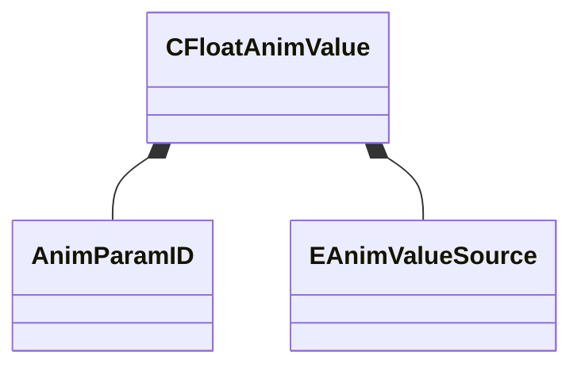

[Schemas](../../schemas.md) / [animgraphdoclib](../animgraphdoclib.md) / CFloatAnimValue

# CFloatAnimValue

> Source: **Build 25000182** · 2026-08-28 · `windows-x86_64` · schema `0.10.0`

**Kind:** class · **Size:** 32 bytes (`0x20`) · **Align:** 8 · **Module:** animgraphdoclib

**Relationships:**

## Memory layout

4 fields (4 declared here, 0 inherited). Offsets are absolute from the object base.

| Offset | Field | Type | From | Annotations |
|--------|-------|------|------|-------------|
| `0x8` | `m_flConstValue` | float32 |  | `MPropertySuppressField` |
| `0x10` | `m_paramName` | CUtlString |  | `MPropertySuppressField` |
| `0x18` | `m_paramID` | [AnimParamID](../modellib/AnimParamID.md) |  | `MPropertySuppressField` |
| `0x1c` | `m_eSource` | [EAnimValueSource](../animgraphdoclib/EAnimValueSource.md) |  | `MPropertySuppressField` |

KV3 class defaults

<pre>{
	&quot;_class&quot;: &quot;CFloatAnimValue&quot;,
	&quot;m_flConstValue&quot;: 0.000000,
	&quot;m_paramName&quot;: &quot;&quot;,
	&quot;m_paramID&quot;:
	{
		&quot;m_id&quot;: &lt;HIDDEN FOR DIFF&gt;,
	},
	&quot;m_eSource&quot;: &quot;Constant&quot;
}</pre>

