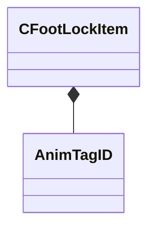

[Schemas](../../schemas.md) / [animgraphdoclib](../animgraphdoclib.md) / CFootLockItem

# CFootLockItem

**Kind:** class · **Size:** 64 bytes (`0x40`) · **Align:** 8 · **Module:** animgraphdoclib

**Metadata:** `MPropertyElementNameFn`, `MPropertyFriendlyName Item`

**Relationships:**

## Memory layout

9 fields (9 declared here, 0 inherited). Offsets are absolute from the object base.

| Offset | Field | Type | From | Annotations |
|--------|-------|------|------|-------------|
| `0x0` | `m_footName` | CUtlString |  | `MPropertyAttributeChoiceName Foot` `MPropertyFriendlyName Foot` |
| `0x8` | `m_targetBoneName` | CUtlString |  | `MPropertyAttributeChoiceName Bone` `MPropertyFriendlyName Target Bone` |
| `0x10` | `m_ikChainName` | CUtlString |  | `MPropertyAttributeChoiceName IKChain` `MPropertyFriendlyName IK Chain` |
| `0x18` | `m_disableTagName` | CGlobalSymbol |  | `MPropertySuppressField` |
| `0x20` | `m_disableTagID` | [AnimTagID](../modellib/AnimTagID.md) |  | `MPropertyAttributeChoiceName Tag` `MPropertyFriendlyName Disable Tag` |
| `0x24` | `m_flMaxRotationLeft` | float32 |  | `MPropertyAttributeRange 0 180` `MPropertyFriendlyName Max Left Rotation` |
| `0x28` | `m_flMaxRotationRight` | float32 |  | `MPropertyAttributeRange 0 180` `MPropertyFriendlyName Max Right Rotation` |
| `0x30` | `m_footstepLandedTagName` | CGlobalSymbol |  | `MPropertySuppressField` |
| `0x38` | `m_footstepLandedTag` | [AnimTagID](../modellib/AnimTagID.md) |  | `MPropertyAttributeChoiceName Tag` `MPropertyFriendlyName Footstep Landed Tag` |

KV3 class defaults

<pre>{
	&quot;m_footName&quot;: &quot;&quot;,
	&quot;m_targetBoneName&quot;: &quot;&quot;,
	&quot;m_ikChainName&quot;: &quot;&quot;,
	&quot;m_disableTagName&quot;: &quot;&quot;,
	&quot;m_disableTagID&quot;:
	{
		&quot;m_id&quot;: &lt;HIDDEN FOR DIFF&gt;,
	},
	&quot;m_flMaxRotationLeft&quot;: 90.000000,
	&quot;m_flMaxRotationRight&quot;: 90.000000,
	&quot;m_footstepLandedTagName&quot;: &quot;&quot;,
	&quot;m_footstepLandedTag&quot;:
	{
		&quot;m_id&quot;: &lt;HIDDEN FOR DIFF&gt;,
	}
}</pre>

