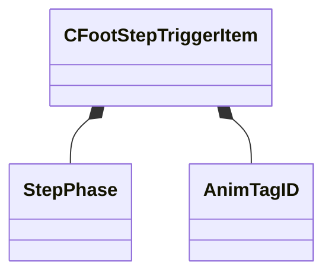

[Schemas](../../schemas.md) / [animgraphdoclib](../animgraphdoclib.md) / CFootStepTriggerItem

# CFootStepTriggerItem

> Source: **Build 25000182** · 2026-08-28 · `windows-x86_64` · schema `0.10.0`

**Kind:** class · **Size:** 64 bytes (`0x40`) · **Align:** 8 · **Module:** animgraphdoclib

**Metadata:** `MPropertyElementNameFn`, `MPropertyFriendlyName Item`

**Relationships:**

## Memory layout

4 fields (4 declared here, 0 inherited). Offsets are absolute from the object base.

| Offset | Field | Type | From | Annotations |
|--------|-------|------|------|-------------|
| `0x0` | `m_footName` | CUtlString |  | `MPropertyAttributeChoiceName Foot` `MPropertyFriendlyName Foot` |
| `0x8` | `m_triggerPhase` | [StepPhase](../animgraphlib/StepPhase.md) |  | `MPropertyFriendlyName Trigger Phase` |
| `0x10` | `m_tagNames` | CUtlVector< CGlobalSymbol > |  | `MPropertySuppressField` |
| `0x28` | `m_tagIDs` | CUtlVector< [AnimTagID](../modellib/AnimTagID.md) > |  | `MPropertyAttributeChoiceName Tag` `MPropertyFriendlyName Tags` |

KV3 class defaults

<pre>{
	&quot;m_footName&quot;: &quot;&quot;,
	&quot;m_triggerPhase&quot;: &quot;StepPhase_OnGround&quot;,
	&quot;m_tagNames&quot;:
	[
	],
	&quot;m_tagIDs&quot;:
	[
	]
}</pre>

