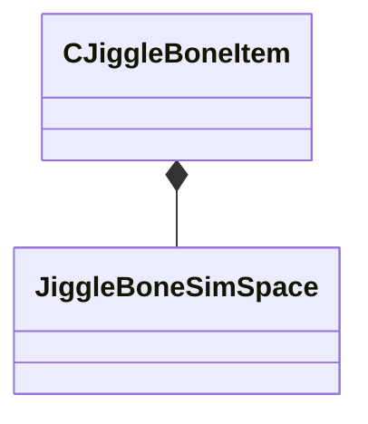

[Schemas](../../schemas.md) / [animgraphdoclib](../animgraphdoclib.md) / CJiggleBoneItem

# CJiggleBoneItem

> Source: **Build 25000182** · 2026-08-28 · `windows-x86_64` · schema `0.10.0`

**Kind:** class · **Size:** 48 bytes (`0x30`) · **Align:** 8 · **Module:** animgraphdoclib

**Metadata:** `MPropertyElementNameFn`, `MPropertyFriendlyName Item`

**Relationships:**

## Memory layout

7 fields (7 declared here, 0 inherited). Offsets are absolute from the object base.

| Offset | Field | Type | From | Annotations |
|--------|-------|------|------|-------------|
| `0x0` | `m_boneName` | CUtlString |  | `MPropertyAttributeChoiceName Bone` `MPropertyFriendlyName Bone` |
| `0x8` | `m_flSpringStrength` | float32 |  | `MPropertyFriendlyName Spring Strength` |
| `0xc` | `m_flSimRateFPS` | float32 |  | `MPropertyFriendlyName Sim Rate (FPS)` |
| `0x10` | `m_flDamping` | float32 |  | `MPropertyAttributeRange 0 1` `MPropertyFriendlyName Damping` |
| `0x14` | `m_eSimSpace` | [JiggleBoneSimSpace](../animgraphlib/JiggleBoneSimSpace.md) |  | `MPropertyFriendlyName Sim Space` |
| `0x18` | `m_vBoundsMaxLS` | Vector |  | `MPropertyFriendlyName Max` `MPropertyGroupName Movement Limits` |
| `0x24` | `m_vBoundsMinLS` | Vector |  | `MPropertyFriendlyName Min` `MPropertyGroupName Movement Limits` |

KV3 class defaults

<pre>{
	&quot;m_boneName&quot;: &quot;&quot;,
	&quot;m_flSpringStrength&quot;: 10.000000,
	&quot;m_flSimRateFPS&quot;: 90.000000,
	&quot;m_flDamping&quot;: 0.010000,
	&quot;m_eSimSpace&quot;: &quot;SimSpace_World&quot;,
	&quot;m_vBoundsMaxLS&quot;:
	[
		10.000000,
		10.000000,
		10.000000
	],
	&quot;m_vBoundsMinLS&quot;:
	[
		-10.000000,
		-10.000000,
		-10.000000
	]
}</pre>

