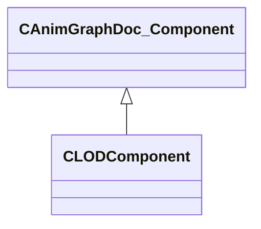

[Schemas](../../schemas.md) / [animgraphdoclib](../animgraphdoclib.md) / CLODComponent

# CLODComponent

**Kind:** class · **Size:** 64 bytes (`0x40`) · **Align:** 8 · **Module:** animgraphdoclib

**Inherits from:** [CAnimGraphDoc_Component](../animgraphdoclib/CAnimGraphDoc_Component.md)

**Relationships:**

## Memory layout

6 fields (1 declared here, 5 inherited). Offsets are absolute from the object base.

| Offset | Field | Type | From | Annotations |
|--------|-------|------|------|-------------|
| `0x18` | `m_group` | CUtlString | [CAnimGraphDoc_Component](../animgraphdoclib/CAnimGraphDoc_Component.md) | `MPropertySuppressField` |
| `0x28` | `m_id` | [AnimComponentID](../modellib/AnimComponentID.md) | [CAnimGraphDoc_Component](../animgraphdoclib/CAnimGraphDoc_Component.md) | `MPropertySuppressField` |
| `0x2c` | `m_bStartEnabled` | bool | [CAnimGraphDoc_Component](../animgraphdoclib/CAnimGraphDoc_Component.md) | `MPropertyFriendlyName Start Enabled` |
| `0x30` | `m_nPriority` | int32 | [CAnimGraphDoc_Component](../animgraphdoclib/CAnimGraphDoc_Component.md) | `MPropertyFriendlyName Priority` |
| `0x34` | `m_networkMode` | [AnimNodeNetworkMode](../!GlobalTypes/AnimNodeNetworkMode.md) | [CAnimGraphDoc_Component](../animgraphdoclib/CAnimGraphDoc_Component.md) | `MPropertyFriendlyName Network Mode` |
| `0x38` | `m_nServerLOD` | int32 |  |  |

KV3 class defaults

<pre>{
	&quot;_class&quot;: &quot;CLODComponent&quot;,
	&quot;m_group&quot;: &quot;&quot;,
	&quot;m_id&quot;:
	{
		&quot;m_id&quot;: &lt;HIDDEN FOR DIFF&gt;,
	},
	&quot;m_bStartEnabled&quot;: true,
	&quot;m_nPriority&quot;: 100,
	&quot;m_networkMode&quot;: &quot;ServerAuthoritative&quot;,
	&quot;m_nServerLOD&quot;: -1
}</pre>

