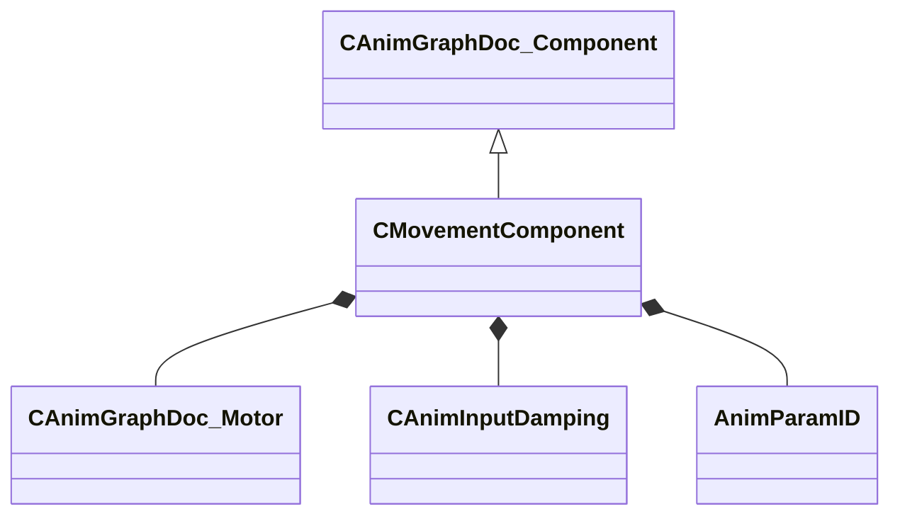

[Schemas](../../schemas.md) / [animgraphdoclib](../animgraphdoclib.md) / CMovementComponent

# CMovementComponent

> Source: **Build 25000182** · 2026-08-28 · `windows-x86_64` · schema `0.10.0`

**Kind:** class · **Size:** 256 bytes (`0x100`) · **Align:** 8 · **Module:** animgraphdoclib

**Inherits from:** [CAnimGraphDoc_Component](../animgraphdoclib/CAnimGraphDoc_Component.md)

**Relationships:**

## Memory layout

10 fields (5 declared here, 5 inherited). Offsets are absolute from the object base.

| Offset | Field | Type | From | Annotations |
|--------|-------|------|------|-------------|
| `0x18` | `m_group` | CUtlString | [CAnimGraphDoc_Component](../animgraphdoclib/CAnimGraphDoc_Component.md) | `MPropertySuppressField` |
| `0x28` | `m_id` | [AnimComponentID](../modellib/AnimComponentID.md) | [CAnimGraphDoc_Component](../animgraphdoclib/CAnimGraphDoc_Component.md) | `MPropertySuppressField` |
| `0x2c` | `m_bStartEnabled` | bool | [CAnimGraphDoc_Component](../animgraphdoclib/CAnimGraphDoc_Component.md) | `MPropertyFriendlyName Start Enabled` |
| `0x30` | `m_nPriority` | int32 | [CAnimGraphDoc_Component](../animgraphdoclib/CAnimGraphDoc_Component.md) | `MPropertyFriendlyName Priority` |
| `0x34` | `m_networkMode` | [AnimNodeNetworkMode](../animgraphlib/AnimNodeNetworkMode.md) | [CAnimGraphDoc_Component](../animgraphdoclib/CAnimGraphDoc_Component.md) | `MPropertyFriendlyName Network Mode` |
| `0x38` | `m_motors` | CUtlVector< CSmartPtr< [CAnimGraphDoc_Motor](../animgraphdoclib/CAnimGraphDoc_Motor.md) > > |  | `MPropertySuppressField` |
| `0x50` | `m_bNetworkPath` | bool |  | `MPropertyFriendlyName Network Path` |
| `0x58` | `m_facingDamping` | [CAnimInputDamping](../animgraphlib/CAnimInputDamping.md) |  | `MPropertyFriendlyName Damping` `MPropertyGroupName +Facing` |
| `0x70` | `m_bNetworkFacing` | bool |  | `MPropertyFriendlyName Network Facing` `MPropertyGroupName +Facing` |
| `0x74` | `m_paramIDs` | [AnimParamID](../modellib/AnimParamID.md)[34] |  | `MPropertySuppressField` |

KV3 class defaults

<pre>{
	&quot;_class&quot;: &quot;CMovementComponent&quot;,
	&quot;m_group&quot;: &quot;&quot;,
	&quot;m_id&quot;:
	{
		&quot;m_id&quot;: &lt;HIDDEN FOR DIFF&gt;,
	},
	&quot;m_bStartEnabled&quot;: true,
	&quot;m_nPriority&quot;: 100,
	&quot;m_networkMode&quot;: &quot;ServerAuthoritative&quot;,
	&quot;m_motors&quot;:
	[
	],
	&quot;m_bNetworkPath&quot;: true,
	&quot;m_facingDamping&quot;:
	{
		&quot;_class&quot;: &quot;CAnimInputDamping&quot;,
		&quot;m_speedFunction&quot;: &quot;NoDamping&quot;,
		&quot;m_fSpeedScale&quot;: 1.000000,
		&quot;m_fFallingSpeedScale&quot;: 1.000000
	},
	&quot;m_bNetworkFacing&quot;: true,
	&quot;m_paramIDs&quot;:
	[
		{
			&quot;m_id&quot;: &lt;HIDDEN FOR DIFF&gt;,
		},
		{
			&quot;m_id&quot;: &lt;HIDDEN FOR DIFF&gt;,
		},
		{
			&quot;m_id&quot;: &lt;HIDDEN FOR DIFF&gt;,
		},
		{
			&quot;m_id&quot;: &lt;HIDDEN FOR DIFF&gt;,
		},
		{
			&quot;m_id&quot;: &lt;HIDDEN FOR DIFF&gt;,
		},
		{
			&quot;m_id&quot;: &lt;HIDDEN FOR DIFF&gt;,
		},
		{
			&quot;m_id&quot;: &lt;HIDDEN FOR DIFF&gt;,
		},
		{
			&quot;m_id&quot;: &lt;HIDDEN FOR DIFF&gt;,
		},
		{
			&quot;m_id&quot;: &lt;HIDDEN FOR DIFF&gt;,
		},
		{
			&quot;m_id&quot;: &lt;HIDDEN FOR DIFF&gt;,
		},
		{
			&quot;m_id&quot;: &lt;HIDDEN FOR DIFF&gt;,
		},
		{
			&quot;m_id&quot;: &lt;HIDDEN FOR DIFF&gt;,
		},
		{
			&quot;m_id&quot;: &lt;HIDDEN FOR DIFF&gt;,
		},
		{
			&quot;m_id&quot;: &lt;HIDDEN FOR DIFF&gt;,
		},
		{
			&quot;m_id&quot;: &lt;HIDDEN FOR DIFF&gt;,
		},
		{
			&quot;m_id&quot;: &lt;HIDDEN FOR DIFF&gt;,
		},
		{
			&quot;m_id&quot;: &lt;HIDDEN FOR DIFF&gt;,
		},
		{
			&quot;m_id&quot;: &lt;HIDDEN FOR DIFF&gt;,
		},
		{
			&quot;m_id&quot;: &lt;HIDDEN FOR DIFF&gt;,
		},
		{
			&quot;m_id&quot;: &lt;HIDDEN FOR DIFF&gt;,
		},
		{
			&quot;m_id&quot;: &lt;HIDDEN FOR DIFF&gt;,
		},
		{
			&quot;m_id&quot;: &lt;HIDDEN FOR DIFF&gt;,
		},
		{
			&quot;m_id&quot;: &lt;HIDDEN FOR DIFF&gt;,
		},
		{
			&quot;m_id&quot;: &lt;HIDDEN FOR DIFF&gt;,
		},
		{
			&quot;m_id&quot;: &lt;HIDDEN FOR DIFF&gt;,
		},
		{
			&quot;m_id&quot;: &lt;HIDDEN FOR DIFF&gt;,
		},
		{
			&quot;m_id&quot;: &lt;HIDDEN FOR DIFF&gt;,
		},
		{
			&quot;m_id&quot;: &lt;HIDDEN FOR DIFF&gt;,
		},
		{
			&quot;m_id&quot;: &lt;HIDDEN FOR DIFF&gt;,
		},
		{
			&quot;m_id&quot;: &lt;HIDDEN FOR DIFF&gt;,
		},
		{
			&quot;m_id&quot;: &lt;HIDDEN FOR DIFF&gt;,
		},
		{
			&quot;m_id&quot;: &lt;HIDDEN FOR DIFF&gt;,
		},
		{
			&quot;m_id&quot;: &lt;HIDDEN FOR DIFF&gt;,
		},
		{
			&quot;m_id&quot;: &lt;HIDDEN FOR DIFF&gt;,
		}
	]
}</pre>

