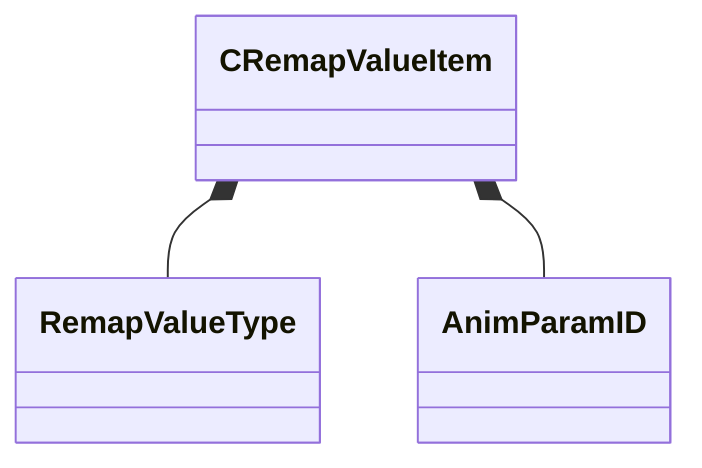

[Schemas](../../schemas.md) / [animgraphdoclib](../animgraphdoclib.md) / CRemapValueItem

# CRemapValueItem

> Source: **Build 25000182** · 2026-08-28 · `windows-x86_64` · schema `0.10.0`

**Kind:** class · **Size:** 72 bytes (`0x48`) · **Align:** 8 · **Module:** animgraphdoclib

**Metadata:** `MPropertyFriendlyName Remap Value`

**Relationships:**

## Memory layout

13 fields (13 declared here, 0 inherited). Offsets are absolute from the object base.

| Offset | Field | Type | From | Annotations |
|--------|-------|------|------|-------------|
| `0x0` | `m_valueType` | [RemapValueType](../animgraphdoclib/RemapValueType.md) |  | `MPropertyAutoRebuildOnChange` `MPropertyFriendlyName Value Type` |
| `0x8` | `m_floatParamNameIn` | CUtlString |  | `MPropertySuppressField` |
| `0x10` | `m_floatParamNameOut` | CUtlString |  | `MPropertySuppressField` |
| `0x18` | `m_vectorParamNameIn` | CUtlString |  | `MPropertySuppressField` |
| `0x20` | `m_vectorParamNameOut` | CUtlString |  | `MPropertySuppressField` |
| `0x28` | `m_floatParamIn` | [AnimParamID](../modellib/AnimParamID.md) |  | `MPropertyAttrStateCallback` `MPropertyAttributeChoiceName FloatParameter` `MPropertyFriendlyName Parameter In` |
| `0x2c` | `m_floatParamOut` | [AnimParamID](../modellib/AnimParamID.md) |  | `MPropertyAttrStateCallback` `MPropertyAttributeChoiceName PrivateFloatParameter` `MPropertyFriendlyName Parameter Out` |
| `0x30` | `m_vectorParamIn` | [AnimParamID](../modellib/AnimParamID.md) |  | `MPropertyAttrStateCallback` `MPropertyAttributeChoiceName VectorParameter` `MPropertyFriendlyName Parameter In` |
| `0x34` | `m_vectorParamOut` | [AnimParamID](../modellib/AnimParamID.md) |  | `MPropertyAttrStateCallback` `MPropertyAttributeChoiceName PrivateVectorParameter` `MPropertyFriendlyName Parameter Out` |
| `0x38` | `m_flMinInputValue` | float32 |  | `MPropertyFriendlyName Min Input Value` |
| `0x3c` | `m_flMaxInputValue` | float32 |  | `MPropertyFriendlyName Max Input Value` |
| `0x40` | `m_flMinOutputValue` | float32 |  | `MPropertyFriendlyName Min Output Value` |
| `0x44` | `m_flMaxOutputValue` | float32 |  | `MPropertyFriendlyName Max Output Value` |

KV3 class defaults

<pre>{
	&quot;m_valueType&quot;: &quot;FloatParameter&quot;,
	&quot;m_floatParamNameIn&quot;: &quot;&quot;,
	&quot;m_floatParamNameOut&quot;: &quot;&quot;,
	&quot;m_vectorParamNameIn&quot;: &quot;&quot;,
	&quot;m_vectorParamNameOut&quot;: &quot;&quot;,
	&quot;m_floatParamIn&quot;:
	{
		&quot;m_id&quot;: &lt;HIDDEN FOR DIFF&gt;,
	},
	&quot;m_floatParamOut&quot;:
	{
		&quot;m_id&quot;: &lt;HIDDEN FOR DIFF&gt;,
	},
	&quot;m_vectorParamIn&quot;:
	{
		&quot;m_id&quot;: &lt;HIDDEN FOR DIFF&gt;,
	},
	&quot;m_vectorParamOut&quot;:
	{
		&quot;m_id&quot;: &lt;HIDDEN FOR DIFF&gt;,
	},
	&quot;m_flMinInputValue&quot;: 0.000000,
	&quot;m_flMaxInputValue&quot;: 1.000000,
	&quot;m_flMinOutputValue&quot;: 0.000000,
	&quot;m_flMaxOutputValue&quot;: 1.000000
}</pre>

