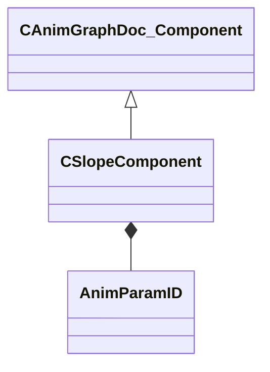

[Schemas](../../schemas.md) / [animgraphdoclib](../animgraphdoclib.md) / CSlopeComponent

# CSlopeComponent

> Source: **Build 25000182** · 2026-08-28 · `windows-x86_64` · schema `0.10.0`

**Kind:** class · **Size:** 88 bytes (`0x58`) · **Align:** 8 · **Module:** animgraphdoclib

**Inherits from:** [CAnimGraphDoc_Component](../animgraphdoclib/CAnimGraphDoc_Component.md)

**Relationships:**

## Memory layout

12 fields (7 declared here, 5 inherited). Offsets are absolute from the object base.

| Offset | Field | Type | From | Annotations |
|--------|-------|------|------|-------------|
| `0x18` | `m_group` | CUtlString | [CAnimGraphDoc_Component](../animgraphdoclib/CAnimGraphDoc_Component.md) | `MPropertySuppressField` |
| `0x28` | `m_id` | [AnimComponentID](../modellib/AnimComponentID.md) | [CAnimGraphDoc_Component](../animgraphdoclib/CAnimGraphDoc_Component.md) | `MPropertySuppressField` |
| `0x2c` | `m_bStartEnabled` | bool | [CAnimGraphDoc_Component](../animgraphdoclib/CAnimGraphDoc_Component.md) | `MPropertyFriendlyName Start Enabled` |
| `0x30` | `m_nPriority` | int32 | [CAnimGraphDoc_Component](../animgraphdoclib/CAnimGraphDoc_Component.md) | `MPropertyFriendlyName Priority` |
| `0x34` | `m_networkMode` | [AnimNodeNetworkMode](../animgraphlib/AnimNodeNetworkMode.md) | [CAnimGraphDoc_Component](../animgraphdoclib/CAnimGraphDoc_Component.md) | `MPropertyFriendlyName Network Mode` |
| `0x38` | `m_flTraceDistance` | float32 |  | `MPropertyFriendlyName Trace Distance` |
| `0x3c` | `m_slopeAngleID` | [AnimParamID](../modellib/AnimParamID.md) |  | `MPropertySuppressField` |
| `0x40` | `m_slopeHeadingID` | [AnimParamID](../modellib/AnimParamID.md) |  | `MPropertySuppressField` |
| `0x44` | `m_slopeAngleSideID` | [AnimParamID](../modellib/AnimParamID.md) |  | `MPropertySuppressField` |
| `0x48` | `m_slopeAngleFrontID` | [AnimParamID](../modellib/AnimParamID.md) |  | `MPropertySuppressField` |
| `0x4c` | `m_slopeNormalID` | [AnimParamID](../modellib/AnimParamID.md) |  | `MPropertySuppressField` |
| `0x50` | `m_slopeNormal_WorldSpaceID` | [AnimParamID](../modellib/AnimParamID.md) |  | `MPropertySuppressField` |

KV3 class defaults

<pre>{
	&quot;_class&quot;: &quot;CSlopeComponent&quot;,
	&quot;m_group&quot;: &quot;&quot;,
	&quot;m_id&quot;:
	{
		&quot;m_id&quot;: &lt;HIDDEN FOR DIFF&gt;,
	},
	&quot;m_bStartEnabled&quot;: true,
	&quot;m_nPriority&quot;: 100,
	&quot;m_networkMode&quot;: &quot;ServerAuthoritative&quot;,
	&quot;m_flTraceDistance&quot;: 36.000000,
	&quot;m_slopeAngleID&quot;:
	{
		&quot;m_id&quot;: &lt;HIDDEN FOR DIFF&gt;,
	},
	&quot;m_slopeHeadingID&quot;:
	{
		&quot;m_id&quot;: &lt;HIDDEN FOR DIFF&gt;,
	},
	&quot;m_slopeAngleSideID&quot;:
	{
		&quot;m_id&quot;: &lt;HIDDEN FOR DIFF&gt;,
	},
	&quot;m_slopeAngleFrontID&quot;:
	{
		&quot;m_id&quot;: &lt;HIDDEN FOR DIFF&gt;,
	},
	&quot;m_slopeNormalID&quot;:
	{
		&quot;m_id&quot;: &lt;HIDDEN FOR DIFF&gt;,
	},
	&quot;m_slopeNormal_WorldSpaceID&quot;:
	{
		&quot;m_id&quot;: &lt;HIDDEN FOR DIFF&gt;,
	}
}</pre>

