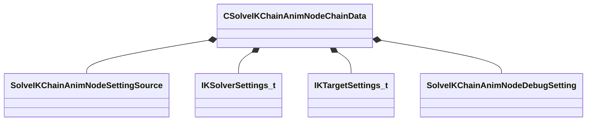

[Schemas](../../schemas.md) / [animgraphdoclib](../animgraphdoclib.md) / CSolveIKChainAnimNodeChainData

# CSolveIKChainAnimNodeChainData

**Kind:** class · **Size:** 104 bytes (`0x68`) · **Align:** 8 · **Module:** animgraphdoclib

**Metadata:** `MPropertyElementNameFn`

**Relationships:**

## Memory layout

8 fields (8 declared here, 0 inherited). Offsets are absolute from the object base.

| Offset | Field | Type | From | Annotations |
|--------|-------|------|------|-------------|
| `0x8` | `m_IkChain` | CUtlString |  | `MPropertyAttributeChoiceName IKChain` `MPropertyFriendlyName IK Chain` |
| `0x10` | `m_SolverSettingSource` | [SolveIKChainAnimNodeSettingSource](../!GlobalTypes/SolveIKChainAnimNodeSettingSource.md) |  | `MPropertyAutoRebuildOnChange` `MPropertyFriendlyName Solver Setting Source` |
| `0x14` | `m_OverrideSolverSettings` | [IKSolverSettings_t](../animgraphlib/IKSolverSettings_t.md) |  | `MPropertyAttrStateCallback` `MPropertyAutoExpandSelf` `MPropertyFriendlyName Override Solver Settings` |
| `0x20` | `m_TargetSettingSource` | [SolveIKChainAnimNodeSettingSource](../!GlobalTypes/SolveIKChainAnimNodeSettingSource.md) |  | `MPropertyAutoRebuildOnChange` `MPropertyFriendlyName Target Setting Source` |
| `0x28` | `m_OverrideTargetSettings` | [IKTargetSettings_t](../animgraphlib/IKTargetSettings_t.md) |  | `MPropertyAttrStateCallback` `MPropertyAutoExpandSelf` `MPropertyFriendlyName Override Target Settings` |
| `0x50` | `m_DebugSetting` | [SolveIKChainAnimNodeDebugSetting](../!GlobalTypes/SolveIKChainAnimNodeDebugSetting.md) |  | `MPropertyFriendlyName Debug Setting` `MPropertyGroupName Debug` |
| `0x54` | `m_flDebugNormalizedLength` | float32 |  | `MPropertyFriendlyName Debug Normalized Length` `MPropertyGroupName Debug` |
| `0x58` | `m_vDebugOffset` | Vector |  | `MPropertyFriendlyName Debug Offset` `MPropertyGroupName Debug` |

KV3 class defaults

<pre>{
	&quot;_class&quot;: &quot;CSolveIKChainAnimNodeChainData&quot;,
	&quot;m_IkChain&quot;: &quot;&quot;,
	&quot;m_SolverSettingSource&quot;: &quot;SOLVEIKCHAINANIMNODESETTINGSOURCE_Default&quot;,
	&quot;m_OverrideSolverSettings&quot;:
	{
		&quot;m_SolverType&quot;: &quot;IKSOLVER_TwoBone&quot;,
		&quot;m_nNumIterations&quot;: 6,
		&quot;m_EndEffectorRotationFixUpMode&quot;: &quot;MatchTargetOrientation&quot;
	},
	&quot;m_TargetSettingSource&quot;: &quot;SOLVEIKCHAINANIMNODESETTINGSOURCE_Default&quot;,
	&quot;m_OverrideTargetSettings&quot;:
	{
		&quot;m_TargetSource&quot;: &quot;Bone&quot;,
		&quot;m_Bone&quot;:
		{
			&quot;m_Name&quot;: &quot;&quot;
		},
		&quot;m_AnimgraphParameterNamePosition&quot;:
		{
			&quot;m_id&quot;: &lt;HIDDEN FOR DIFF&gt;,
		},
		&quot;m_AnimgraphParameterNameOrientation&quot;:
		{
			&quot;m_id&quot;: &lt;HIDDEN FOR DIFF&gt;,
		},
		&quot;m_TargetCoordSystem&quot;: &quot;World Space&quot;
	},
	&quot;m_DebugSetting&quot;: &quot;SOLVEIKCHAINANIMNODEDEBUGSETTING_None&quot;,
	&quot;m_flDebugNormalizedLength&quot;: 1.000000,
	&quot;m_vDebugOffset&quot;:
	[
		0.000000,
		0.000000,
		0.000000
	]
}</pre>

