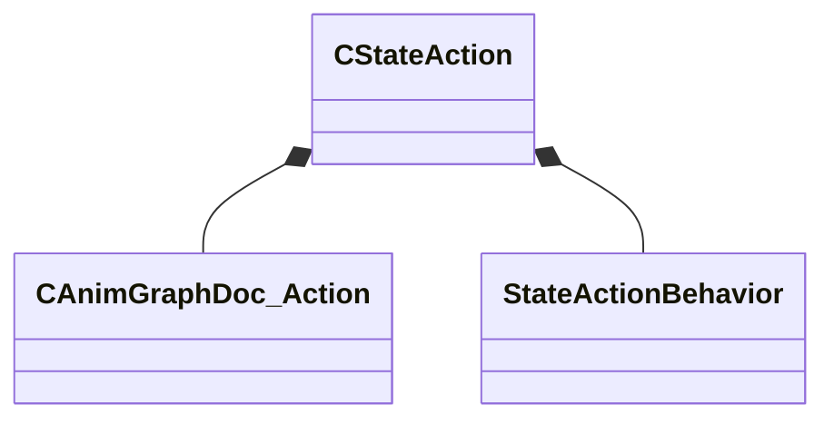

[Schemas](../../schemas.md) / [animgraphdoclib](../animgraphdoclib.md) / CStateAction

# CStateAction

> Source: **Build 25000182** · 2026-08-28 · `windows-x86_64` · schema `0.10.0`

**Kind:** class · **Size:** 24 bytes (`0x18`) · **Align:** 8 · **Module:** animgraphdoclib

**Relationships:**

## Memory layout

2 fields (2 declared here, 0 inherited). Offsets are absolute from the object base.

| Offset | Field | Type | From | Annotations |
|--------|-------|------|------|-------------|
| `0x8` | `m_pAction` | CSmartPtr< [CAnimGraphDoc_Action](../animgraphdoclib/CAnimGraphDoc_Action.md) > |  |  |
| `0x10` | `m_eBehavior` | [StateActionBehavior](../animgraphlib/StateActionBehavior.md) |  |  |

KV3 class defaults

<pre>{
	&quot;_class&quot;: &quot;CStateAction&quot;,
	&quot;m_pAction&quot;: null,
	&quot;m_eBehavior&quot;: &quot;STATETAGBEHAVIOR_ACTIVE_WHILE_CURRENT&quot;
}</pre>

