# Module: animgraphlib

[📊 View UML Diagram](../diagrams/animgraphlib.md)

| Name | Kind | Bases | Fields |
|------|------|-------|--------|
| [AimCameraOpFixedSettings_t](#aimcameraopfixedsettings_t) | class |  | 7 |
| [AimMatrixBlendMode](#aimmatrixblendmode) | enum |  | 4 |
| [AimMatrixOpFixedSettings_t](#aimmatrixopfixedsettings_t) | class |  | 13 |
| [AnimNodeNetworkMode](#animnodenetworkmode) | enum |  | 2 |
| [AnimParamButton_t](#animparambutton_t) | enum |  | 13 |
| [AnimParamNetworkSetting](#animparamnetworksetting) | enum |  | 3 |
| [AnimParamType_t](#animparamtype_t) | enum |  | 9 |
| [AnimParamVectorType_t](#animparamvectortype_t) | enum |  | 5 |
| [AnimScriptType](#animscripttype) | enum |  | 3 |
| [AnimValueSource](#animvaluesource) | enum |  | 37 |
| [AnimVectorSource](#animvectorsource) | enum |  | 14 |
| [BinaryNodeChildOption](#binarynodechildoption) | enum |  | 2 |
| [BinaryNodeTiming](#binarynodetiming) | enum |  | 3 |
| [Blend2DMode](#blend2dmode) | enum |  | 2 |
| [BlendItem_t](#blenditem_t) | class |  | 6 |
| [BlendKeyType](#blendkeytype) | enum |  | 4 |
| [BoneDemoCaptureSettings_t](#bonedemocapturesettings_t) | class |  | 7 |
| [BoneMaskBlendSpace](#bonemaskblendspace) | enum |  | 4 |
| [CActionComponentUpdater](#cactioncomponentupdater) | class | CAnimComponentUpdater | 1 |
| [CAddUpdateNode](#caddupdatenode) | class | CBinaryUpdateNode | 5 |
| [CAimCameraUpdateNode](#caimcameraupdatenode) | class | CUnaryUpdateNode | 8 |
| [CAimMatrixUpdateNode](#caimmatrixupdatenode) | class | CUnaryUpdateNode | 6 |
| [CAnimActionUpdater](#canimactionupdater) | class |  | 0 |
| [CAnimComponentUpdater](#canimcomponentupdater) | class |  | 4 |
| [CAnimDemoCaptureSettings](#canimdemocapturesettings) | class |  | 15 |
| [CAnimGraphDebugReplay](#canimgraphdebugreplay) | class |  | 5 |
| [CAnimGraphModelBinding](#canimgraphmodelbinding) | class |  | 2 |
| [CAnimGraphNetworkSettings](#canimgraphnetworksettings) | class | CAnimGraphSettingsGroup | 1 |
| [CAnimGraphSettingsGroup](#canimgraphsettingsgroup) | class |  | 0 |
| [CAnimGraphSettingsManager](#canimgraphsettingsmanager) | class |  | 1 |
| [CAnimInputDamping](#caniminputdamping) | class |  | 3 |
| [CAnimMotorUpdaterBase](#canimmotorupdaterbase) | class |  | 2 |
| [CAnimNodePath](#canimnodepath) | class |  | 2 |
| [CAnimParamHandle](#canimparamhandle) | class |  | 2 |
| [CAnimParamHandleMap](#canimparamhandlemap) | class |  | 1 |
| [CAnimParameterBase](#canimparameterbase) | class |  | 7 |
| [CAnimParameterManagerUpdater](#canimparametermanagerupdater) | class |  | 6 |
| [CAnimReplayFrame](#canimreplayframe) | class |  | 5 |
| [CAnimScriptComponentUpdater](#canimscriptcomponentupdater) | class | CAnimComponentUpdater | 1 |
| [CAnimScriptManager](#canimscriptmanager) | class |  | 1 |
| [CAnimStateMachineUpdater](#canimstatemachineupdater) | class |  | 3 |
| [CAnimTagBase](#canimtagbase) | class |  | 5 |
| [CAnimTagManagerUpdater](#canimtagmanagerupdater) | class |  | 1 |
| [CAnimUpdateNodeBase](#canimupdatenodebase) | class |  | 3 |
| [CAnimUpdateNodeRef](#canimupdatenoderef) | class |  | 1 |
| [CAnimUpdateSharedData](#canimupdateshareddata) | class |  | 10 |
| [CAnimationGraphInstance](#canimationgraphinstance) | class |  | 1 |
| [CAnimationGraphVisualizerAxis](#canimationgraphvisualizeraxis) | class | CAnimationGraphVisualizerPrimitiveBase | 2 |
| [CAnimationGraphVisualizerLine](#canimationgraphvisualizerline) | class | CAnimationGraphVisualizerPrimitiveBase | 3 |
| [CAnimationGraphVisualizerPie](#canimationgraphvisualizerpie) | class | CAnimationGraphVisualizerPrimitiveBase | 4 |
| [CAnimationGraphVisualizerPrimitiveBase](#canimationgraphvisualizerprimitivebase) | class |  | 3 |
| [CAnimationGraphVisualizerPrimitiveType](#canimationgraphvisualizerprimitivetype) | enum |  | 5 |
| [CAnimationGraphVisualizerSphere](#canimationgraphvisualizersphere) | class | CAnimationGraphVisualizerPrimitiveBase | 3 |
| [CAnimationGraphVisualizerText](#canimationgraphvisualizertext) | class | CAnimationGraphVisualizerPrimitiveBase | 3 |
| [CAnimationLayer](#canimationlayer) | class |  | 11 |
| [CAudioAnimTag](#caudioanimtag) | class | CAnimTagBase | 7 |
| [CBinaryUpdateNode](#cbinaryupdatenode) | class | CAnimUpdateNodeBase | 6 |
| [CBindPoseUpdateNode](#cbindposeupdatenode) | class | CLeafUpdateNode | 0 |
| [CBlend2DInstanceData](#cblend2dinstancedata) | class |  | 3 |
| [CBlend2DUpdateNode](#cblend2dupdatenode) | class | CAnimUpdateNodeBase | 15 |
| [CBlendCurve](#cblendcurve) | class |  | 2 |
| [CBlendNodeInstanceData](#cblendnodeinstancedata) | class |  | 7 |
| [CBlendUpdateNode](#cblendupdatenode) | class | CAnimUpdateNodeBase | 13 |
| [CBlockSelectionMetricEvaluator](#cblockselectionmetricevaluator) | class | CMotionMetricEvaluator | 0 |
| [CBodyGroupAnimTag](#cbodygroupanimtag) | class | CAnimTagBase | 2 |
| [CBodyGroupSetting](#cbodygroupsetting) | class |  | 2 |
| [CBoneMaskUpdateNode](#cbonemaskupdatenode) | class | CBinaryUpdateNode | 7 |
| [CBonePositionMetricEvaluator](#cbonepositionmetricevaluator) | class | CMotionMetricEvaluator | 1 |
| [CBoneVelocityMetricEvaluator](#cbonevelocitymetricevaluator) | class | CMotionMetricEvaluator | 1 |
| [CBoolAnimParameter](#cboolanimparameter) | class | CConcreteAnimParameter | 1 |
| [CCPPScriptComponentUpdater](#ccppscriptcomponentupdater) | class | CAnimComponentUpdater | 1 |
| [CCachedPose](#ccachedpose) | class |  | 4 |
| [CChoiceInstanceData](#cchoiceinstancedata) | class |  | 4 |
| [CChoiceUpdateNode](#cchoiceupdatenode) | class | CAnimUpdateNodeBase | 10 |
| [CChoreoInstanceData](#cchoreoinstancedata) | class |  | 1 |
| [CChoreoUpdateNode](#cchoreoupdatenode) | class | CUnaryUpdateNode | 0 |
| [CClothSettingsAnimTag](#cclothsettingsanimtag) | class | CAnimTagBase | 4 |
| [CConcreteAnimParameter](#cconcreteanimparameter) | class | CAnimParameterBase | 6 |
| [CCurrentRotationVelocityMetricEvaluator](#ccurrentrotationvelocitymetricevaluator) | class | CMotionMetricEvaluator | 0 |
| [CCurrentVelocityMetricEvaluator](#ccurrentvelocitymetricevaluator) | class | CMotionMetricEvaluator | 0 |
| [CCycleClipInstanceData](#ccycleclipinstancedata) | class |  | 2 |
| [CCycleControlClipUpdateNode](#ccyclecontrolclipupdatenode) | class | CLeafUpdateNode | 6 |
| [CCycleControlUpdateNode](#ccyclecontrolupdatenode) | class | CUnaryUpdateNode | 3 |
| [CDampedPathAnimMotorUpdater](#cdampedpathanimmotorupdater) | class | CPathAnimMotorUpdaterBase | 7 |
| [CDampedValueComponentUpdater](#cdampedvaluecomponentupdater) | class | CAnimComponentUpdater | 1 |
| [CDampedValueUpdateItem](#cdampedvalueupdateitem) | class |  | 3 |
| [CDemoSettingsComponentUpdater](#cdemosettingscomponentupdater) | class | CAnimComponentUpdater | 1 |
| [CDirectPlaybackInstanceData](#cdirectplaybackinstancedata) | class |  | 12 |
| [CDirectPlaybackTagData](#cdirectplaybacktagdata) | class |  | 2 |
| [CDirectPlaybackUpdateNode](#cdirectplaybackupdatenode) | class | CUnaryUpdateNode | 3 |
| [CDirectionalBlendInstanceData](#cdirectionalblendinstancedata) | class |  | 7 |
| [CDirectionalBlendUpdateNode](#cdirectionalblendupdatenode) | class | CLeafUpdateNode | 8 |
| [CDistanceRemainingMetricEvaluator](#cdistanceremainingmetricevaluator) | class | CMotionMetricEvaluator | 7 |
| [CEditableMotionGraph](#ceditablemotiongraph) | class | CMotionGraph | 0 |
| [CEmitTagActionUpdater](#cemittagactionupdater) | class | CAnimActionUpdater | 2 |
| [CEnumAnimParameter](#cenumanimparameter) | class | CConcreteAnimParameter | 3 |
| [CExpressionActionUpdater](#cexpressionactionupdater) | class | CAnimActionUpdater | 3 |
| [CFloatAnimParameter](#cfloatanimparameter) | class | CConcreteAnimParameter | 4 |
| [CFollowAttachmentUpdateNode](#cfollowattachmentupdatenode) | class | CUnaryUpdateNode | 1 |
| [CFollowPathInstanceData](#cfollowpathinstancedata) | class |  | 5 |
| [CFollowPathUpdateNode](#cfollowpathupdatenode) | class | CUnaryUpdateNode | 13 |
| [CFollowTargetUpdateNode](#cfollowtargetupdatenode) | class | CUnaryUpdateNode | 3 |
| [CFootAdjustmentInstanceData](#cfootadjustmentinstancedata) | class |  | 3 |
| [CFootAdjustmentUpdateNode](#cfootadjustmentupdatenode) | class | CUnaryUpdateNode | 9 |
| [CFootCycleMetricEvaluator](#cfootcyclemetricevaluator) | class | CMotionMetricEvaluator | 1 |
| [CFootFallAnimTag](#cfootfallanimtag) | class | CAnimTagBase | 1 |
| [CFootLockUpdateNode](#cfootlockupdatenode) | class | CUnaryUpdateNode | 20 |
| [CFootPinningUpdateNode](#cfootpinningupdatenode) | class | CUnaryUpdateNode | 4 |
| [CFootPositionMetricEvaluator](#cfootpositionmetricevaluator) | class | CMotionMetricEvaluator | 2 |
| [CFootStepTriggerUpdateNode](#cfootsteptriggerupdatenode) | class | CUnaryUpdateNode | 2 |
| [CFootstepLandedAnimTag](#cfootsteplandedanimtag) | class | CAnimTagBase | 5 |
| [CFutureFacingMetricEvaluator](#cfuturefacingmetricevaluator) | class | CMotionMetricEvaluator | 2 |
| [CFutureVelocityMetricEvaluator](#cfuturevelocitymetricevaluator) | class | CMotionMetricEvaluator | 4 |
| [CHandshakeAnimTagBase](#chandshakeanimtagbase) | class | CAnimTagBase | 1 |
| [CHitReactUpdateNode](#chitreactupdatenode) | class | CUnaryUpdateNode | 8 |
| [CInputStreamUpdateNode](#cinputstreamupdatenode) | class | CLeafUpdateNode | 0 |
| [CIntAnimParameter](#cintanimparameter) | class | CConcreteAnimParameter | 3 |
| [CJiggleBoneUpdateNode](#cjiggleboneupdatenode) | class | CUnaryUpdateNode | 1 |
| [CJumpHelperUpdateNode](#cjumphelperupdatenode) | class | CSequenceUpdateNode | 8 |
| [CLODComponentUpdater](#clodcomponentupdater) | class | CAnimComponentUpdater | 1 |
| [CLeafUpdateNode](#cleafupdatenode) | class | CAnimUpdateNodeBase | 0 |
| [CLeanMatrixInstanceData](#cleanmatrixinstancedata) | class |  | 2 |
| [CLeanMatrixUpdateNode](#cleanmatrixupdatenode) | class | CLeafUpdateNode | 10 |
| [CLookAtUpdateNode](#clookatupdatenode) | class | CUnaryUpdateNode | 6 |
| [CLookComponentUpdater](#clookcomponentupdater) | class | CAnimComponentUpdater | 9 |
| [CMaterialAttributeAnimTag](#cmaterialattributeanimtag) | class | CAnimTagBase | 4 |
| [CMotionDataSet](#cmotiondataset) | class |  | 2 |
| [CMotionGraph](#cmotiongraph) | class |  | 7 |
| [CMotionGraphConfig](#cmotiongraphconfig) | class |  | 5 |
| [CMotionGraphGroup](#cmotiongraphgroup) | class |  | 5 |
| [CMotionGraphUpdateNode](#cmotiongraphupdatenode) | class | CLeafUpdateNode | 1 |
| [CMotionMatchingUpdateNode](#cmotionmatchingupdatenode) | class | CLeafUpdateNode | 23 |
| [CMotionMetricEvaluator](#cmotionmetricevaluator) | class |  | 4 |
| [CMotionNode](#cmotionnode) | class |  | 2 |
| [CMotionNodeBlend1D](#cmotionnodeblend1d) | class | CMotionNode | 2 |
| [CMotionNodeSequence](#cmotionnodesequence) | class | CMotionNode | 3 |
| [CMotionSearchDB](#cmotionsearchdb) | class |  | 3 |
| [CMotionSearchNode](#cmotionsearchnode) | class |  | 5 |
| [CMovementComponentUpdater](#cmovementcomponentupdater) | class | CAnimComponentUpdater | 8 |
| [CMovementHandshakeAnimTag](#cmovementhandshakeanimtag) | class | CHandshakeAnimTagBase | 0 |
| [CMoverInstanceData](#cmoverinstancedata) | class |  | 4 |
| [CMoverUpdateNode](#cmoverupdatenode) | class | CUnaryUpdateNode | 12 |
| [CNetworkedCycle](#cnetworkedcycle) | class |  | 5 |
| [COrientationWarpUpdateNode](#corientationwarpupdatenode) | class | CUnaryUpdateNode | 13 |
| [CPairedSequenceComponentUpdater](#cpairedsequencecomponentupdater) | class | CAnimComponentUpdater | 0 |
| [CPairedSequenceUpdateNode](#cpairedsequenceupdatenode) | class | CSequenceUpdateNodeBase | 1 |
| [CParamSpanUpdater](#cparamspanupdater) | class |  | 1 |
| [CParticleAnimTag](#cparticleanimtag) | class | CAnimTagBase | 11 |
| [CPathAnimMotorUpdater](#cpathanimmotorupdater) | class | CPathAnimMotorUpdaterBase | 0 |
| [CPathAnimMotorUpdaterBase](#cpathanimmotorupdaterbase) | class | CAnimMotorUpdaterBase | 1 |
| [CPathHelperUpdateNode](#cpathhelperupdatenode) | class | CUnaryUpdateNode | 2 |
| [CPathMetricEvaluator](#cpathmetricevaluator) | class | CMotionMetricEvaluator | 4 |
| [CPlayerInputAnimMotorUpdater](#cplayerinputanimmotorupdater) | class | CAnimMotorUpdaterBase | 6 |
| [CPoseHandle](#cposehandle) | class |  | 2 |
| [CProductQuantizer](#cproductquantizer) | class |  | 2 |
| [CQuaternionAnimParameter](#cquaternionanimparameter) | class | CConcreteAnimParameter | 2 |
| [CRagdollAnimTag](#cragdollanimtag) | class | CAnimTagBase | 1 |
| [CRagdollComponentUpdater](#cragdollcomponentupdater) | class | CAnimComponentUpdater | 10 |
| [CRagdollUpdateNode](#cragdollupdatenode) | class | CUnaryUpdateNode | 2 |
| [CRemapValueComponentUpdater](#cremapvaluecomponentupdater) | class | CAnimComponentUpdater | 1 |
| [CRemapValueUpdateItem](#cremapvalueupdateitem) | class |  | 6 |
| [CRootMotion](#crootmotion) | class |  | 3 |
| [CRootUpdateNode](#crootupdatenode) | class | CUnaryUpdateNode | 0 |
| [CSelectorUpdateNode](#cselectorupdatenode) | class | CAnimUpdateNodeBase | 10 |
| [CSequenceFinishedAnimTag](#csequencefinishedanimtag) | class | CAnimTagBase | 1 |
| [CSequenceTagSpans](#csequencetagspans) | class |  | 2 |
| [CSequenceUpdateNode](#csequenceupdatenode) | class | CSequenceUpdateNodeBase | 4 |
| [CSequenceUpdateNodeBase](#csequenceupdatenodebase) | class | CLeafUpdateNode | 2 |
| [CSetParameterActionUpdater](#csetparameteractionupdater) | class | CAnimActionUpdater | 2 |
| [CSingleFrameUpdateNode](#csingleframeupdatenode) | class | CLeafUpdateNode | 4 |
| [CSlopeComponentUpdater](#cslopecomponentupdater) | class | CAnimComponentUpdater | 7 |
| [CSlowDownOnSlopesUpdateNode](#cslowdownonslopesupdatenode) | class | CUnaryUpdateNode | 1 |
| [CSolveIKChainUpdateNode](#csolveikchainupdatenode) | class | CUnaryUpdateNode | 2 |
| [CSolveIKTargetHandle_t](#csolveiktargethandle_t) | class |  | 2 |
| [CSpeedScaleUpdateNode](#cspeedscaleupdatenode) | class | CUnaryUpdateNode | 1 |
| [CStanceOverrideUpdateNode](#cstanceoverrideupdatenode) | class | CUnaryUpdateNode | 4 |
| [CStanceScaleUpdateNode](#cstancescaleupdatenode) | class | CUnaryUpdateNode | 1 |
| [CStateActionUpdater](#cstateactionupdater) | class |  | 2 |
| [CStateMachineComponentUpdater](#cstatemachinecomponentupdater) | class | CAnimComponentUpdater | 1 |
| [CStateMachineInstanceData](#cstatemachineinstancedata) | class |  | 4 |
| [CStateMachineUpdateNode](#cstatemachineupdatenode) | class | CAnimUpdateNodeBase | 6 |
| [CStateNodeInstanceData](#cstatenodeinstancedata) | class |  | 4 |
| [CStateNodeStateData](#cstatenodestatedata) | class |  | 3 |
| [CStateNodeTransitionData](#cstatenodetransitiondata) | class |  | 5 |
| [CStateUpdateData](#cstateupdatedata) | class |  | 10 |
| [CStaticPoseCache](#cstaticposecache) | class |  | 3 |
| [CStaticPoseCacheBuilder](#cstaticposecachebuilder) | class | CStaticPoseCache | 0 |
| [CStepsRemainingMetricEvaluator](#cstepsremainingmetricevaluator) | class | CMotionMetricEvaluator | 2 |
| [CStopAtGoalUpdateNode](#cstopatgoalupdatenode) | class | CUnaryUpdateNode | 5 |
| [CStringAnimTag](#cstringanimtag) | class | CAnimTagBase | 0 |
| [CSubtractUpdateNode](#csubtractupdatenode) | class | CBinaryUpdateNode | 4 |
| [CSymbolAnimParameter](#csymbolanimparameter) | class | CConcreteAnimParameter | 1 |
| [CTargetSelectorUpdateNode](#ctargetselectorupdatenode) | class | CAnimUpdateNodeBase | 10 |
| [CTargetWarpUpdateNode](#ctargetwarpupdatenode) | class | CUnaryUpdateNode | 14 |
| [CTaskHandshakeAnimTag](#ctaskhandshakeanimtag) | class | CHandshakeAnimTagBase | 0 |
| [CTaskStatusAnimTag](#ctaskstatusanimtag) | class | CAnimTagBase | 0 |
| [CTimeRemainingMetricEvaluator](#ctimeremainingmetricevaluator) | class | CMotionMetricEvaluator | 4 |
| [CToggleComponentActionUpdater](#ctogglecomponentactionupdater) | class | CAnimActionUpdater | 2 |
| [CTransitionUpdateData](#ctransitionupdatedata) | class |  | 4 |
| [CTurnHelperInstanceData](#cturnhelperinstancedata) | class |  | 3 |
| [CTurnHelperUpdateNode](#cturnhelperupdatenode) | class | CUnaryUpdateNode | 6 |
| [CTwoBoneIKUpdateNode](#ctwoboneikupdatenode) | class | CUnaryUpdateNode | 1 |
| [CUnaryUpdateNode](#cunaryupdatenode) | class | CAnimUpdateNodeBase | 1 |
| [CVectorAnimParameter](#cvectoranimparameter) | class | CConcreteAnimParameter | 3 |
| [CVectorQuantizer](#cvectorquantizer) | class |  | 3 |
| [CVirtualAnimParameter](#cvirtualanimparameter) | class | CAnimParameterBase | 2 |
| [CWarpSectionAnimTag](#cwarpsectionanimtag) | class | CWarpSectionAnimTagBase | 2 |
| [CWarpSectionAnimTagBase](#cwarpsectionanimtagbase) | class | CAnimTagBase | 0 |
| [CWayPointHelperInstanceData](#cwaypointhelperinstancedata) | class |  | 4 |
| [CWayPointHelperUpdateNode](#cwaypointhelperupdatenode) | class | CUnaryUpdateNode | 5 |
| [CZeroPoseUpdateNode](#czeroposeupdatenode) | class | CLeafUpdateNode | 0 |
| [ChainToSolveData_t](#chaintosolvedata_t) | class |  | 6 |
| [ChoiceBlendMethod](#choiceblendmethod) | enum |  | 2 |
| [ChoiceChangeMethod](#choicechangemethod) | enum |  | 3 |
| [ChoiceMethod](#choicemethod) | enum |  | 4 |
| [ConfigIndex](#configindex) | class |  | 2 |
| [DampedPathMotorInstanceData_t](#dampedpathmotorinstancedata_t) | class |  | 3 |
| [DampingSpeedFunction](#dampingspeedfunction) | enum |  | 4 |
| [EDemoBoneSelectionMode](#edemoboneselectionmode) | enum |  | 2 |
| [EIKEndEffectorRotationFixUpMode](#eikendeffectorrotationfixupmode) | enum |  | 5 |
| [FacingMode](#facingmode) | enum |  | 5 |
| [FieldNetworkOption](#fieldnetworkoption) | enum |  | 3 |
| [FollowAttachmentSettings_t](#followattachmentsettings_t) | class |  | 5 |
| [FollowTargetOpFixedSettings_t](#followtargetopfixedsettings_t) | class |  | 5 |
| [FootFallTagFoot_t](#footfalltagfoot_t) | enum |  | 8 |
| [FootFixedData_t](#footfixeddata_t) | class |  | 11 |
| [FootFixedSettings](#footfixedsettings) | class |  | 10 |
| [FootLockPoseOpFixedSettings](#footlockposeopfixedsettings) | class |  | 18 |
| [FootLockSubVisualization](#footlocksubvisualization) | enum |  | 2 |
| [FootPinningPoseOpFixedData_t](#footpinningposeopfixeddata_t) | class |  | 7 |
| [FootPinningTimingSource](#footpinningtimingsource) | enum |  | 3 |
| [FootStepTrigger](#footsteptrigger) | class |  | 3 |
| [FootstepJumpPhase_t](#footstepjumpphase_t) | enum |  | 4 |
| [FootstepLandedFootSoundType_t](#footsteplandedfootsoundtype_t) | enum |  | 3 |
| [HandshakeTagState_t](#handshaketagstate_t) | enum |  | 3 |
| [HandshakeTagType_t](#handshaketagtype_t) | enum |  | 4 |
| [HitReactFixedSettings_t](#hitreactfixedsettings_t) | class |  | 17 |
| [IAnimationGraphInstance](#ianimationgraphinstance) | class |  | 0 |
| [IKBoneNameAndIndex_t](#ikbonenameandindex_t) | class |  | 1 |
| [IKChannelMode](#ikchannelmode) | enum |  | 4 |
| [IKDemoCaptureSettings_t](#ikdemocapturesettings_t) | class |  | 5 |
| [IKSolverSettings_t](#iksolversettings_t) | class |  | 3 |
| [IKSolverType](#iksolvertype) | enum |  | 6 |
| [IKTargetCoordinateSystem](#iktargetcoordinatesystem) | enum |  | 3 |
| [IKTargetSettings_t](#iktargetsettings_t) | class |  | 5 |
| [IKTargetSource](#iktargetsource) | enum |  | 3 |
| [IkEndEffectorType](#ikendeffectortype) | enum |  | 2 |
| [IkTargetType](#iktargettype) | enum |  | 4 |
| [JiggleBoneSettingsList_t](#jigglebonesettingslist_t) | class |  | 1 |
| [JiggleBoneSettings_t](#jigglebonesettings_t) | class |  | 7 |
| [JiggleBoneSimSpace](#jigglebonesimspace) | enum |  | 3 |
| [JumpCorrectionMethod](#jumpcorrectionmethod) | enum |  | 2 |
| [LinearRootMotionBlendMode_t](#linearrootmotionblendmode_t) | enum |  | 3 |
| [LookAtBone_t](#lookatbone_t) | class |  | 2 |
| [LookAtOpFixedSettings_t](#lookatopfixedsettings_t) | class |  | 11 |
| [LookData](#lookdata) | class |  | 1 |
| [MatterialAttributeTagType_t](#matterialattributetagtype_t) | enum |  | 2 |
| [MotionBlendItem](#motionblenditem) | class |  | 2 |
| [MotionDBIndex](#motiondbindex) | class |  | 1 |
| [MotionIndex](#motionindex) | class |  | 2 |
| [MotionMatchingInstanceData](#motionmatchinginstancedata) | class |  | 2 |
| [MotionSelection](#motionselection) | class |  | 5 |
| [MovementData](#movementdata) | class |  | 18 |
| [NetVarConfigIndex](#netvarconfigindex) | class |  | 1 |
| [OrientationWarpMode_t](#orientationwarpmode_t) | enum |  | 3 |
| [OrientationWarpRootMotionSource_t](#orientationwarprootmotionsource_t) | enum |  | 3 |
| [OrientationWarpTargetOffsetMode_t](#orientationwarptargetoffsetmode_t) | enum |  | 4 |
| [PairedSequenceData](#pairedsequencedata) | class |  | 1 |
| [PairedSequence_t](#pairedsequence_t) | class |  | 3 |
| [ParamSpanSample_t](#paramspansample_t) | class |  | 2 |
| [ParamSpan_t](#paramspan_t) | class |  | 5 |
| [PerTickSettings_t](#perticksettings_t) | class |  | 12 |
| [PlayerInputMotorInstanceData_t](#playerinputmotorinstancedata_t) | class |  | 3 |
| [PoseType_t](#posetype_t) | enum |  | 3 |
| [RagdollPoseControl](#ragdollposecontrol) | enum |  | 1 |
| [ResetCycleOption](#resetcycleoption) | enum |  | 5 |
| [SampleCode](#samplecode) | class |  | 1 |
| [ScriptInfo_t](#scriptinfo_t) | class |  | 5 |
| [SelectorInstanceData_t](#selectorinstancedata_t) | class |  | 4 |
| [SelectorTagBehavior_t](#selectortagbehavior_t) | enum |  | 3 |
| [SequenceData](#sequencedata) | class |  | 2 |
| [SlopeData](#slopedata) | class |  | 1 |
| [SolveIKChainAnimNodeDebugSetting](#solveikchainanimnodedebugsetting) | enum |  | 7 |
| [SolveIKChainPoseOpFixedSettings_t](#solveikchainposeopfixedsettings_t) | class |  | 1 |
| [StanceInfo_t](#stanceinfo_t) | class |  | 2 |
| [StanceOverrideMode](#stanceoverridemode) | enum |  | 2 |
| [StateActionBehavior](#stateactionbehavior) | enum |  | 5 |
| [StepPhase](#stepphase) | enum |  | 2 |
| [TagSpan_t](#tagspan_t) | class |  | 3 |
| [TargetSelectorAngleMode_t](#targetselectoranglemode_t) | enum |  | 2 |
| [TargetSelectorInstanceData_t](#targetselectorinstancedata_t) | class |  | 2 |
| [TargetWarpAngleMode_t](#targetwarpanglemode_t) | enum |  | 2 |
| [TargetWarpCorrectionMethod](#targetwarpcorrectionmethod) | enum |  | 2 |
| [TargetWarpTimingMethod](#targetwarptimingmethod) | enum |  | 2 |
| [TraceSettings_t](#tracesettings_t) | class |  | 2 |
| [TwoBoneIKSettings_t](#twoboneiksettings_t) | class |  | 15 |
| [VelocityMetricMode](#velocitymetricmode) | enum |  | 3 |
| [WeightList](#weightlist) | class |  | 2 |

---

### AimCameraOpFixedSettings_t

**Metadata:** `MGetKV3ClassDefaults {
	"m_nChainIndex": -1,
	"m_nCameraJointIndex": -1,
	"m_nPelvisJointIndex": -1,
	"m_nClavicleLeftJointIndex": -1,
	"m_nClavicleRightJointIndex": -1,
	"m_nDepenetrationJointIndex": -1,
	"m_propJoints":
	[
	]
}`

**Fields:**

| Name | Type | Annotations |
|------|------|-------------|
| `m_nChainIndex` | int32 |  |
| `m_nCameraJointIndex` | int32 |  |
| `m_nPelvisJointIndex` | int32 |  |
| `m_nClavicleLeftJointIndex` | int32 |  |
| `m_nClavicleRightJointIndex` | int32 |  |
| `m_nDepenetrationJointIndex` | int32 |  |
| `m_propJoints` | CUtlVector<int32> |  |

### AimMatrixBlendMode

**Values:**

| Name | Value | Description |
|------|-------|-------------|
| `AimMatrixBlendMode_None` | 0 | None |
| `AimMatrixBlendMode_Additive` | 1 | Additive |
| `AimMatrixBlendMode_ModelSpaceAdditive` | 2 | Model-Space Additive |
| `AimMatrixBlendMode_BoneMask` | 3 | Bone Mask |

### AimMatrixOpFixedSettings_t

**Metadata:** `MGetKV3ClassDefaults {
	"m_attachment":
	{
		"m_influenceRotations":
		[
			[
				0.000000,
				0.000000,
				0.000000,
				0.000000
			],
			[
				0.000000,
				0.000000,
				0.000000,
				0.000000
			],
			[
				0.000000,
				0.000000,
				0.000000,
				0.000000
			]
		],
		"m_influenceOffsets":
		[
			[
				0.000000,
				0.000000,
				0.000000
			],
			[
				0.000000,
				0.000000,
				0.000000
			],
			[
				0.000000,
				0.000000,
				0.000000
			]
		],
		"m_influenceIndices":
		[
			0,
			0,
			0
		],
		"m_influenceWeights":
		[
			0.000000,
			0.000000,
			0.000000
		],
		"m_numInfluences": 0
	},
	"m_damping":
	{
		"_class": "CAnimInputDamping",
		"m_speedFunction": "NoDamping",
		"m_fSpeedScale": 1.000000,
		"m_fFallingSpeedScale": 1.000000
	},
	"m_poseCacheHandles":
	[
		{
			"m_nIndex": 65535,
			"m_eType": "POSETYPE_INVALID"
		},
		{
			"m_nIndex": 65535,
			"m_eType": "POSETYPE_INVALID"
		},
		{
			"m_nIndex": 65535,
			"m_eType": "POSETYPE_INVALID"
		},
		{
			"m_nIndex": 65535,
			"m_eType": "POSETYPE_INVALID"
		},
		{
			"m_nIndex": 65535,
			"m_eType": "POSETYPE_INVALID"
		},
		{
			"m_nIndex": 65535,
			"m_eType": "POSETYPE_INVALID"
		},
		{
			"m_nIndex": 65535,
			"m_eType": "POSETYPE_INVALID"
		},
		{
			"m_nIndex": 65535,
			"m_eType": "POSETYPE_INVALID"
		},
		{
			"m_nIndex": 65535,
			"m_eType": "POSETYPE_INVALID"
		},
		{
			"m_nIndex": 65535,
			"m_eType": "POSETYPE_INVALID"
		}
	],
	"m_eBlendMode": "AimMatrixBlendMode_None",
	"m_flMaxYawAngle": 45.000000,
	"m_flMaxPitchAngle": 45.000000,
	"m_nSequenceMaxFrame": 0,
	"m_nBoneMaskIndex": -1,
	"m_bTargetIsPosition": true,
	"m_bUseBiasAndClamp": false,
	"m_flBiasAndClampYawOffset": 1.000000,
	"m_flBiasAndClampPitchOffset": 1.000000,
	"m_biasAndClampBlendCurve":
	{
		"m_flControlPoint1": 0.000000,
		"m_flControlPoint2": 1.000000
	}
}`

**Relationships:**

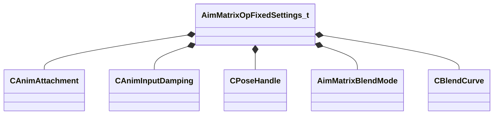

**Fields:**

| Name | Type | Annotations |
|------|------|-------------|
| `m_attachment` | [CAnimAttachment](../schemas/modellib.md#canimattachment) |  |
| `m_damping` | [CAnimInputDamping](../schemas/animgraphlib.md#caniminputdamping) |  |
| `m_poseCacheHandles` | [CPoseHandle](../schemas/animgraphlib.md#cposehandle)[10] |  |
| `m_eBlendMode` | [AimMatrixBlendMode](../schemas/animgraphlib.md#aimmatrixblendmode) |  |
| `m_flMaxYawAngle` | float32 |  |
| `m_flMaxPitchAngle` | float32 |  |
| `m_nSequenceMaxFrame` | int32 |  |
| `m_nBoneMaskIndex` | int32 |  |
| `m_bTargetIsPosition` | bool |  |
| `m_bUseBiasAndClamp` | bool |  |
| `m_flBiasAndClampYawOffset` | float32 |  |
| `m_flBiasAndClampPitchOffset` | float32 |  |
| `m_biasAndClampBlendCurve` | [CBlendCurve](../schemas/animgraphlib.md#cblendcurve) |  |

### AnimNodeNetworkMode

**Values:**

| Name | Value | Description |
|------|-------|-------------|
| `ServerAuthoritative` | 0 | Server Authoritative |
| `ClientSimulate` | 1 | Client Simulate |

### AnimParamButton_t

**Values:**

| Name | Value | Description |
|------|-------|-------------|
| `ANIMPARAM_BUTTON_NONE` | 0 | None |
| `ANIMPARAM_BUTTON_DPAD_UP` | 1 | Dpad Up |
| `ANIMPARAM_BUTTON_DPAD_RIGHT` | 2 | Dpad Right |
| `ANIMPARAM_BUTTON_DPAD_DOWN` | 3 | Dpad Down |
| `ANIMPARAM_BUTTON_DPAD_LEFT` | 4 | Dpad Left |
| `ANIMPARAM_BUTTON_A` | 5 | A |
| `ANIMPARAM_BUTTON_B` | 6 | B |
| `ANIMPARAM_BUTTON_X` | 7 | X |
| `ANIMPARAM_BUTTON_Y` | 8 | Y |
| `ANIMPARAM_BUTTON_LEFT_SHOULDER` | 9 | Left Shoulder |
| `ANIMPARAM_BUTTON_RIGHT_SHOULDER` | 10 | Right Shoulder |
| `ANIMPARAM_BUTTON_LTRIGGER` | 11 | Left Trigger |
| `ANIMPARAM_BUTTON_RTRIGGER` | 12 | Right Trigger |

### AnimParamNetworkSetting

**Values:**

| Name | Value | Description |
|------|-------|-------------|
| `Auto` | 0 | Auto |
| `AlwaysNetwork` | 1 | Always Network |
| `NeverNetwork` | 2 | Never Network |

### AnimParamType_t

**Values:**

| Name | Value | Description |
|------|-------|-------------|
| `ANIMPARAM_UNKNOWN` | 0 |  |
| `ANIMPARAM_BOOL` | 1 |  |
| `ANIMPARAM_ENUM` | 2 |  |
| `ANIMPARAM_INT` | 3 |  |
| `ANIMPARAM_FLOAT` | 4 |  |
| `ANIMPARAM_VECTOR` | 5 |  |
| `ANIMPARAM_QUATERNION` | 6 |  |
| `ANIMPARAM_GLOBALSYMBOL` | 7 |  |
| `ANIMPARAM_COUNT` | 8 |  |

### AnimParamVectorType_t

**Values:**

| Name | Value | Description |
|------|-------|-------------|
| `ANIMPARAM_VECTOR_TYPE_NONE` | 0 | None Specified |
| `ANIMPARAM_VECTOR_TYPE_POSITION_WS` | 1 | World Space Position |
| `ANIMPARAM_VECTOR_TYPE_POSITION_LS` | 2 | Model Space Position |
| `ANIMPARAM_VECTOR_TYPE_DIRECTION_WS` | 3 | World Space Direction |
| `ANIMPARAM_VECTOR_TYPE_DIRECTION_LS` | 4 | Model Space Direction |

### AnimScriptType

**Values:**

| Name | Value | Description |
|------|-------|-------------|
| `ANIMSCRIPT_TYPE_INVALID` | -1 |  |
| `ANIMSCRIPT_FUSE_GENERAL` | 0 |  |
| `ANIMSCRIPT_FUSE_STATEMACHINE` | 1 |  |

### AnimValueSource

**Values:**

| Name | Value | Description |
|------|-------|-------------|
| `MoveHeading` | 0 | Move Heading |
| `MoveSpeed` | 1 | Move Speed |
| `ForwardSpeed` | 2 | Forward Speed |
| `StrafeSpeed` | 3 | Strafe Speed |
| `FacingHeading` | 4 | Facing Heading |
| `LookHeading` | 5 | Look Heading |
| `LookHeadingNormalized` | 6 | Look Heading Normalized |
| `LookPitch` | 7 | Look Pitch |
| `LookDistance` | 8 | Look Distance |
| `Parameter` | 9 | Parameter |
| `WayPointHeading` | 10 | Waypoint Heading |
| `WayPointDistance` | 11 | Waypoint Distance |
| `BoundaryRadius` | 12 | Boundary Radius |
| `TargetMoveHeading` | 13 | Target Move Heading |
| `TargetMoveSpeed` | 14 | Target Move Speed |
| `AccelerationHeading` | 15 | Acceleration Heading |
| `AccelerationSpeed` | 16 | Acceleration Speed |
| `SlopeHeading` | 17 | Slope Heading |
| `SlopeAngle` | 18 | Slope Angle |
| `SlopePitch` | 19 | Slope Pitch |
| `SlopeYaw` | 20 | Slope Yaw |
| `GoalDistance` | 21 | Goal Distance |
| `AccelerationLeftRight` | 22 | Acceleration Left-Right |
| `AccelerationFrontBack` | 23 | Acceleration Forward-Back |
| `RootMotionSpeed` | 24 | Root Motion Speed |
| `RootMotionTurnSpeed` | 25 | Root Motion Turn Speed |
| `MoveHeadingRelativeToLookHeading` | 26 | Move Heading Relative to Look Heading |
| `MaxMoveSpeed` | 27 | Max Move Speed |
| `FingerCurl_Thumb` | 28 | Finger Curl - Thumb |
| `FingerCurl_Index` | 29 | Finger Curl - Index |
| `FingerCurl_Middle` | 30 | Finger Curl - Middle |
| `FingerCurl_Ring` | 31 | Finger Curl - Ring |
| `FingerCurl_Pinky` | 32 | Finger Curl - Pinky |
| `FingerSplay_Thumb_Index` | 33 | Finger Splay - Thumb:Index |
| `FingerSplay_Index_Middle` | 34 | Finger Splay - Index:Middle |
| `FingerSplay_Middle_Ring` | 35 | Finger Splay - Middle:Ring |
| `FingerSplay_Ring_Pinky` | 36 | Finger Splay - Ring:Pinky |

### AnimVectorSource

**Values:**

| Name | Value | Description |
|------|-------|-------------|
| `MoveDirection` | 0 | Move Direction |
| `FacingPosition` | 1 | Facing Position |
| `LookDirection` | 2 | Look Direction |
| `VectorParameter` | 3 | Parameter |
| `WayPointDirection` | 4 | Waypoint Direction |
| `Acceleration` | 5 | Acceleration |
| `SlopeNormal` | 6 | Slope Normal |
| `SlopeNormal_WorldSpace` | 7 | Slope Normal World Space |
| `LookTarget` | 8 | Look Target |
| `LookTarget_WorldSpace` | 9 | Look Target World Space |
| `WayPointPosition` | 10 | Waypoint Position |
| `GoalPosition` | 11 | Goal Position |
| `RootMotionVelocity` | 12 | Root Motion Velocity |
| `ManualTarget_WorldSpace` | 13 | Manual Target World Space |

### BinaryNodeChildOption

**Values:**

| Name | Value | Description |
|------|-------|-------------|
| `Child1` | 0 | Child 1 |
| `Child2` | 1 | Child 2 |

### BinaryNodeTiming

**Values:**

| Name | Value | Description |
|------|-------|-------------|
| `UseChild1` | 0 | Use Child1 |
| `UseChild2` | 1 | Use Child2 |
| `SyncChildren` | 2 | Synchronize Children |

### Blend2DMode

**Values:**

| Name | Value | Description |
|------|-------|-------------|
| `Blend2DMode_General` | 0 | General |
| `Blend2DMode_Directional` | 1 | Directional |

### BlendItem_t

**Metadata:** `MGetKV3ClassDefaults {
	"m_tags":
	[
	],
	"m_pChild":
	{
		"m_nodeIndex": -1
	},
	"m_hSequence": -1,
	"m_vPos":
	[
		0.000000,
		0.000000
	],
	"m_flDuration": 0.000000,
	"m_bUseCustomDuration": false
}`

**Relationships:**

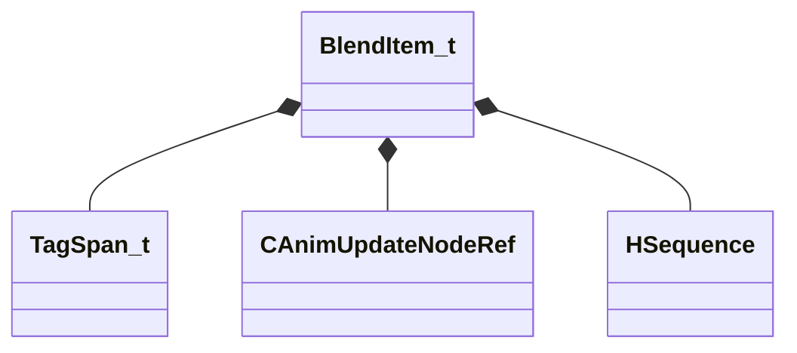

**Fields:**

| Name | Type | Annotations |
|------|------|-------------|
| `m_tags` | CUtlVector<[TagSpan_t](../schemas/animgraphlib.md#tagspan_t)> |  |
| `m_pChild` | [CAnimUpdateNodeRef](../schemas/animgraphlib.md#canimupdatenoderef) |  |
| `m_hSequence` | [HSequence](../schemas/animationsystem.md#hsequence) |  |
| `m_vPos` | Vector2D |  |
| `m_flDuration` | float32 |  |
| `m_bUseCustomDuration` | bool |  |

### BlendKeyType

**Values:**

| Name | Value | Description |
|------|-------|-------------|
| `BlendKey_UserValue` | 0 | User Defined Values |
| `BlendKey_Velocity` | 1 | Velocity |
| `BlendKey_Distance` | 2 | Distance |
| `BlendKey_RemainingDistance` | 3 | Remaining Distance |

### BoneDemoCaptureSettings_t

**Metadata:** `MGetKV3ClassDefaults {
	"m_boneName": "",
	"m_flErrorSplineRotationMax": 1.000000,
	"m_flErrorSplineTranslationMax": 1.000000,
	"m_flErrorSplineScaleMax": 1.000000,
	"m_flErrorQuantizationRotationMax": 1.000000,
	"m_flErrorQuantizationTranslationMax": 1.000000,
	"m_flErrorQuantizationScaleMax": 1.000000
}`

**Fields:**

| Name | Type | Annotations |
|------|------|-------------|
| `m_boneName` | CUtlString | `MPropertyFriendlyName "Bone"` `MPropertyAttributeChoiceName "Bone"` |
| `m_flErrorSplineRotationMax` | float32 | `MPropertySuppressField` |
| `m_flErrorSplineTranslationMax` | float32 | `MPropertySuppressField` |
| `m_flErrorSplineScaleMax` | float32 | `MPropertySuppressField` |
| `m_flErrorQuantizationRotationMax` | float32 | `MPropertySuppressField` |
| `m_flErrorQuantizationTranslationMax` | float32 | `MPropertySuppressField` |
| `m_flErrorQuantizationScaleMax` | float32 | `MPropertySuppressField` |

### BoneMaskBlendSpace

**Values:**

| Name | Value | Description |
|------|-------|-------------|
| `BlendSpace_Parent` | 0 | Parent Space |
| `BlendSpace_Model` | 1 | Model Space |
| `BlendSpace_Model_RotationOnly` | 2 | Model Space, Rotation Only |
| `BlendSpace_Model_TranslationOnly` | 3 | Model Space, Translation Only |

### CActionComponentUpdater

**Inherits from:** [CAnimComponentUpdater](animgraphlib.md#canimcomponentupdater)

**Metadata:** `MGetKV3ClassDefaults {
	"_class": "CActionComponentUpdater",
	"m_name": "",
	"m_id":
	{
		"m_id": <HIDDEN FOR DIFF>,
	},
	"m_networkMode": "ServerAuthoritative",
	"m_bStartEnabled": false,
	"m_actions":
	[
	]
}`

**Relationships:**

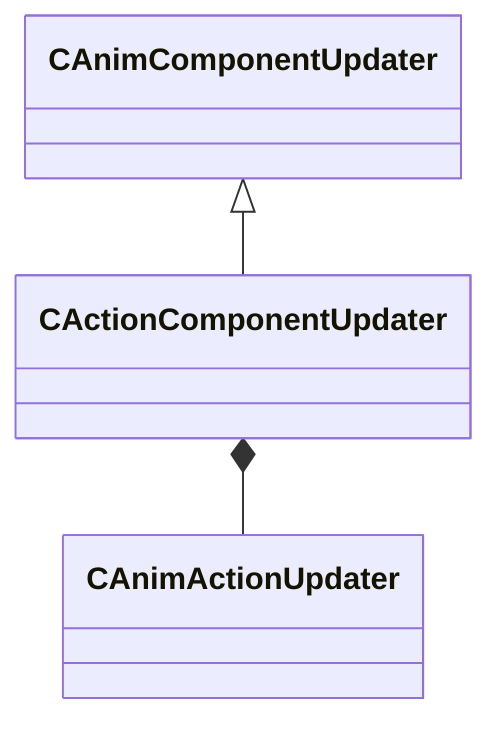

**Fields:**

| Name | Type | Annotations |
|------|------|-------------|
| `m_actions` | CUtlVector<CSmartPtr<[CAnimActionUpdater](../schemas/animgraphlib.md#canimactionupdater)>> |  |

### CAddUpdateNode

**Inherits from:** [CBinaryUpdateNode](animgraphlib.md#cbinaryupdatenode)

**Metadata:** `MGetKV3ClassDefaults {
	"_class": "CAddUpdateNode",
	"m_nodePath":
	{
		"m_path":
		[
			{
				"m_id": <HIDDEN FOR DIFF>,
			},
			{
				"m_id": <HIDDEN FOR DIFF>,
			},
			{
				"m_id": <HIDDEN FOR DIFF>,
			},
			{
				"m_id": <HIDDEN FOR DIFF>,
			},
			{
				"m_id": <HIDDEN FOR DIFF>,
			},
			{
				"m_id": <HIDDEN FOR DIFF>,
			},
			{
				"m_id": <HIDDEN FOR DIFF>,
			},
			{
				"m_id": <HIDDEN FOR DIFF>,
			},
			{
				"m_id": <HIDDEN FOR DIFF>,
			},
			{
				"m_id": <HIDDEN FOR DIFF>,
			},
			{
				"m_id": <HIDDEN FOR DIFF>,
			}
		],
		"m_nCount": 0
	},
	"m_networkMode": "ServerAuthoritative",
	"m_name": "",
	"m_pChild1":
	{
		"m_nodeIndex": -1
	},
	"m_pChild2":
	{
		"m_nodeIndex": -1
	},
	"m_timingBehavior": "UseChild1",
	"m_flTimingBlend": 0.500000,
	"m_bResetChild1": true,
	"m_bResetChild2": true,
	"m_footMotionTiming": "Child1",
	"m_bApplyToFootMotion": true,
	"m_bApplyChannelsSeparately": true,
	"m_bUseModelSpace": false,
	"m_bApplyScale": false
}`

**Relationships:**

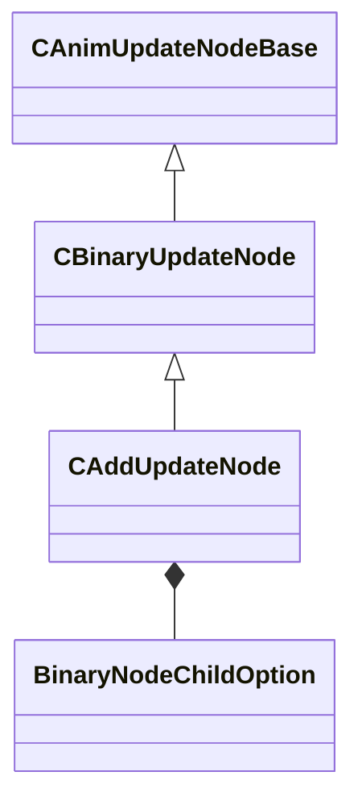

**Fields:**

| Name | Type | Annotations |
|------|------|-------------|
| `m_footMotionTiming` | [BinaryNodeChildOption](../schemas/animgraphlib.md#binarynodechildoption) |  |
| `m_bApplyToFootMotion` | bool |  |
| `m_bApplyChannelsSeparately` | bool |  |
| `m_bUseModelSpace` | bool |  |
| `m_bApplyScale` | bool |  |

### CAimCameraUpdateNode

**Inherits from:** [CUnaryUpdateNode](animgraphlib.md#cunaryupdatenode)

**Metadata:** `MGetKV3ClassDefaults {
	"_class": "CAimCameraUpdateNode",
	"m_nodePath":
	{
		"m_path":
		[
			{
				"m_id": <HIDDEN FOR DIFF>,
			},
			{
				"m_id": <HIDDEN FOR DIFF>,
			},
			{
				"m_id": <HIDDEN FOR DIFF>,
			},
			{
				"m_id": <HIDDEN FOR DIFF>,
			},
			{
				"m_id": <HIDDEN FOR DIFF>,
			},
			{
				"m_id": <HIDDEN FOR DIFF>,
			},
			{
				"m_id": <HIDDEN FOR DIFF>,
			},
			{
				"m_id": <HIDDEN FOR DIFF>,
			},
			{
				"m_id": <HIDDEN FOR DIFF>,
			},
			{
				"m_id": <HIDDEN FOR DIFF>,
			},
			{
				"m_id": <HIDDEN FOR DIFF>,
			}
		],
		"m_nCount": 0
	},
	"m_networkMode": "ServerAuthoritative",
	"m_name": "",
	"m_pChildNode":
	{
		"m_nodeIndex": -1
	},
	"m_hParameterPosition":
	{
		"m_type": "ANIMPARAM_UNKNOWN",
		"m_index": 255
	},
	"m_hParameterOrientation":
	{
		"m_type": "ANIMPARAM_UNKNOWN",
		"m_index": 255
	},
	"m_hParameterPelvisOffset":
	{
		"m_type": "ANIMPARAM_UNKNOWN",
		"m_index": 255
	},
	"m_hParameterCameraOnly":
	{
		"m_type": "ANIMPARAM_UNKNOWN",
		"m_index": 255
	},
	"m_hParameterWeaponDepenetrationDistance":
	{
		"m_type": "ANIMPARAM_UNKNOWN",
		"m_index": 255
	},
	"m_hParameterWeaponDepenetrationDelta":
	{
		"m_type": "ANIMPARAM_UNKNOWN",
		"m_index": 255
	},
	"m_hParameterCameraClearanceDistance":
	{
		"m_type": "ANIMPARAM_UNKNOWN",
		"m_index": 255
	},
	"m_opFixedSettings":
	{
		"m_nChainIndex": -1,
		"m_nCameraJointIndex": -1,
		"m_nPelvisJointIndex": -1,
		"m_nClavicleLeftJointIndex": -1,
		"m_nClavicleRightJointIndex": -1,
		"m_nDepenetrationJointIndex": -1,
		"m_propJoints":
		[
		]
	}
}`

**Relationships:**

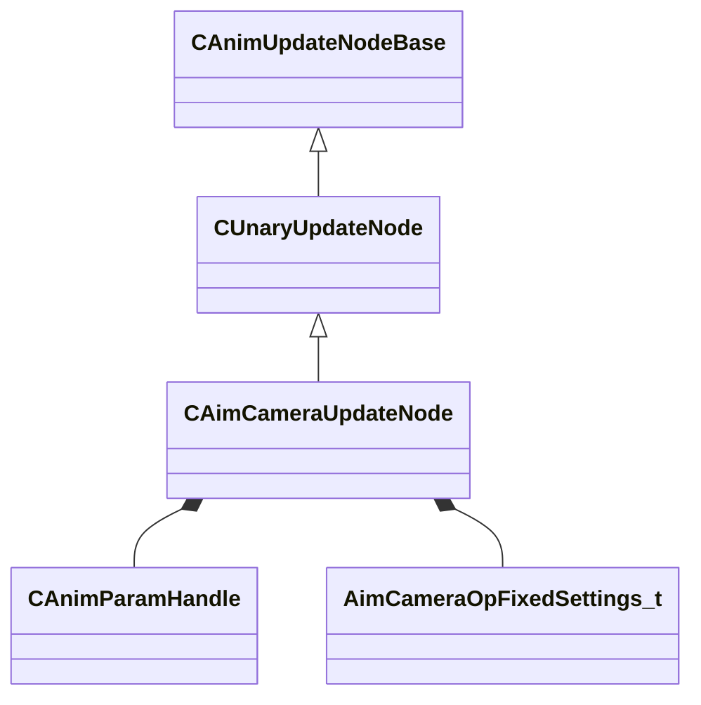

**Fields:**

| Name | Type | Annotations |
|------|------|-------------|
| `m_hParameterPosition` | [CAnimParamHandle](../schemas/animgraphlib.md#canimparamhandle) |  |
| `m_hParameterOrientation` | [CAnimParamHandle](../schemas/animgraphlib.md#canimparamhandle) |  |
| `m_hParameterPelvisOffset` | [CAnimParamHandle](../schemas/animgraphlib.md#canimparamhandle) |  |
| `m_hParameterCameraOnly` | [CAnimParamHandle](../schemas/animgraphlib.md#canimparamhandle) |  |
| `m_hParameterWeaponDepenetrationDistance` | [CAnimParamHandle](../schemas/animgraphlib.md#canimparamhandle) |  |
| `m_hParameterWeaponDepenetrationDelta` | [CAnimParamHandle](../schemas/animgraphlib.md#canimparamhandle) |  |
| `m_hParameterCameraClearanceDistance` | [CAnimParamHandle](../schemas/animgraphlib.md#canimparamhandle) |  |
| `m_opFixedSettings` | [AimCameraOpFixedSettings_t](../schemas/animgraphlib.md#aimcameraopfixedsettings_t) |  |

### CAimMatrixUpdateNode

**Inherits from:** [CUnaryUpdateNode](animgraphlib.md#cunaryupdatenode)

**Metadata:** `MGetKV3ClassDefaults {
	"_class": "CAimMatrixUpdateNode",
	"m_nodePath":
	{
		"m_path":
		[
			{
				"m_id": <HIDDEN FOR DIFF>,
			},
			{
				"m_id": <HIDDEN FOR DIFF>,
			},
			{
				"m_id": <HIDDEN FOR DIFF>,
			},
			{
				"m_id": <HIDDEN FOR DIFF>,
			},
			{
				"m_id": <HIDDEN FOR DIFF>,
			},
			{
				"m_id": <HIDDEN FOR DIFF>,
			},
			{
				"m_id": <HIDDEN FOR DIFF>,
			},
			{
				"m_id": <HIDDEN FOR DIFF>,
			},
			{
				"m_id": <HIDDEN FOR DIFF>,
			},
			{
				"m_id": <HIDDEN FOR DIFF>,
			},
			{
				"m_id": <HIDDEN FOR DIFF>,
			}
		],
		"m_nCount": 0
	},
	"m_networkMode": "ServerAuthoritative",
	"m_name": "",
	"m_pChildNode":
	{
		"m_nodeIndex": -1
	},
	"m_opFixedSettings":
	{
		"m_attachment":
		{
			"m_influenceRotations":
			[
				[
					0.000000,
					0.000000,
					0.000000,
					0.000000
				],
				[
					0.000000,
					0.000000,
					0.000000,
					0.000000
				],
				[
					0.000000,
					0.000000,
					0.000000,
					0.000000
				]
			],
			"m_influenceOffsets":
			[
				[
					0.000000,
					0.000000,
					0.000000
				],
				[
					0.000000,
					0.000000,
					0.000000
				],
				[
					0.000000,
					0.000000,
					0.000000
				]
			],
			"m_influenceIndices":
			[
				0,
				0,
				0
			],
			"m_influenceWeights":
			[
				0.000000,
				0.000000,
				0.000000
			],
			"m_numInfluences": 0
		},
		"m_damping":
		{
			"_class": "CAnimInputDamping",
			"m_speedFunction": "NoDamping",
			"m_fSpeedScale": 1.000000,
			"m_fFallingSpeedScale": 1.000000
		},
		"m_poseCacheHandles":
		[
			{
				"m_nIndex": 65535,
				"m_eType": "POSETYPE_INVALID"
			},
			{
				"m_nIndex": 65535,
				"m_eType": "POSETYPE_INVALID"
			},
			{
				"m_nIndex": 65535,
				"m_eType": "POSETYPE_INVALID"
			},
			{
				"m_nIndex": 65535,
				"m_eType": "POSETYPE_INVALID"
			},
			{
				"m_nIndex": 65535,
				"m_eType": "POSETYPE_INVALID"
			},
			{
				"m_nIndex": 65535,
				"m_eType": "POSETYPE_INVALID"
			},
			{
				"m_nIndex": 65535,
				"m_eType": "POSETYPE_INVALID"
			},
			{
				"m_nIndex": 65535,
				"m_eType": "POSETYPE_INVALID"
			},
			{
				"m_nIndex": 65535,
				"m_eType": "POSETYPE_INVALID"
			},
			{
				"m_nIndex": 65535,
				"m_eType": "POSETYPE_INVALID"
			}
		],
		"m_eBlendMode": "AimMatrixBlendMode_None",
		"m_flMaxYawAngle": 45.000000,
		"m_flMaxPitchAngle": 45.000000,
		"m_nSequenceMaxFrame": 0,
		"m_nBoneMaskIndex": -1,
		"m_bTargetIsPosition": true,
		"m_bUseBiasAndClamp": false,
		"m_flBiasAndClampYawOffset": 1.000000,
		"m_flBiasAndClampPitchOffset": 1.000000,
		"m_biasAndClampBlendCurve":
		{
			"m_flControlPoint1": 0.000000,
			"m_flControlPoint2": 1.000000
		}
	},
	"m_target": "MoveDirection",
	"m_paramIndex":
	{
		"m_type": "ANIMPARAM_UNKNOWN",
		"m_index": 255
	},
	"m_hSequence": -1,
	"m_bResetChild": false,
	"m_bLockWhenWaning": false
}`

**Relationships:**

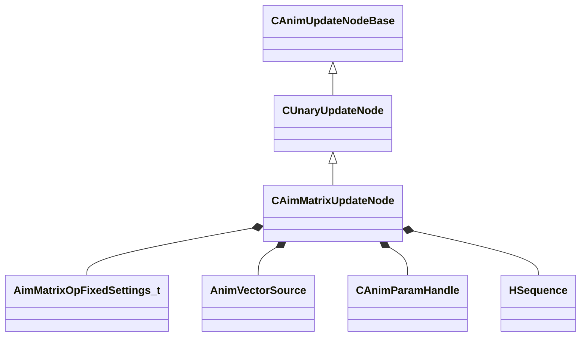

**Fields:**

| Name | Type | Annotations |
|------|------|-------------|
| `m_opFixedSettings` | [AimMatrixOpFixedSettings_t](../schemas/animgraphlib.md#aimmatrixopfixedsettings_t) |  |
| `m_target` | [AnimVectorSource](../schemas/animgraphlib.md#animvectorsource) |  |
| `m_paramIndex` | [CAnimParamHandle](../schemas/animgraphlib.md#canimparamhandle) |  |
| `m_hSequence` | [HSequence](../schemas/animationsystem.md#hsequence) |  |
| `m_bResetChild` | bool |  |
| `m_bLockWhenWaning` | bool |  |

### CAnimActionUpdater

**Derived by:** [CEmitTagActionUpdater](animgraphlib.md#cemittagactionupdater), [CExpressionActionUpdater](animgraphlib.md#cexpressionactionupdater), [CSetParameterActionUpdater](animgraphlib.md#csetparameteractionupdater), [CToggleComponentActionUpdater](animgraphlib.md#ctogglecomponentactionupdater)

**Metadata:** `MGetKV3ClassDefaults Could not parse KV3 Defaults`

**Relationships:**

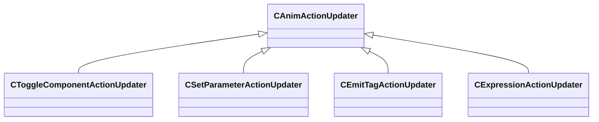

### CAnimComponentUpdater

**Derived by:** [CActionComponentUpdater](animgraphlib.md#cactioncomponentupdater), [CAnimScriptComponentUpdater](animgraphlib.md#canimscriptcomponentupdater), [CCPPScriptComponentUpdater](animgraphlib.md#ccppscriptcomponentupdater), [CDampedValueComponentUpdater](animgraphlib.md#cdampedvaluecomponentupdater), [CDemoSettingsComponentUpdater](animgraphlib.md#cdemosettingscomponentupdater), [CLODComponentUpdater](animgraphlib.md#clodcomponentupdater), [CLookComponentUpdater](animgraphlib.md#clookcomponentupdater), [CMovementComponentUpdater](animgraphlib.md#cmovementcomponentupdater), [CPairedSequenceComponentUpdater](animgraphlib.md#cpairedsequencecomponentupdater), [CRagdollComponentUpdater](animgraphlib.md#cragdollcomponentupdater), [CRemapValueComponentUpdater](animgraphlib.md#cremapvaluecomponentupdater), [CSlopeComponentUpdater](animgraphlib.md#cslopecomponentupdater), [CStateMachineComponentUpdater](animgraphlib.md#cstatemachinecomponentupdater)

**Metadata:** `MGetKV3ClassDefaults Could not parse KV3 Defaults`

**Relationships:**

```mermaid
classDiagram
    CAnimComponentUpdater <|-- CCPPScriptComponentUpdater
    CAnimComponentUpdater <|-- CAnimScriptComponentUpdater
    CAnimComponentUpdater <|-- CSlopeComponentUpdater
    CAnimComponentUpdater <|-- CDemoSettingsComponentUpdater
    CAnimComponentUpdater <|-- CMovementComponentUpdater
    CAnimComponentUpdater <|-- CPairedSequenceComponentUpdater
    CAnimComponentUpdater <|-- CLODComponentUpdater
    CAnimComponentUpdater <|-- CStateMachineComponentUpdater
    CAnimComponentUpdater <|-- CRagdollComponentUpdater
    CAnimComponentUpdater <|-- CDampedValueComponentUpdater
    CAnimComponentUpdater <|-- CActionComponentUpdater
    CAnimComponentUpdater <|-- CRemapValueComponentUpdater
    CAnimComponentUpdater <|-- CLookComponentUpdater
    CAnimComponentUpdater *-- AnimComponentID
    CAnimComponentUpdater *-- AnimNodeNetworkMode
```

**Fields:**

| Name | Type | Annotations |
|------|------|-------------|
| `m_name` | CUtlString |  |
| `m_id` | [AnimComponentID](../schemas/modellib.md#animcomponentid) |  |
| `m_networkMode` | [AnimNodeNetworkMode](../schemas/animgraphlib.md#animnodenetworkmode) |  |
| `m_bStartEnabled` | bool |  |

### CAnimDemoCaptureSettings

**Metadata:** `MGetKV3ClassDefaults {
	"m_vecErrorRangeSplineRotation":
	[
		0.100000,
		0.500000
	],
	"m_vecErrorRangeSplineTranslation":
	[
		0.100000,
		0.500000
	],
	"m_vecErrorRangeSplineScale":
	[
		0.100000,
		0.500000
	],
	"m_flIkRotation_MaxSplineError": 0.030000,
	"m_flIkTranslation_MaxSplineError": 0.300000,
	"m_vecErrorRangeQuantizationRotation":
	[
		0.100000,
		0.500000
	],
	"m_vecErrorRangeQuantizationTranslation":
	[
		0.100000,
		0.500000
	],
	"m_vecErrorRangeQuantizationScale":
	[
		0.100000,
		0.500000
	],
	"m_flIkRotation_MaxQuantizationError": 0.010000,
	"m_flIkTranslation_MaxQuantizationError": 0.100000,
	"m_baseSequence": "",
	"m_nBaseSequenceFrame": 0,
	"m_boneSelectionMode": "CaptureSelectedBones",
	"m_bones":
	[
	],
	"m_ikChains":
	[
	]
}`

**Relationships:**

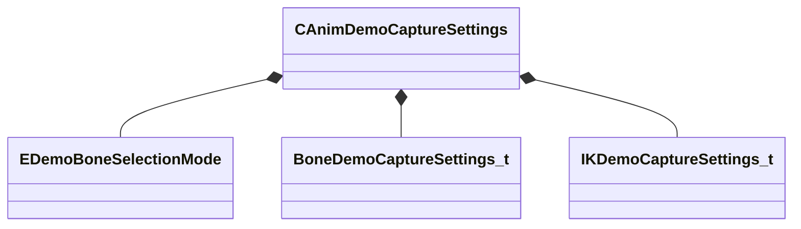

**Fields:**

| Name | Type | Annotations |
|------|------|-------------|
| `m_vecErrorRangeSplineRotation` | Vector2D | `MPropertyFriendlyName "Rotation Error Range"` `MPropertyGroupName "+Spline Settings"` |
| `m_vecErrorRangeSplineTranslation` | Vector2D | `MPropertyFriendlyName "Translation Error Range"` `MPropertyGroupName "+Spline Settings"` |
| `m_vecErrorRangeSplineScale` | Vector2D | `MPropertyFriendlyName "Scale Error Range"` `MPropertyGroupName "+Spline Settings"` |
| `m_flIkRotation_MaxSplineError` | float32 | `MPropertyFriendlyName "Max IK Rotation Error"` `MPropertyGroupName "+Spline Settings"` |
| `m_flIkTranslation_MaxSplineError` | float32 | `MPropertyFriendlyName "Max IK Translation Error"` `MPropertyGroupName "+Spline Settings"` |
| `m_vecErrorRangeQuantizationRotation` | Vector2D | `MPropertyFriendlyName "Rotation Error Range"` `MPropertyGroupName "+Quantization Settings"` |
| `m_vecErrorRangeQuantizationTranslation` | Vector2D | `MPropertyFriendlyName "Translation Error Range"` `MPropertyGroupName "+Quantization Settings"` |
| `m_vecErrorRangeQuantizationScale` | Vector2D | `MPropertyFriendlyName "Scale Error Range"` `MPropertyGroupName "+Quantization Settings"` |
| `m_flIkRotation_MaxQuantizationError` | float32 | `MPropertyFriendlyName "Max IK Rotation Error"` `MPropertyGroupName "+Quantization Settings"` |
| `m_flIkTranslation_MaxQuantizationError` | float32 | `MPropertyFriendlyName "Max IK Translation Error"` `MPropertyGroupName "+Quantization Settings"` |
| `m_baseSequence` | CUtlString | `MPropertyFriendlyName "Base Sequence"` `MPropertyGroupName "+Base Pose"` `MPropertyAttributeChoiceName "Sequence"` |
| `m_nBaseSequenceFrame` | int32 | `MPropertyFriendlyName "Base Sequence Frame"` `MPropertyGroupName "+Base Pose"` |
| `m_boneSelectionMode` | [EDemoBoneSelectionMode](../schemas/animgraphlib.md#edemoboneselectionmode) | `MPropertyFriendlyName "Bone Selection Mode"` `MPropertyGroupName "+Bones"` `MPropertyAutoRebuildOnChange` |
| `m_bones` | CUtlVector<[BoneDemoCaptureSettings_t](../schemas/animgraphlib.md#bonedemocapturesettings_t)> | `MPropertyFriendlyName "Bones"` `MPropertyGroupName "+Bones"` `MPropertyAttrStateCallback` |
| `m_ikChains` | CUtlVector<[IKDemoCaptureSettings_t](../schemas/animgraphlib.md#ikdemocapturesettings_t)> | `MPropertyFriendlyName "IK Chains"` |

### CAnimGraphDebugReplay

**Metadata:** `MGetKV3ClassDefaults {
	"_class": "CAnimGraphDebugReplay",
	"m_animGraphFileName": "",
	"m_frameList":
	[
		null,
		null,
		null,
		null,
		null,
		null,
		null,
		null,
		null,
		null,
		null,
		null,
		null,
		null,
		null,
		null,
		null,
		null,
		null,
		null,
		null,
		null,
		null,
		null,
		null,
		null,
		null,
		null,
		null,
		null,
		null,
		null,
		null,
		null,
		null,
		null,
		null,
		null,
		null,
		null,
		null,
		null,
		null,
		null,
		null,
		null,
		null,
		null,
		null,
		null,
		null,
		null,
		null,
		null,
		null,
		null,
		null,
		null,
		null,
		null,
		null,
		null,
		null,
		null,
		null,
		null,
		null,
		null,
		null,
		null,
		null,
		null,
		null,
		null,
		null,
		null,
		null,
		null,
		null,
		null,
		null,
		null,
		null,
		null,
		null,
		null,
		null,
		null,
		null,
		null,
		null,
		null,
		null,
		null,
		null,
		null,
		null,
		null,
		null,
		null,
		null,
		null,
		null,
		null,
		null,
		null,
		null,
		null,
		null,
		null,
		null,
		null,
		null,
		null,
		null,
		null,
		null,
		null,
		null,
		null,
		null,
		null,
		null,
		null,
		null,
		null,
		null,
		null,
		null,
		null,
		null,
		null,
		null,
		null,
		null,
		null,
		null,
		null,
		null,
		null,
		null,
		null,
		null,
		null,
		null,
		null,
		null,
		null,
		null,
		null,
		null,
		null,
		null,
		null,
		null,
		null,
		null,
		null,
		null,
		null,
		null,
		null,
		null,
		null,
		null,
		null,
		null,
		null,
		null,
		null,
		null,
		null,
		null,
		null,
		null,
		null,
		null,
		null,
		null,
		null,
		null,
		null,
		null,
		null,
		null,
		null,
		null,
		null,
		null,
		null,
		null,
		null,
		null,
		null,
		null,
		null,
		null,
		null,
		null,
		null,
		null,
		null,
		null,
		null,
		null,
		null,
		null,
		null,
		null,
		null,
		null,
		null,
		null,
		null,
		null,
		null,
		null,
		null,
		null,
		null,
		null,
		null,
		null,
		null,
		null,
		null,
		null,
		null,
		null,
		null,
		null,
		null,
		null,
		null,
		null,
		null,
		null,
		null,
		null,
		null,
		null,
		null,
		null,
		null,
		null,
		null,
		null,
		null,
		null,
		null,
		null,
		null,
		null,
		null,
		null,
		null,
		null,
		null,
		null,
		null,
		null,
		null,
		null,
		null,
		null,
		null,
		null,
		null,
		null,
		null,
		null,
		null,
		null,
		null,
		null,
		null,
		null,
		null,
		null,
		null,
		null,
		null,
		null,
		null,
		null,
		null,
		null,
		null,
		null,
		null,
		null,
		null,
		null,
		null,
		null,
		null,
		null,
		null,
		null,
		null,
		null,
		null,
		null,
		null,
		null,
		null,
		null,
		null,
		null,
		null,
		null,
		null,
		null,
		null,
		null,
		null,
		null,
		null,
		null,
		null,
		null,
		null,
		null,
		null,
		null,
		null,
		null,
		null,
		null,
		null,
		null,
		null,
		null,
		null,
		null,
		null,
		null,
		null,
		null,
		null,
		null,
		null,
		null,
		null,
		null,
		null,
		null,
		null,
		null,
		null,
		null,
		null,
		null,
		null,
		null,
		null,
		null,
		null,
		null,
		null,
		null,
		null,
		null,
		null,
		null,
		null,
		null,
		null,
		null,
		null,
		null,
		null,
		null,
		null,
		null,
		null,
		null,
		null,
		null,
		null,
		null,
		null,
		null,
		null,
		null,
		null,
		null,
		null,
		null,
		null,
		null,
		null,
		null,
		null,
		null,
		null,
		null,
		null,
		null,
		null,
		null,
		null,
		null,
		null,
		null,
		null,
		null,
		null,
		null,
		null,
		null,
		null,
		null,
		null,
		null,
		null,
		null,
		null,
		null,
		null,
		null,
		null,
		null,
		null,
		null,
		null,
		null,
		null,
		null,
		null,
		null,
		null,
		null,
		null,
		null,
		null,
		null,
		null,
		null,
		null,
		null,
		null,
		null,
		null,
		null,
		null,
		null,
		null,
		null,
		null,
		null,
		null,
		null,
		null,
		null,
		null,
		null,
		null,
		null,
		null,
		null,
		null,
		null,
		null,
		null,
		null,
		null,
		null,
		null,
		null,
		null,
		null,
		null,
		null,
		null,
		null,
		null,
		null,
		null,
		null,
		null,
		null,
		null,
		null,
		null,
		null,
		null,
		null,
		null,
		null,
		null,
		null,
		null,
		null,
		null,
		null,
		null,
		null,
		null,
		null,
		null,
		null,
		null,
		null,
		null,
		null,
		null,
		null,
		null,
		null,
		null,
		null,
		null,
		null,
		null,
		null,
		null,
		null,
		null,
		null,
		null,
		null,
		null,
		null,
		null,
		null,
		null,
		null,
		null,
		null,
		null,
		null,
		null,
		null,
		null,
		null,
		null,
		null,
		null,
		null,
		null,
		null,
		null,
		null,
		null,
		null,
		null,
		null,
		null,
		null,
		null,
		null,
		null,
		null,
		null,
		null,
		null,
		null,
		null,
		null,
		null,
		null,
		null,
		null,
		null,
		null,
		null,
		null,
		null,
		null,
		null,
		null,
		null,
		null,
		null,
		null,
		null,
		null,
		null,
		null,
		null,
		null,
		null,
		null,
		null,
		null,
		null,
		null,
		null,
		null,
		null,
		null,
		null,
		null,
		null,
		null,
		null,
		null,
		null,
		null,
		null,
		null,
		null,
		null,
		null,
		null,
		null,
		null,
		null,
		null,
		null,
		null,
		null,
		null,
		null,
		null,
		null,
		null,
		null,
		null,
		null,
		null,
		null,
		null,
		null,
		null,
		null,
		null,
		null,
		null,
		null,
		null,
		null,
		null,
		null,
		null,
		null,
		null,
		null,
		null,
		null,
		null,
		null,
		null,
		null,
		null,
		null,
		null,
		null,
		null,
		null,
		null,
		null,
		null,
		null,
		null,
		null,
		null,
		null,
		null,
		null,
		null,
		null,
		null,
		null,
		null,
		null,
		null,
		null,
		null,
		null,
		null,
		null,
		null,
		null,
		null,
		null,
		null,
		null,
		null,
		null,
		null,
		null,
		null,
		null,
		null,
		null,
		null,
		null,
		null,
		null,
		null,
		null,
		null,
		null,
		null,
		null,
		null,
		null,
		null,
		null,
		null,
		null,
		null,
		null,
		null,
		null,
		null,
		null,
		null,
		null,
		null,
		null,
		null,
		null,
		null,
		null,
		null,
		null,
		null,
		null,
		null,
		null,
		null,
		null,
		null,
		null,
		null,
		null,
		null,
		null,
		null,
		null,
		null,
		null,
		null,
		null,
		null,
		null,
		null,
		null,
		null,
		null,
		null,
		null,
		null,
		null,
		null,
		null,
		null,
		null,
		null,
		null,
		null,
		null,
		null,
		null,
		null,
		null,
		null,
		null,
		null,
		null,
		null,
		null,
		null,
		null,
		null,
		null,
		null,
		null,
		null,
		null,
		null,
		null,
		null,
		null,
		null,
		null,
		null,
		null,
		null,
		null,
		null,
		null,
		null,
		null,
		null,
		null,
		null,
		null,
		null,
		null,
		null,
		null,
		null,
		null,
		null,
		null,
		null,
		null,
		null,
		null,
		null,
		null,
		null,
		null,
		null,
		null,
		null,
		null,
		null,
		null,
		null,
		null,
		null,
		null,
		null,
		null,
		null,
		null,
		null,
		null,
		null,
		null,
		null,
		null,
		null,
		null,
		null,
		null,
		null,
		null,
		null,
		null,
		null,
		null,
		null,
		null,
		null,
		null,
		null,
		null,
		null,
		null,
		null,
		null,
		null,
		null,
		null,
		null,
		null,
		null,
		null,
		null,
		null,
		null,
		null,
		null,
		null,
		null,
		null,
		null,
		null,
		null,
		null,
		null,
		null,
		null,
		null,
		null,
		null,
		null,
		null,
		null,
		null,
		null,
		null,
		null,
		null,
		null,
		null,
		null,
		null,
		null,
		null,
		null,
		null,
		null,
		null,
		null,
		null,
		null,
		null,
		null,
		null,
		null,
		null,
		null,
		null,
		null,
		null,
		null,
		null,
		null,
		null,
		null,
		null,
		null,
		null,
		null,
		null,
		null,
		null,
		null,
		null,
		null,
		null,
		null,
		null,
		null,
		null,
		null,
		null,
		null,
		null,
		null,
		null,
		null,
		null,
		null,
		null,
		null,
		null,
		null,
		null,
		null,
		null,
		null,
		null,
		null,
		null,
		null,
		null,
		null,
		null,
		null,
		null,
		null,
		null,
		null,
		null,
		null,
		null,
		null,
		null,
		null,
		null,
		null,
		null,
		null,
		null,
		null,
		null,
		null,
		null,
		null,
		null,
		null,
		null,
		null,
		null,
		null,
		null,
		null,
		null,
		null,
		null,
		null,
		null,
		null,
		null,
		null,
		null,
		null,
		null,
		null,
		null,
		null,
		null,
		null,
		null,
		null,
		null,
		null,
		null,
		null,
		null,
		null,
		null,
		null,
		null,
		null,
		null,
		null,
		null,
		null,
		null,
		null,
		null,
		null,
		null,
		null,
		null,
		null,
		null,
		null,
		null,
		null,
		null,
		null,
		null,
		null,
		null,
		null,
		null,
		null,
		null,
		null,
		null,
		null,
		null,
		null,
		null,
		null,
		null,
		null,
		null,
		null,
		null,
		null,
		null,
		null,
		null,
		null,
		null,
		null,
		null,
		null,
		null,
		null,
		null,
		null,
		null,
		null,
		null,
		null,
		null,
		null,
		null,
		null,
		null,
		null,
		null,
		null,
		null,
		null,
		null,
		null,
		null,
		null,
		null,
		null,
		null,
		null,
		null,
		null,
		null,
		null,
		null,
		null,
		null,
		null,
		null,
		null,
		null,
		null,
		null,
		null,
		null,
		null,
		null,
		null,
		null,
		null,
		null,
		null,
		null,
		null,
		null,
		null,
		null,
		null,
		null,
		null,
		null,
		null,
		null,
		null,
		null,
		null,
		null,
		null,
		null,
		null,
		null,
		null,
		null,
		null,
		null,
		null,
		null,
		null,
		null,
		null,
		null,
		null,
		null,
		null,
		null,
		null,
		null,
		null,
		null,
		null,
		null,
		null,
		null,
		null,
		null,
		null,
		null,
		null,
		null,
		null,
		null,
		null,
		null,
		null,
		null,
		null,
		null,
		null,
		null,
		null,
		null,
		null,
		null,
		null,
		null,
		null,
		null,
		null,
		null,
		null,
		null,
		null,
		null,
		null,
		null,
		null,
		null,
		null,
		null,
		null,
		null,
		null,
		null,
		null,
		null,
		null,
		null,
		null,
		null,
		null,
		null,
		null,
		null,
		null,
		null,
		null,
		null,
		null,
		null,
		null,
		null,
		null,
		null,
		null,
		null,
		null,
		null,
		null,
		null,
		null,
		null,
		null,
		null,
		null,
		null,
		null,
		null,
		null,
		null,
		null,
		null,
		null,
		null,
		null,
		null,
		null,
		null,
		null,
		null,
		null,
		null,
		null,
		null,
		null,
		null,
		null,
		null,
		null,
		null,
		null,
		null,
		null,
		null,
		null,
		null,
		null,
		null,
		null,
		null,
		null,
		null,
		null,
		null,
		null,
		null,
		null,
		null,
		null,
		null,
		null,
		null,
		null,
		null,
		null,
		null,
		null,
		null,
		null,
		null,
		null,
		null,
		null,
		null,
		null,
		null,
		null,
		null,
		null,
		null,
		null,
		null,
		null,
		null,
		null,
		null,
		null,
		null,
		null,
		null,
		null,
		null,
		null,
		null,
		null,
		null,
		null,
		null,
		null,
		null,
		null,
		null,
		null,
		null,
		null,
		null,
		null,
		null,
		null,
		null,
		null,
		null,
		null,
		null,
		null,
		null,
		null,
		null,
		null,
		null,
		null,
		null,
		null,
		null,
		null,
		null,
		null,
		null,
		null,
		null,
		null,
		null,
		null,
		null,
		null,
		null,
		null,
		null,
		null,
		null,
		null,
		null,
		null,
		null,
		null,
		null,
		null,
		null,
		null,
		null,
		null,
		null,
		null,
		null,
		null,
		null,
		null,
		null,
		null,
		null,
		null,
		null,
		null,
		null,
		null,
		null,
		null,
		null,
		null,
		null,
		null,
		null,
		null,
		null,
		null,
		null,
		null,
		null,
		null,
		null,
		null,
		null,
		null,
		null,
		null,
		null,
		null,
		null,
		null,
		null,
		null,
		null,
		null,
		null,
		null,
		null,
		null,
		null,
		null,
		null,
		null,
		null,
		null,
		null,
		null,
		null,
		null,
		null,
		null,
		null,
		null,
		null,
		null,
		null,
		null,
		null,
		null,
		null,
		null,
		null,
		null,
		null,
		null,
		null,
		null,
		null,
		null,
		null,
		null,
		null,
		null,
		null,
		null,
		null,
		null,
		null,
		null,
		null,
		null,
		null,
		null,
		null,
		null,
		null,
		null,
		null,
		null,
		null,
		null,
		null,
		null,
		null,
		null,
		null,
		null,
		null,
		null,
		null,
		null,
		null,
		null,
		null,
		null,
		null,
		null,
		null,
		null,
		null,
		null,
		null,
		null,
		null,
		null,
		null,
		null,
		null,
		null,
		null,
		null,
		null,
		null,
		null,
		null,
		null,
		null,
		null,
		null,
		null,
		null,
		null,
		null,
		null,
		null,
		null,
		null,
		null,
		null,
		null,
		null,
		null,
		null,
		null,
		null,
		null,
		null,
		null,
		null,
		null,
		null,
		null,
		null,
		null,
		null,
		null,
		null,
		null,
		null,
		null,
		null,
		null,
		null,
		null,
		null,
		null,
		null,
		null,
		null,
		null,
		null,
		null,
		null,
		null,
		null,
		null,
		null,
		null,
		null,
		null,
		null,
		null,
		null,
		null,
		null,
		null,
		null,
		null,
		null,
		null,
		null,
		null,
		null,
		null,
		null,
		null,
		null,
		null,
		null,
		null,
		null,
		null,
		null,
		null,
		null,
		null,
		null,
		null,
		null,
		null,
		null,
		null,
		null,
		null,
		null,
		null,
		null,
		null,
		null,
		null,
		null,
		null,
		null,
		null,
		null,
		null,
		null,
		null,
		null,
		null,
		null,
		null,
		null,
		null,
		null,
		null,
		null,
		null,
		null,
		null,
		null,
		null,
		null,
		null,
		null,
		null,
		null,
		null,
		null,
		null,
		null,
		null,
		null,
		null,
		null,
		null,
		null,
		null,
		null,
		null,
		null,
		null,
		null,
		null,
		null,
		null,
		null,
		null,
		null,
		null,
		null,
		null,
		null,
		null,
		null,
		null,
		null,
		null,
		null,
		null,
		null,
		null,
		null,
		null,
		null,
		null,
		null,
		null,
		null,
		null,
		null,
		null,
		null,
		null,
		null,
		null,
		null,
		null,
		null,
		null,
		null,
		null,
		null,
		null,
		null,
		null,
		null,
		null,
		null,
		null,
		null,
		null,
		null,
		null,
		null,
		null,
		null,
		null,
		null,
		null,
		null,
		null,
		null,
		null,
		null,
		null,
		null,
		null,
		null,
		null,
		null,
		null,
		null,
		null,
		null,
		null,
		null,
		null,
		null,
		null,
		null,
		null,
		null,
		null,
		null,
		null,
		null,
		null,
		null,
		null,
		null,
		null,
		null,
		null,
		null,
		null,
		null,
		null,
		null,
		null,
		null,
		null,
		null,
		null,
		null,
		null,
		null,
		null,
		null,
		null,
		null,
		null,
		null,
		null,
		null,
		null,
		null,
		null,
		null,
		null,
		null,
		null,
		null,
		null,
		null,
		null,
		null,
		null,
		null,
		null,
		null,
		null,
		null,
		null,
		null,
		null,
		null,
		null,
		null,
		null,
		null,
		null,
		null,
		null,
		null,
		null,
		null,
		null,
		null,
		null,
		null,
		null,
		null,
		null,
		null,
		null,
		null,
		null,
		null,
		null,
		null,
		null,
		null,
		null,
		null,
		null,
		null,
		null,
		null,
		null,
		null,
		null,
		null,
		null,
		null,
		null,
		null,
		null,
		null,
		null,
		null,
		null,
		null,
		null,
		null,
		null,
		null,
		null,
		null,
		null,
		null,
		null,
		null,
		null,
		null,
		null,
		null,
		null,
		null,
		null,
		null,
		null,
		null,
		null,
		null,
		null,
		null,
		null,
		null,
		null,
		null,
		null,
		null,
		null,
		null,
		null,
		null,
		null,
		null,
		null,
		null,
		null,
		null,
		null,
		null,
		null,
		null,
		null,
		null,
		null,
		null,
		null,
		null,
		null,
		null,
		null,
		null,
		null,
		null,
		null,
		null,
		null,
		null,
		null,
		null,
		null,
		null,
		null,
		null,
		null,
		null,
		null,
		null,
		null,
		null,
		null,
		null,
		null,
		null,
		null,
		null,
		null,
		null,
		null,
		null,
		null,
		null,
		null,
		null,
		null,
		null,
		null,
		null,
		null,
		null,
		null,
		null,
		null,
		null,
		null,
		null,
		null,
		null,
		null,
		null,
		null,
		null,
		null,
		null,
		null,
		null,
		null,
		null,
		null,
		null,
		null,
		null,
		null,
		null,
		null,
		null,
		null,
		null,
		null,
		null,
		null,
		null,
		null,
		null,
		null,
		null,
		null,
		null,
		null,
		null,
		null,
		null,
		null,
		null,
		null,
		null,
		null,
		null,
		null,
		null,
		null,
		null,
		null,
		null,
		null,
		null,
		null,
		null,
		null,
		null,
		null,
		null,
		null,
		null,
		null,
		null,
		null,
		null,
		null,
		null,
		null,
		null,
		null,
		null,
		null,
		null,
		null,
		null,
		null,
		null,
		null,
		null,
		null,
		null,
		null,
		null,
		null,
		null,
		null,
		null,
		null,
		null,
		null,
		null,
		null,
		null,
		null,
		null,
		null,
		null,
		null,
		null,
		null,
		null,
		null,
		null,
		null,
		null,
		null,
		null,
		null,
		null,
		null,
		null,
		null,
		null,
		null,
		null,
		null,
		null,
		null,
		null,
		null,
		null,
		null,
		null,
		null,
		null,
		null,
		null,
		null,
		null,
		null,
		null,
		null,
		null,
		null,
		null,
		null,
		null,
		null,
		null,
		null,
		null,
		null,
		null,
		null,
		null,
		null,
		null,
		null,
		null,
		null,
		null,
		null,
		null,
		null,
		null,
		null,
		null,
		null,
		null,
		null,
		null,
		null,
		null,
		null,
		null,
		null,
		null,
		null,
		null,
		null,
		null,
		null,
		null,
		null,
		null,
		null,
		null,
		null,
		null,
		null,
		null,
		null,
		null,
		null,
		null,
		null,
		null,
		null,
		null,
		null,
		null,
		null,
		null,
		null,
		null,
		null,
		null,
		null,
		null,
		null,
		null,
		null,
		null,
		null,
		null,
		null,
		null,
		null,
		null,
		null,
		null,
		null,
		null,
		null,
		null,
		null,
		null,
		null,
		null,
		null,
		null,
		null,
		null,
		null,
		null,
		null,
		null,
		null,
		null,
		null,
		null,
		null,
		null,
		null,
		null,
		null,
		null,
		null,
		null,
		null,
		null,
		null,
		null,
		null,
		null,
		null,
		null,
		null,
		null,
		null,
		null,
		null,
		null,
		null,
		null,
		null,
		null,
		null,
		null,
		null,
		null,
		null,
		null,
		null,
		null,
		null,
		null,
		null,
		null,
		null,
		null,
		null,
		null,
		null,
		null,
		null,
		null,
		null,
		null,
		null,
		null,
		null,
		null,
		null,
		null,
		null,
		null,
		null,
		null,
		null,
		null,
		null,
		null,
		null,
		null,
		null,
		null,
		null,
		null,
		null,
		null,
		null,
		null,
		null,
		null,
		null,
		null,
		null,
		null,
		null,
		null,
		null,
		null,
		null,
		null,
		null,
		null,
		null,
		null,
		null,
		null,
		null,
		null,
		null,
		null,
		null,
		null,
		null,
		null,
		null,
		null,
		null,
		null,
		null,
		null,
		null,
		null,
		null,
		null,
		null,
		null,
		null,
		null,
		null,
		null,
		null,
		null,
		null,
		null,
		null,
		null,
		null,
		null,
		null,
		null,
		null,
		null,
		null,
		null,
		null,
		null,
		null,
		null,
		null,
		null,
		null,
		null,
		null,
		null,
		null,
		null,
		null,
		null,
		null,
		null,
		null,
		null,
		null,
		null,
		null,
		null,
		null,
		null,
		null,
		null,
		null,
		null,
		null,
		null,
		null,
		null,
		null,
		null,
		null,
		null,
		null,
		null,
		null,
		null,
		null,
		null,
		null,
		null,
		null,
		null,
		null,
		null,
		null,
		null,
		null,
		null,
		null,
		null,
		null,
		null,
		null,
		null,
		null,
		null,
		null,
		null,
		null,
		null,
		null,
		null,
		null,
		null,
		null,
		null,
		null,
		null,
		null,
		null,
		null,
		null,
		null,
		null,
		null,
		null,
		null,
		null,
		null,
		null,
		null,
		null,
		null,
		null,
		null,
		null,
		null,
		null,
		null,
		null,
		null,
		null,
		null,
		null,
		null,
		null,
		null,
		null,
		null,
		null,
		null,
		null,
		null,
		null,
		null,
		null,
		null,
		null,
		null,
		null,
		null,
		null,
		null,
		null,
		null,
		null,
		null,
		null,
		null,
		null,
		null,
		null,
		null,
		null,
		null,
		null,
		null,
		null,
		null,
		null,
		null,
		null,
		null,
		null,
		null,
		null,
		null,
		null,
		null,
		null,
		null,
		null,
		null,
		null,
		null,
		null,
		null,
		null,
		null,
		null,
		null,
		null,
		null,
		null,
		null,
		null,
		null,
		null,
		null,
		null,
		null,
		null,
		null,
		null,
		null,
		null,
		null,
		null,
		null,
		null,
		null,
		null,
		null,
		null,
		null,
		null,
		null,
		null,
		null,
		null,
		null,
		null,
		null,
		null,
		null,
		null,
		null,
		null,
		null,
		null,
		null,
		null,
		null,
		null,
		null,
		null,
		null,
		null,
		null,
		null,
		null,
		null,
		null,
		null,
		null,
		null,
		null,
		null,
		null,
		null,
		null,
		null,
		null,
		null,
		null,
		null,
		null,
		null,
		null,
		null,
		null,
		null,
		null,
		null,
		null,
		null,
		null,
		null,
		null,
		null,
		null,
		null,
		null,
		null,
		null,
		null,
		null,
		null,
		null,
		null,
		null,
		null,
		null,
		null,
		null,
		null,
		null,
		null,
		null,
		null,
		null,
		null,
		null,
		null,
		null,
		null,
		null,
		null,
		null,
		null,
		null,
		null,
		null,
		null,
		null,
		null,
		null,
		null,
		null,
		null,
		null,
		null,
		null,
		null,
		null,
		null,
		null,
		null,
		null,
		null,
		null,
		null,
		null,
		null,
		null,
		null,
		null,
		null,
		null,
		null,
		null,
		null,
		null,
		null,
		null,
		null,
		null,
		null,
		null,
		null,
		null,
		null,
		null,
		null,
		null,
		null,
		null,
		null,
		null,
		null,
		null,
		null,
		null,
		null,
		null,
		null,
		null,
		null,
		null,
		null,
		null,
		null,
		null,
		null,
		null,
		null,
		null,
		null,
		null,
		null,
		null,
		null,
		null,
		null,
		null,
		null,
		null,
		null,
		null,
		null,
		null,
		null,
		null,
		null,
		null,
		null,
		null,
		null,
		null,
		null,
		null,
		null,
		null,
		null,
		null,
		null,
		null,
		null,
		null,
		null,
		null,
		null,
		null,
		null,
		null,
		null,
		null,
		null,
		null,
		null,
		null,
		null,
		null,
		null,
		null,
		null,
		null,
		null,
		null,
		null,
		null,
		null,
		null,
		null,
		null,
		null,
		null,
		null,
		null,
		null,
		null,
		null,
		null,
		null,
		null,
		null,
		null,
		null,
		null,
		null,
		null,
		null,
		null,
		null,
		null,
		null,
		null,
		null,
		null,
		null,
		null,
		null,
		null,
		null,
		null,
		null,
		null,
		null,
		null,
		null,
		null,
		null,
		null,
		null,
		null,
		null,
		null,
		null,
		null,
		null,
		null,
		null,
		null,
		null,
		null,
		null,
		null,
		null,
		null,
		null,
		null,
		null,
		null,
		null,
		null,
		null,
		null,
		null,
		null,
		null,
		null,
		null,
		null,
		null,
		null,
		null,
		null,
		null,
		null,
		null,
		null,
		null,
		null,
		null,
		null,
		null,
		null,
		null,
		null,
		null,
		null,
		null,
		null,
		null,
		null,
		null,
		null,
		null,
		null,
		null,
		null,
		null,
		null,
		null,
		null,
		null,
		null,
		null,
		null,
		null,
		null,
		null,
		null,
		null,
		null,
		null,
		null,
		null,
		null,
		null,
		null,
		null,
		null,
		null,
		null,
		null,
		null,
		null,
		null,
		null,
		null,
		null,
		null,
		null,
		null,
		null,
		null,
		null,
		null,
		null,
		null,
		null,
		null,
		null,
		null,
		null,
		null,
		null,
		null,
		null,
		null,
		null,
		null,
		null,
		null,
		null,
		null,
		null,
		null,
		null,
		null,
		null,
		null,
		null,
		null,
		null,
		null,
		null,
		null,
		null,
		null,
		null,
		null,
		null,
		null,
		null,
		null,
		null,
		null,
		null,
		null,
		null,
		null,
		null,
		null,
		null,
		null,
		null,
		null,
		null,
		null,
		null,
		null,
		null,
		null,
		null,
		null,
		null,
		null,
		null,
		null,
		null,
		null,
		null,
		null,
		null,
		null,
		null,
		null,
		null,
		null,
		null,
		null,
		null,
		null,
		null,
		null,
		null,
		null,
		null,
		null,
		null,
		null,
		null,
		null,
		null,
		null,
		null,
		null,
		null,
		null,
		null,
		null,
		null,
		null,
		null,
		null,
		null,
		null,
		null,
		null,
		null,
		null,
		null,
		null,
		null,
		null,
		null,
		null,
		null,
		null,
		null,
		null,
		null,
		null,
		null,
		null,
		null,
		null,
		null,
		null,
		null,
		null,
		null,
		null,
		null,
		null,
		null,
		null,
		null,
		null,
		null,
		null,
		null,
		null,
		null,
		null,
		null,
		null,
		null,
		null,
		null,
		null,
		null,
		null,
		null,
		null,
		null,
		null,
		null,
		null,
		null,
		null,
		null,
		null,
		null,
		null,
		null,
		null,
		null,
		null,
		null,
		null,
		null,
		null,
		null,
		null,
		null,
		null,
		null,
		null,
		null,
		null,
		null,
		null,
		null,
		null,
		null,
		null,
		null,
		null,
		null,
		null,
		null,
		null,
		null,
		null,
		null,
		null,
		null,
		null,
		null,
		null,
		null,
		null,
		null,
		null,
		null,
		null,
		null,
		null,
		null,
		null,
		null,
		null,
		null,
		null,
		null,
		null,
		null,
		null,
		null,
		null,
		null,
		null,
		null,
		null,
		null,
		null,
		null,
		null,
		null,
		null,
		null,
		null,
		null,
		null,
		null,
		null,
		null,
		null,
		null,
		null,
		null,
		null,
		null,
		null,
		null,
		null,
		null,
		null,
		null,
		null,
		null,
		null,
		null,
		null,
		null,
		null,
		null,
		null,
		null,
		null,
		null,
		null,
		null,
		null,
		null,
		null,
		null,
		null,
		null,
		null,
		null,
		null,
		null,
		null,
		null,
		null,
		null,
		null,
		null,
		null,
		null,
		null,
		null,
		null,
		null,
		null,
		null,
		null,
		null,
		null,
		null,
		null,
		null,
		null,
		null,
		null,
		null,
		null,
		null,
		null,
		null,
		null,
		null,
		null,
		null,
		null,
		null,
		null,
		null,
		null,
		null,
		null,
		null,
		null,
		null,
		null,
		null,
		null,
		null,
		null,
		null,
		null,
		null,
		null,
		null,
		null,
		null,
		null,
		null,
		null,
		null,
		null,
		null,
		null,
		null,
		null,
		null,
		null,
		null,
		null,
		null,
		null,
		null,
		null,
		null,
		null,
		null,
		null,
		null,
		null,
		null,
		null,
		null,
		null,
		null,
		null,
		null,
		null,
		null,
		null,
		null,
		null,
		null,
		null,
		null,
		null,
		null,
		null,
		null,
		null,
		null,
		null,
		null,
		null,
		null,
		null,
		null,
		null,
		null,
		null,
		null,
		null,
		null,
		null,
		null,
		null,
		null,
		null,
		null,
		null,
		null,
		null,
		null,
		null,
		null,
		null,
		null,
		null,
		null,
		null,
		null,
		null,
		null,
		null,
		null,
		null,
		null,
		null,
		null,
		null,
		null,
		null,
		null,
		null,
		null,
		null,
		null,
		null,
		null,
		null,
		null,
		null,
		null,
		null,
		null,
		null,
		null,
		null,
		null,
		null,
		null,
		null,
		null,
		null,
		null,
		null,
		null,
		null,
		null,
		null,
		null,
		null,
		null,
		null,
		null,
		null,
		null,
		null,
		null,
		null,
		null,
		null,
		null,
		null,
		null,
		null,
		null,
		null,
		null,
		null,
		null,
		null,
		null,
		null,
		null,
		null,
		null,
		null,
		null,
		null,
		null,
		null,
		null,
		null,
		null,
		null,
		null,
		null,
		null,
		null,
		null,
		null,
		null,
		null,
		null,
		null,
		null,
		null,
		null,
		null,
		null,
		null,
		null,
		null,
		null,
		null,
		null,
		null,
		null,
		null,
		null,
		null,
		null,
		null,
		null,
		null,
		null,
		null,
		null,
		null,
		null,
		null,
		null,
		null,
		null,
		null,
		null,
		null,
		null,
		null,
		null,
		null,
		null,
		null,
		null,
		null,
		null,
		null,
		null,
		null,
		null,
		null,
		null,
		null,
		null,
		null,
		null,
		null,
		null,
		null,
		null,
		null,
		null,
		null,
		null,
		null,
		null,
		null,
		null,
		null,
		null,
		null,
		null,
		null,
		null,
		null,
		null,
		null,
		null,
		null,
		null,
		null,
		null,
		null,
		null,
		null,
		null,
		null,
		null,
		null,
		null,
		null,
		null,
		null,
		null,
		null,
		null,
		null,
		null,
		null,
		null,
		null,
		null,
		null,
		null,
		null,
		null,
		null,
		null,
		null,
		null,
		null,
		null,
		null,
		null,
		null,
		null,
		null,
		null,
		null,
		null,
		null,
		null,
		null,
		null,
		null,
		null,
		null,
		null,
		null,
		null,
		null,
		null,
		null,
		null,
		null,
		null,
		null,
		null,
		null,
		null,
		null,
		null,
		null,
		null,
		null,
		null,
		null,
		null,
		null,
		null,
		null,
		null,
		null,
		null,
		null,
		null,
		null,
		null,
		null,
		null,
		null,
		null,
		null,
		null,
		null,
		null,
		null,
		null,
		null,
		null,
		null,
		null,
		null,
		null,
		null,
		null,
		null,
		null,
		null,
		null,
		null,
		null,
		null,
		null,
		null,
		null,
		null,
		null,
		null,
		null,
		null,
		null,
		null,
		null,
		null,
		null,
		null,
		null,
		null,
		null,
		null,
		null,
		null,
		null,
		null,
		null,
		null,
		null,
		null,
		null,
		null,
		null,
		null,
		null,
		null,
		null,
		null,
		null,
		null,
		null,
		null,
		null,
		null,
		null,
		null,
		null,
		null,
		null,
		null,
		null,
		null,
		null,
		null,
		null,
		null,
		null,
		null,
		null,
		null,
		null,
		null,
		null,
		null,
		null,
		null,
		null,
		null,
		null,
		null,
		null,
		null,
		null,
		null,
		null,
		null,
		null,
		null,
		null,
		null,
		null,
		null,
		null,
		null,
		null,
		null,
		null,
		null,
		null,
		null,
		null,
		null,
		null,
		null,
		null,
		null,
		null,
		null,
		null,
		null,
		null,
		null,
		null,
		null,
		null,
		null,
		null,
		null,
		null,
		null,
		null,
		null,
		null,
		null,
		null,
		null,
		null,
		null,
		null,
		null,
		null,
		null,
		null,
		null,
		null,
		null,
		null,
		null,
		null,
		null,
		null,
		null,
		null,
		null,
		null,
		null,
		null,
		null,
		null,
		null,
		null,
		null,
		null,
		null,
		null,
		null,
		null,
		null,
		null,
		null,
		null,
		null,
		null,
		null,
		null,
		null,
		null,
		null,
		null,
		null,
		null,
		null,
		null,
		null,
		null,
		null,
		null,
		null,
		null,
		null,
		null,
		null,
		null,
		null,
		null,
		null,
		null,
		null,
		null,
		null,
		null,
		null,
		null,
		null,
		null,
		null,
		null,
		null,
		null,
		null,
		null,
		null,
		null,
		null,
		null,
		null,
		null,
		null,
		null,
		null,
		null,
		null,
		null,
		null,
		null,
		null,
		null,
		null,
		null,
		null,
		null,
		null,
		null,
		null,
		null,
		null,
		null,
		null,
		null,
		null,
		null,
		null,
		null,
		null,
		null,
		null,
		null,
		null,
		null,
		null,
		null,
		null,
		null,
		null,
		null,
		null,
		null,
		null,
		null,
		null,
		null,
		null,
		null,
		null,
		null,
		null,
		null,
		null,
		null,
		null,
		null,
		null,
		null,
		null,
		null,
		null,
		null,
		null,
		null,
		null,
		null,
		null,
		null,
		null,
		null,
		null,
		null,
		null,
		null,
		null,
		null,
		null,
		null,
		null,
		null,
		null,
		null,
		null,
		null,
		null,
		null,
		null,
		null,
		null,
		null,
		null,
		null,
		null,
		null,
		null,
		null,
		null,
		null,
		null,
		null,
		null,
		null,
		null,
		null,
		null,
		null,
		null,
		null,
		null,
		null,
		null,
		null,
		null,
		null,
		null,
		null,
		null,
		null,
		null,
		null,
		null,
		null,
		null,
		null,
		null,
		null,
		null,
		null,
		null,
		null,
		null,
		null,
		null,
		null,
		null,
		null,
		null,
		null,
		null,
		null,
		null,
		null,
		null,
		null,
		null,
		null,
		null,
		null,
		null,
		null,
		null,
		null,
		null,
		null,
		null,
		null,
		null,
		null,
		null,
		null,
		null,
		null,
		null,
		null,
		null,
		null,
		null,
		null,
		null,
		null,
		null,
		null,
		null,
		null,
		null,
		null,
		null,
		null,
		null,
		null,
		null,
		null,
		null,
		null,
		null,
		null,
		null,
		null,
		null,
		null,
		null,
		null,
		null,
		null,
		null,
		null,
		null,
		null,
		null,
		null,
		null,
		null,
		null,
		null,
		null,
		null,
		null,
		null,
		null,
		null,
		null,
		null,
		null,
		null,
		null,
		null,
		null,
		null,
		null,
		null,
		null,
		null,
		null,
		null,
		null,
		null,
		null,
		null,
		null,
		null,
		null,
		null,
		null,
		null,
		null,
		null,
		null,
		null,
		null,
		null,
		null,
		null,
		null,
		null,
		null,
		null,
		null,
		null,
		null,
		null,
		null,
		null,
		null,
		null,
		null,
		null,
		null,
		null,
		null,
		null,
		null,
		null,
		null,
		null,
		null,
		null,
		null,
		null,
		null,
		null,
		null,
		null,
		null,
		null,
		null,
		null,
		null,
		null,
		null,
		null,
		null,
		null,
		null,
		null,
		null,
		null,
		null,
		null,
		null,
		null,
		null,
		null,
		null,
		null,
		null,
		null,
		null,
		null,
		null,
		null,
		null,
		null,
		null,
		null,
		null,
		null,
		null,
		null,
		null,
		null,
		null,
		null,
		null,
		null,
		null,
		null,
		null,
		null,
		null,
		null,
		null,
		null,
		null,
		null,
		null,
		null,
		null,
		null,
		null,
		null,
		null,
		null,
		null,
		null,
		null,
		null,
		null,
		null,
		null,
		null,
		null,
		null,
		null,
		null,
		null,
		null,
		null,
		null,
		null,
		null,
		null,
		null,
		null,
		null,
		null,
		null,
		null,
		null,
		null,
		null,
		null,
		null,
		null,
		null,
		null,
		null,
		null,
		null,
		null,
		null,
		null,
		null,
		null,
		null,
		null,
		null,
		null,
		null,
		null,
		null,
		null,
		null,
		null,
		null,
		null,
		null,
		null,
		null,
		null,
		null,
		null,
		null,
		null,
		null,
		null,
		null,
		null,
		null,
		null,
		null,
		null,
		null,
		null,
		null,
		null,
		null,
		null,
		null,
		null,
		null,
		null,
		null,
		null,
		null,
		null,
		null,
		null,
		null,
		null,
		null,
		null,
		null,
		null,
		null,
		null,
		null,
		null,
		null,
		null,
		null,
		null,
		null,
		null,
		null,
		null,
		null,
		null,
		null,
		null,
		null,
		null,
		null,
		null,
		null,
		null,
		null,
		null,
		null,
		null,
		null,
		null,
		null,
		null,
		null,
		null,
		null,
		null,
		null,
		null,
		null,
		null,
		null,
		null,
		null,
		null,
		null,
		null,
		null,
		null,
		null,
		null,
		null,
		null,
		null,
		null,
		null,
		null,
		null,
		null,
		null,
		null,
		null,
		null,
		null,
		null,
		null,
		null,
		null,
		null,
		null,
		null,
		null,
		null,
		null,
		null,
		null,
		null,
		null,
		null,
		null,
		null,
		null,
		null,
		null,
		null,
		null,
		null,
		null,
		null,
		null,
		null,
		null,
		null,
		null,
		null,
		null,
		null,
		null,
		null,
		null,
		null,
		null,
		null,
		null,
		null,
		null,
		null,
		null,
		null,
		null,
		null,
		null,
		null,
		null,
		null,
		null,
		null,
		null,
		null,
		null,
		null,
		null,
		null,
		null,
		null,
		null,
		null,
		null,
		null,
		null,
		null,
		null,
		null,
		null,
		null,
		null,
		null,
		null,
		null,
		null,
		null,
		null,
		null,
		null,
		null,
		null,
		null,
		null,
		null,
		null,
		null,
		null,
		null,
		null,
		null,
		null,
		null,
		null,
		null,
		null,
		null,
		null,
		null,
		null,
		null,
		null,
		null,
		null,
		null,
		null,
		null,
		null,
		null,
		null,
		null,
		null,
		null,
		null,
		null,
		null,
		null,
		null,
		null,
		null,
		null,
		null,
		null,
		null,
		null,
		null,
		null,
		null,
		null,
		null,
		null,
		null,
		null,
		null,
		null,
		null,
		null,
		null,
		null,
		null,
		null,
		null,
		null,
		null,
		null,
		null,
		null,
		null,
		null,
		null,
		null,
		null,
		null,
		null,
		null,
		null,
		null,
		null,
		null,
		null,
		null,
		null,
		null,
		null,
		null,
		null,
		null,
		null,
		null,
		null,
		null,
		null,
		null,
		null,
		null,
		null,
		null,
		null,
		null,
		null,
		null,
		null,
		null,
		null,
		null,
		null,
		null,
		null,
		null,
		null,
		null,
		null,
		null,
		null,
		null,
		null,
		null,
		null,
		null,
		null,
		null,
		null,
		null,
		null,
		null,
		null,
		null,
		null,
		null,
		null,
		null,
		null,
		null,
		null,
		null,
		null,
		null,
		null,
		null,
		null,
		null,
		null,
		null,
		null,
		null,
		null,
		null,
		null,
		null,
		null,
		null,
		null,
		null,
		null,
		null,
		null,
		null,
		null,
		null,
		null,
		null,
		null,
		null,
		null,
		null,
		null,
		null,
		null,
		null,
		null,
		null,
		null,
		null,
		null,
		null,
		null,
		null,
		null,
		null,
		null,
		null,
		null,
		null,
		null,
		null,
		null,
		null,
		null,
		null,
		null,
		null,
		null,
		null,
		null,
		null,
		null,
		null,
		null,
		null,
		null,
		null,
		null,
		null,
		null,
		null,
		null,
		null,
		null,
		null,
		null,
		null,
		null,
		null,
		null,
		null,
		null,
		null,
		null,
		null,
		null,
		null,
		null,
		null,
		null,
		null,
		null,
		null,
		null,
		null,
		null,
		null,
		null,
		null,
		null,
		null,
		null,
		null,
		null,
		null,
		null,
		null,
		null,
		null,
		null,
		null,
		null,
		null,
		null,
		null,
		null,
		null,
		null,
		null,
		null,
		null,
		null,
		null,
		null,
		null,
		null,
		null,
		null,
		null,
		null,
		null,
		null,
		null,
		null,
		null,
		null,
		null,
		null,
		null,
		null,
		null,
		null,
		null,
		null,
		null,
		null,
		null,
		null,
		null,
		null,
		null,
		null,
		null,
		null,
		null,
		null,
		null,
		null,
		null,
		null,
		null,
		null,
		null,
		null,
		null,
		null,
		null,
		null,
		null,
		null,
		null,
		null,
		null,
		null,
		null,
		null,
		null,
		null,
		null,
		null,
		null,
		null,
		null,
		null,
		null,
		null,
		null,
		null,
		null,
		null,
		null,
		null,
		null,
		null,
		null,
		null,
		null,
		null,
		null,
		null,
		null,
		null,
		null,
		null,
		null,
		null,
		null,
		null,
		null,
		null,
		null,
		null,
		null,
		null,
		null,
		null,
		null,
		null,
		null,
		null,
		null,
		null,
		null,
		null,
		null,
		null,
		null,
		null,
		null,
		null,
		null,
		null,
		null,
		null,
		null,
		null,
		null,
		null,
		null,
		null,
		null,
		null,
		null,
		null,
		null,
		null,
		null,
		null,
		null,
		null,
		null,
		null,
		null,
		null,
		null,
		null,
		null,
		null,
		null,
		null,
		null,
		null,
		null,
		null,
		null,
		null,
		null,
		null,
		null,
		null,
		null,
		null,
		null,
		null,
		null,
		null,
		null,
		null,
		null,
		null,
		null,
		null,
		null,
		null,
		null,
		null,
		null,
		null,
		null,
		null,
		null,
		null,
		null,
		null,
		null,
		null,
		null,
		null,
		null,
		null,
		null,
		null,
		null,
		null,
		null,
		null,
		null,
		null,
		null,
		null,
		null,
		null,
		null,
		null,
		null,
		null,
		null,
		null,
		null,
		null,
		null,
		null,
		null,
		null,
		null,
		null,
		null,
		null,
		null,
		null,
		null,
		null,
		null,
		null,
		null,
		null,
		null,
		null,
		null,
		null,
		null,
		null,
		null,
		null,
		null,
		null,
		null,
		null,
		null,
		null,
		null,
		null,
		null,
		null,
		null,
		null,
		null,
		null,
		null,
		null,
		null,
		null,
		null,
		null,
		null,
		null,
		null,
		null,
		null,
		null,
		null,
		null,
		null,
		null,
		null,
		null,
		null,
		null,
		null,
		null,
		null,
		null,
		null,
		null,
		null,
		null,
		null,
		null,
		null,
		null,
		null,
		null,
		null,
		null,
		null,
		null,
		null,
		null,
		null,
		null,
		null,
		null,
		null,
		null,
		null,
		null,
		null,
		null,
		null,
		null,
		null,
		null,
		null,
		null,
		null,
		null,
		null,
		null,
		null,
		null,
		null,
		null,
		null,
		null,
		null,
		null,
		null,
		null,
		null,
		null,
		null,
		null,
		null,
		null,
		null,
		null,
		null,
		null,
		null,
		null,
		null,
		null,
		null,
		null,
		null,
		null,
		null,
		null,
		null,
		null,
		null,
		null,
		null,
		null,
		null,
		null,
		null,
		null,
		null,
		null,
		null,
		null,
		null,
		null,
		null,
		null,
		null,
		null,
		null,
		null,
		null,
		null,
		null,
		null,
		null,
		null,
		null,
		null,
		null,
		null,
		null,
		null,
		null,
		null,
		null,
		null,
		null,
		null,
		null,
		null,
		null,
		null,
		null,
		null,
		null,
		null,
		null,
		null,
		null,
		null,
		null,
		null,
		null,
		null,
		null,
		null,
		null,
		null,
		null,
		null,
		null,
		null,
		null,
		null,
		null,
		null,
		null,
		null,
		null,
		null,
		null,
		null,
		null,
		null,
		null,
		null,
		null,
		null,
		null,
		null,
		null,
		null,
		null,
		null,
		null,
		null,
		null,
		null,
		null,
		null,
		null,
		null,
		null,
		null,
		null,
		null,
		null,
		null,
		null,
		null,
		null,
		null,
		null,
		null,
		null,
		null,
		null,
		null,
		null,
		null,
		null,
		null,
		null,
		null,
		null,
		null,
		null,
		null,
		null,
		null,
		null,
		null,
		null,
		null,
		null,
		null,
		null,
		null,
		null,
		null,
		null,
		null,
		null,
		null,
		null,
		null,
		null,
		null,
		null,
		null,
		null,
		null,
		null,
		null,
		null,
		null,
		null,
		null,
		null,
		null,
		null,
		null,
		null,
		null,
		null,
		null,
		null,
		null,
		null,
		null,
		null,
		null,
		null,
		null,
		null,
		null,
		null,
		null,
		null,
		null,
		null,
		null,
		null,
		null,
		null,
		null,
		null,
		null,
		null,
		null,
		null,
		null,
		null,
		null,
		null,
		null,
		null,
		null,
		null,
		null,
		null,
		null,
		null,
		null,
		null,
		null,
		null,
		null,
		null,
		null,
		null,
		null,
		null,
		null,
		null,
		null,
		null,
		null,
		null,
		null,
		null,
		null,
		null,
		null,
		null,
		null,
		null,
		null,
		null,
		null,
		null,
		null,
		null,
		null,
		null,
		null,
		null,
		null,
		null,
		null,
		null,
		null,
		null,
		null,
		null,
		null,
		null,
		null,
		null,
		null,
		null,
		null,
		null,
		null,
		null,
		null,
		null,
		null,
		null,
		null,
		null,
		null,
		null,
		null,
		null,
		null,
		null,
		null,
		null,
		null,
		null,
		null,
		null,
		null,
		null,
		null,
		null,
		null,
		null,
		null,
		null,
		null,
		null,
		null,
		null,
		null,
		null,
		null,
		null,
		null,
		null,
		null,
		null,
		null,
		null,
		null,
		null,
		null,
		null,
		null,
		null,
		null,
		null,
		null,
		null,
		null,
		null,
		null,
		null,
		null,
		null,
		null,
		null,
		null,
		null,
		null,
		null,
		null,
		null,
		null,
		null,
		null,
		null,
		null,
		null,
		null,
		null,
		null,
		null,
		null,
		null,
		null,
		null,
		null,
		null,
		null,
		null,
		null,
		null,
		null,
		null,
		null,
		null,
		null,
		null,
		null,
		null,
		null,
		null,
		null,
		null,
		null,
		null,
		null,
		null,
		null,
		null,
		null,
		null,
		null,
		null,
		null,
		null,
		null,
		null,
		null,
		null,
		null,
		null,
		null,
		null,
		null,
		null,
		null,
		null,
		null,
		null,
		null,
		null,
		null,
		null,
		null,
		null,
		null,
		null,
		null,
		null,
		null,
		null,
		null,
		null,
		null,
		null,
		null,
		null,
		null,
		null,
		null,
		null,
		null,
		null,
		null,
		null,
		null,
		null,
		null,
		null,
		null,
		null,
		null,
		null,
		null,
		null,
		null,
		null,
		null,
		null,
		null,
		null,
		null,
		null,
		null,
		null,
		null,
		null,
		null,
		null,
		null,
		null,
		null,
		null,
		null,
		null,
		null,
		null,
		null,
		null,
		null,
		null,
		null,
		null,
		null,
		null,
		null,
		null,
		null,
		null,
		null,
		null,
		null,
		null,
		null,
		null,
		null,
		null,
		null,
		null,
		null,
		null,
		null,
		null,
		null,
		null,
		null,
		null,
		null,
		null,
		null,
		null,
		null,
		null,
		null,
		null,
		null,
		null,
		null,
		null,
		null,
		null,
		null,
		null,
		null,
		null,
		null,
		null,
		null,
		null,
		null,
		null,
		null,
		null,
		null,
		null,
		null,
		null,
		null,
		null,
		null,
		null,
		null,
		null,
		null,
		null,
		null,
		null,
		null,
		null,
		null,
		null,
		null,
		null,
		null,
		null,
		null,
		null,
		null,
		null,
		null,
		null,
		null,
		null,
		null,
		null,
		null,
		null,
		null,
		null,
		null,
		null,
		null,
		null,
		null,
		null,
		null,
		null,
		null,
		null,
		null,
		null,
		null,
		null,
		null,
		null,
		null,
		null,
		null,
		null,
		null,
		null,
		null,
		null,
		null,
		null,
		null,
		null,
		null,
		null,
		null,
		null,
		null,
		null,
		null,
		null,
		null,
		null,
		null,
		null,
		null,
		null,
		null,
		null,
		null,
		null,
		null,
		null,
		null,
		null,
		null,
		null,
		null,
		null,
		null,
		null,
		null,
		null,
		null,
		null,
		null,
		null,
		null,
		null,
		null,
		null,
		null,
		null,
		null,
		null,
		null,
		null,
		null,
		null,
		null,
		null,
		null,
		null,
		null,
		null,
		null,
		null,
		null,
		null,
		null,
		null,
		null,
		null,
		null,
		null,
		null,
		null,
		null,
		null,
		null,
		null,
		null,
		null,
		null,
		null,
		null,
		null,
		null,
		null,
		null,
		null,
		null,
		null,
		null,
		null,
		null,
		null,
		null,
		null,
		null,
		null,
		null,
		null,
		null,
		null,
		null,
		null,
		null,
		null,
		null,
		null,
		null,
		null,
		null,
		null,
		null,
		null,
		null,
		null,
		null,
		null,
		null,
		null,
		null,
		null,
		null,
		null,
		null,
		null,
		null,
		null,
		null,
		null,
		null,
		null,
		null,
		null,
		null,
		null,
		null,
		null,
		null,
		null,
		null,
		null,
		null,
		null,
		null,
		null,
		null,
		null,
		null,
		null,
		null,
		null,
		null,
		null,
		null,
		null,
		null,
		null,
		null,
		null,
		null,
		null,
		null,
		null,
		null,
		null,
		null,
		null,
		null,
		null,
		null,
		null,
		null,
		null,
		null,
		null,
		null,
		null,
		null,
		null,
		null,
		null,
		null,
		null,
		null,
		null,
		null,
		null,
		null,
		null,
		null,
		null,
		null,
		null,
		null,
		null,
		null,
		null,
		null,
		null,
		null,
		null,
		null,
		null,
		null,
		null,
		null,
		null,
		null,
		null,
		null,
		null,
		null,
		null,
		null,
		null,
		null,
		null,
		null,
		null,
		null,
		null,
		null,
		null,
		null,
		null,
		null,
		null,
		null,
		null,
		null,
		null,
		null,
		null,
		null,
		null,
		null,
		null,
		null,
		null,
		null,
		null,
		null,
		null,
		null,
		null,
		null,
		null,
		null,
		null,
		null,
		null,
		null,
		null,
		null,
		null,
		null,
		null,
		null,
		null,
		null,
		null,
		null,
		null,
		null,
		null,
		null,
		null,
		null,
		null,
		null,
		null,
		null,
		null,
		null,
		null,
		null,
		null,
		null,
		null,
		null,
		null,
		null,
		null,
		null,
		null,
		null,
		null,
		null,
		null,
		null,
		null,
		null,
		null,
		null,
		null,
		null,
		null,
		null,
		null,
		null,
		null,
		null,
		null,
		null,
		null,
		null,
		null,
		null,
		null,
		null,
		null,
		null,
		null,
		null,
		null,
		null,
		null,
		null,
		null,
		null,
		null,
		null,
		null,
		null,
		null,
		null,
		null,
		null,
		null,
		null,
		null,
		null,
		null,
		null,
		null,
		null,
		null,
		null,
		null,
		null,
		null,
		null,
		null,
		null,
		null,
		null,
		null,
		null,
		null,
		null,
		null,
		null,
		null,
		null,
		null,
		null,
		null,
		null,
		null,
		null,
		null,
		null,
		null,
		null,
		null,
		null,
		null,
		null,
		null,
		null,
		null,
		null,
		null,
		null,
		null,
		null,
		null,
		null,
		null,
		null,
		null,
		null,
		null,
		null,
		null,
		null,
		null,
		null,
		null,
		null,
		null,
		null,
		null,
		null,
		null,
		null,
		null,
		null,
		null,
		null,
		null,
		null,
		null,
		null,
		null,
		null,
		null,
		null,
		null,
		null,
		null,
		null,
		null,
		null,
		null,
		null,
		null,
		null,
		null,
		null,
		null,
		null,
		null,
		null,
		null,
		null,
		null,
		null,
		null,
		null,
		null,
		null,
		null,
		null,
		null,
		null,
		null,
		null,
		null,
		null,
		null,
		null,
		null,
		null,
		null,
		null,
		null,
		null,
		null,
		null,
		null,
		null,
		null,
		null,
		null,
		null,
		null,
		null,
		null,
		null,
		null,
		null,
		null,
		null,
		null,
		null,
		null,
		null,
		null,
		null,
		null,
		null,
		null,
		null,
		null,
		null,
		null,
		null,
		null,
		null,
		null,
		null,
		null,
		null,
		null,
		null,
		null,
		null,
		null,
		null,
		null,
		null,
		null,
		null,
		null,
		null,
		null,
		null,
		null,
		null,
		null,
		null,
		null,
		null,
		null,
		null,
		null,
		null,
		null,
		null,
		null,
		null,
		null,
		null,
		null,
		null,
		null,
		null,
		null,
		null,
		null,
		null,
		null,
		null,
		null,
		null,
		null,
		null,
		null,
		null,
		null,
		null,
		null,
		null,
		null,
		null,
		null,
		null,
		null,
		null,
		null,
		null,
		null,
		null,
		null,
		null,
		null,
		null,
		null,
		null,
		null,
		null,
		null,
		null,
		null,
		null,
		null,
		null,
		null,
		null,
		null,
		null,
		null,
		null,
		null,
		null,
		null,
		null,
		null,
		null,
		null,
		null,
		null,
		null,
		null,
		null,
		null,
		null,
		null,
		null,
		null,
		null,
		null,
		null,
		null,
		null,
		null,
		null,
		null,
		null,
		null,
		null,
		null,
		null,
		null,
		null,
		null,
		null,
		null,
		null,
		null,
		null,
		null,
		null,
		null,
		null,
		null,
		null,
		null,
		null,
		null,
		null,
		null,
		null,
		null,
		null,
		null,
		null,
		null,
		null,
		null,
		null,
		null,
		null,
		null,
		null,
		null,
		null,
		null,
		null,
		null,
		null,
		null,
		null,
		null,
		null,
		null,
		null,
		null,
		null,
		null,
		null,
		null,
		null,
		null,
		null,
		null,
		null,
		null,
		null,
		null,
		null,
		null,
		null,
		null,
		null,
		null,
		null,
		null,
		null,
		null,
		null,
		null,
		null,
		null,
		null,
		null,
		null,
		null,
		null,
		null,
		null,
		null,
		null,
		null,
		null,
		null,
		null,
		null,
		null,
		null,
		null,
		null,
		null,
		null,
		null,
		null,
		null,
		null,
		null,
		null,
		null,
		null,
		null,
		null
	],
	"m_startIndex": 0,
	"m_writeIndex": 0,
	"m_frameCount": 0
}`

**Relationships:**

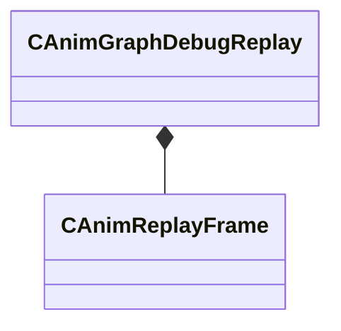

**Fields:**

| Name | Type | Annotations |
|------|------|-------------|
| `m_animGraphFileName` | CUtlString |  |
| `m_frameList` | CUtlVector<CSmartPtr<[CAnimReplayFrame](../schemas/animgraphlib.md#canimreplayframe)>> |  |
| `m_startIndex` | int32 |  |
| `m_writeIndex` | int32 |  |
| `m_frameCount` | int32 |  |

### CAnimGraphModelBinding

**Metadata:** `MGetKV3ClassDefaults {
	"_class": "CAnimGraphModelBinding",
	"m_modelName": "",
	"m_pSharedData": null
}`

**Relationships:**

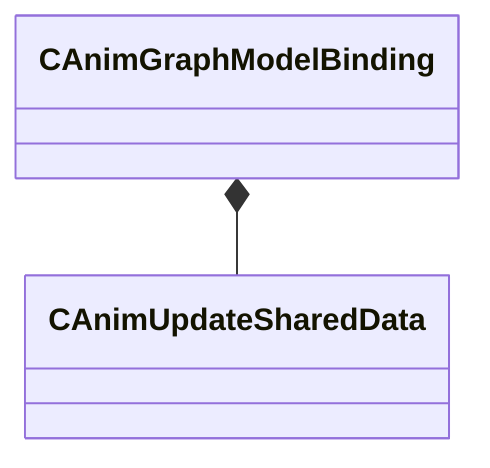

**Fields:**

| Name | Type | Annotations |
|------|------|-------------|
| `m_modelName` | CUtlString |  |
| `m_pSharedData` | CSmartPtr<[CAnimUpdateSharedData](../schemas/animgraphlib.md#canimupdateshareddata)> |  |

### CAnimGraphNetworkSettings

**Inherits from:** [CAnimGraphSettingsGroup](animgraphlib.md#canimgraphsettingsgroup)

**Metadata:** `MGetKV3ClassDefaults {
	"_class": "CAnimGraphNetworkSettings",
	"m_bNetworkingEnabled": true
}`, `MPropertyFriendlyName "Networking"`

**Relationships:**

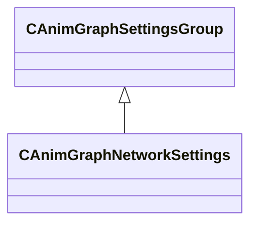

**Fields:**

| Name | Type | Annotations |
|------|------|-------------|
| `m_bNetworkingEnabled` | bool | `MPropertyFriendlyName "Enable Networking"` |

### CAnimGraphSettingsGroup

**Derived by:** [CAnimGraphNetworkSettings](animgraphlib.md#canimgraphnetworksettings)

**Metadata:** `MGetKV3ClassDefaults {
	"_class": "CAnimGraphSettingsGroup"
}`

**Relationships:**


### CAnimGraphSettingsManager

**Metadata:** `MGetKV3ClassDefaults {
	"_class": "CAnimGraphSettingsManager",
	"m_settingsGroups":
	[
		{
			"_class": "CAnimGraphNetworkSettings",
			"m_bNetworkingEnabled": true
		}
	]
}`

**Relationships:**

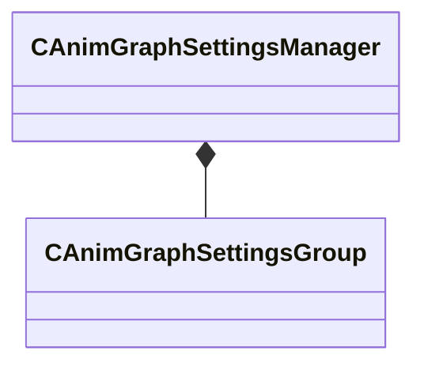

**Fields:**

| Name | Type | Annotations |
|------|------|-------------|
| `m_settingsGroups` | CUtlVector<CSmartPtr<[CAnimGraphSettingsGroup](../schemas/animgraphlib.md#canimgraphsettingsgroup)>> |  |

### CAnimInputDamping

**Metadata:** `MGetKV3ClassDefaults {
	"_class": "CAnimInputDamping",
	"m_speedFunction": "NoDamping",
	"m_fSpeedScale": 1.000000,
	"m_fFallingSpeedScale": 1.000000
}`, `MPropertyFriendlyName "Damping"`

**Relationships:**

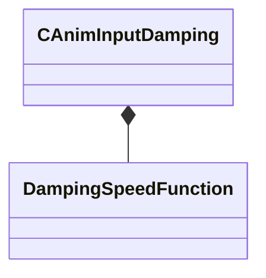

**Fields:**

| Name | Type | Annotations |
|------|------|-------------|
| `m_speedFunction` | [DampingSpeedFunction](../schemas/animgraphlib.md#dampingspeedfunction) | `MPropertyFriendlyName "Speed Function"` |
| `m_fSpeedScale` | float32 | `MPropertyFriendlyName "Speed Scale"` |
| `m_fFallingSpeedScale` | float32 | `MPropertyFriendlyName "Falling Speed Scale"` |

### CAnimMotorUpdaterBase

**Derived by:** [CPathAnimMotorUpdaterBase](animgraphlib.md#cpathanimmotorupdaterbase), [CPlayerInputAnimMotorUpdater](animgraphlib.md#cplayerinputanimmotorupdater)

**Metadata:** `MGetKV3ClassDefaults Could not parse KV3 Defaults`

**Relationships:**

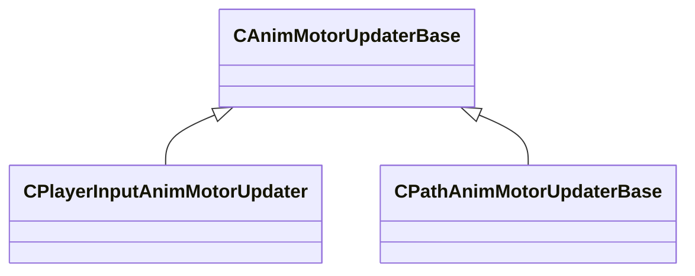

**Fields:**

| Name | Type | Annotations |
|------|------|-------------|
| `m_name` | CUtlString |  |
| `m_bDefault` | bool |  |

### CAnimNodePath

**Metadata:** `MGetKV3ClassDefaults {
	"m_path":
	[
		{
			"m_id": <HIDDEN FOR DIFF>,
		},
		{
			"m_id": <HIDDEN FOR DIFF>,
		},
		{
			"m_id": <HIDDEN FOR DIFF>,
		},
		{
			"m_id": <HIDDEN FOR DIFF>,
		},
		{
			"m_id": <HIDDEN FOR DIFF>,
		},
		{
			"m_id": <HIDDEN FOR DIFF>,
		},
		{
			"m_id": <HIDDEN FOR DIFF>,
		},
		{
			"m_id": <HIDDEN FOR DIFF>,
		},
		{
			"m_id": <HIDDEN FOR DIFF>,
		},
		{
			"m_id": <HIDDEN FOR DIFF>,
		},
		{
			"m_id": <HIDDEN FOR DIFF>,
		}
	],
	"m_nCount": 0
}`

**Relationships:**

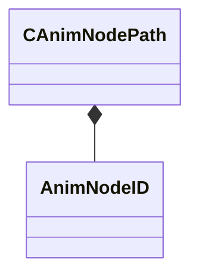

**Fields:**

| Name | Type | Annotations |
|------|------|-------------|
| `m_path` | [AnimNodeID](../schemas/modellib.md#animnodeid)[11] |  |
| `m_nCount` | int32 |  |

### CAnimParamHandle

**Metadata:** `MGetKV3ClassDefaults {
	"m_type": "ANIMPARAM_UNKNOWN",
	"m_index": 255
}`

**Relationships:**

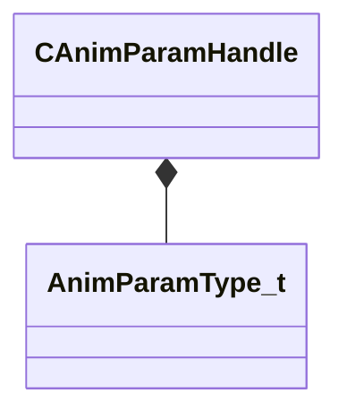

**Fields:**

| Name | Type | Annotations |
|------|------|-------------|
| `m_type` | [AnimParamType_t](../schemas/animgraphlib.md#animparamtype_t) |  |
| `m_index` | uint8 |  |

### CAnimParamHandleMap

**Metadata:** `MGetKV3ClassDefaults {
	"m_list":
	{
	}
}`

**Fields:**

| Name | Type | Annotations |
|------|------|-------------|
| `m_list` | CUtlHashtable<uint16,int16> |  |

### CAnimParameterBase

**Derived by:** [CConcreteAnimParameter](animgraphlib.md#cconcreteanimparameter), [CVirtualAnimParameter](animgraphlib.md#cvirtualanimparameter)

**Metadata:** `MGetKV3ClassDefaults Could not parse KV3 Defaults`

**Relationships:**

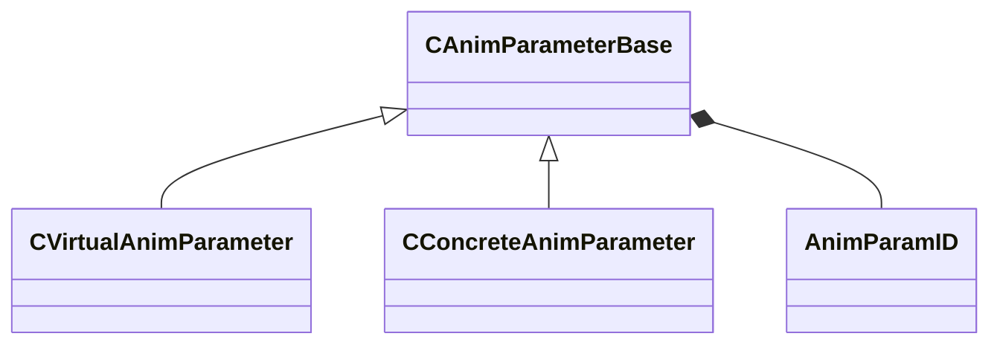

**Fields:**

| Name | Type | Annotations |
|------|------|-------------|
| `m_name` | CGlobalSymbol | `MPropertyFriendlyName "Name"` `MPropertySortPriority 100` |
| `m_sComment` | CUtlString | `MPropertyFriendlyName "Comment"` `MPropertyAttributeEditor "TextBlock()"` `MPropertySortPriority -100` |
| `m_group` | CUtlString | `MPropertyReadOnly` `MPropertySortPriority -90` |
| `m_id` | [AnimParamID](../schemas/modellib.md#animparamid) | `MPropertyReadOnly` `MPropertySortPriority -90` |
| `m_componentName` | CUtlString | `MPropertySuppressField` `MPropertyAutoRebuildOnChange` |
| `m_bNetworkingRequested` | bool | `MPropertySuppressField` |
| `m_bIsReferenced` | bool | `MPropertySuppressField` |

### CAnimParameterManagerUpdater

**Metadata:** `MGetKV3ClassDefaults {
	"_class": "CAnimParameterManagerUpdater",
	"m_parameters":
	[
	],
	"m_idToIndexMap":
	[
	],
	"m_nameToIndexMap":
	{
	},
	"m_indexToHandle":
	[
	],
	"m_autoResetParams":
	[
	],
	"m_autoResetMap":
	[
	]
}`

**Relationships:**

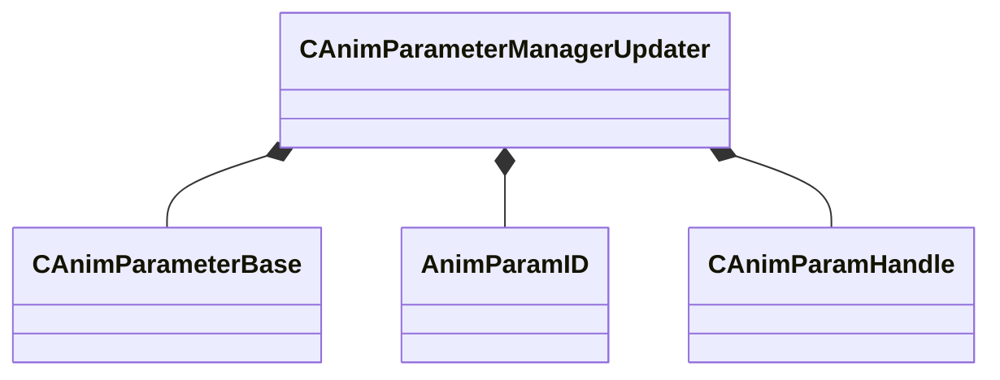

**Fields:**

| Name | Type | Annotations |
|------|------|-------------|
| `m_parameters` | CUtlVector<CSmartPtr<[CAnimParameterBase](../schemas/animgraphlib.md#canimparameterbase)>> |  |
| `m_idToIndexMap` | CUtlHashtable<[AnimParamID](../schemas/modellib.md#animparamid),int32> |  |
| `m_nameToIndexMap` | CUtlHashtable<CUtlString,int32> |  |
| `m_indexToHandle` | CUtlVector<[CAnimParamHandle](../schemas/animgraphlib.md#canimparamhandle)> |  |
| `m_autoResetParams` | CUtlVector<std::pair<[CAnimParamHandle](../schemas/animgraphlib.md#canimparamhandle),CAnimVariant>> |  |
| `m_autoResetMap` | CUtlHashtable<[CAnimParamHandle](../schemas/animgraphlib.md#canimparamhandle),int16> |  |

### CAnimReplayFrame

**Metadata:** `MGetKV3ClassDefaults {
	"_class": "CAnimReplayFrame",
	"m_inputDataBlocks":
	[
	],
	"m_instanceData": "[BINARY BLOB]",
	"m_startingLocalToWorldTransform":
	[
		0.000000,
		0.000000,
		0.000000,
		1.000000,
		0.000000,
		0.000000,
		0.000000,
		1.000000
	],
	"m_localToWorldTransform":
	[
		0.000000,
		0.000000,
		0.000000,
		1.000000,
		0.000000,
		0.000000,
		0.000000,
		1.000000
	],
	"m_timeStamp": 0.000000
}`

**Fields:**

| Name | Type | Annotations |
|------|------|-------------|
| `m_inputDataBlocks` | CUtlVector<CUtlBinaryBlock> |  |
| `m_instanceData` | CUtlBinaryBlock |  |
| `m_startingLocalToWorldTransform` | CTransform |  |
| `m_localToWorldTransform` | CTransform |  |
| `m_timeStamp` | float32 |  |

### CAnimScriptComponentUpdater

**Inherits from:** [CAnimComponentUpdater](animgraphlib.md#canimcomponentupdater)

**Metadata:** `MGetKV3ClassDefaults {
	"_class": "CAnimScriptComponentUpdater",
	"m_name": "",
	"m_id":
	{
		"m_id": <HIDDEN FOR DIFF>,
	},
	"m_networkMode": "ServerAuthoritative",
	"m_bStartEnabled": false,
	"m_hScript":
	{
		"m_id": <HIDDEN FOR DIFF>,
	}
}`

**Relationships:**

```mermaid
classDiagram
    CAnimComponentUpdater <|-- CAnimScriptComponentUpdater
    CAnimScriptComponentUpdater *-- AnimScriptHandle
```

**Fields:**

| Name | Type | Annotations |
|------|------|-------------|
| `m_hScript` | [AnimScriptHandle](../schemas/modellib.md#animscripthandle) |  |

### CAnimScriptManager

**Metadata:** `MGetKV3ClassDefaults {
	"_class": "CAnimScriptManager",
	"m_scriptInfo":
	[
	]
}`

**Relationships:**

```mermaid
classDiagram
    CAnimScriptManager *-- ScriptInfo_t
```

**Fields:**

| Name | Type | Annotations |
|------|------|-------------|
| `m_scriptInfo` | CUtlVector<[ScriptInfo_t](../schemas/animgraphlib.md#scriptinfo_t)> |  |

### CAnimStateMachineUpdater

**Metadata:** `MGetKV3ClassDefaults {
	"_class": "CAnimStateMachineUpdater",
	"m_states":
	[
	],
	"m_transitions":
	[
	],
	"m_startStateIndex": -1
}`

**Relationships:**

```mermaid
classDiagram
    CAnimStateMachineUpdater *-- CStateUpdateData
    CAnimStateMachineUpdater *-- CTransitionUpdateData
```

**Fields:**

| Name | Type | Annotations |
|------|------|-------------|
| `m_states` | CUtlVector<[CStateUpdateData](../schemas/animgraphlib.md#cstateupdatedata)> |  |
| `m_transitions` | CUtlVector<[CTransitionUpdateData](../schemas/animgraphlib.md#ctransitionupdatedata)> |  |
| `m_startStateIndex` | int32 |  |

### CAnimTagBase

**Derived by:** [CAudioAnimTag](animgraphlib.md#caudioanimtag), [CBodyGroupAnimTag](animgraphlib.md#cbodygroupanimtag), [CClothSettingsAnimTag](animgraphlib.md#cclothsettingsanimtag), [CFootFallAnimTag](animgraphlib.md#cfootfallanimtag), [CFootstepLandedAnimTag](animgraphlib.md#cfootsteplandedanimtag), [CHandshakeAnimTagBase](animgraphlib.md#chandshakeanimtagbase), [CMaterialAttributeAnimTag](animgraphlib.md#cmaterialattributeanimtag), [CParticleAnimTag](animgraphlib.md#cparticleanimtag), [CRagdollAnimTag](animgraphlib.md#cragdollanimtag), [CSequenceFinishedAnimTag](animgraphlib.md#csequencefinishedanimtag), [CStringAnimTag](animgraphlib.md#cstringanimtag), [CTaskStatusAnimTag](animgraphlib.md#ctaskstatusanimtag), [CWarpSectionAnimTagBase](animgraphlib.md#cwarpsectionanimtagbase)

**Metadata:** `MGetKV3ClassDefaults {
	"_class": "CAnimTagBase",
	"m_name": "Unnamed Tag",
	"m_sComment": "",
	"m_group": "",
	"m_tagID":
	{
		"m_id": <HIDDEN FOR DIFF>,
	},
	"m_bIsReferenced": false
}`

**Relationships:**

```mermaid
classDiagram
    CAnimTagBase <|-- CMaterialAttributeAnimTag
    CAnimTagBase <|-- CBodyGroupAnimTag
    CAnimTagBase <|-- CRagdollAnimTag
    CAnimTagBase <|-- CStringAnimTag
    CAnimTagBase <|-- CWarpSectionAnimTagBase
    CAnimTagBase <|-- CAudioAnimTag
    CAnimTagBase <|-- CClothSettingsAnimTag
    CAnimTagBase <|-- CHandshakeAnimTagBase
    CAnimTagBase <|-- CFootstepLandedAnimTag
    CAnimTagBase <|-- CParticleAnimTag
    CAnimTagBase <|-- CFootFallAnimTag
    CAnimTagBase <|-- CTaskStatusAnimTag
    CAnimTagBase <|-- CSequenceFinishedAnimTag
    CAnimTagBase *-- AnimTagID
```

**Fields:**

| Name | Type | Annotations |
|------|------|-------------|
| `m_name` | CGlobalSymbol | `MPropertyFriendlyName "Name"` `MPropertySortPriority 100` |
| `m_sComment` | CUtlString | `MPropertyFriendlyName "Comment"` `MPropertyAttributeEditor "TextBlock()"` `MPropertySortPriority -100` |
| `m_group` | CGlobalSymbol | `MPropertySuppressField` |
| `m_tagID` | [AnimTagID](../schemas/modellib.md#animtagid) | `MPropertySuppressField` |
| `m_bIsReferenced` | bool | `MPropertySuppressField` |

### CAnimTagManagerUpdater

**Metadata:** `MGetKV3ClassDefaults {
	"_class": "CAnimTagManagerUpdater",
	"m_tags":
	[
	]
}`

**Relationships:**

```mermaid
classDiagram
    CAnimTagManagerUpdater *-- CAnimTagBase
```

**Fields:**

| Name | Type | Annotations |
|------|------|-------------|
| `m_tags` | CUtlVector<CSmartPtr<[CAnimTagBase](../schemas/animgraphlib.md#canimtagbase)>> |  |

### CAnimUpdateNodeBase

**Derived by:** [CBinaryUpdateNode](animgraphlib.md#cbinaryupdatenode), [CBlend2DUpdateNode](animgraphlib.md#cblend2dupdatenode), [CBlendUpdateNode](animgraphlib.md#cblendupdatenode), [CChoiceUpdateNode](animgraphlib.md#cchoiceupdatenode), [CLeafUpdateNode](animgraphlib.md#cleafupdatenode), [CSelectorUpdateNode](animgraphlib.md#cselectorupdatenode), [CStateMachineUpdateNode](animgraphlib.md#cstatemachineupdatenode), [CTargetSelectorUpdateNode](animgraphlib.md#ctargetselectorupdatenode), [CUnaryUpdateNode](animgraphlib.md#cunaryupdatenode)

**Metadata:** `MGetKV3ClassDefaults Could not parse KV3 Defaults`

**Relationships:**

```mermaid
classDiagram
    CAnimUpdateNodeBase <|-- CBinaryUpdateNode
    CAnimUpdateNodeBase <|-- CLeafUpdateNode
    CAnimUpdateNodeBase <|-- CStateMachineUpdateNode
    CAnimUpdateNodeBase <|-- CBlendUpdateNode
    CAnimUpdateNodeBase <|-- CSelectorUpdateNode
    CAnimUpdateNodeBase <|-- CUnaryUpdateNode
    CAnimUpdateNodeBase <|-- CTargetSelectorUpdateNode
    CAnimUpdateNodeBase <|-- CBlend2DUpdateNode
    CAnimUpdateNodeBase <|-- CChoiceUpdateNode
    CAnimUpdateNodeBase *-- CAnimNodePath
    CAnimUpdateNodeBase *-- AnimNodeNetworkMode
```

**Fields:**

| Name | Type | Annotations |
|------|------|-------------|
| `m_nodePath` | [CAnimNodePath](../schemas/animgraphlib.md#canimnodepath) |  |
| `m_networkMode` | [AnimNodeNetworkMode](../schemas/animgraphlib.md#animnodenetworkmode) |  |
| `m_name` | CUtlString |  |

### CAnimUpdateNodeRef

**Metadata:** `MGetKV3ClassDefaults {
	"m_nodeIndex": -1
}`

**Fields:**

| Name | Type | Annotations |
|------|------|-------------|
| `m_nodeIndex` | int32 |  |

### CAnimUpdateSharedData

**Metadata:** `MGetKV3ClassDefaults {
	"_class": "CAnimUpdateSharedData",
	"m_nodes":
	[
	],
	"m_nodeIndexMap":
	[
	],
	"m_components":
	[
	],
	"m_pParamListUpdater": null,
	"m_pTagManagerUpdater": null,
	"m_scriptManager": null,
	"m_settings":
	{
		"_class": "CAnimGraphSettingsManager",
		"m_settingsGroups":
		[
			{
				"_class": "CAnimGraphNetworkSettings",
				"m_bNetworkingEnabled": true
			}
		]
	},
	"m_pStaticPoseCache": null,
	"m_pSkeleton": null,
	"m_rootNodePath":
	{
		"m_path":
		[
			{
				"m_id": <HIDDEN FOR DIFF>,
			},
			{
				"m_id": <HIDDEN FOR DIFF>,
			},
			{
				"m_id": <HIDDEN FOR DIFF>,
			},
			{
				"m_id": <HIDDEN FOR DIFF>,
			},
			{
				"m_id": <HIDDEN FOR DIFF>,
			},
			{
				"m_id": <HIDDEN FOR DIFF>,
			},
			{
				"m_id": <HIDDEN FOR DIFF>,
			},
			{
				"m_id": <HIDDEN FOR DIFF>,
			},
			{
				"m_id": <HIDDEN FOR DIFF>,
			},
			{
				"m_id": <HIDDEN FOR DIFF>,
			},
			{
				"m_id": <HIDDEN FOR DIFF>,
			}
		],
		"m_nCount": 0
	}
}`

**Relationships:**

```mermaid
classDiagram
    CAnimUpdateSharedData *-- CAnimUpdateNodeBase
    CAnimUpdateSharedData *-- CAnimNodePath
    CAnimUpdateSharedData *-- CAnimComponentUpdater
    CAnimUpdateSharedData *-- CAnimParameterManagerUpdater
    CAnimUpdateSharedData *-- CAnimTagManagerUpdater
    CAnimUpdateSharedData *-- CAnimScriptManager
    CAnimUpdateSharedData *-- CAnimGraphSettingsManager
    CAnimUpdateSharedData *-- CStaticPoseCacheBuilder
    CAnimUpdateSharedData *-- CAnimSkeleton
```

**Fields:**

| Name | Type | Annotations |
|------|------|-------------|
| `m_nodes` | CUtlVector<CSmartPtr<[CAnimUpdateNodeBase](../schemas/animgraphlib.md#canimupdatenodebase)>> |  |
| `m_nodeIndexMap` | CUtlHashtable<[CAnimNodePath](../schemas/animgraphlib.md#canimnodepath),int32> |  |
| `m_components` | CUtlVector<CSmartPtr<[CAnimComponentUpdater](../schemas/animgraphlib.md#canimcomponentupdater)>> |  |
| `m_pParamListUpdater` | CSmartPtr<[CAnimParameterManagerUpdater](../schemas/animgraphlib.md#canimparametermanagerupdater)> |  |
| `m_pTagManagerUpdater` | CSmartPtr<[CAnimTagManagerUpdater](../schemas/animgraphlib.md#canimtagmanagerupdater)> |  |
| `m_scriptManager` | CSmartPtr<[CAnimScriptManager](../schemas/animgraphlib.md#canimscriptmanager)> |  |
| `m_settings` | [CAnimGraphSettingsManager](../schemas/animgraphlib.md#canimgraphsettingsmanager) |  |
| `m_pStaticPoseCache` | CSmartPtr<[CStaticPoseCacheBuilder](../schemas/animgraphlib.md#cstaticposecachebuilder)> |  |
| `m_pSkeleton` | CSmartPtr<[CAnimSkeleton](../schemas/modellib.md#canimskeleton)> |  |
| `m_rootNodePath` | [CAnimNodePath](../schemas/animgraphlib.md#canimnodepath) |  |

### CAnimationGraphInstance

**Metadata:** `MGetKV3ClassDefaults Could not parse KV3 Defaults`

**Fields:**

| Name | Type | Annotations |
|------|------|-------------|
| `m_bTagDispatchDirty` | bool |  |

### CAnimationGraphVisualizerAxis

**Inherits from:** [CAnimationGraphVisualizerPrimitiveBase](animgraphlib.md#canimationgraphvisualizerprimitivebase)

**Metadata:** `MGetKV3ClassDefaults {
	"_class": "CAnimationGraphVisualizerAxis",
	"m_Type": "ANIMATIONGRAPHVISUALIZERPRIMITIVETYPE_Axis",
	"m_OwningAnimNodePaths":
	[
		{
			"m_id": <HIDDEN FOR DIFF>,
		},
		{
			"m_id": <HIDDEN FOR DIFF>,
		},
		{
			"m_id": <HIDDEN FOR DIFF>,
		},
		{
			"m_id": <HIDDEN FOR DIFF>,
		},
		{
			"m_id": <HIDDEN FOR DIFF>,
		},
		{
			"m_id": <HIDDEN FOR DIFF>,
		},
		{
			"m_id": <HIDDEN FOR DIFF>,
		},
		{
			"m_id": <HIDDEN FOR DIFF>,
		},
		{
			"m_id": <HIDDEN FOR DIFF>,
		},
		{
			"m_id": <HIDDEN FOR DIFF>,
		},
		{
			"m_id": <HIDDEN FOR DIFF>,
		}
	],
	"m_nOwningAnimNodePathCount": 0,
	"m_xWsTransform":
	[
		0.000000,
		0.000000,
		0.000000,
		0.000000,
		0.000000,
		0.000000,
		0.000000,
		0.000000
	],
	"m_flAxisSize": 0.000000
}`

**Relationships:**

```mermaid
classDiagram
    CAnimationGraphVisualizerPrimitiveBase <|-- CAnimationGraphVisualizerAxis
```

**Fields:**

| Name | Type | Annotations |
|------|------|-------------|
| `m_xWsTransform` | CTransform |  |
| `m_flAxisSize` | float32 |  |

### CAnimationGraphVisualizerLine

**Inherits from:** [CAnimationGraphVisualizerPrimitiveBase](animgraphlib.md#canimationgraphvisualizerprimitivebase)

**Metadata:** `MGetKV3ClassDefaults {
	"_class": "CAnimationGraphVisualizerLine",
	"m_Type": "ANIMATIONGRAPHVISUALIZERPRIMITIVETYPE_Line",
	"m_OwningAnimNodePaths":
	[
		{
			"m_id": <HIDDEN FOR DIFF>,
		},
		{
			"m_id": <HIDDEN FOR DIFF>,
		},
		{
			"m_id": <HIDDEN FOR DIFF>,
		},
		{
			"m_id": <HIDDEN FOR DIFF>,
		},
		{
			"m_id": <HIDDEN FOR DIFF>,
		},
		{
			"m_id": <HIDDEN FOR DIFF>,
		},
		{
			"m_id": <HIDDEN FOR DIFF>,
		},
		{
			"m_id": <HIDDEN FOR DIFF>,
		},
		{
			"m_id": <HIDDEN FOR DIFF>,
		},
		{
			"m_id": <HIDDEN FOR DIFF>,
		},
		{
			"m_id": <HIDDEN FOR DIFF>,
		}
	],
	"m_nOwningAnimNodePathCount": 0,
	"m_vWsPositionStart":
	[
		0.000000,
		0.000000,
		0.000000
	],
	"m_vWsPositionEnd":
	[
		0.000000,
		0.000000,
		0.000000
	],
	"m_Color":
	[
		0,
		0,
		0,
		0
	]
}`

**Relationships:**

```mermaid
classDiagram
    CAnimationGraphVisualizerPrimitiveBase <|-- CAnimationGraphVisualizerLine
```

**Fields:**

| Name | Type | Annotations |
|------|------|-------------|
| `m_vWsPositionStart` | VectorAligned |  |
| `m_vWsPositionEnd` | VectorAligned |  |
| `m_Color` | Color |  |

### CAnimationGraphVisualizerPie

**Inherits from:** [CAnimationGraphVisualizerPrimitiveBase](animgraphlib.md#canimationgraphvisualizerprimitivebase)

**Metadata:** `MGetKV3ClassDefaults {
	"_class": "CAnimationGraphVisualizerPie",
	"m_Type": "ANIMATIONGRAPHVISUALIZERPRIMITIVETYPE_Pie",
	"m_OwningAnimNodePaths":
	[
		{
			"m_id": <HIDDEN FOR DIFF>,
		},
		{
			"m_id": <HIDDEN FOR DIFF>,
		},
		{
			"m_id": <HIDDEN FOR DIFF>,
		},
		{
			"m_id": <HIDDEN FOR DIFF>,
		},
		{
			"m_id": <HIDDEN FOR DIFF>,
		},
		{
			"m_id": <HIDDEN FOR DIFF>,
		},
		{
			"m_id": <HIDDEN FOR DIFF>,
		},
		{
			"m_id": <HIDDEN FOR DIFF>,
		},
		{
			"m_id": <HIDDEN FOR DIFF>,
		},
		{
			"m_id": <HIDDEN FOR DIFF>,
		},
		{
			"m_id": <HIDDEN FOR DIFF>,
		}
	],
	"m_nOwningAnimNodePathCount": 0,
	"m_vWsCenter":
	[
		0.000000,
		0.000000,
		0.000000
	],
	"m_vWsStart":
	[
		0.000000,
		0.000000,
		0.000000
	],
	"m_vWsEnd":
	[
		0.000000,
		0.000000,
		0.000000
	],
	"m_Color":
	[
		0,
		0,
		0,
		0
	]
}`

**Relationships:**

```mermaid
classDiagram
    CAnimationGraphVisualizerPrimitiveBase <|-- CAnimationGraphVisualizerPie
```

**Fields:**

| Name | Type | Annotations |
|------|------|-------------|
| `m_vWsCenter` | VectorAligned |  |
| `m_vWsStart` | VectorAligned |  |
| `m_vWsEnd` | VectorAligned |  |
| `m_Color` | Color |  |

### CAnimationGraphVisualizerPrimitiveBase

**Derived by:** [CAnimationGraphVisualizerAxis](animgraphlib.md#canimationgraphvisualizeraxis), [CAnimationGraphVisualizerLine](animgraphlib.md#canimationgraphvisualizerline), [CAnimationGraphVisualizerPie](animgraphlib.md#canimationgraphvisualizerpie), [CAnimationGraphVisualizerSphere](animgraphlib.md#canimationgraphvisualizersphere), [CAnimationGraphVisualizerText](animgraphlib.md#canimationgraphvisualizertext)

**Metadata:** `MGetKV3ClassDefaults {
	"_class": "CAnimationGraphVisualizerPrimitiveBase",
	"m_Type": "ANIMATIONGRAPHVISUALIZERPRIMITIVETYPE_Text",
	"m_OwningAnimNodePaths":
	[
		{
			"m_id": <HIDDEN FOR DIFF>,
		},
		{
			"m_id": <HIDDEN FOR DIFF>,
		},
		{
			"m_id": <HIDDEN FOR DIFF>,
		},
		{
			"m_id": <HIDDEN FOR DIFF>,
		},
		{
			"m_id": <HIDDEN FOR DIFF>,
		},
		{
			"m_id": <HIDDEN FOR DIFF>,
		},
		{
			"m_id": <HIDDEN FOR DIFF>,
		},
		{
			"m_id": <HIDDEN FOR DIFF>,
		},
		{
			"m_id": <HIDDEN FOR DIFF>,
		},
		{
			"m_id": <HIDDEN FOR DIFF>,
		},
		{
			"m_id": <HIDDEN FOR DIFF>,
		}
	],
	"m_nOwningAnimNodePathCount": 0
}`

**Relationships:**

```mermaid
classDiagram
    CAnimationGraphVisualizerPrimitiveBase <|-- CAnimationGraphVisualizerPie
    CAnimationGraphVisualizerPrimitiveBase <|-- CAnimationGraphVisualizerAxis
    CAnimationGraphVisualizerPrimitiveBase <|-- CAnimationGraphVisualizerText
    CAnimationGraphVisualizerPrimitiveBase <|-- CAnimationGraphVisualizerSphere
    CAnimationGraphVisualizerPrimitiveBase <|-- CAnimationGraphVisualizerLine
    CAnimationGraphVisualizerPrimitiveBase *-- CAnimationGraphVisualizerPrimitiveType
    CAnimationGraphVisualizerPrimitiveBase *-- AnimNodeID
```

**Fields:**

| Name | Type | Annotations |
|------|------|-------------|
| `m_Type` | [CAnimationGraphVisualizerPrimitiveType](../schemas/animgraphlib.md#canimationgraphvisualizerprimitivetype) |  |
| `m_OwningAnimNodePaths` | [AnimNodeID](../schemas/modellib.md#animnodeid)[11] |  |
| `m_nOwningAnimNodePathCount` | int32 |  |

### CAnimationGraphVisualizerPrimitiveType

**Values:**

| Name | Value | Description |
|------|-------|-------------|
| `ANIMATIONGRAPHVISUALIZERPRIMITIVETYPE_Text` | 0 |  |
| `ANIMATIONGRAPHVISUALIZERPRIMITIVETYPE_Sphere` | 1 |  |
| `ANIMATIONGRAPHVISUALIZERPRIMITIVETYPE_Line` | 2 |  |
| `ANIMATIONGRAPHVISUALIZERPRIMITIVETYPE_Pie` | 3 |  |
| `ANIMATIONGRAPHVISUALIZERPRIMITIVETYPE_Axis` | 4 |  |

### CAnimationGraphVisualizerSphere

**Inherits from:** [CAnimationGraphVisualizerPrimitiveBase](animgraphlib.md#canimationgraphvisualizerprimitivebase)

**Metadata:** `MGetKV3ClassDefaults {
	"_class": "CAnimationGraphVisualizerSphere",
	"m_Type": "ANIMATIONGRAPHVISUALIZERPRIMITIVETYPE_Sphere",
	"m_OwningAnimNodePaths":
	[
		{
			"m_id": <HIDDEN FOR DIFF>,
		},
		{
			"m_id": <HIDDEN FOR DIFF>,
		},
		{
			"m_id": <HIDDEN FOR DIFF>,
		},
		{
			"m_id": <HIDDEN FOR DIFF>,
		},
		{
			"m_id": <HIDDEN FOR DIFF>,
		},
		{
			"m_id": <HIDDEN FOR DIFF>,
		},
		{
			"m_id": <HIDDEN FOR DIFF>,
		},
		{
			"m_id": <HIDDEN FOR DIFF>,
		},
		{
			"m_id": <HIDDEN FOR DIFF>,
		},
		{
			"m_id": <HIDDEN FOR DIFF>,
		},
		{
			"m_id": <HIDDEN FOR DIFF>,
		}
	],
	"m_nOwningAnimNodePathCount": 0,
	"m_vWsPosition":
	[
		0.000000,
		0.000000,
		0.000000
	],
	"m_flRadius": -1.000000,
	"m_Color":
	[
		0,
		0,
		0,
		0
	]
}`

**Relationships:**

```mermaid
classDiagram
    CAnimationGraphVisualizerPrimitiveBase <|-- CAnimationGraphVisualizerSphere
```

**Fields:**

| Name | Type | Annotations |
|------|------|-------------|
| `m_vWsPosition` | VectorAligned |  |
| `m_flRadius` | float32 |  |
| `m_Color` | Color |  |

### CAnimationGraphVisualizerText

**Inherits from:** [CAnimationGraphVisualizerPrimitiveBase](animgraphlib.md#canimationgraphvisualizerprimitivebase)

**Metadata:** `MGetKV3ClassDefaults {
	"_class": "CAnimationGraphVisualizerText",
	"m_Type": "ANIMATIONGRAPHVISUALIZERPRIMITIVETYPE_Text",
	"m_OwningAnimNodePaths":
	[
		{
			"m_id": <HIDDEN FOR DIFF>,
		},
		{
			"m_id": <HIDDEN FOR DIFF>,
		},
		{
			"m_id": <HIDDEN FOR DIFF>,
		},
		{
			"m_id": <HIDDEN FOR DIFF>,
		},
		{
			"m_id": <HIDDEN FOR DIFF>,
		},
		{
			"m_id": <HIDDEN FOR DIFF>,
		},
		{
			"m_id": <HIDDEN FOR DIFF>,
		},
		{
			"m_id": <HIDDEN FOR DIFF>,
		},
		{
			"m_id": <HIDDEN FOR DIFF>,
		},
		{
			"m_id": <HIDDEN FOR DIFF>,
		},
		{
			"m_id": <HIDDEN FOR DIFF>,
		}
	],
	"m_nOwningAnimNodePathCount": 0,
	"m_vWsPosition":
	[
		0.000000,
		0.000000,
		0.000000
	],
	"m_Color":
	[
		0,
		0,
		0,
		0
	],
	"m_Text": ""
}`

**Relationships:**

```mermaid
classDiagram
    CAnimationGraphVisualizerPrimitiveBase <|-- CAnimationGraphVisualizerText
```

**Fields:**

| Name | Type | Annotations |
|------|------|-------------|
| `m_vWsPosition` | VectorAligned |  |
| `m_Color` | Color |  |
| `m_Text` | CUtlString |  |

### CAnimationLayer

**Metadata:** `MGetKV3ClassDefaults {
	"m_hSequence": 0,
	"m_flPrevCycle": 0.000000,
	"m_flCycle": 0.000000,
	"m_flWeight": 0.000000,
	"m_nOrder": 12,
	"m_bLooping": false,
	"m_nFlags": 0,
	"m_bSequenceFinished": false,
	"m_flKillRate": 100.000000,
	"m_flKillDelay": 0.000000,
	"m_nPriority": 0
}`

**Fields:**

| Name | Type | Annotations |
|------|------|-------------|
| `m_hSequence` | CAnimNetVar<int32> |  |
| `m_flPrevCycle` | float32 |  |
| `m_flCycle` | CAnimNetVar<float32> |  |
| `m_flWeight` | CAnimNetVar<float32> |  |
| `m_nOrder` | CAnimNetVar<int32> |  |
| `m_bLooping` | bool |  |
| `m_nFlags` | int32 |  |
| `m_bSequenceFinished` | bool |  |
| `m_flKillRate` | float32 |  |
| `m_flKillDelay` | float32 |  |
| `m_nPriority` | int32 |  |

### CAudioAnimTag

**Inherits from:** [CAnimTagBase](animgraphlib.md#canimtagbase)

**Metadata:** `MGetKV3ClassDefaults {
	"_class": "CAudioAnimTag",
	"m_name": "Unnamed Tag",
	"m_sComment": "",
	"m_group": "",
	"m_tagID":
	{
		"m_id": <HIDDEN FOR DIFF>,
	},
	"m_bIsReferenced": false,
	"m_clipName": "",
	"m_attachmentName": "",
	"m_flVolume": 1.000000,
	"m_bStopWhenTagEnds": false,
	"m_bStopWhenGraphEnds": true,
	"m_bPlayOnServer": true,
	"m_bPlayOnClient": true
}`, `MPropertyFriendlyName "Audio Tag"`

**Relationships:**

```mermaid
classDiagram
    CAnimTagBase <|-- CAudioAnimTag
```

**Fields:**

| Name | Type | Annotations |
|------|------|-------------|
| `m_clipName` | CUtlString | `MPropertyFriendlyName "Sound Event"` `MPropertyAttributeEditor "SoundPicker()"` |
| `m_attachmentName` | CUtlString | `MPropertyFriendlyName "Attachment"` `MPropertyAttributeChoiceName "Attachment"` |
| `m_flVolume` | float32 | `MPropertyFriendlyName "Volume"` `MPropertyAttributeRange "0 1"` |
| `m_bStopWhenTagEnds` | bool | `MPropertyFriendlyName "Stop on Tag End"` |
| `m_bStopWhenGraphEnds` | bool | `MPropertyFriendlyName "Stop When Graph Destroyed"` |
| `m_bPlayOnServer` | bool | `MPropertyFriendlyName "Play on Server"` |
| `m_bPlayOnClient` | bool | `MPropertyFriendlyName "Play on Client"` |

### CBinaryUpdateNode

**Inherits from:** [CAnimUpdateNodeBase](animgraphlib.md#canimupdatenodebase)

**Derived by:** [CAddUpdateNode](animgraphlib.md#caddupdatenode), [CBoneMaskUpdateNode](animgraphlib.md#cbonemaskupdatenode), [CSubtractUpdateNode](animgraphlib.md#csubtractupdatenode)

**Metadata:** `MGetKV3ClassDefaults Could not parse KV3 Defaults`

**Relationships:**

```mermaid
classDiagram
    CAnimUpdateNodeBase <|-- CBinaryUpdateNode
    CBinaryUpdateNode <|-- CBoneMaskUpdateNode
    CBinaryUpdateNode <|-- CSubtractUpdateNode
    CBinaryUpdateNode <|-- CAddUpdateNode
    CBinaryUpdateNode *-- CAnimUpdateNodeRef
    CBinaryUpdateNode *-- BinaryNodeTiming
```

**Fields:**

| Name | Type | Annotations |
|------|------|-------------|
| `m_pChild1` | [CAnimUpdateNodeRef](../schemas/animgraphlib.md#canimupdatenoderef) |  |
| `m_pChild2` | [CAnimUpdateNodeRef](../schemas/animgraphlib.md#canimupdatenoderef) |  |
| `m_timingBehavior` | [BinaryNodeTiming](../schemas/animgraphlib.md#binarynodetiming) |  |
| `m_flTimingBlend` | float32 |  |
| `m_bResetChild1` | bool |  |
| `m_bResetChild2` | bool |  |

### CBindPoseUpdateNode

**Inherits from:** [CLeafUpdateNode](animgraphlib.md#cleafupdatenode)

**Metadata:** `MGetKV3ClassDefaults {
	"_class": "CBindPoseUpdateNode",
	"m_nodePath":
	{
		"m_path":
		[
			{
				"m_id": <HIDDEN FOR DIFF>,
			},
			{
				"m_id": <HIDDEN FOR DIFF>,
			},
			{
				"m_id": <HIDDEN FOR DIFF>,
			},
			{
				"m_id": <HIDDEN FOR DIFF>,
			},
			{
				"m_id": <HIDDEN FOR DIFF>,
			},
			{
				"m_id": <HIDDEN FOR DIFF>,
			},
			{
				"m_id": <HIDDEN FOR DIFF>,
			},
			{
				"m_id": <HIDDEN FOR DIFF>,
			},
			{
				"m_id": <HIDDEN FOR DIFF>,
			},
			{
				"m_id": <HIDDEN FOR DIFF>,
			},
			{
				"m_id": <HIDDEN FOR DIFF>,
			}
		],
		"m_nCount": 0
	},
	"m_networkMode": "ServerAuthoritative",
	"m_name": ""
}`

**Relationships:**

```mermaid
classDiagram
    CLeafUpdateNode <|-- CBindPoseUpdateNode
    CAnimUpdateNodeBase <|-- CLeafUpdateNode
```

### CBlend2DInstanceData

**Metadata:** `MGetKV3ClassDefaults {
	"m_dampedValue":
	[
		0.000000,
		0.000000
	],
	"m_flCycle": 0.000000,
	"m_flPrevCycle": 0.000000
}`

**Fields:**

| Name | Type | Annotations |
|------|------|-------------|
| `m_dampedValue` | Vector2D |  |
| `m_flCycle` | float32 |  |
| `m_flPrevCycle` | float32 |  |

### CBlend2DUpdateNode

**Inherits from:** [CAnimUpdateNodeBase](animgraphlib.md#canimupdatenodebase)

**Metadata:** `MGetKV3ClassDefaults {
	"_class": "CBlend2DUpdateNode",
	"m_nodePath":
	{
		"m_path":
		[
			{
				"m_id": <HIDDEN FOR DIFF>,
			},
			{
				"m_id": <HIDDEN FOR DIFF>,
			},
			{
				"m_id": <HIDDEN FOR DIFF>,
			},
			{
				"m_id": <HIDDEN FOR DIFF>,
			},
			{
				"m_id": <HIDDEN FOR DIFF>,
			},
			{
				"m_id": <HIDDEN FOR DIFF>,
			},
			{
				"m_id": <HIDDEN FOR DIFF>,
			},
			{
				"m_id": <HIDDEN FOR DIFF>,
			},
			{
				"m_id": <HIDDEN FOR DIFF>,
			},
			{
				"m_id": <HIDDEN FOR DIFF>,
			},
			{
				"m_id": <HIDDEN FOR DIFF>,
			}
		],
		"m_nCount": 0
	},
	"m_networkMode": "ServerAuthoritative",
	"m_name": "",
	"m_items":
	[
	],
	"m_tags":
	[
	],
	"m_paramSpans":
	{
		"m_spans":
		[
		]
	},
	"m_nodeItemIndices":
	[
	],
	"m_damping":
	{
		"_class": "CAnimInputDamping",
		"m_speedFunction": "NoDamping",
		"m_fSpeedScale": 1.000000,
		"m_fFallingSpeedScale": 1.000000
	},
	"m_blendSourceX": "MoveHeading",
	"m_paramX":
	{
		"m_type": "ANIMPARAM_UNKNOWN",
		"m_index": 255
	},
	"m_blendSourceY": "MoveHeading",
	"m_paramY":
	{
		"m_type": "ANIMPARAM_UNKNOWN",
		"m_index": 255
	},
	"m_eBlendMode": "Blend2DMode_General",
	"m_playbackSpeed": 0.000000,
	"m_bLoop": false,
	"m_bLockBlendOnReset": false,
	"m_bLockWhenWaning": false,
	"m_bAnimEventsAndTagsOnMostWeightedOnly": false
}`

**Relationships:**

```mermaid
classDiagram
    CAnimUpdateNodeBase <|-- CBlend2DUpdateNode
    CBlend2DUpdateNode *-- BlendItem_t
    CBlend2DUpdateNode *-- TagSpan_t
    CBlend2DUpdateNode *-- CParamSpanUpdater
    CBlend2DUpdateNode *-- CAnimInputDamping
    CBlend2DUpdateNode *-- AnimValueSource
    CBlend2DUpdateNode *-- CAnimParamHandle
    CBlend2DUpdateNode *-- Blend2DMode
```

**Fields:**

| Name | Type | Annotations |
|------|------|-------------|
| `m_items` | CUtlVector<[BlendItem_t](../schemas/animgraphlib.md#blenditem_t)> |  |
| `m_tags` | CUtlVector<[TagSpan_t](../schemas/animgraphlib.md#tagspan_t)> |  |
| `m_paramSpans` | [CParamSpanUpdater](../schemas/animgraphlib.md#cparamspanupdater) |  |
| `m_nodeItemIndices` | CUtlVector<int32> |  |
| `m_damping` | [CAnimInputDamping](../schemas/animgraphlib.md#caniminputdamping) |  |
| `m_blendSourceX` | [AnimValueSource](../schemas/animgraphlib.md#animvaluesource) |  |
| `m_paramX` | [CAnimParamHandle](../schemas/animgraphlib.md#canimparamhandle) |  |
| `m_blendSourceY` | [AnimValueSource](../schemas/animgraphlib.md#animvaluesource) |  |
| `m_paramY` | [CAnimParamHandle](../schemas/animgraphlib.md#canimparamhandle) |  |
| `m_eBlendMode` | [Blend2DMode](../schemas/animgraphlib.md#blend2dmode) |  |
| `m_playbackSpeed` | float32 |  |
| `m_bLoop` | bool |  |
| `m_bLockBlendOnReset` | bool |  |
| `m_bLockWhenWaning` | bool |  |
| `m_bAnimEventsAndTagsOnMostWeightedOnly` | bool |  |

### CBlendCurve

**Metadata:** `MGetKV3ClassDefaults {
	"m_flControlPoint1": 0.000000,
	"m_flControlPoint2": 1.000000
}`

**Fields:**

| Name | Type | Annotations |
|------|------|-------------|
| `m_flControlPoint1` | float32 |  |
| `m_flControlPoint2` | float32 |  |

### CBlendNodeInstanceData

**Metadata:** `MGetKV3ClassDefaults {
	"m_dampedValue": 0.000000,
	"m_flCycle": 0.000000,
	"m_flCycleZeroTime": 0.000000,
	"m_flPlaybackRate": 1.000000,
	"m_flBlendValue": 0.000000,
	"m_flDuration": 1.000000,
	"m_resetCount": 0
}`

**Fields:**

| Name | Type | Annotations |
|------|------|-------------|
| `m_dampedValue` | float32 |  |
| `m_flCycle` | float32 |  |
| `m_flCycleZeroTime` | float32 |  |
| `m_flPlaybackRate` | float32 |  |
| `m_flBlendValue` | CAnimNetVar<float32> |  |
| `m_flDuration` | float32 |  |
| `m_resetCount` | CAnimNetVar<uint8> |  |

### CBlendUpdateNode

**Inherits from:** [CAnimUpdateNodeBase](animgraphlib.md#canimupdatenodebase)

**Metadata:** `MGetKV3ClassDefaults {
	"_class": "CBlendUpdateNode",
	"m_nodePath":
	{
		"m_path":
		[
			{
				"m_id": <HIDDEN FOR DIFF>,
			},
			{
				"m_id": <HIDDEN FOR DIFF>,
			},
			{
				"m_id": <HIDDEN FOR DIFF>,
			},
			{
				"m_id": <HIDDEN FOR DIFF>,
			},
			{
				"m_id": <HIDDEN FOR DIFF>,
			},
			{
				"m_id": <HIDDEN FOR DIFF>,
			},
			{
				"m_id": <HIDDEN FOR DIFF>,
			},
			{
				"m_id": <HIDDEN FOR DIFF>,
			},
			{
				"m_id": <HIDDEN FOR DIFF>,
			},
			{
				"m_id": <HIDDEN FOR DIFF>,
			},
			{
				"m_id": <HIDDEN FOR DIFF>,
			}
		],
		"m_nCount": 0
	},
	"m_networkMode": "ServerAuthoritative",
	"m_name": "",
	"m_children":
	[
	],
	"m_sortedOrder":
	[
	],
	"m_targetValues":
	[
	],
	"m_blendValueSource": "MoveHeading",
	"m_eLinearRootMotionBlendMode": "LERP",
	"m_paramIndex":
	{
		"m_type": "ANIMPARAM_UNKNOWN",
		"m_index": 255
	},
	"m_damping":
	{
		"_class": "CAnimInputDamping",
		"m_speedFunction": "NoDamping",
		"m_fSpeedScale": 1.000000,
		"m_fFallingSpeedScale": 1.000000
	},
	"m_blendKeyType": "BlendKey_UserValue",
	"m_bLockBlendOnReset": false,
	"m_bSyncCycles": false,
	"m_bLoop": false,
	"m_bLockWhenWaning": false,
	"m_bIsAngle": false
}`

**Relationships:**

```mermaid
classDiagram
    CAnimUpdateNodeBase <|-- CBlendUpdateNode
    CBlendUpdateNode *-- CAnimUpdateNodeRef
    CBlendUpdateNode *-- AnimValueSource
    CBlendUpdateNode *-- LinearRootMotionBlendMode_t
    CBlendUpdateNode *-- CAnimParamHandle
    CBlendUpdateNode *-- CAnimInputDamping
    CBlendUpdateNode *-- BlendKeyType
```

**Fields:**

| Name | Type | Annotations |
|------|------|-------------|
| `m_children` | CUtlVector<[CAnimUpdateNodeRef](../schemas/animgraphlib.md#canimupdatenoderef)> |  |
| `m_sortedOrder` | CUtlVector<uint8> |  |
| `m_targetValues` | CUtlVector<float32> |  |
| `m_blendValueSource` | [AnimValueSource](../schemas/animgraphlib.md#animvaluesource) |  |
| `m_eLinearRootMotionBlendMode` | [LinearRootMotionBlendMode_t](../schemas/animgraphlib.md#linearrootmotionblendmode_t) |  |
| `m_paramIndex` | [CAnimParamHandle](../schemas/animgraphlib.md#canimparamhandle) |  |
| `m_damping` | [CAnimInputDamping](../schemas/animgraphlib.md#caniminputdamping) |  |
| `m_blendKeyType` | [BlendKeyType](../schemas/animgraphlib.md#blendkeytype) |  |
| `m_bLockBlendOnReset` | bool |  |
| `m_bSyncCycles` | bool |  |
| `m_bLoop` | bool |  |
| `m_bLockWhenWaning` | bool |  |
| `m_bIsAngle` | bool |  |

### CBlockSelectionMetricEvaluator

**Inherits from:** [CMotionMetricEvaluator](animgraphlib.md#cmotionmetricevaluator)

**Metadata:** `MGetKV3ClassDefaults Could not parse KV3 Defaults`

**Relationships:**

```mermaid
classDiagram
    CMotionMetricEvaluator <|-- CBlockSelectionMetricEvaluator
```

### CBodyGroupAnimTag

**Inherits from:** [CAnimTagBase](animgraphlib.md#canimtagbase)

**Metadata:** `MGetKV3ClassDefaults {
	"_class": "CBodyGroupAnimTag",
	"m_name": "Unnamed Tag",
	"m_sComment": "",
	"m_group": "",
	"m_tagID":
	{
		"m_id": <HIDDEN FOR DIFF>,
	},
	"m_bIsReferenced": false,
	"m_nPriority": 5,
	"m_bodyGroupSettings":
	[
	]
}`, `MPropertyFriendlyName "Body Group Tag"`

**Relationships:**

```mermaid
classDiagram
    CAnimTagBase <|-- CBodyGroupAnimTag
    CBodyGroupAnimTag *-- CBodyGroupSetting
```

**Fields:**

| Name | Type | Annotations |
|------|------|-------------|
| `m_nPriority` | int32 | `MPropertyFriendlyName "Priority"` |
| `m_bodyGroupSettings` | CUtlVector<[CBodyGroupSetting](../schemas/animgraphlib.md#cbodygroupsetting)> | `MPropertyFriendlyName "Body Group Settings"` |

### CBodyGroupSetting

**Metadata:** `MGetKV3ClassDefaults {
	"m_BodyGroupName": "",
	"m_nBodyGroupOption": 0
}`, `MPropertyFriendlyName "Body Group Setting"`, `MPropertyElementNameFn`

**Fields:**

| Name | Type | Annotations |
|------|------|-------------|
| `m_BodyGroupName` | CUtlString | `MPropertyFriendlyName "BodyGroup"` `MPropertyAttributeChoiceName "BodyGroup"` `MPropertyAutoRebuildOnChange` |
| `m_nBodyGroupOption` | int32 | `MPropertyFriendlyName "BodyGroup Option"` `MPropertyAttributeChoiceName "BodyGroupOption"` |

### CBoneMaskUpdateNode

**Inherits from:** [CBinaryUpdateNode](animgraphlib.md#cbinaryupdatenode)

**Metadata:** `MGetKV3ClassDefaults {
	"_class": "CBoneMaskUpdateNode",
	"m_nodePath":
	{
		"m_path":
		[
			{
				"m_id": <HIDDEN FOR DIFF>,
			},
			{
				"m_id": <HIDDEN FOR DIFF>,
			},
			{
				"m_id": <HIDDEN FOR DIFF>,
			},
			{
				"m_id": <HIDDEN FOR DIFF>,
			},
			{
				"m_id": <HIDDEN FOR DIFF>,
			},
			{
				"m_id": <HIDDEN FOR DIFF>,
			},
			{
				"m_id": <HIDDEN FOR DIFF>,
			},
			{
				"m_id": <HIDDEN FOR DIFF>,
			},
			{
				"m_id": <HIDDEN FOR DIFF>,
			},
			{
				"m_id": <HIDDEN FOR DIFF>,
			},
			{
				"m_id": <HIDDEN FOR DIFF>,
			}
		],
		"m_nCount": 0
	},
	"m_networkMode": "ServerAuthoritative",
	"m_name": "",
	"m_pChild1":
	{
		"m_nodeIndex": -1
	},
	"m_pChild2":
	{
		"m_nodeIndex": -1
	},
	"m_timingBehavior": "UseChild1",
	"m_flTimingBlend": 0.500000,
	"m_bResetChild1": true,
	"m_bResetChild2": true,
	"m_nWeightListIndex": 0,
	"m_flRootMotionBlend": 0.000000,
	"m_blendSpace": "BlendSpace_Parent",
	"m_footMotionTiming": "Child1",
	"m_bUseBlendScale": false,
	"m_blendValueSource": "MoveHeading",
	"m_hBlendParameter":
	{
		"m_type": "ANIMPARAM_UNKNOWN",
		"m_index": 255
	}
}`

**Relationships:**

```mermaid
classDiagram
    CBinaryUpdateNode <|-- CBoneMaskUpdateNode
    CAnimUpdateNodeBase <|-- CBinaryUpdateNode
    CBoneMaskUpdateNode *-- BoneMaskBlendSpace
    CBoneMaskUpdateNode *-- BinaryNodeChildOption
    CBoneMaskUpdateNode *-- AnimValueSource
    CBoneMaskUpdateNode *-- CAnimParamHandle
```

**Fields:**

| Name | Type | Annotations |
|------|------|-------------|
| `m_nWeightListIndex` | int32 |  |
| `m_flRootMotionBlend` | float32 |  |
| `m_blendSpace` | [BoneMaskBlendSpace](../schemas/animgraphlib.md#bonemaskblendspace) |  |
| `m_footMotionTiming` | [BinaryNodeChildOption](../schemas/animgraphlib.md#binarynodechildoption) |  |
| `m_bUseBlendScale` | bool |  |
| `m_blendValueSource` | [AnimValueSource](../schemas/animgraphlib.md#animvaluesource) |  |
| `m_hBlendParameter` | [CAnimParamHandle](../schemas/animgraphlib.md#canimparamhandle) |  |

### CBonePositionMetricEvaluator

**Inherits from:** [CMotionMetricEvaluator](animgraphlib.md#cmotionmetricevaluator)

**Metadata:** `MGetKV3ClassDefaults {
	"_class": "CBonePositionMetricEvaluator",
	"m_means":
	[
	],
	"m_standardDeviations":
	[
	],
	"m_flWeight": 0.000000,
	"m_nDimensionStartIndex": -1,
	"m_nBoneIndex": -1
}`

**Relationships:**

```mermaid
classDiagram
    CMotionMetricEvaluator <|-- CBonePositionMetricEvaluator
```

**Fields:**

| Name | Type | Annotations |
|------|------|-------------|
| `m_nBoneIndex` | int32 |  |

### CBoneVelocityMetricEvaluator

**Inherits from:** [CMotionMetricEvaluator](animgraphlib.md#cmotionmetricevaluator)

**Metadata:** `MGetKV3ClassDefaults {
	"_class": "CBoneVelocityMetricEvaluator",
	"m_means":
	[
	],
	"m_standardDeviations":
	[
	],
	"m_flWeight": 0.000000,
	"m_nDimensionStartIndex": -1,
	"m_nBoneIndex": -1
}`

**Relationships:**

```mermaid
classDiagram
    CMotionMetricEvaluator <|-- CBoneVelocityMetricEvaluator
```

**Fields:**

| Name | Type | Annotations |
|------|------|-------------|
| `m_nBoneIndex` | int32 |  |

### CBoolAnimParameter

**Inherits from:** [CConcreteAnimParameter](animgraphlib.md#cconcreteanimparameter)

**Metadata:** `MGetKV3ClassDefaults {
	"_class": "CBoolAnimParameter",
	"m_name": "Unnamed Parameter",
	"m_sComment": "",
	"m_group": "",
	"m_id":
	{
		"m_id": <HIDDEN FOR DIFF>,
	},
	"m_componentName": "",
	"m_bNetworkingRequested": false,
	"m_bIsReferenced": false,
	"m_previewButton": "ANIMPARAM_BUTTON_NONE",
	"m_eNetworkSetting": "Auto",
	"m_bUseMostRecentValue": false,
	"m_bAutoReset": false,
	"m_bGameWritable": true,
	"m_bGraphWritable": false,
	"m_bDefaultValue": false
}`, `MPropertyFriendlyName "Bool Parameter"`

**Relationships:**

```mermaid
classDiagram
    CConcreteAnimParameter <|-- CBoolAnimParameter
    CAnimParameterBase <|-- CConcreteAnimParameter
```

**Fields:**

| Name | Type | Annotations |
|------|------|-------------|
| `m_bDefaultValue` | bool | `MPropertyFriendlyName "Default Value"` |

### CCPPScriptComponentUpdater

**Inherits from:** [CAnimComponentUpdater](animgraphlib.md#canimcomponentupdater)

**Metadata:** `MGetKV3ClassDefaults {
	"_class": "CCPPScriptComponentUpdater",
	"m_name": "",
	"m_id":
	{
		"m_id": <HIDDEN FOR DIFF>,
	},
	"m_networkMode": "ServerAuthoritative",
	"m_bStartEnabled": false,
	"m_scriptsToRun":
	[
	]
}`

**Relationships:**

```mermaid
classDiagram
    CAnimComponentUpdater <|-- CCPPScriptComponentUpdater
```

**Fields:**

| Name | Type | Annotations |
|------|------|-------------|
| `m_scriptsToRun` | CUtlVector<CGlobalSymbol> | `MPropertyFriendlyName "Scripts"` |

### CCachedPose

**Metadata:** `MGetKV3ClassDefaults {
	"_class": "CCachedPose",
	"m_transforms":
	[
	],
	"m_morphWeights":
	[
	],
	"m_hSequence": -1,
	"m_flCycle": 0.000000
}`

**Relationships:**

```mermaid
classDiagram
    CCachedPose *-- HSequence
```

**Fields:**

| Name | Type | Annotations |
|------|------|-------------|
| `m_transforms` | CUtlVector<CTransform> |  |
| `m_morphWeights` | CUtlVector<float32> |  |
| `m_hSequence` | [HSequence](../schemas/animationsystem.md#hsequence) |  |
| `m_flCycle` | float32 |  |

### CChoiceInstanceData

**Metadata:** `MGetKV3ClassDefaults {
	"m_currentChoice": -1,
	"m_previousChoice": -1,
	"m_flClipStartTime": 0.000000,
	"m_choicePreviousCycle": 0.000000
}`

**Fields:**

| Name | Type | Annotations |
|------|------|-------------|
| `m_currentChoice` | CAnimNetVar<int32> |  |
| `m_previousChoice` | int32 |  |
| `m_flClipStartTime` | CAnimNetVar<float32> |  |
| `m_choicePreviousCycle` | float32 |  |

### CChoiceUpdateNode

**Inherits from:** [CAnimUpdateNodeBase](animgraphlib.md#canimupdatenodebase)

**Metadata:** `MGetKV3ClassDefaults {
	"_class": "CChoiceUpdateNode",
	"m_nodePath":
	{
		"m_path":
		[
			{
				"m_id": <HIDDEN FOR DIFF>,
			},
			{
				"m_id": <HIDDEN FOR DIFF>,
			},
			{
				"m_id": <HIDDEN FOR DIFF>,
			},
			{
				"m_id": <HIDDEN FOR DIFF>,
			},
			{
				"m_id": <HIDDEN FOR DIFF>,
			},
			{
				"m_id": <HIDDEN FOR DIFF>,
			},
			{
				"m_id": <HIDDEN FOR DIFF>,
			},
			{
				"m_id": <HIDDEN FOR DIFF>,
			},
			{
				"m_id": <HIDDEN FOR DIFF>,
			},
			{
				"m_id": <HIDDEN FOR DIFF>,
			},
			{
				"m_id": <HIDDEN FOR DIFF>,
			}
		],
		"m_nCount": 0
	},
	"m_networkMode": "ServerAuthoritative",
	"m_name": "",
	"m_children":
	[
	],
	"m_weights":
	[
	],
	"m_blendTimes":
	[
	],
	"m_choiceMethod": "WeightedRandom",
	"m_choiceChangeMethod": "OnReset",
	"m_blendMethod": "SingleBlendTime",
	"m_blendTime": 0.000000,
	"m_bCrossFade": false,
	"m_bResetChosen": false,
	"m_bDontResetSameSelection": false
}`

**Relationships:**

```mermaid
classDiagram
    CAnimUpdateNodeBase <|-- CChoiceUpdateNode
    CChoiceUpdateNode *-- CAnimUpdateNodeRef
    CChoiceUpdateNode *-- ChoiceMethod
    CChoiceUpdateNode *-- ChoiceChangeMethod
    CChoiceUpdateNode *-- ChoiceBlendMethod
```

**Fields:**

| Name | Type | Annotations |
|------|------|-------------|
| `m_children` | CUtlVector<[CAnimUpdateNodeRef](../schemas/animgraphlib.md#canimupdatenoderef)> |  |
| `m_weights` | CUtlVector<float32> |  |
| `m_blendTimes` | CUtlVector<float32> |  |
| `m_choiceMethod` | [ChoiceMethod](../schemas/animgraphlib.md#choicemethod) |  |
| `m_choiceChangeMethod` | [ChoiceChangeMethod](../schemas/animgraphlib.md#choicechangemethod) |  |
| `m_blendMethod` | [ChoiceBlendMethod](../schemas/animgraphlib.md#choiceblendmethod) |  |
| `m_blendTime` | float32 |  |
| `m_bCrossFade` | bool |  |
| `m_bResetChosen` | bool |  |
| `m_bDontResetSameSelection` | bool |  |

### CChoreoInstanceData

**Metadata:** `MGetKV3ClassDefaults {
	"m_AnimOverlay":
	[
		{
			"m_hSequence": 0,
			"m_flPrevCycle": 0.000000,
			"m_flCycle": 0.000000,
			"m_flWeight": 0.000000,
			"m_nOrder": 12,
			"m_bLooping": false,
			"m_nFlags": 0,
			"m_bSequenceFinished": false,
			"m_flKillRate": 100.000000,
			"m_flKillDelay": 0.000000,
			"m_nPriority": 0
		},
		{
			"m_hSequence": 0,
			"m_flPrevCycle": 0.000000,
			"m_flCycle": 0.000000,
			"m_flWeight": 0.000000,
			"m_nOrder": 12,
			"m_bLooping": false,
			"m_nFlags": 0,
			"m_bSequenceFinished": false,
			"m_flKillRate": 100.000000,
			"m_flKillDelay": 0.000000,
			"m_nPriority": 0
		},
		{
			"m_hSequence": 0,
			"m_flPrevCycle": 0.000000,
			"m_flCycle": 0.000000,
			"m_flWeight": 0.000000,
			"m_nOrder": 12,
			"m_bLooping": false,
			"m_nFlags": 0,
			"m_bSequenceFinished": false,
			"m_flKillRate": 100.000000,
			"m_flKillDelay": 0.000000,
			"m_nPriority": 0
		},
		{
			"m_hSequence": 0,
			"m_flPrevCycle": 0.000000,
			"m_flCycle": 0.000000,
			"m_flWeight": 0.000000,
			"m_nOrder": 12,
			"m_bLooping": false,
			"m_nFlags": 0,
			"m_bSequenceFinished": false,
			"m_flKillRate": 100.000000,
			"m_flKillDelay": 0.000000,
			"m_nPriority": 0
		},
		{
			"m_hSequence": 0,
			"m_flPrevCycle": 0.000000,
			"m_flCycle": 0.000000,
			"m_flWeight": 0.000000,
			"m_nOrder": 12,
			"m_bLooping": false,
			"m_nFlags": 0,
			"m_bSequenceFinished": false,
			"m_flKillRate": 100.000000,
			"m_flKillDelay": 0.000000,
			"m_nPriority": 0
		},
		{
			"m_hSequence": 0,
			"m_flPrevCycle": 0.000000,
			"m_flCycle": 0.000000,
			"m_flWeight": 0.000000,
			"m_nOrder": 12,
			"m_bLooping": false,
			"m_nFlags": 0,
			"m_bSequenceFinished": false,
			"m_flKillRate": 100.000000,
			"m_flKillDelay": 0.000000,
			"m_nPriority": 0
		},
		{
			"m_hSequence": 0,
			"m_flPrevCycle": 0.000000,
			"m_flCycle": 0.000000,
			"m_flWeight": 0.000000,
			"m_nOrder": 12,
			"m_bLooping": false,
			"m_nFlags": 0,
			"m_bSequenceFinished": false,
			"m_flKillRate": 100.000000,
			"m_flKillDelay": 0.000000,
			"m_nPriority": 0
		},
		{
			"m_hSequence": 0,
			"m_flPrevCycle": 0.000000,
			"m_flCycle": 0.000000,
			"m_flWeight": 0.000000,
			"m_nOrder": 12,
			"m_bLooping": false,
			"m_nFlags": 0,
			"m_bSequenceFinished": false,
			"m_flKillRate": 100.000000,
			"m_flKillDelay": 0.000000,
			"m_nPriority": 0
		},
		{
			"m_hSequence": 0,
			"m_flPrevCycle": 0.000000,
			"m_flCycle": 0.000000,
			"m_flWeight": 0.000000,
			"m_nOrder": 12,
			"m_bLooping": false,
			"m_nFlags": 0,
			"m_bSequenceFinished": false,
			"m_flKillRate": 100.000000,
			"m_flKillDelay": 0.000000,
			"m_nPriority": 0
		},
		{
			"m_hSequence": 0,
			"m_flPrevCycle": 0.000000,
			"m_flCycle": 0.000000,
			"m_flWeight": 0.000000,
			"m_nOrder": 12,
			"m_bLooping": false,
			"m_nFlags": 0,
			"m_bSequenceFinished": false,
			"m_flKillRate": 100.000000,
			"m_flKillDelay": 0.000000,
			"m_nPriority": 0
		},
		{
			"m_hSequence": 0,
			"m_flPrevCycle": 0.000000,
			"m_flCycle": 0.000000,
			"m_flWeight": 0.000000,
			"m_nOrder": 12,
			"m_bLooping": false,
			"m_nFlags": 0,
			"m_bSequenceFinished": false,
			"m_flKillRate": 100.000000,
			"m_flKillDelay": 0.000000,
			"m_nPriority": 0
		},
		{
			"m_hSequence": 0,
			"m_flPrevCycle": 0.000000,
			"m_flCycle": 0.000000,
			"m_flWeight": 0.000000,
			"m_nOrder": 12,
			"m_bLooping": false,
			"m_nFlags": 0,
			"m_bSequenceFinished": false,
			"m_flKillRate": 100.000000,
			"m_flKillDelay": 0.000000,
			"m_nPriority": 0
		}
	]
}`

**Relationships:**

```mermaid
classDiagram
    CChoreoInstanceData *-- CAnimationLayer
```

**Fields:**

| Name | Type | Annotations |
|------|------|-------------|
| `m_AnimOverlay` | [CAnimationLayer](../schemas/animgraphlib.md#canimationlayer)[12] |  |

### CChoreoUpdateNode

**Inherits from:** [CUnaryUpdateNode](animgraphlib.md#cunaryupdatenode)

**Metadata:** `MGetKV3ClassDefaults {
	"_class": "CChoreoUpdateNode",
	"m_nodePath":
	{
		"m_path":
		[
			{
				"m_id": <HIDDEN FOR DIFF>,
			},
			{
				"m_id": <HIDDEN FOR DIFF>,
			},
			{
				"m_id": <HIDDEN FOR DIFF>,
			},
			{
				"m_id": <HIDDEN FOR DIFF>,
			},
			{
				"m_id": <HIDDEN FOR DIFF>,
			},
			{
				"m_id": <HIDDEN FOR DIFF>,
			},
			{
				"m_id": <HIDDEN FOR DIFF>,
			},
			{
				"m_id": <HIDDEN FOR DIFF>,
			},
			{
				"m_id": <HIDDEN FOR DIFF>,
			},
			{
				"m_id": <HIDDEN FOR DIFF>,
			},
			{
				"m_id": <HIDDEN FOR DIFF>,
			}
		],
		"m_nCount": 0
	},
	"m_networkMode": "ServerAuthoritative",
	"m_name": "",
	"m_pChildNode":
	{
		"m_nodeIndex": -1
	}
}`

**Relationships:**

```mermaid
classDiagram
    CUnaryUpdateNode <|-- CChoreoUpdateNode
    CAnimUpdateNodeBase <|-- CUnaryUpdateNode
```

### CClothSettingsAnimTag

**Inherits from:** [CAnimTagBase](animgraphlib.md#canimtagbase)

**Metadata:** `MGetKV3ClassDefaults {
	"_class": "CClothSettingsAnimTag",
	"m_name": "Unnamed Tag",
	"m_sComment": "",
	"m_group": "",
	"m_tagID":
	{
		"m_id": <HIDDEN FOR DIFF>,
	},
	"m_bIsReferenced": false,
	"m_flStiffness": 1.000000,
	"m_flEaseIn": 0.000000,
	"m_flEaseOut": 0.000000,
	"m_nVertexSet": ""
}`, `MPropertyFriendlyName "Cloth Settings Tag"`

**Relationships:**

```mermaid
classDiagram
    CAnimTagBase <|-- CClothSettingsAnimTag
```

**Fields:**

| Name | Type | Annotations |
|------|------|-------------|
| `m_flStiffness` | float32 | `MPropertyFriendlyName "Stiffness"` `MPropertyAttributeRange "0 1"` |
| `m_flEaseIn` | float32 | `MPropertyFriendlyName "EaseIn"` `MPropertyAttributeRange "0 1"` |
| `m_flEaseOut` | float32 | `MPropertyFriendlyName "EaseOut"` `MPropertyAttributeRange "0 1"` |
| `m_nVertexSet` | CUtlString | `MPropertyFriendlyName "VertexSet"` |

### CConcreteAnimParameter

**Inherits from:** [CAnimParameterBase](animgraphlib.md#canimparameterbase)

**Derived by:** [CBoolAnimParameter](animgraphlib.md#cboolanimparameter), [CEnumAnimParameter](animgraphlib.md#cenumanimparameter), [CFloatAnimParameter](animgraphlib.md#cfloatanimparameter), [CIntAnimParameter](animgraphlib.md#cintanimparameter), [CQuaternionAnimParameter](animgraphlib.md#cquaternionanimparameter), [CSymbolAnimParameter](animgraphlib.md#csymbolanimparameter), [CVectorAnimParameter](animgraphlib.md#cvectoranimparameter)

**Metadata:** `MGetKV3ClassDefaults Could not parse KV3 Defaults`

**Relationships:**

```mermaid
classDiagram
    CAnimParameterBase <|-- CConcreteAnimParameter
    CConcreteAnimParameter <|-- CBoolAnimParameter
    CConcreteAnimParameter <|-- CFloatAnimParameter
    CConcreteAnimParameter <|-- CEnumAnimParameter
    CConcreteAnimParameter <|-- CQuaternionAnimParameter
    CConcreteAnimParameter <|-- CSymbolAnimParameter
    CConcreteAnimParameter <|-- CVectorAnimParameter
    CConcreteAnimParameter <|-- CIntAnimParameter
    CConcreteAnimParameter *-- AnimParamButton_t
    CConcreteAnimParameter *-- AnimParamNetworkSetting
```

**Fields:**

| Name | Type | Annotations |
|------|------|-------------|
| `m_previewButton` | [AnimParamButton_t](../schemas/animgraphlib.md#animparambutton_t) | `MPropertyFriendlyName "Preview Button"` |
| `m_eNetworkSetting` | [AnimParamNetworkSetting](../schemas/animgraphlib.md#animparamnetworksetting) | `MPropertyFriendlyName "Network"` |
| `m_bUseMostRecentValue` | bool | `MPropertyFriendlyName "Force Latest Value"` |
| `m_bAutoReset` | bool | `MPropertyFriendlyName "Auto Reset"` |
| `m_bGameWritable` | bool | `MPropertyFriendlyName "Game Writable"` `MPropertyGroupName "+Permissions"` `MPropertyAttrStateCallback` |
| `m_bGraphWritable` | bool | `MPropertyFriendlyName "Graph Writable"` `MPropertyGroupName "+Permissions"` `MPropertyAttrStateCallback` |

### CCurrentRotationVelocityMetricEvaluator

**Inherits from:** [CMotionMetricEvaluator](animgraphlib.md#cmotionmetricevaluator)

**Metadata:** `MGetKV3ClassDefaults {
	"_class": "CCurrentRotationVelocityMetricEvaluator",
	"m_means":
	[
	],
	"m_standardDeviations":
	[
	],
	"m_flWeight": 0.000000,
	"m_nDimensionStartIndex": -1
}`

**Relationships:**

```mermaid
classDiagram
    CMotionMetricEvaluator <|-- CCurrentRotationVelocityMetricEvaluator
```

### CCurrentVelocityMetricEvaluator

**Inherits from:** [CMotionMetricEvaluator](animgraphlib.md#cmotionmetricevaluator)

**Metadata:** `MGetKV3ClassDefaults {
	"_class": "CCurrentVelocityMetricEvaluator",
	"m_means":
	[
	],
	"m_standardDeviations":
	[
	],
	"m_flWeight": 0.000000,
	"m_nDimensionStartIndex": -1
}`

**Relationships:**

```mermaid
classDiagram
    CMotionMetricEvaluator <|-- CCurrentVelocityMetricEvaluator
```

### CCycleClipInstanceData

**Metadata:** `MGetKV3ClassDefaults {
	"m_flCycle": 0.000000,
	"m_flPrevCycle": 0.000000
}`

**Fields:**

| Name | Type | Annotations |
|------|------|-------------|
| `m_flCycle` | CAnimNetVar<float32> |  |
| `m_flPrevCycle` | CAnimNetVar<float32> |  |

### CCycleControlClipUpdateNode

**Inherits from:** [CLeafUpdateNode](animgraphlib.md#cleafupdatenode)

**Metadata:** `MGetKV3ClassDefaults {
	"_class": "CCycleControlClipUpdateNode",
	"m_nodePath":
	{
		"m_path":
		[
			{
				"m_id": <HIDDEN FOR DIFF>,
			},
			{
				"m_id": <HIDDEN FOR DIFF>,
			},
			{
				"m_id": <HIDDEN FOR DIFF>,
			},
			{
				"m_id": <HIDDEN FOR DIFF>,
			},
			{
				"m_id": <HIDDEN FOR DIFF>,
			},
			{
				"m_id": <HIDDEN FOR DIFF>,
			},
			{
				"m_id": <HIDDEN FOR DIFF>,
			},
			{
				"m_id": <HIDDEN FOR DIFF>,
			},
			{
				"m_id": <HIDDEN FOR DIFF>,
			},
			{
				"m_id": <HIDDEN FOR DIFF>,
			},
			{
				"m_id": <HIDDEN FOR DIFF>,
			}
		],
		"m_nCount": 0
	},
	"m_networkMode": "ServerAuthoritative",
	"m_name": "",
	"m_tags":
	[
	],
	"m_hSequence": -1,
	"m_duration": 0.000000,
	"m_valueSource": "MoveHeading",
	"m_paramIndex":
	{
		"m_type": "ANIMPARAM_UNKNOWN",
		"m_index": 255
	},
	"m_bLockWhenWaning": false
}`

**Relationships:**

```mermaid
classDiagram
    CLeafUpdateNode <|-- CCycleControlClipUpdateNode
    CAnimUpdateNodeBase <|-- CLeafUpdateNode
    CCycleControlClipUpdateNode *-- TagSpan_t
    CCycleControlClipUpdateNode *-- HSequence
    CCycleControlClipUpdateNode *-- AnimValueSource
    CCycleControlClipUpdateNode *-- CAnimParamHandle
```

**Fields:**

| Name | Type | Annotations |
|------|------|-------------|
| `m_tags` | CUtlVector<[TagSpan_t](../schemas/animgraphlib.md#tagspan_t)> |  |
| `m_hSequence` | [HSequence](../schemas/animationsystem.md#hsequence) |  |
| `m_duration` | float32 |  |
| `m_valueSource` | [AnimValueSource](../schemas/animgraphlib.md#animvaluesource) |  |
| `m_paramIndex` | [CAnimParamHandle](../schemas/animgraphlib.md#canimparamhandle) |  |
| `m_bLockWhenWaning` | bool |  |

### CCycleControlUpdateNode

**Inherits from:** [CUnaryUpdateNode](animgraphlib.md#cunaryupdatenode)

**Metadata:** `MGetKV3ClassDefaults {
	"_class": "CCycleControlUpdateNode",
	"m_nodePath":
	{
		"m_path":
		[
			{
				"m_id": <HIDDEN FOR DIFF>,
			},
			{
				"m_id": <HIDDEN FOR DIFF>,
			},
			{
				"m_id": <HIDDEN FOR DIFF>,
			},
			{
				"m_id": <HIDDEN FOR DIFF>,
			},
			{
				"m_id": <HIDDEN FOR DIFF>,
			},
			{
				"m_id": <HIDDEN FOR DIFF>,
			},
			{
				"m_id": <HIDDEN FOR DIFF>,
			},
			{
				"m_id": <HIDDEN FOR DIFF>,
			},
			{
				"m_id": <HIDDEN FOR DIFF>,
			},
			{
				"m_id": <HIDDEN FOR DIFF>,
			},
			{
				"m_id": <HIDDEN FOR DIFF>,
			}
		],
		"m_nCount": 0
	},
	"m_networkMode": "ServerAuthoritative",
	"m_name": "",
	"m_pChildNode":
	{
		"m_nodeIndex": -1
	},
	"m_valueSource": "MoveHeading",
	"m_paramIndex":
	{
		"m_type": "ANIMPARAM_UNKNOWN",
		"m_index": 255
	},
	"m_bLockWhenWaning": false
}`

**Relationships:**

```mermaid
classDiagram
    CUnaryUpdateNode <|-- CCycleControlUpdateNode
    CAnimUpdateNodeBase <|-- CUnaryUpdateNode
    CCycleControlUpdateNode *-- AnimValueSource
    CCycleControlUpdateNode *-- CAnimParamHandle
```

**Fields:**

| Name | Type | Annotations |
|------|------|-------------|
| `m_valueSource` | [AnimValueSource](../schemas/animgraphlib.md#animvaluesource) |  |
| `m_paramIndex` | [CAnimParamHandle](../schemas/animgraphlib.md#canimparamhandle) |  |
| `m_bLockWhenWaning` | bool |  |

### CDampedPathAnimMotorUpdater

**Inherits from:** [CPathAnimMotorUpdaterBase](animgraphlib.md#cpathanimmotorupdaterbase)

**Metadata:** `MGetKV3ClassDefaults {
	"_class": "CDampedPathAnimMotorUpdater",
	"m_name": "",
	"m_bDefault": false,
	"m_bLockToPath": false,
	"m_flAnticipationTime": 1.000000,
	"m_flMinSpeedScale": 0.250000,
	"m_hAnticipationPosParam":
	{
		"m_type": "ANIMPARAM_UNKNOWN",
		"m_index": 255
	},
	"m_hAnticipationHeadingParam":
	{
		"m_type": "ANIMPARAM_UNKNOWN",
		"m_index": 255
	},
	"m_flSpringConstant": 10.000000,
	"m_flMinSpringTension": 1.000000,
	"m_flMaxSpringTension": 100.000000
}`

**Relationships:**

```mermaid
classDiagram
    CPathAnimMotorUpdaterBase <|-- CDampedPathAnimMotorUpdater
    CAnimMotorUpdaterBase <|-- CPathAnimMotorUpdaterBase
    CDampedPathAnimMotorUpdater *-- CAnimParamHandle
```

**Fields:**

| Name | Type | Annotations |
|------|------|-------------|
| `m_flAnticipationTime` | float32 |  |
| `m_flMinSpeedScale` | float32 |  |
| `m_hAnticipationPosParam` | [CAnimParamHandle](../schemas/animgraphlib.md#canimparamhandle) |  |
| `m_hAnticipationHeadingParam` | [CAnimParamHandle](../schemas/animgraphlib.md#canimparamhandle) |  |
| `m_flSpringConstant` | float32 |  |
| `m_flMinSpringTension` | float32 |  |
| `m_flMaxSpringTension` | float32 |  |

### CDampedValueComponentUpdater

**Inherits from:** [CAnimComponentUpdater](animgraphlib.md#canimcomponentupdater)

**Metadata:** `MGetKV3ClassDefaults {
	"_class": "CDampedValueComponentUpdater",
	"m_name": "",
	"m_id":
	{
		"m_id": <HIDDEN FOR DIFF>,
	},
	"m_networkMode": "ServerAuthoritative",
	"m_bStartEnabled": false,
	"m_items":
	[
	]
}`

**Relationships:**

```mermaid
classDiagram
    CAnimComponentUpdater <|-- CDampedValueComponentUpdater
    CDampedValueComponentUpdater *-- CDampedValueUpdateItem
```

**Fields:**

| Name | Type | Annotations |
|------|------|-------------|
| `m_items` | CUtlVector<[CDampedValueUpdateItem](../schemas/animgraphlib.md#cdampedvalueupdateitem)> |  |

### CDampedValueUpdateItem

**Metadata:** `MGetKV3ClassDefaults {
	"m_damping":
	{
		"_class": "CAnimInputDamping",
		"m_speedFunction": "NoDamping",
		"m_fSpeedScale": 1.000000,
		"m_fFallingSpeedScale": 1.000000
	},
	"m_hParamIn":
	{
		"m_type": "ANIMPARAM_UNKNOWN",
		"m_index": 255
	},
	"m_hParamOut":
	{
		"m_type": "ANIMPARAM_UNKNOWN",
		"m_index": 255
	}
}`

**Relationships:**

```mermaid
classDiagram
    CDampedValueUpdateItem *-- CAnimInputDamping
    CDampedValueUpdateItem *-- CAnimParamHandle
```

**Fields:**

| Name | Type | Annotations |
|------|------|-------------|
| `m_damping` | [CAnimInputDamping](../schemas/animgraphlib.md#caniminputdamping) |  |
| `m_hParamIn` | [CAnimParamHandle](../schemas/animgraphlib.md#canimparamhandle) |  |
| `m_hParamOut` | [CAnimParamHandle](../schemas/animgraphlib.md#canimparamhandle) |  |

### CDemoSettingsComponentUpdater

**Inherits from:** [CAnimComponentUpdater](animgraphlib.md#canimcomponentupdater)

**Metadata:** `MGetKV3ClassDefaults {
	"_class": "CDemoSettingsComponentUpdater",
	"m_name": "",
	"m_id":
	{
		"m_id": <HIDDEN FOR DIFF>,
	},
	"m_networkMode": "ServerAuthoritative",
	"m_bStartEnabled": false,
	"m_settings":
	{
		"m_vecErrorRangeSplineRotation":
		[
			0.100000,
			0.500000
		],
		"m_vecErrorRangeSplineTranslation":
		[
			0.100000,
			0.500000
		],
		"m_vecErrorRangeSplineScale":
		[
			0.100000,
			0.500000
		],
		"m_flIkRotation_MaxSplineError": 0.030000,
		"m_flIkTranslation_MaxSplineError": 0.300000,
		"m_vecErrorRangeQuantizationRotation":
		[
			0.100000,
			0.500000
		],
		"m_vecErrorRangeQuantizationTranslation":
		[
			0.100000,
			0.500000
		],
		"m_vecErrorRangeQuantizationScale":
		[
			0.100000,
			0.500000
		],
		"m_flIkRotation_MaxQuantizationError": 0.010000,
		"m_flIkTranslation_MaxQuantizationError": 0.100000,
		"m_baseSequence": "",
		"m_nBaseSequenceFrame": 0,
		"m_boneSelectionMode": "CaptureSelectedBones",
		"m_bones":
		[
		],
		"m_ikChains":
		[
		]
	}
}`

**Relationships:**

```mermaid
classDiagram
    CAnimComponentUpdater <|-- CDemoSettingsComponentUpdater
    CDemoSettingsComponentUpdater *-- CAnimDemoCaptureSettings
```

**Fields:**

| Name | Type | Annotations |
|------|------|-------------|
| `m_settings` | [CAnimDemoCaptureSettings](../schemas/animgraphlib.md#canimdemocapturesettings) |  |

### CDirectPlaybackInstanceData

**Metadata:** `MGetKV3ClassDefaults {
	"m_vTargetPosition":
	[
		0.000000,
		0.000000,
		0.000000
	],
	"m_flTargetFacing": 0.000000,
	"m_flInterpEndTime": -1.000000,
	"m_weights":
	[
		0.000000,
		0.000000,
		0.000000,
		0.000000
	],
	"m_sequences":
	[
		{
			"m_hSequence": -1,
			"m_cycle":
			{
				"m_flCycleUnclamped": 0.000000,
				"m_flPrevCycleUnclamped": 0.000000,
				"m_flCyclesPerSecond": 1.000000,
				"m_flCycleZeroTime": 0.000000,
				"m_resetCount": 0
			}
		},
		{
			"m_hSequence": -1,
			"m_cycle":
			{
				"m_flCycleUnclamped": 0.000000,
				"m_flPrevCycleUnclamped": 0.000000,
				"m_flCyclesPerSecond": 1.000000,
				"m_flCycleZeroTime": 0.000000,
				"m_resetCount": 0
			}
		},
		{
			"m_hSequence": -1,
			"m_cycle":
			{
				"m_flCycleUnclamped": 0.000000,
				"m_flPrevCycleUnclamped": 0.000000,
				"m_flCyclesPerSecond": 1.000000,
				"m_flCycleZeroTime": 0.000000,
				"m_resetCount": 0
			}
		},
		{
			"m_hSequence": -1,
			"m_cycle":
			{
				"m_flCycleUnclamped": 0.000000,
				"m_flPrevCycleUnclamped": 0.000000,
				"m_flCyclesPerSecond": 1.000000,
				"m_flCycleZeroTime": 0.000000,
				"m_resetCount": 0
			}
		}
	],
	"m_currentSequenceIndex": 0,
	"m_currentSequenceData": 0,
	"m_flFadeInTime": 0.200000,
	"m_flFadeOutTime": 0.200000,
	"m_flForcedCycle": -1.000000,
	"m_bResetPending": false,
	"m_SequenceCycleZeroTime": 0.000000
}`

**Relationships:**

```mermaid
classDiagram
    CDirectPlaybackInstanceData *-- SequenceData
```

**Fields:**

| Name | Type | Annotations |
|------|------|-------------|
| `m_vTargetPosition` | Vector |  |
| `m_flTargetFacing` | float32 |  |
| `m_flInterpEndTime` | float32 |  |
| `m_weights` | float32[4] |  |
| `m_sequences` | [SequenceData](../schemas/animgraphlib.md#sequencedata)[4] |  |
| `m_currentSequenceIndex` | uint32 |  |
| `m_currentSequenceData` | CAnimNetVar<uint64> |  |
| `m_flFadeInTime` | float32 |  |
| `m_flFadeOutTime` | float32 |  |
| `m_flForcedCycle` | CAnimNetVar<float32> |  |
| `m_bResetPending` | bool |  |
| `m_SequenceCycleZeroTime` | CAnimNetVar<float32> |  |

### CDirectPlaybackTagData

**Metadata:** `MGetKV3ClassDefaults {
	"m_sequenceName": "",
	"m_tags":
	[
	]
}`

**Relationships:**

```mermaid
classDiagram
    CDirectPlaybackTagData *-- TagSpan_t
```

**Fields:**

| Name | Type | Annotations |
|------|------|-------------|
| `m_sequenceName` | CUtlString |  |
| `m_tags` | CUtlVector<[TagSpan_t](../schemas/animgraphlib.md#tagspan_t)> |  |

### CDirectPlaybackUpdateNode

**Inherits from:** [CUnaryUpdateNode](animgraphlib.md#cunaryupdatenode)

**Metadata:** `MGetKV3ClassDefaults {
	"_class": "CDirectPlaybackUpdateNode",
	"m_nodePath":
	{
		"m_path":
		[
			{
				"m_id": <HIDDEN FOR DIFF>,
			},
			{
				"m_id": <HIDDEN FOR DIFF>,
			},
			{
				"m_id": <HIDDEN FOR DIFF>,
			},
			{
				"m_id": <HIDDEN FOR DIFF>,
			},
			{
				"m_id": <HIDDEN FOR DIFF>,
			},
			{
				"m_id": <HIDDEN FOR DIFF>,
			},
			{
				"m_id": <HIDDEN FOR DIFF>,
			},
			{
				"m_id": <HIDDEN FOR DIFF>,
			},
			{
				"m_id": <HIDDEN FOR DIFF>,
			},
			{
				"m_id": <HIDDEN FOR DIFF>,
			},
			{
				"m_id": <HIDDEN FOR DIFF>,
			}
		],
		"m_nCount": 0
	},
	"m_networkMode": "ServerAuthoritative",
	"m_name": "",
	"m_pChildNode":
	{
		"m_nodeIndex": -1
	},
	"m_bFinishEarly": false,
	"m_bResetOnFinish": false,
	"m_allTags":
	[
	]
}`

**Relationships:**

```mermaid
classDiagram
    CUnaryUpdateNode <|-- CDirectPlaybackUpdateNode
    CAnimUpdateNodeBase <|-- CUnaryUpdateNode
    CDirectPlaybackUpdateNode *-- CDirectPlaybackTagData
```

**Fields:**

| Name | Type | Annotations |
|------|------|-------------|
| `m_bFinishEarly` | bool |  |
| `m_bResetOnFinish` | bool |  |
| `m_allTags` | CUtlVector<[CDirectPlaybackTagData](../schemas/animgraphlib.md#cdirectplaybacktagdata)> |  |

### CDirectionalBlendInstanceData

**Metadata:** `MGetKV3ClassDefaults {
	"m_dampedValue": 0.000000,
	"m_flCycle": 0.000000,
	"m_flPrevCycle": 0.000000,
	"m_flPlaybackRate": 1.000000,
	"m_flCycleZeroTime": 0.000000,
	"m_resetCycleValue": 0.000000,
	"m_resetCount": 0.000000
}`

**Fields:**

| Name | Type | Annotations |
|------|------|-------------|
| `m_dampedValue` | float32 |  |
| `m_flCycle` | float32 |  |
| `m_flPrevCycle` | float32 |  |
| `m_flPlaybackRate` | CAnimNetVar<float32> |  |
| `m_flCycleZeroTime` | CAnimNetVar<float32> |  |
| `m_resetCycleValue` | CAnimNetVar<float32> |  |
| `m_resetCount` | CAnimNetVar<float32> |  |

### CDirectionalBlendUpdateNode

**Inherits from:** [CLeafUpdateNode](animgraphlib.md#cleafupdatenode)

**Metadata:** `MGetKV3ClassDefaults {
	"_class": "CDirectionalBlendUpdateNode",
	"m_nodePath":
	{
		"m_path":
		[
			{
				"m_id": <HIDDEN FOR DIFF>,
			},
			{
				"m_id": <HIDDEN FOR DIFF>,
			},
			{
				"m_id": <HIDDEN FOR DIFF>,
			},
			{
				"m_id": <HIDDEN FOR DIFF>,
			},
			{
				"m_id": <HIDDEN FOR DIFF>,
			},
			{
				"m_id": <HIDDEN FOR DIFF>,
			},
			{
				"m_id": <HIDDEN FOR DIFF>,
			},
			{
				"m_id": <HIDDEN FOR DIFF>,
			},
			{
				"m_id": <HIDDEN FOR DIFF>,
			},
			{
				"m_id": <HIDDEN FOR DIFF>,
			},
			{
				"m_id": <HIDDEN FOR DIFF>,
			}
		],
		"m_nCount": 0
	},
	"m_networkMode": "ServerAuthoritative",
	"m_name": "",
	"m_hSequences":
	[
		-1,
		-1,
		-1,
		-1,
		-1,
		-1,
		-1,
		-1
	],
	"m_damping":
	{
		"_class": "CAnimInputDamping",
		"m_speedFunction": "NoDamping",
		"m_fSpeedScale": 1.000000,
		"m_fFallingSpeedScale": 1.000000
	},
	"m_blendValueSource": "MoveHeading",
	"m_paramIndex":
	{
		"m_type": "ANIMPARAM_UNKNOWN",
		"m_index": 255
	},
	"m_playbackSpeed": 0.000000,
	"m_duration": 0.000000,
	"m_bLoop": false,
	"m_bLockBlendOnReset": false
}`

**Relationships:**

```mermaid
classDiagram
    CLeafUpdateNode <|-- CDirectionalBlendUpdateNode
    CAnimUpdateNodeBase <|-- CLeafUpdateNode
    CDirectionalBlendUpdateNode *-- HSequence
    CDirectionalBlendUpdateNode *-- CAnimInputDamping
    CDirectionalBlendUpdateNode *-- AnimValueSource
    CDirectionalBlendUpdateNode *-- CAnimParamHandle
```

**Fields:**

| Name | Type | Annotations |
|------|------|-------------|
| `m_hSequences` | [HSequence](../schemas/animationsystem.md#hsequence)[8] |  |
| `m_damping` | [CAnimInputDamping](../schemas/animgraphlib.md#caniminputdamping) |  |
| `m_blendValueSource` | [AnimValueSource](../schemas/animgraphlib.md#animvaluesource) |  |
| `m_paramIndex` | [CAnimParamHandle](../schemas/animgraphlib.md#canimparamhandle) |  |
| `m_playbackSpeed` | float32 |  |
| `m_duration` | float32 |  |
| `m_bLoop` | bool |  |
| `m_bLockBlendOnReset` | bool |  |

### CDistanceRemainingMetricEvaluator

**Inherits from:** [CMotionMetricEvaluator](animgraphlib.md#cmotionmetricevaluator)

**Metadata:** `MGetKV3ClassDefaults {
	"_class": "CDistanceRemainingMetricEvaluator",
	"m_means":
	[
	],
	"m_standardDeviations":
	[
	],
	"m_flWeight": 0.000000,
	"m_nDimensionStartIndex": -1,
	"m_flMaxDistance": 0.000000,
	"m_flMinDistance": 0.000000,
	"m_flStartGoalFilterDistance": 0.000000,
	"m_flMaxGoalOvershootScale": 0.000000,
	"m_bFilterFixedMinDistance": false,
	"m_bFilterGoalDistance": false,
	"m_bFilterGoalOvershoot": false
}`

**Relationships:**

```mermaid
classDiagram
    CMotionMetricEvaluator <|-- CDistanceRemainingMetricEvaluator
```

**Fields:**

| Name | Type | Annotations |
|------|------|-------------|
| `m_flMaxDistance` | float32 |  |
| `m_flMinDistance` | float32 |  |
| `m_flStartGoalFilterDistance` | float32 |  |
| `m_flMaxGoalOvershootScale` | float32 |  |
| `m_bFilterFixedMinDistance` | bool |  |
| `m_bFilterGoalDistance` | bool |  |
| `m_bFilterGoalOvershoot` | bool |  |

### CEditableMotionGraph

**Inherits from:** [CMotionGraph](animgraphlib.md#cmotiongraph)

**Metadata:** `MGetKV3ClassDefaults {
	"_class": "CEditableMotionGraph",
	"m_paramSpans":
	{
		"m_spans":
		[
		]
	},
	"m_tags":
	[
	],
	"m_pRootNode": null,
	"m_nParameterCount": 0,
	"m_nConfigStartIndex": -1,
	"m_nConfigCount": -1,
	"m_bLoop": false
}`

**Relationships:**

```mermaid
classDiagram
    CMotionGraph <|-- CEditableMotionGraph
```

### CEmitTagActionUpdater

**Inherits from:** [CAnimActionUpdater](animgraphlib.md#canimactionupdater)

**Metadata:** `MGetKV3ClassDefaults {
	"_class": "CEmitTagActionUpdater",
	"m_nTagIndex": -1,
	"m_bIsZeroDuration": false
}`

**Relationships:**

```mermaid
classDiagram
    CAnimActionUpdater <|-- CEmitTagActionUpdater
```

**Fields:**

| Name | Type | Annotations |
|------|------|-------------|
| `m_nTagIndex` | int32 |  |
| `m_bIsZeroDuration` | bool |  |

### CEnumAnimParameter

**Inherits from:** [CConcreteAnimParameter](animgraphlib.md#cconcreteanimparameter)

**Metadata:** `MGetKV3ClassDefaults {
	"_class": "CEnumAnimParameter",
	"m_name": "Unnamed Parameter",
	"m_sComment": "",
	"m_group": "",
	"m_id":
	{
		"m_id": <HIDDEN FOR DIFF>,
	},
	"m_componentName": "",
	"m_bNetworkingRequested": false,
	"m_bIsReferenced": false,
	"m_previewButton": "ANIMPARAM_BUTTON_NONE",
	"m_eNetworkSetting": "Auto",
	"m_bUseMostRecentValue": false,
	"m_bAutoReset": false,
	"m_bGameWritable": true,
	"m_bGraphWritable": false,
	"m_defaultValue": 0,
	"m_enumOptions":
	[
	],
	"m_vecEnumReferenced":
	[
	]
}`, `MPropertyFriendlyName "Enum Parameter"`

**Relationships:**

```mermaid
classDiagram
    CConcreteAnimParameter <|-- CEnumAnimParameter
    CAnimParameterBase <|-- CConcreteAnimParameter
```

**Fields:**

| Name | Type | Annotations |
|------|------|-------------|
| `m_defaultValue` | uint8 | `MPropertyFriendlyName "Default Value"` |
| `m_enumOptions` | CUtlVector<CUtlString> | `MPropertyFriendlyName "Values"` |
| `m_vecEnumReferenced` | CUtlVector<uint64> | `MPropertySuppressField` |

### CExpressionActionUpdater

**Inherits from:** [CAnimActionUpdater](animgraphlib.md#canimactionupdater)

**Metadata:** `MGetKV3ClassDefaults {
	"_class": "CExpressionActionUpdater",
	"m_hParam":
	{
		"m_type": "ANIMPARAM_UNKNOWN",
		"m_index": 255
	},
	"m_eParamType": "ANIMPARAM_UNKNOWN",
	"m_hScript":
	{
		"m_id": <HIDDEN FOR DIFF>,
	}
}`

**Relationships:**

```mermaid
classDiagram
    CAnimActionUpdater <|-- CExpressionActionUpdater
    CExpressionActionUpdater *-- CAnimParamHandle
    CExpressionActionUpdater *-- AnimParamType_t
    CExpressionActionUpdater *-- AnimScriptHandle
```

**Fields:**

| Name | Type | Annotations |
|------|------|-------------|
| `m_hParam` | [CAnimParamHandle](../schemas/animgraphlib.md#canimparamhandle) |  |
| `m_eParamType` | [AnimParamType_t](../schemas/animgraphlib.md#animparamtype_t) |  |
| `m_hScript` | [AnimScriptHandle](../schemas/modellib.md#animscripthandle) |  |

### CFloatAnimParameter

**Inherits from:** [CConcreteAnimParameter](animgraphlib.md#cconcreteanimparameter)

**Metadata:** `MGetKV3ClassDefaults {
	"_class": "CFloatAnimParameter",
	"m_name": "Unnamed Parameter",
	"m_sComment": "",
	"m_group": "",
	"m_id":
	{
		"m_id": <HIDDEN FOR DIFF>,
	},
	"m_componentName": "",
	"m_bNetworkingRequested": false,
	"m_bIsReferenced": false,
	"m_previewButton": "ANIMPARAM_BUTTON_NONE",
	"m_eNetworkSetting": "Auto",
	"m_bUseMostRecentValue": false,
	"m_bAutoReset": false,
	"m_bGameWritable": true,
	"m_bGraphWritable": false,
	"m_fDefaultValue": 0.000000,
	"m_fMinValue": 0.000000,
	"m_fMaxValue": 1.000000,
	"m_bInterpolate": false
}`, `MPropertyFriendlyName "Float Parameter"`

**Relationships:**

```mermaid
classDiagram
    CConcreteAnimParameter <|-- CFloatAnimParameter
    CAnimParameterBase <|-- CConcreteAnimParameter
```

**Fields:**

| Name | Type | Annotations |
|------|------|-------------|
| `m_fDefaultValue` | float32 | `MPropertyFriendlyName "Default Value"` |
| `m_fMinValue` | float32 | `MPropertyFriendlyName "Min Value"` |
| `m_fMaxValue` | float32 | `MPropertyFriendlyName "Max Value"` |
| `m_bInterpolate` | bool | `MPropertyFriendlyName "Interpolate"` |

### CFollowAttachmentUpdateNode

**Inherits from:** [CUnaryUpdateNode](animgraphlib.md#cunaryupdatenode)

**Metadata:** `MGetKV3ClassDefaults {
	"_class": "CFollowAttachmentUpdateNode",
	"m_nodePath":
	{
		"m_path":
		[
			{
				"m_id": <HIDDEN FOR DIFF>,
			},
			{
				"m_id": <HIDDEN FOR DIFF>,
			},
			{
				"m_id": <HIDDEN FOR DIFF>,
			},
			{
				"m_id": <HIDDEN FOR DIFF>,
			},
			{
				"m_id": <HIDDEN FOR DIFF>,
			},
			{
				"m_id": <HIDDEN FOR DIFF>,
			},
			{
				"m_id": <HIDDEN FOR DIFF>,
			},
			{
				"m_id": <HIDDEN FOR DIFF>,
			},
			{
				"m_id": <HIDDEN FOR DIFF>,
			},
			{
				"m_id": <HIDDEN FOR DIFF>,
			},
			{
				"m_id": <HIDDEN FOR DIFF>,
			}
		],
		"m_nCount": 0
	},
	"m_networkMode": "ServerAuthoritative",
	"m_name": "",
	"m_pChildNode":
	{
		"m_nodeIndex": -1
	},
	"m_opFixedData":
	{
		"m_attachment":
		{
			"m_influenceRotations":
			[
				[
					0.000000,
					0.000000,
					0.000000,
					0.000000
				],
				[
					0.000000,
					0.000000,
					0.000000,
					0.000000
				],
				[
					0.000000,
					0.000000,
					0.000000,
					0.000000
				]
			],
			"m_influenceOffsets":
			[
				[
					0.000000,
					0.000000,
					0.000000
				],
				[
					0.000000,
					0.000000,
					0.000000
				],
				[
					0.000000,
					0.000000,
					0.000000
				]
			],
			"m_influenceIndices":
			[
				0,
				0,
				0
			],
			"m_influenceWeights":
			[
				0.000000,
				0.000000,
				0.000000
			],
			"m_numInfluences": 0
		},
		"m_boneIndex": -1,
		"m_attachmentHandle": 0,
		"m_bMatchTranslation": false,
		"m_bMatchRotation": false
	}
}`

**Relationships:**

```mermaid
classDiagram
    CUnaryUpdateNode <|-- CFollowAttachmentUpdateNode
    CAnimUpdateNodeBase <|-- CUnaryUpdateNode
    CFollowAttachmentUpdateNode *-- FollowAttachmentSettings_t
```

**Fields:**

| Name | Type | Annotations |
|------|------|-------------|
| `m_opFixedData` | [FollowAttachmentSettings_t](../schemas/animgraphlib.md#followattachmentsettings_t) |  |

### CFollowPathInstanceData

**Metadata:** `MGetKV3ClassDefaults {
	"m_xLastPredictedTransformsDeltas":
	[
	],
	"m_dampedTurnValue": 0.000000,
	"m_flTurnAmount": 0.000000,
	"m_flPredictionScale": 1.000000,
	"m_flLastPathTime": 0.000000
}`

**Fields:**

| Name | Type | Annotations |
|------|------|-------------|
| `m_xLastPredictedTransformsDeltas` | CRelativeArray<CMotionTransform> |  |
| `m_dampedTurnValue` | float32 |  |
| `m_flTurnAmount` | float32 |  |
| `m_flPredictionScale` | CAnimNetVar<float32> |  |
| `m_flLastPathTime` | float32 |  |

### CFollowPathUpdateNode

**Inherits from:** [CUnaryUpdateNode](animgraphlib.md#cunaryupdatenode)

**Metadata:** `MGetKV3ClassDefaults {
	"_class": "CFollowPathUpdateNode",
	"m_nodePath":
	{
		"m_path":
		[
			{
				"m_id": <HIDDEN FOR DIFF>,
			},
			{
				"m_id": <HIDDEN FOR DIFF>,
			},
			{
				"m_id": <HIDDEN FOR DIFF>,
			},
			{
				"m_id": <HIDDEN FOR DIFF>,
			},
			{
				"m_id": <HIDDEN FOR DIFF>,
			},
			{
				"m_id": <HIDDEN FOR DIFF>,
			},
			{
				"m_id": <HIDDEN FOR DIFF>,
			},
			{
				"m_id": <HIDDEN FOR DIFF>,
			},
			{
				"m_id": <HIDDEN FOR DIFF>,
			},
			{
				"m_id": <HIDDEN FOR DIFF>,
			},
			{
				"m_id": <HIDDEN FOR DIFF>,
			}
		],
		"m_nCount": 0
	},
	"m_networkMode": "ServerAuthoritative",
	"m_name": "",
	"m_pChildNode":
	{
		"m_nodeIndex": -1
	},
	"m_flBlendOutTime": 0.300000,
	"m_bBlockNonPathMovement": false,
	"m_bStopFeetAtGoal": false,
	"m_bScaleSpeed": false,
	"m_flScale": 0.000000,
	"m_flMinAngle": 0.000000,
	"m_flMaxAngle": 0.000000,
	"m_flSpeedScaleBlending": 0.000000,
	"m_turnDamping":
	{
		"_class": "CAnimInputDamping",
		"m_speedFunction": "NoDamping",
		"m_fSpeedScale": 1.000000,
		"m_fFallingSpeedScale": 1.000000
	},
	"m_facingTarget": "MoveHeading",
	"m_hParam":
	{
		"m_type": "ANIMPARAM_UNKNOWN",
		"m_index": 255
	},
	"m_flTurnToFaceOffset": 0.000000,
	"m_bTurnToFace": false
}`

**Relationships:**

```mermaid
classDiagram
    CUnaryUpdateNode <|-- CFollowPathUpdateNode
    CAnimUpdateNodeBase <|-- CUnaryUpdateNode
    CFollowPathUpdateNode *-- CAnimInputDamping
    CFollowPathUpdateNode *-- AnimValueSource
    CFollowPathUpdateNode *-- CAnimParamHandle
```

**Fields:**

| Name | Type | Annotations |
|------|------|-------------|
| `m_flBlendOutTime` | float32 |  |
| `m_bBlockNonPathMovement` | bool |  |
| `m_bStopFeetAtGoal` | bool |  |
| `m_bScaleSpeed` | bool |  |
| `m_flScale` | float32 |  |
| `m_flMinAngle` | float32 |  |
| `m_flMaxAngle` | float32 |  |
| `m_flSpeedScaleBlending` | float32 |  |
| `m_turnDamping` | [CAnimInputDamping](../schemas/animgraphlib.md#caniminputdamping) |  |
| `m_facingTarget` | [AnimValueSource](../schemas/animgraphlib.md#animvaluesource) |  |
| `m_hParam` | [CAnimParamHandle](../schemas/animgraphlib.md#canimparamhandle) |  |
| `m_flTurnToFaceOffset` | float32 |  |
| `m_bTurnToFace` | bool |  |

### CFollowTargetUpdateNode

**Inherits from:** [CUnaryUpdateNode](animgraphlib.md#cunaryupdatenode)

**Metadata:** `MGetKV3ClassDefaults {
	"_class": "CFollowTargetUpdateNode",
	"m_nodePath":
	{
		"m_path":
		[
			{
				"m_id": <HIDDEN FOR DIFF>,
			},
			{
				"m_id": <HIDDEN FOR DIFF>,
			},
			{
				"m_id": <HIDDEN FOR DIFF>,
			},
			{
				"m_id": <HIDDEN FOR DIFF>,
			},
			{
				"m_id": <HIDDEN FOR DIFF>,
			},
			{
				"m_id": <HIDDEN FOR DIFF>,
			},
			{
				"m_id": <HIDDEN FOR DIFF>,
			},
			{
				"m_id": <HIDDEN FOR DIFF>,
			},
			{
				"m_id": <HIDDEN FOR DIFF>,
			},
			{
				"m_id": <HIDDEN FOR DIFF>,
			},
			{
				"m_id": <HIDDEN FOR DIFF>,
			}
		],
		"m_nCount": 0
	},
	"m_networkMode": "ServerAuthoritative",
	"m_name": "",
	"m_pChildNode":
	{
		"m_nodeIndex": -1
	},
	"m_opFixedData":
	{
		"m_boneIndex": -1,
		"m_bBoneTarget": true,
		"m_boneTargetIndex": -1,
		"m_bWorldCoodinateTarget": true,
		"m_bMatchTargetOrientation": false
	},
	"m_hParameterPosition":
	{
		"m_type": "ANIMPARAM_UNKNOWN",
		"m_index": 255
	},
	"m_hParameterOrientation":
	{
		"m_type": "ANIMPARAM_UNKNOWN",
		"m_index": 255
	}
}`

**Relationships:**

```mermaid
classDiagram
    CUnaryUpdateNode <|-- CFollowTargetUpdateNode
    CAnimUpdateNodeBase <|-- CUnaryUpdateNode
    CFollowTargetUpdateNode *-- FollowTargetOpFixedSettings_t
    CFollowTargetUpdateNode *-- CAnimParamHandle
```

**Fields:**

| Name | Type | Annotations |
|------|------|-------------|
| `m_opFixedData` | [FollowTargetOpFixedSettings_t](../schemas/animgraphlib.md#followtargetopfixedsettings_t) |  |
| `m_hParameterPosition` | [CAnimParamHandle](../schemas/animgraphlib.md#canimparamhandle) |  |
| `m_hParameterOrientation` | [CAnimParamHandle](../schemas/animgraphlib.md#canimparamhandle) |  |

### CFootAdjustmentInstanceData

**Metadata:** `MGetKV3ClassDefaults {
	"m_flStartTime": 0.000000,
	"m_flDuration": 0.000000,
	"m_flStartHeadingWS": 0.000000
}`

**Fields:**

| Name | Type | Annotations |
|------|------|-------------|
| `m_flStartTime` | CAnimNetVar<float32> |  |
| `m_flDuration` | CAnimNetVar<float32> |  |
| `m_flStartHeadingWS` | float32 |  |

### CFootAdjustmentUpdateNode

**Inherits from:** [CUnaryUpdateNode](animgraphlib.md#cunaryupdatenode)

**Metadata:** `MGetKV3ClassDefaults {
	"_class": "CFootAdjustmentUpdateNode",
	"m_nodePath":
	{
		"m_path":
		[
			{
				"m_id": <HIDDEN FOR DIFF>,
			},
			{
				"m_id": <HIDDEN FOR DIFF>,
			},
			{
				"m_id": <HIDDEN FOR DIFF>,
			},
			{
				"m_id": <HIDDEN FOR DIFF>,
			},
			{
				"m_id": <HIDDEN FOR DIFF>,
			},
			{
				"m_id": <HIDDEN FOR DIFF>,
			},
			{
				"m_id": <HIDDEN FOR DIFF>,
			},
			{
				"m_id": <HIDDEN FOR DIFF>,
			},
			{
				"m_id": <HIDDEN FOR DIFF>,
			},
			{
				"m_id": <HIDDEN FOR DIFF>,
			},
			{
				"m_id": <HIDDEN FOR DIFF>,
			}
		],
		"m_nCount": 0
	},
	"m_networkMode": "ServerAuthoritative",
	"m_name": "",
	"m_pChildNode":
	{
		"m_nodeIndex": -1
	},
	"m_clips":
	[
	],
	"m_hBasePoseCacheHandle":
	{
		"m_nIndex": 65535,
		"m_eType": "POSETYPE_INVALID"
	},
	"m_facingTarget":
	{
		"m_type": "ANIMPARAM_UNKNOWN",
		"m_index": 255
	},
	"m_flTurnTimeMin": 0.000000,
	"m_flTurnTimeMax": 0.000000,
	"m_flStepHeightMax": 0.000000,
	"m_flStepHeightMaxAngle": 0.000000,
	"m_bResetChild": false,
	"m_bAnimationDriven": false
}`

**Relationships:**

```mermaid
classDiagram
    CUnaryUpdateNode <|-- CFootAdjustmentUpdateNode
    CAnimUpdateNodeBase <|-- CUnaryUpdateNode
    CFootAdjustmentUpdateNode *-- HSequence
    CFootAdjustmentUpdateNode *-- CPoseHandle
    CFootAdjustmentUpdateNode *-- CAnimParamHandle
```

**Fields:**

| Name | Type | Annotations |
|------|------|-------------|
| `m_clips` | CUtlVector<[HSequence](../schemas/animationsystem.md#hsequence)> |  |
| `m_hBasePoseCacheHandle` | [CPoseHandle](../schemas/animgraphlib.md#cposehandle) |  |
| `m_facingTarget` | [CAnimParamHandle](../schemas/animgraphlib.md#canimparamhandle) |  |
| `m_flTurnTimeMin` | float32 |  |
| `m_flTurnTimeMax` | float32 |  |
| `m_flStepHeightMax` | float32 |  |
| `m_flStepHeightMaxAngle` | float32 |  |
| `m_bResetChild` | bool |  |
| `m_bAnimationDriven` | bool |  |

### CFootCycleMetricEvaluator

**Inherits from:** [CMotionMetricEvaluator](animgraphlib.md#cmotionmetricevaluator)

**Metadata:** `MGetKV3ClassDefaults {
	"_class": "CFootCycleMetricEvaluator",
	"m_means":
	[
	],
	"m_standardDeviations":
	[
	],
	"m_flWeight": 0.000000,
	"m_nDimensionStartIndex": -1,
	"m_footIndices":
	[
	]
}`

**Relationships:**

```mermaid
classDiagram
    CMotionMetricEvaluator <|-- CFootCycleMetricEvaluator
```

**Fields:**

| Name | Type | Annotations |
|------|------|-------------|
| `m_footIndices` | CUtlVector<int32> |  |

### CFootFallAnimTag

**Inherits from:** [CAnimTagBase](animgraphlib.md#canimtagbase)

**Metadata:** `MGetKV3ClassDefaults {
	"_class": "CFootFallAnimTag",
	"m_name": "Unnamed Tag",
	"m_sComment": "",
	"m_group": "",
	"m_tagID":
	{
		"m_id": <HIDDEN FOR DIFF>,
	},
	"m_bIsReferenced": false,
	"m_foot": "FOOT1"
}`, `MPropertyFriendlyName "FootFall Tag"`

**Relationships:**

```mermaid
classDiagram
    CAnimTagBase <|-- CFootFallAnimTag
    CFootFallAnimTag *-- FootFallTagFoot_t
```

**Fields:**

| Name | Type | Annotations |
|------|------|-------------|
| `m_foot` | [FootFallTagFoot_t](../schemas/animgraphlib.md#footfalltagfoot_t) | `MPropertyFriendlyName "Foot"` |

### CFootLockUpdateNode

**Inherits from:** [CUnaryUpdateNode](animgraphlib.md#cunaryupdatenode)

**Metadata:** `MGetKV3ClassDefaults {
	"_class": "CFootLockUpdateNode",
	"m_nodePath":
	{
		"m_path":
		[
			{
				"m_id": <HIDDEN FOR DIFF>,
			},
			{
				"m_id": <HIDDEN FOR DIFF>,
			},
			{
				"m_id": <HIDDEN FOR DIFF>,
			},
			{
				"m_id": <HIDDEN FOR DIFF>,
			},
			{
				"m_id": <HIDDEN FOR DIFF>,
			},
			{
				"m_id": <HIDDEN FOR DIFF>,
			},
			{
				"m_id": <HIDDEN FOR DIFF>,
			},
			{
				"m_id": <HIDDEN FOR DIFF>,
			},
			{
				"m_id": <HIDDEN FOR DIFF>,
			},
			{
				"m_id": <HIDDEN FOR DIFF>,
			},
			{
				"m_id": <HIDDEN FOR DIFF>,
			}
		],
		"m_nCount": 0
	},
	"m_networkMode": "ServerAuthoritative",
	"m_name": "",
	"m_pChildNode":
	{
		"m_nodeIndex": -1
	},
	"m_opFixedSettings":
	{
		"m_footInfo":
		[
		],
		"m_hipDampingSettings":
		{
			"_class": "CAnimInputDamping",
			"m_speedFunction": "NoDamping",
			"m_fSpeedScale": 1.000000,
			"m_fFallingSpeedScale": 1.000000
		},
		"m_nHipBoneIndex": -1,
		"m_ikSolverType": "IKSOLVER_TwoBone",
		"m_bApplyTilt": false,
		"m_bApplyHipDrop": false,
		"m_bAlwaysUseFallbackHinge": false,
		"m_bApplyFootRotationLimits": false,
		"m_bApplyLegTwistLimits": false,
		"m_flMaxFootHeight": -12.000000,
		"m_flExtensionScale": 0.700000,
		"m_flMaxLegTwist": 180.000000,
		"m_bEnableLockBreaking": false,
		"m_flLockBreakTolerance": 0.200000,
		"m_flLockBlendTime": 0.200000,
		"m_bEnableStretching": false,
		"m_flMaxStretchAmount": 2.000000,
		"m_flStretchExtensionScale": 0.998000
	},
	"m_footSettings":
	[
	],
	"m_hipShiftDamping":
	{
		"_class": "CAnimInputDamping",
		"m_speedFunction": "NoDamping",
		"m_fSpeedScale": 1.000000,
		"m_fFallingSpeedScale": 1.000000
	},
	"m_rootHeightDamping":
	{
		"_class": "CAnimInputDamping",
		"m_speedFunction": "NoDamping",
		"m_fSpeedScale": 1.000000,
		"m_fFallingSpeedScale": 1.000000
	},
	"m_flStrideCurveScale": 0.000000,
	"m_flStrideCurveLimitScale": 0.000000,
	"m_flStepHeightIncreaseScale": 0.000000,
	"m_flStepHeightDecreaseScale": 0.000000,
	"m_flHipShiftScale": 0.000000,
	"m_flBlendTime": 0.000000,
	"m_flMaxRootHeightOffset": 0.000000,
	"m_flMinRootHeightOffset": 0.000000,
	"m_flTiltPlanePitchSpringStrength": 0.000000,
	"m_flTiltPlaneRollSpringStrength": 0.000000,
	"m_bApplyFootRotationLimits": false,
	"m_bApplyHipShift": false,
	"m_bModulateStepHeight": false,
	"m_bResetChild": false,
	"m_bEnableVerticalCurvedPaths": false,
	"m_bEnableRootHeightDamping": false
}`

**Relationships:**

```mermaid
classDiagram
    CUnaryUpdateNode <|-- CFootLockUpdateNode
    CAnimUpdateNodeBase <|-- CUnaryUpdateNode
    CFootLockUpdateNode *-- FootLockPoseOpFixedSettings
    CFootLockUpdateNode *-- FootFixedSettings
    CFootLockUpdateNode *-- CAnimInputDamping
```

**Fields:**

| Name | Type | Annotations |
|------|------|-------------|
| `m_opFixedSettings` | [FootLockPoseOpFixedSettings](../schemas/animgraphlib.md#footlockposeopfixedsettings) |  |
| `m_footSettings` | CUtlVector<[FootFixedSettings](../schemas/animgraphlib.md#footfixedsettings)> |  |
| `m_hipShiftDamping` | [CAnimInputDamping](../schemas/animgraphlib.md#caniminputdamping) |  |
| `m_rootHeightDamping` | [CAnimInputDamping](../schemas/animgraphlib.md#caniminputdamping) |  |
| `m_flStrideCurveScale` | float32 |  |
| `m_flStrideCurveLimitScale` | float32 |  |
| `m_flStepHeightIncreaseScale` | float32 |  |
| `m_flStepHeightDecreaseScale` | float32 |  |
| `m_flHipShiftScale` | float32 |  |
| `m_flBlendTime` | float32 |  |
| `m_flMaxRootHeightOffset` | float32 |  |
| `m_flMinRootHeightOffset` | float32 |  |
| `m_flTiltPlanePitchSpringStrength` | float32 |  |
| `m_flTiltPlaneRollSpringStrength` | float32 |  |
| `m_bApplyFootRotationLimits` | bool |  |
| `m_bApplyHipShift` | bool |  |
| `m_bModulateStepHeight` | bool |  |
| `m_bResetChild` | bool |  |
| `m_bEnableVerticalCurvedPaths` | bool |  |
| `m_bEnableRootHeightDamping` | bool |  |

### CFootPinningUpdateNode

**Inherits from:** [CUnaryUpdateNode](animgraphlib.md#cunaryupdatenode)

**Metadata:** `MGetKV3ClassDefaults {
	"_class": "CFootPinningUpdateNode",
	"m_nodePath":
	{
		"m_path":
		[
			{
				"m_id": <HIDDEN FOR DIFF>,
			},
			{
				"m_id": <HIDDEN FOR DIFF>,
			},
			{
				"m_id": <HIDDEN FOR DIFF>,
			},
			{
				"m_id": <HIDDEN FOR DIFF>,
			},
			{
				"m_id": <HIDDEN FOR DIFF>,
			},
			{
				"m_id": <HIDDEN FOR DIFF>,
			},
			{
				"m_id": <HIDDEN FOR DIFF>,
			},
			{
				"m_id": <HIDDEN FOR DIFF>,
			},
			{
				"m_id": <HIDDEN FOR DIFF>,
			},
			{
				"m_id": <HIDDEN FOR DIFF>,
			},
			{
				"m_id": <HIDDEN FOR DIFF>,
			}
		],
		"m_nCount": 0
	},
	"m_networkMode": "ServerAuthoritative",
	"m_name": "",
	"m_pChildNode":
	{
		"m_nodeIndex": -1
	},
	"m_poseOpFixedData":
	{
		"m_footInfo":
		[
		],
		"m_flBlendTime": 0.000000,
		"m_flLockBreakDistance": 0.000000,
		"m_flMaxLegTwist": 25.000000,
		"m_nHipBoneIndex": -1,
		"m_bApplyLegTwistLimits": false,
		"m_bApplyFootRotationLimits": false
	},
	"m_eTimingSource": "FootMotion",
	"m_params":
	[
	],
	"m_bResetChild": false
}`

**Relationships:**

```mermaid
classDiagram
    CUnaryUpdateNode <|-- CFootPinningUpdateNode
    CAnimUpdateNodeBase <|-- CUnaryUpdateNode
    CFootPinningUpdateNode *-- FootPinningPoseOpFixedData_t
    CFootPinningUpdateNode *-- FootPinningTimingSource
    CFootPinningUpdateNode *-- CAnimParamHandle
```

**Fields:**

| Name | Type | Annotations |
|------|------|-------------|
| `m_poseOpFixedData` | [FootPinningPoseOpFixedData_t](../schemas/animgraphlib.md#footpinningposeopfixeddata_t) |  |
| `m_eTimingSource` | [FootPinningTimingSource](../schemas/animgraphlib.md#footpinningtimingsource) |  |
| `m_params` | CUtlVector<[CAnimParamHandle](../schemas/animgraphlib.md#canimparamhandle)> |  |
| `m_bResetChild` | bool |  |

### CFootPositionMetricEvaluator

**Inherits from:** [CMotionMetricEvaluator](animgraphlib.md#cmotionmetricevaluator)

**Metadata:** `MGetKV3ClassDefaults {
	"_class": "CFootPositionMetricEvaluator",
	"m_means":
	[
	],
	"m_standardDeviations":
	[
	],
	"m_flWeight": 0.000000,
	"m_nDimensionStartIndex": -1,
	"m_footIndices":
	[
	],
	"m_bIgnoreSlope": false
}`

**Relationships:**

```mermaid
classDiagram
    CMotionMetricEvaluator <|-- CFootPositionMetricEvaluator
```

**Fields:**

| Name | Type | Annotations |
|------|------|-------------|
| `m_footIndices` | CUtlVector<int32> |  |
| `m_bIgnoreSlope` | bool |  |

### CFootStepTriggerUpdateNode

**Inherits from:** [CUnaryUpdateNode](animgraphlib.md#cunaryupdatenode)

**Metadata:** `MGetKV3ClassDefaults {
	"_class": "CFootStepTriggerUpdateNode",
	"m_nodePath":
	{
		"m_path":
		[
			{
				"m_id": <HIDDEN FOR DIFF>,
			},
			{
				"m_id": <HIDDEN FOR DIFF>,
			},
			{
				"m_id": <HIDDEN FOR DIFF>,
			},
			{
				"m_id": <HIDDEN FOR DIFF>,
			},
			{
				"m_id": <HIDDEN FOR DIFF>,
			},
			{
				"m_id": <HIDDEN FOR DIFF>,
			},
			{
				"m_id": <HIDDEN FOR DIFF>,
			},
			{
				"m_id": <HIDDEN FOR DIFF>,
			},
			{
				"m_id": <HIDDEN FOR DIFF>,
			},
			{
				"m_id": <HIDDEN FOR DIFF>,
			},
			{
				"m_id": <HIDDEN FOR DIFF>,
			}
		],
		"m_nCount": 0
	},
	"m_networkMode": "ServerAuthoritative",
	"m_name": "",
	"m_pChildNode":
	{
		"m_nodeIndex": -1
	},
	"m_triggers":
	[
	],
	"m_flTolerance": 0.000000
}`

**Relationships:**

```mermaid
classDiagram
    CUnaryUpdateNode <|-- CFootStepTriggerUpdateNode
    CAnimUpdateNodeBase <|-- CUnaryUpdateNode
    CFootStepTriggerUpdateNode *-- FootStepTrigger
```

**Fields:**

| Name | Type | Annotations |
|------|------|-------------|
| `m_triggers` | CUtlVector<[FootStepTrigger](../schemas/animgraphlib.md#footsteptrigger)> |  |
| `m_flTolerance` | float32 |  |

### CFootstepLandedAnimTag

**Inherits from:** [CAnimTagBase](animgraphlib.md#canimtagbase)

**Metadata:** `MGetKV3ClassDefaults {
	"_class": "CFootstepLandedAnimTag",
	"m_name": "Unnamed Tag",
	"m_sComment": "",
	"m_group": "",
	"m_tagID":
	{
		"m_id": <HIDDEN FOR DIFF>,
	},
	"m_bIsReferenced": false,
	"m_FootstepType": "FOOTSOUND_Left",
	"m_OverrideSoundName": "",
	"m_DebugAnimSourceString": "",
	"m_BoneName": "",
	"m_footstepJumpPhase": "Unknown"
}`, `MPropertyFriendlyName "FootstepLanded Tag"`

**Relationships:**

```mermaid
classDiagram
    CAnimTagBase <|-- CFootstepLandedAnimTag
    CFootstepLandedAnimTag *-- FootstepLandedFootSoundType_t
    CFootstepLandedAnimTag *-- FootstepJumpPhase_t
```

**Fields:**

| Name | Type | Annotations |
|------|------|-------------|
| `m_FootstepType` | [FootstepLandedFootSoundType_t](../schemas/animgraphlib.md#footsteplandedfootsoundtype_t) | `MPropertyFriendlyName "Footstep Type"` |
| `m_OverrideSoundName` | CUtlString | `MPropertyFriendlyName "Override Sound"` `MPropertyAttributeChoiceName "Sound"` |
| `m_DebugAnimSourceString` | CUtlString | `MPropertyFriendlyName "Debug Name"` |
| `m_BoneName` | CUtlString | `MPropertyFriendlyName "Bone Name"` `MPropertyAttributeChoiceName "Bone"` |
| `m_footstepJumpPhase` | [FootstepJumpPhase_t](../schemas/animgraphlib.md#footstepjumpphase_t) | `MPropertyFriendlyName "Jump Phase"` |

### CFutureFacingMetricEvaluator

**Inherits from:** [CMotionMetricEvaluator](animgraphlib.md#cmotionmetricevaluator)

**Metadata:** `MGetKV3ClassDefaults {
	"_class": "CFutureFacingMetricEvaluator",
	"m_means":
	[
	],
	"m_standardDeviations":
	[
	],
	"m_flWeight": 0.000000,
	"m_nDimensionStartIndex": -1,
	"m_flDistance": 100.000000,
	"m_flTime": 1.000000
}`

**Relationships:**

```mermaid
classDiagram
    CMotionMetricEvaluator <|-- CFutureFacingMetricEvaluator
```

**Fields:**

| Name | Type | Annotations |
|------|------|-------------|
| `m_flDistance` | float32 |  |
| `m_flTime` | float32 |  |

### CFutureVelocityMetricEvaluator

**Inherits from:** [CMotionMetricEvaluator](animgraphlib.md#cmotionmetricevaluator)

**Metadata:** `MGetKV3ClassDefaults {
	"_class": "CFutureVelocityMetricEvaluator",
	"m_means":
	[
	],
	"m_standardDeviations":
	[
	],
	"m_flWeight": 0.000000,
	"m_nDimensionStartIndex": -1,
	"m_flDistance": 0.000000,
	"m_flStoppingDistance": 0.000000,
	"m_flTargetSpeed": 0.000000,
	"m_eMode": "DirectionOnly"
}`

**Relationships:**

```mermaid
classDiagram
    CMotionMetricEvaluator <|-- CFutureVelocityMetricEvaluator
    CFutureVelocityMetricEvaluator *-- VelocityMetricMode
```

**Fields:**

| Name | Type | Annotations |
|------|------|-------------|
| `m_flDistance` | float32 |  |
| `m_flStoppingDistance` | float32 |  |
| `m_flTargetSpeed` | float32 |  |
| `m_eMode` | [VelocityMetricMode](../schemas/animgraphlib.md#velocitymetricmode) |  |

### CHandshakeAnimTagBase

**Inherits from:** [CAnimTagBase](animgraphlib.md#canimtagbase)

**Derived by:** [CMovementHandshakeAnimTag](animgraphlib.md#cmovementhandshakeanimtag), [CTaskHandshakeAnimTag](animgraphlib.md#ctaskhandshakeanimtag)

**Metadata:** `MGetKV3ClassDefaults {
	"_class": "CHandshakeAnimTagBase",
	"m_name": "Unnamed Tag",
	"m_sComment": "",
	"m_group": "",
	"m_tagID":
	{
		"m_id": <HIDDEN FOR DIFF>,
	},
	"m_bIsReferenced": false,
	"m_bIsDisableTag": false
}`

**Relationships:**

```mermaid
classDiagram
    CAnimTagBase <|-- CHandshakeAnimTagBase
    CHandshakeAnimTagBase <|-- CTaskHandshakeAnimTag
    CHandshakeAnimTagBase <|-- CMovementHandshakeAnimTag
```

**Fields:**

| Name | Type | Annotations |
|------|------|-------------|
| `m_bIsDisableTag` | bool | `MPropertyFriendlyName "Disables Handshake"` |

### CHitReactUpdateNode

**Inherits from:** [CUnaryUpdateNode](animgraphlib.md#cunaryupdatenode)

**Metadata:** `MGetKV3ClassDefaults {
	"_class": "CHitReactUpdateNode",
	"m_nodePath":
	{
		"m_path":
		[
			{
				"m_id": <HIDDEN FOR DIFF>,
			},
			{
				"m_id": <HIDDEN FOR DIFF>,
			},
			{
				"m_id": <HIDDEN FOR DIFF>,
			},
			{
				"m_id": <HIDDEN FOR DIFF>,
			},
			{
				"m_id": <HIDDEN FOR DIFF>,
			},
			{
				"m_id": <HIDDEN FOR DIFF>,
			},
			{
				"m_id": <HIDDEN FOR DIFF>,
			},
			{
				"m_id": <HIDDEN FOR DIFF>,
			},
			{
				"m_id": <HIDDEN FOR DIFF>,
			},
			{
				"m_id": <HIDDEN FOR DIFF>,
			},
			{
				"m_id": <HIDDEN FOR DIFF>,
			}
		],
		"m_nCount": 0
	},
	"m_networkMode": "ServerAuthoritative",
	"m_name": "",
	"m_pChildNode":
	{
		"m_nodeIndex": -1
	},
	"m_opFixedSettings":
	{
		"m_nWeightListIndex": 0,
		"m_nEffectedBoneCount": 0,
		"m_flMaxImpactForce": 0.000000,
		"m_flMinImpactForce": 0.000000,
		"m_flWhipImpactScale": 0.000000,
		"m_flCounterRotationScale": 0.000000,
		"m_flDistanceFadeScale": 0.000000,
		"m_flPropagationScale": 0.000000,
		"m_flWhipDelay": 0.000000,
		"m_flSpringStrength": 0.000000,
		"m_flWhipSpringStrength": 0.000000,
		"m_flMaxAngleRadians": 0.000000,
		"m_nHipBoneIndex": 0,
		"m_flHipBoneTranslationScale": 0.000000,
		"m_flHipDipSpringStrength": 0.000000,
		"m_flHipDipImpactScale": 0.000000,
		"m_flHipDipDelay": 0.000000
	},
	"m_triggerParam":
	{
		"m_type": "ANIMPARAM_UNKNOWN",
		"m_index": 255
	},
	"m_hitBoneParam":
	{
		"m_type": "ANIMPARAM_UNKNOWN",
		"m_index": 255
	},
	"m_hitOffsetParam":
	{
		"m_type": "ANIMPARAM_UNKNOWN",
		"m_index": 255
	},
	"m_hitDirectionParam":
	{
		"m_type": "ANIMPARAM_UNKNOWN",
		"m_index": 255
	},
	"m_hitStrengthParam":
	{
		"m_type": "ANIMPARAM_UNKNOWN",
		"m_index": 255
	},
	"m_flMinDelayBetweenHits": 0.000000,
	"m_bResetChild": false
}`

**Relationships:**

```mermaid
classDiagram
    CUnaryUpdateNode <|-- CHitReactUpdateNode
    CAnimUpdateNodeBase <|-- CUnaryUpdateNode
    CHitReactUpdateNode *-- HitReactFixedSettings_t
    CHitReactUpdateNode *-- CAnimParamHandle
```

**Fields:**

| Name | Type | Annotations |
|------|------|-------------|
| `m_opFixedSettings` | [HitReactFixedSettings_t](../schemas/animgraphlib.md#hitreactfixedsettings_t) |  |
| `m_triggerParam` | [CAnimParamHandle](../schemas/animgraphlib.md#canimparamhandle) |  |
| `m_hitBoneParam` | [CAnimParamHandle](../schemas/animgraphlib.md#canimparamhandle) |  |
| `m_hitOffsetParam` | [CAnimParamHandle](../schemas/animgraphlib.md#canimparamhandle) |  |
| `m_hitDirectionParam` | [CAnimParamHandle](../schemas/animgraphlib.md#canimparamhandle) |  |
| `m_hitStrengthParam` | [CAnimParamHandle](../schemas/animgraphlib.md#canimparamhandle) |  |
| `m_flMinDelayBetweenHits` | float32 |  |
| `m_bResetChild` | bool |  |

### CInputStreamUpdateNode

**Inherits from:** [CLeafUpdateNode](animgraphlib.md#cleafupdatenode)

**Metadata:** `MGetKV3ClassDefaults {
	"_class": "CInputStreamUpdateNode",
	"m_nodePath":
	{
		"m_path":
		[
			{
				"m_id": <HIDDEN FOR DIFF>,
			},
			{
				"m_id": <HIDDEN FOR DIFF>,
			},
			{
				"m_id": <HIDDEN FOR DIFF>,
			},
			{
				"m_id": <HIDDEN FOR DIFF>,
			},
			{
				"m_id": <HIDDEN FOR DIFF>,
			},
			{
				"m_id": <HIDDEN FOR DIFF>,
			},
			{
				"m_id": <HIDDEN FOR DIFF>,
			},
			{
				"m_id": <HIDDEN FOR DIFF>,
			},
			{
				"m_id": <HIDDEN FOR DIFF>,
			},
			{
				"m_id": <HIDDEN FOR DIFF>,
			},
			{
				"m_id": <HIDDEN FOR DIFF>,
			}
		],
		"m_nCount": 0
	},
	"m_networkMode": "ServerAuthoritative",
	"m_name": ""
}`

**Relationships:**

```mermaid
classDiagram
    CLeafUpdateNode <|-- CInputStreamUpdateNode
    CAnimUpdateNodeBase <|-- CLeafUpdateNode
```

### CIntAnimParameter

**Inherits from:** [CConcreteAnimParameter](animgraphlib.md#cconcreteanimparameter)

**Metadata:** `MGetKV3ClassDefaults {
	"_class": "CIntAnimParameter",
	"m_name": "Unnamed Parameter",
	"m_sComment": "",
	"m_group": "",
	"m_id":
	{
		"m_id": <HIDDEN FOR DIFF>,
	},
	"m_componentName": "",
	"m_bNetworkingRequested": false,
	"m_bIsReferenced": false,
	"m_previewButton": "ANIMPARAM_BUTTON_NONE",
	"m_eNetworkSetting": "Auto",
	"m_bUseMostRecentValue": false,
	"m_bAutoReset": false,
	"m_bGameWritable": true,
	"m_bGraphWritable": false,
	"m_defaultValue": 0,
	"m_minValue": 0,
	"m_maxValue": 100
}`, `MPropertyFriendlyName "Int Parameter"`

**Relationships:**

```mermaid
classDiagram
    CConcreteAnimParameter <|-- CIntAnimParameter
    CAnimParameterBase <|-- CConcreteAnimParameter
```

**Fields:**

| Name | Type | Annotations |
|------|------|-------------|
| `m_defaultValue` | int32 | `MPropertyFriendlyName "Default Value"` |
| `m_minValue` | int32 | `MPropertyFriendlyName "Min Value"` |
| `m_maxValue` | int32 | `MPropertyFriendlyName "Max Value"` |

### CJiggleBoneUpdateNode

**Inherits from:** [CUnaryUpdateNode](animgraphlib.md#cunaryupdatenode)

**Metadata:** `MGetKV3ClassDefaults {
	"_class": "CJiggleBoneUpdateNode",
	"m_nodePath":
	{
		"m_path":
		[
			{
				"m_id": <HIDDEN FOR DIFF>,
			},
			{
				"m_id": <HIDDEN FOR DIFF>,
			},
			{
				"m_id": <HIDDEN FOR DIFF>,
			},
			{
				"m_id": <HIDDEN FOR DIFF>,
			},
			{
				"m_id": <HIDDEN FOR DIFF>,
			},
			{
				"m_id": <HIDDEN FOR DIFF>,
			},
			{
				"m_id": <HIDDEN FOR DIFF>,
			},
			{
				"m_id": <HIDDEN FOR DIFF>,
			},
			{
				"m_id": <HIDDEN FOR DIFF>,
			},
			{
				"m_id": <HIDDEN FOR DIFF>,
			},
			{
				"m_id": <HIDDEN FOR DIFF>,
			}
		],
		"m_nCount": 0
	},
	"m_networkMode": "ServerAuthoritative",
	"m_name": "",
	"m_pChildNode":
	{
		"m_nodeIndex": -1
	},
	"m_opFixedData":
	{
		"m_boneSettings":
		[
		]
	}
}`

**Relationships:**

```mermaid
classDiagram
    CUnaryUpdateNode <|-- CJiggleBoneUpdateNode
    CAnimUpdateNodeBase <|-- CUnaryUpdateNode
    CJiggleBoneUpdateNode *-- JiggleBoneSettingsList_t
```

**Fields:**

| Name | Type | Annotations |
|------|------|-------------|
| `m_opFixedData` | [JiggleBoneSettingsList_t](../schemas/animgraphlib.md#jigglebonesettingslist_t) |  |

### CJumpHelperUpdateNode

**Inherits from:** [CSequenceUpdateNode](animgraphlib.md#csequenceupdatenode)

**Metadata:** `MGetKV3ClassDefaults {
	"_class": "CJumpHelperUpdateNode",
	"m_nodePath":
	{
		"m_path":
		[
			{
				"m_id": <HIDDEN FOR DIFF>,
			},
			{
				"m_id": <HIDDEN FOR DIFF>,
			},
			{
				"m_id": <HIDDEN FOR DIFF>,
			},
			{
				"m_id": <HIDDEN FOR DIFF>,
			},
			{
				"m_id": <HIDDEN FOR DIFF>,
			},
			{
				"m_id": <HIDDEN FOR DIFF>,
			},
			{
				"m_id": <HIDDEN FOR DIFF>,
			},
			{
				"m_id": <HIDDEN FOR DIFF>,
			},
			{
				"m_id": <HIDDEN FOR DIFF>,
			},
			{
				"m_id": <HIDDEN FOR DIFF>,
			},
			{
				"m_id": <HIDDEN FOR DIFF>,
			}
		],
		"m_nCount": 0
	},
	"m_networkMode": "ServerAuthoritative",
	"m_name": "",
	"m_playbackSpeed": 1.000000,
	"m_bLoop": false,
	"m_hSequence": -1,
	"m_duration": 0.000000,
	"m_paramSpans":
	{
		"m_spans":
		[
		]
	},
	"m_tags":
	[
	],
	"m_hTargetParam":
	{
		"m_type": "ANIMPARAM_UNKNOWN",
		"m_index": 255
	},
	"m_flOriginalJumpMovement":
	[
		0.000000,
		0.000000,
		0.000000
	],
	"m_flOriginalJumpDuration": 0.000000,
	"m_flJumpStartCycle": 0.000000,
	"m_flJumpEndCycle": 0.000000,
	"m_eCorrectionMethod": "ScaleMotion",
	"m_bTranslationAxis":
	[
		false,
		false,
		false
	],
	"m_bScaleSpeed": false
}`

**Relationships:**

```mermaid
classDiagram
    CSequenceUpdateNode <|-- CJumpHelperUpdateNode
    CSequenceUpdateNodeBase <|-- CSequenceUpdateNode
    CLeafUpdateNode <|-- CSequenceUpdateNodeBase
    CAnimUpdateNodeBase <|-- CLeafUpdateNode
    CJumpHelperUpdateNode *-- CAnimParamHandle
    CJumpHelperUpdateNode *-- JumpCorrectionMethod
```

**Fields:**

| Name | Type | Annotations |
|------|------|-------------|
| `m_hTargetParam` | [CAnimParamHandle](../schemas/animgraphlib.md#canimparamhandle) |  |
| `m_flOriginalJumpMovement` | Vector |  |
| `m_flOriginalJumpDuration` | float32 |  |
| `m_flJumpStartCycle` | float32 |  |
| `m_flJumpEndCycle` | float32 |  |
| `m_eCorrectionMethod` | [JumpCorrectionMethod](../schemas/animgraphlib.md#jumpcorrectionmethod) |  |
| `m_bTranslationAxis` | bool[3] |  |
| `m_bScaleSpeed` | bool |  |

### CLODComponentUpdater

**Inherits from:** [CAnimComponentUpdater](animgraphlib.md#canimcomponentupdater)

**Metadata:** `MGetKV3ClassDefaults {
	"_class": "CLODComponentUpdater",
	"m_name": "",
	"m_id":
	{
		"m_id": <HIDDEN FOR DIFF>,
	},
	"m_networkMode": "ServerAuthoritative",
	"m_bStartEnabled": false,
	"m_nServerLOD": 0
}`

**Relationships:**

```mermaid
classDiagram
    CAnimComponentUpdater <|-- CLODComponentUpdater
```

**Fields:**

| Name | Type | Annotations |
|------|------|-------------|
| `m_nServerLOD` | int32 |  |

### CLeafUpdateNode

**Inherits from:** [CAnimUpdateNodeBase](animgraphlib.md#canimupdatenodebase)

**Derived by:** [CBindPoseUpdateNode](animgraphlib.md#cbindposeupdatenode), [CCycleControlClipUpdateNode](animgraphlib.md#ccyclecontrolclipupdatenode), [CDirectionalBlendUpdateNode](animgraphlib.md#cdirectionalblendupdatenode), [CInputStreamUpdateNode](animgraphlib.md#cinputstreamupdatenode), [CLeanMatrixUpdateNode](animgraphlib.md#cleanmatrixupdatenode), [CMotionGraphUpdateNode](animgraphlib.md#cmotiongraphupdatenode), [CMotionMatchingUpdateNode](animgraphlib.md#cmotionmatchingupdatenode), [CSequenceUpdateNodeBase](animgraphlib.md#csequenceupdatenodebase), [CSingleFrameUpdateNode](animgraphlib.md#csingleframeupdatenode), [CZeroPoseUpdateNode](animgraphlib.md#czeroposeupdatenode)

**Metadata:** `MGetKV3ClassDefaults Could not parse KV3 Defaults`

**Relationships:**

```mermaid
classDiagram
    CAnimUpdateNodeBase <|-- CLeafUpdateNode
    CLeafUpdateNode <|-- CDirectionalBlendUpdateNode
    CLeafUpdateNode <|-- CCycleControlClipUpdateNode
    CLeafUpdateNode <|-- CMotionMatchingUpdateNode
    CLeafUpdateNode <|-- CBindPoseUpdateNode
    CLeafUpdateNode <|-- CLeanMatrixUpdateNode
    CLeafUpdateNode <|-- CSequenceUpdateNodeBase
    CLeafUpdateNode <|-- CSingleFrameUpdateNode
    CLeafUpdateNode <|-- CMotionGraphUpdateNode
    CLeafUpdateNode <|-- CInputStreamUpdateNode
    CLeafUpdateNode <|-- CZeroPoseUpdateNode
```

### CLeanMatrixInstanceData

**Metadata:** `MGetKV3ClassDefaults {
	"m_flValueY": 0.000000,
	"m_flValueX": 0.000000
}`

**Fields:**

| Name | Type | Annotations |
|------|------|-------------|
| `m_flValueY` | float32 |  |
| `m_flValueX` | float32 |  |

### CLeanMatrixUpdateNode

**Inherits from:** [CLeafUpdateNode](animgraphlib.md#cleafupdatenode)

**Metadata:** `MGetKV3ClassDefaults {
	"_class": "CLeanMatrixUpdateNode",
	"m_nodePath":
	{
		"m_path":
		[
			{
				"m_id": <HIDDEN FOR DIFF>,
			},
			{
				"m_id": <HIDDEN FOR DIFF>,
			},
			{
				"m_id": <HIDDEN FOR DIFF>,
			},
			{
				"m_id": <HIDDEN FOR DIFF>,
			},
			{
				"m_id": <HIDDEN FOR DIFF>,
			},
			{
				"m_id": <HIDDEN FOR DIFF>,
			},
			{
				"m_id": <HIDDEN FOR DIFF>,
			},
			{
				"m_id": <HIDDEN FOR DIFF>,
			},
			{
				"m_id": <HIDDEN FOR DIFF>,
			},
			{
				"m_id": <HIDDEN FOR DIFF>,
			},
			{
				"m_id": <HIDDEN FOR DIFF>,
			}
		],
		"m_nCount": 0
	},
	"m_networkMode": "ServerAuthoritative",
	"m_name": "",
	"m_frameCorners":
	[
		[
			0,
			0,
			0
		],
		[
			0,
			0,
			0
		],
		[
			0,
			0,
			0
		]
	],
	"m_poses":
	[
		{
			"m_nIndex": 65535,
			"m_eType": "POSETYPE_INVALID"
		},
		{
			"m_nIndex": 65535,
			"m_eType": "POSETYPE_INVALID"
		},
		{
			"m_nIndex": 65535,
			"m_eType": "POSETYPE_INVALID"
		},
		{
			"m_nIndex": 65535,
			"m_eType": "POSETYPE_INVALID"
		},
		{
			"m_nIndex": 65535,
			"m_eType": "POSETYPE_INVALID"
		},
		{
			"m_nIndex": 65535,
			"m_eType": "POSETYPE_INVALID"
		},
		{
			"m_nIndex": 65535,
			"m_eType": "POSETYPE_INVALID"
		},
		{
			"m_nIndex": 65535,
			"m_eType": "POSETYPE_INVALID"
		},
		{
			"m_nIndex": 65535,
			"m_eType": "POSETYPE_INVALID"
		}
	],
	"m_damping":
	{
		"_class": "CAnimInputDamping",
		"m_speedFunction": "NoDamping",
		"m_fSpeedScale": 1.000000,
		"m_fFallingSpeedScale": 1.000000
	},
	"m_blendSource": "MoveDirection",
	"m_paramIndex":
	{
		"m_type": "ANIMPARAM_UNKNOWN",
		"m_index": 255
	},
	"m_verticalAxis":
	[
		0.000000,
		0.000000,
		0.000000
	],
	"m_horizontalAxis":
	[
		0.000000,
		0.000000,
		0.000000
	],
	"m_hSequence": -1,
	"m_flMaxValue": 0.000000,
	"m_nSequenceMaxFrame": 0
}`

**Relationships:**

```mermaid
classDiagram
    CLeafUpdateNode <|-- CLeanMatrixUpdateNode
    CAnimUpdateNodeBase <|-- CLeafUpdateNode
    CLeanMatrixUpdateNode *-- CPoseHandle
    CLeanMatrixUpdateNode *-- CAnimInputDamping
    CLeanMatrixUpdateNode *-- AnimVectorSource
    CLeanMatrixUpdateNode *-- CAnimParamHandle
    CLeanMatrixUpdateNode *-- HSequence
```

**Fields:**

| Name | Type | Annotations |
|------|------|-------------|
| `m_frameCorners` | int32[3][3] |  |
| `m_poses` | [CPoseHandle](../schemas/animgraphlib.md#cposehandle)[9] |  |
| `m_damping` | [CAnimInputDamping](../schemas/animgraphlib.md#caniminputdamping) |  |
| `m_blendSource` | [AnimVectorSource](../schemas/animgraphlib.md#animvectorsource) |  |
| `m_paramIndex` | [CAnimParamHandle](../schemas/animgraphlib.md#canimparamhandle) |  |
| `m_verticalAxis` | Vector |  |
| `m_horizontalAxis` | Vector |  |
| `m_hSequence` | [HSequence](../schemas/animationsystem.md#hsequence) |  |
| `m_flMaxValue` | float32 |  |
| `m_nSequenceMaxFrame` | int32 |  |

### CLookAtUpdateNode

**Inherits from:** [CUnaryUpdateNode](animgraphlib.md#cunaryupdatenode)

**Metadata:** `MGetKV3ClassDefaults {
	"_class": "CLookAtUpdateNode",
	"m_nodePath":
	{
		"m_path":
		[
			{
				"m_id": <HIDDEN FOR DIFF>,
			},
			{
				"m_id": <HIDDEN FOR DIFF>,
			},
			{
				"m_id": <HIDDEN FOR DIFF>,
			},
			{
				"m_id": <HIDDEN FOR DIFF>,
			},
			{
				"m_id": <HIDDEN FOR DIFF>,
			},
			{
				"m_id": <HIDDEN FOR DIFF>,
			},
			{
				"m_id": <HIDDEN FOR DIFF>,
			},
			{
				"m_id": <HIDDEN FOR DIFF>,
			},
			{
				"m_id": <HIDDEN FOR DIFF>,
			},
			{
				"m_id": <HIDDEN FOR DIFF>,
			},
			{
				"m_id": <HIDDEN FOR DIFF>,
			}
		],
		"m_nCount": 0
	},
	"m_networkMode": "ServerAuthoritative",
	"m_name": "",
	"m_pChildNode":
	{
		"m_nodeIndex": -1
	},
	"m_opFixedSettings":
	{
		"m_attachment":
		{
			"m_influenceRotations":
			[
				[
					0.000000,
					0.000000,
					0.000000,
					0.000000
				],
				[
					0.000000,
					0.000000,
					0.000000,
					0.000000
				],
				[
					0.000000,
					0.000000,
					0.000000,
					0.000000
				]
			],
			"m_influenceOffsets":
			[
				[
					0.000000,
					0.000000,
					0.000000
				],
				[
					0.000000,
					0.000000,
					0.000000
				],
				[
					0.000000,
					0.000000,
					0.000000
				]
			],
			"m_influenceIndices":
			[
				0,
				0,
				0
			],
			"m_influenceWeights":
			[
				0.000000,
				0.000000,
				0.000000
			],
			"m_numInfluences": 0
		},
		"m_damping":
		{
			"_class": "CAnimInputDamping",
			"m_speedFunction": "NoDamping",
			"m_fSpeedScale": 1.000000,
			"m_fFallingSpeedScale": 1.000000
		},
		"m_bones":
		[
		],
		"m_flYawLimit": 45.000000,
		"m_flPitchLimit": 45.000000,
		"m_flHysteresisInnerAngle": 1.000000,
		"m_flHysteresisOuterAngle": 20.000000,
		"m_bRotateYawForward": true,
		"m_bMaintainUpDirection": false,
		"m_bTargetIsPosition": true,
		"m_bUseHysteresis": false
	},
	"m_target": "MoveDirection",
	"m_paramIndex":
	{
		"m_type": "ANIMPARAM_UNKNOWN",
		"m_index": 255
	},
	"m_weightParamIndex":
	{
		"m_type": "ANIMPARAM_UNKNOWN",
		"m_index": 255
	},
	"m_bResetChild": false,
	"m_bLockWhenWaning": false
}`

**Relationships:**

```mermaid
classDiagram
    CUnaryUpdateNode <|-- CLookAtUpdateNode
    CAnimUpdateNodeBase <|-- CUnaryUpdateNode
    CLookAtUpdateNode *-- LookAtOpFixedSettings_t
    CLookAtUpdateNode *-- AnimVectorSource
    CLookAtUpdateNode *-- CAnimParamHandle
```

**Fields:**

| Name | Type | Annotations |
|------|------|-------------|
| `m_opFixedSettings` | [LookAtOpFixedSettings_t](../schemas/animgraphlib.md#lookatopfixedsettings_t) |  |
| `m_target` | [AnimVectorSource](../schemas/animgraphlib.md#animvectorsource) |  |
| `m_paramIndex` | [CAnimParamHandle](../schemas/animgraphlib.md#canimparamhandle) |  |
| `m_weightParamIndex` | [CAnimParamHandle](../schemas/animgraphlib.md#canimparamhandle) |  |
| `m_bResetChild` | bool |  |
| `m_bLockWhenWaning` | bool |  |

### CLookComponentUpdater

**Inherits from:** [CAnimComponentUpdater](animgraphlib.md#canimcomponentupdater)

**Metadata:** `MGetKV3ClassDefaults {
	"_class": "CLookComponentUpdater",
	"m_name": "",
	"m_id":
	{
		"m_id": <HIDDEN FOR DIFF>,
	},
	"m_networkMode": "ServerAuthoritative",
	"m_bStartEnabled": false,
	"m_hLookHeading":
	{
		"m_type": "ANIMPARAM_UNKNOWN",
		"m_index": 255
	},
	"m_hLookHeadingNormalized":
	{
		"m_type": "ANIMPARAM_UNKNOWN",
		"m_index": 255
	},
	"m_hLookHeadingVelocity":
	{
		"m_type": "ANIMPARAM_UNKNOWN",
		"m_index": 255
	},
	"m_hLookPitch":
	{
		"m_type": "ANIMPARAM_UNKNOWN",
		"m_index": 255
	},
	"m_hLookDistance":
	{
		"m_type": "ANIMPARAM_UNKNOWN",
		"m_index": 255
	},
	"m_hLookDirection":
	{
		"m_type": "ANIMPARAM_UNKNOWN",
		"m_index": 255
	},
	"m_hLookTarget":
	{
		"m_type": "ANIMPARAM_UNKNOWN",
		"m_index": 255
	},
	"m_hLookTargetWorldSpace":
	{
		"m_type": "ANIMPARAM_UNKNOWN",
		"m_index": 255
	},
	"m_bNetworkLookTarget": true
}`

**Relationships:**

```mermaid
classDiagram
    CAnimComponentUpdater <|-- CLookComponentUpdater
    CLookComponentUpdater *-- CAnimParamHandle
```

**Fields:**

| Name | Type | Annotations |
|------|------|-------------|
| `m_hLookHeading` | [CAnimParamHandle](../schemas/animgraphlib.md#canimparamhandle) |  |
| `m_hLookHeadingNormalized` | [CAnimParamHandle](../schemas/animgraphlib.md#canimparamhandle) |  |
| `m_hLookHeadingVelocity` | [CAnimParamHandle](../schemas/animgraphlib.md#canimparamhandle) |  |
| `m_hLookPitch` | [CAnimParamHandle](../schemas/animgraphlib.md#canimparamhandle) |  |
| `m_hLookDistance` | [CAnimParamHandle](../schemas/animgraphlib.md#canimparamhandle) |  |
| `m_hLookDirection` | [CAnimParamHandle](../schemas/animgraphlib.md#canimparamhandle) |  |
| `m_hLookTarget` | [CAnimParamHandle](../schemas/animgraphlib.md#canimparamhandle) |  |
| `m_hLookTargetWorldSpace` | [CAnimParamHandle](../schemas/animgraphlib.md#canimparamhandle) |  |
| `m_bNetworkLookTarget` | bool |  |

### CMaterialAttributeAnimTag

**Inherits from:** [CAnimTagBase](animgraphlib.md#canimtagbase)

**Metadata:** `MGetKV3ClassDefaults {
	"_class": "CMaterialAttributeAnimTag",
	"m_name": "Unnamed Tag",
	"m_sComment": "",
	"m_group": "",
	"m_tagID":
	{
		"m_id": <HIDDEN FOR DIFF>,
	},
	"m_bIsReferenced": false,
	"m_AttributeName": "",
	"m_AttributeType": "MATERIAL_ATTRIBUTE_TAG_VALUE",
	"m_flValue": 0.000000,
	"m_Color":
	[
		255,
		255,
		255
	]
}`, `MPropertyFriendlyName "Material Attribute Tag"`

**Relationships:**

```mermaid
classDiagram
    CAnimTagBase <|-- CMaterialAttributeAnimTag
    CMaterialAttributeAnimTag *-- MatterialAttributeTagType_t
```

**Fields:**

| Name | Type | Annotations |
|------|------|-------------|
| `m_AttributeName` | CUtlString | `MPropertyFriendlyName "Attribute Name"` |
| `m_AttributeType` | [MatterialAttributeTagType_t](../schemas/animgraphlib.md#matterialattributetagtype_t) | `MPropertyFriendlyName "Attribute Type"` `MPropertyAutoRebuildOnChange` |
| `m_flValue` | float32 | `MPropertyFriendlyName "Value"` `MPropertyAttrStateCallback` |
| `m_Color` | Color | `MPropertyFriendlyName "Color"` `MPropertyAttrStateCallback` |

### CMotionDataSet

**Metadata:** `MGetKV3ClassDefaults {
	"m_groups":
	[
	],
	"m_nDimensionCount": 0
}`

**Relationships:**

```mermaid
classDiagram
    CMotionDataSet *-- CMotionGraphGroup
```

**Fields:**

| Name | Type | Annotations |
|------|------|-------------|
| `m_groups` | CUtlVector<[CMotionGraphGroup](../schemas/animgraphlib.md#cmotiongraphgroup)> |  |
| `m_nDimensionCount` | int32 |  |

### CMotionGraph

**Derived by:** [CEditableMotionGraph](animgraphlib.md#ceditablemotiongraph)

**Metadata:** `MGetKV3ClassDefaults {
	"_class": "CMotionGraph",
	"m_paramSpans":
	{
		"m_spans":
		[
		]
	},
	"m_tags":
	[
	],
	"m_pRootNode": null,
	"m_nParameterCount": 0,
	"m_nConfigStartIndex": -1,
	"m_nConfigCount": -1,
	"m_bLoop": false
}`

**Relationships:**

```mermaid
classDiagram
    CMotionGraph <|-- CEditableMotionGraph
    CMotionGraph *-- CParamSpanUpdater
    CMotionGraph *-- TagSpan_t
    CMotionGraph *-- CMotionNode
```

**Fields:**

| Name | Type | Annotations |
|------|------|-------------|
| `m_paramSpans` | [CParamSpanUpdater](../schemas/animgraphlib.md#cparamspanupdater) |  |
| `m_tags` | CUtlVector<[TagSpan_t](../schemas/animgraphlib.md#tagspan_t)> |  |
| `m_pRootNode` | CSmartPtr<[CMotionNode](../schemas/animgraphlib.md#cmotionnode)> |  |
| `m_nParameterCount` | int32 |  |
| `m_nConfigStartIndex` | int32 |  |
| `m_nConfigCount` | int32 |  |
| `m_bLoop` | bool |  |

### CMotionGraphConfig

**Metadata:** `MGetKV3ClassDefaults {
	"m_paramValues":
	[
		0.000000,
		0.000000,
		0.000000,
		0.000000
	],
	"m_flDuration": 0.000000,
	"m_nMotionIndex":
	{
		"m_nGroup": 65535,
		"m_nMotion": 65535
	},
	"m_nSampleStart": -1,
	"m_nSampleCount": 0
}`

**Relationships:**

```mermaid
classDiagram
    CMotionGraphConfig *-- MotionIndex
```

**Fields:**

| Name | Type | Annotations |
|------|------|-------------|
| `m_paramValues` | float32[4] |  |
| `m_flDuration` | float32 |  |
| `m_nMotionIndex` | [MotionIndex](../schemas/animgraphlib.md#motionindex) |  |
| `m_nSampleStart` | int32 |  |
| `m_nSampleCount` | int32 |  |

### CMotionGraphGroup

**Metadata:** `MGetKV3ClassDefaults {
	"m_searchDB":
	{
		"m_rootNode":
		{
			"m_children":
			[
			],
			"m_quantizer":
			{
				"m_centroidVectors":
				[
				],
				"m_nCentroids": 0,
				"m_nDimensions": 0
			},
			"m_sampleCodes":
			[
			],
			"m_sampleIndices":
			[
			],
			"m_selectableSamples":
			[
			]
		},
		"m_residualQuantizer":
		{
			"m_subQuantizers":
			[
			],
			"m_nDimensions": 0
		},
		"m_codeIndices":
		[
		]
	},
	"m_motionGraphs":
	[
	],
	"m_motionGraphConfigs":
	[
	],
	"m_sampleToConfig":
	[
	],
	"m_hIsActiveScript":
	{
		"m_id": <HIDDEN FOR DIFF>,
	}
}`

**Relationships:**

```mermaid
classDiagram
    CMotionGraphGroup *-- CMotionSearchDB
    CMotionGraphGroup *-- CMotionGraph
    CMotionGraphGroup *-- CMotionGraphConfig
    CMotionGraphGroup *-- AnimScriptHandle
```

**Fields:**

| Name | Type | Annotations |
|------|------|-------------|
| `m_searchDB` | [CMotionSearchDB](../schemas/animgraphlib.md#cmotionsearchdb) |  |
| `m_motionGraphs` | CUtlVector<CSmartPtr<[CMotionGraph](../schemas/animgraphlib.md#cmotiongraph)>> |  |
| `m_motionGraphConfigs` | CUtlVector<[CMotionGraphConfig](../schemas/animgraphlib.md#cmotiongraphconfig)> |  |
| `m_sampleToConfig` | CUtlVector<int32> |  |
| `m_hIsActiveScript` | [AnimScriptHandle](../schemas/modellib.md#animscripthandle) |  |

### CMotionGraphUpdateNode

**Inherits from:** [CLeafUpdateNode](animgraphlib.md#cleafupdatenode)

**Metadata:** `MGetKV3ClassDefaults {
	"_class": "CMotionGraphUpdateNode",
	"m_nodePath":
	{
		"m_path":
		[
			{
				"m_id": <HIDDEN FOR DIFF>,
			},
			{
				"m_id": <HIDDEN FOR DIFF>,
			},
			{
				"m_id": <HIDDEN FOR DIFF>,
			},
			{
				"m_id": <HIDDEN FOR DIFF>,
			},
			{
				"m_id": <HIDDEN FOR DIFF>,
			},
			{
				"m_id": <HIDDEN FOR DIFF>,
			},
			{
				"m_id": <HIDDEN FOR DIFF>,
			},
			{
				"m_id": <HIDDEN FOR DIFF>,
			},
			{
				"m_id": <HIDDEN FOR DIFF>,
			},
			{
				"m_id": <HIDDEN FOR DIFF>,
			},
			{
				"m_id": <HIDDEN FOR DIFF>,
			}
		],
		"m_nCount": 0
	},
	"m_networkMode": "ServerAuthoritative",
	"m_name": "",
	"m_pMotionGraph": null
}`

**Relationships:**

```mermaid
classDiagram
    CLeafUpdateNode <|-- CMotionGraphUpdateNode
    CAnimUpdateNodeBase <|-- CLeafUpdateNode
    CMotionGraphUpdateNode *-- CMotionGraph
```

**Fields:**

| Name | Type | Annotations |
|------|------|-------------|
| `m_pMotionGraph` | CSmartPtr<[CMotionGraph](../schemas/animgraphlib.md#cmotiongraph)> |  |

### CMotionMatchingUpdateNode

**Inherits from:** [CLeafUpdateNode](animgraphlib.md#cleafupdatenode)

**Metadata:** `MGetKV3ClassDefaults {
	"_class": "CMotionMatchingUpdateNode",
	"m_nodePath":
	{
		"m_path":
		[
			{
				"m_id": <HIDDEN FOR DIFF>,
			},
			{
				"m_id": <HIDDEN FOR DIFF>,
			},
			{
				"m_id": <HIDDEN FOR DIFF>,
			},
			{
				"m_id": <HIDDEN FOR DIFF>,
			},
			{
				"m_id": <HIDDEN FOR DIFF>,
			},
			{
				"m_id": <HIDDEN FOR DIFF>,
			},
			{
				"m_id": <HIDDEN FOR DIFF>,
			},
			{
				"m_id": <HIDDEN FOR DIFF>,
			},
			{
				"m_id": <HIDDEN FOR DIFF>,
			},
			{
				"m_id": <HIDDEN FOR DIFF>,
			},
			{
				"m_id": <HIDDEN FOR DIFF>,
			}
		],
		"m_nCount": 0
	},
	"m_networkMode": "ServerAuthoritative",
	"m_name": "",
	"m_dataSet":
	{
		"m_groups":
		[
		],
		"m_nDimensionCount": 0
	},
	"m_metrics":
	[
	],
	"m_weights":
	[
	],
	"m_bSearchEveryTick": false,
	"m_flSearchInterval": 0.100000,
	"m_bSearchWhenClipEnds": true,
	"m_bSearchWhenGoalChanges": true,
	"m_blendCurve":
	{
		"m_flControlPoint1": 0.000000,
		"m_flControlPoint2": 1.000000
	},
	"m_flSampleRate": 0.100000,
	"m_flBlendTime": 0.300000,
	"m_bLockClipWhenWaning": false,
	"m_flSelectionThreshold": 0.000000,
	"m_flReselectionTimeWindow": 0.300000,
	"m_bEnableRotationCorrection": true,
	"m_bGoalAssist": false,
	"m_flGoalAssistDistance": 0.000000,
	"m_flGoalAssistTolerance": 0.000000,
	"m_distanceScale_Damping":
	{
		"_class": "CAnimInputDamping",
		"m_speedFunction": "NoDamping",
		"m_fSpeedScale": 1.000000,
		"m_fFallingSpeedScale": 1.000000
	},
	"m_flDistanceScale_OuterRadius": 0.000000,
	"m_flDistanceScale_InnerRadius": 0.000000,
	"m_flDistanceScale_MaxScale": 0.000000,
	"m_flDistanceScale_MinScale": 0.000000,
	"m_bEnableDistanceScaling": false
}`

**Relationships:**

```mermaid
classDiagram
    CLeafUpdateNode <|-- CMotionMatchingUpdateNode
    CAnimUpdateNodeBase <|-- CLeafUpdateNode
    CMotionMatchingUpdateNode *-- CMotionDataSet
    CMotionMatchingUpdateNode *-- CMotionMetricEvaluator
    CMotionMatchingUpdateNode *-- CBlendCurve
    CMotionMatchingUpdateNode *-- CAnimInputDamping
```

**Fields:**

| Name | Type | Annotations |
|------|------|-------------|
| `m_dataSet` | [CMotionDataSet](../schemas/animgraphlib.md#cmotiondataset) |  |
| `m_metrics` | CUtlVector<CSmartPtr<[CMotionMetricEvaluator](../schemas/animgraphlib.md#cmotionmetricevaluator)>> |  |
| `m_weights` | CUtlVector<float32> |  |
| `m_bSearchEveryTick` | bool |  |
| `m_flSearchInterval` | float32 |  |
| `m_bSearchWhenClipEnds` | bool |  |
| `m_bSearchWhenGoalChanges` | bool |  |
| `m_blendCurve` | [CBlendCurve](../schemas/animgraphlib.md#cblendcurve) |  |
| `m_flSampleRate` | float32 |  |
| `m_flBlendTime` | float32 |  |
| `m_bLockClipWhenWaning` | bool |  |
| `m_flSelectionThreshold` | float32 |  |
| `m_flReselectionTimeWindow` | float32 |  |
| `m_bEnableRotationCorrection` | bool |  |
| `m_bGoalAssist` | bool |  |
| `m_flGoalAssistDistance` | float32 |  |
| `m_flGoalAssistTolerance` | float32 |  |
| `m_distanceScale_Damping` | [CAnimInputDamping](../schemas/animgraphlib.md#caniminputdamping) |  |
| `m_flDistanceScale_OuterRadius` | float32 |  |
| `m_flDistanceScale_InnerRadius` | float32 |  |
| `m_flDistanceScale_MaxScale` | float32 |  |
| `m_flDistanceScale_MinScale` | float32 |  |
| `m_bEnableDistanceScaling` | bool |  |

### CMotionMetricEvaluator

**Derived by:** [CBlockSelectionMetricEvaluator](animgraphlib.md#cblockselectionmetricevaluator), [CBonePositionMetricEvaluator](animgraphlib.md#cbonepositionmetricevaluator), [CBoneVelocityMetricEvaluator](animgraphlib.md#cbonevelocitymetricevaluator), [CCurrentRotationVelocityMetricEvaluator](animgraphlib.md#ccurrentrotationvelocitymetricevaluator), [CCurrentVelocityMetricEvaluator](animgraphlib.md#ccurrentvelocitymetricevaluator), [CDistanceRemainingMetricEvaluator](animgraphlib.md#cdistanceremainingmetricevaluator), [CFootCycleMetricEvaluator](animgraphlib.md#cfootcyclemetricevaluator), [CFootPositionMetricEvaluator](animgraphlib.md#cfootpositionmetricevaluator), [CFutureFacingMetricEvaluator](animgraphlib.md#cfuturefacingmetricevaluator), [CFutureVelocityMetricEvaluator](animgraphlib.md#cfuturevelocitymetricevaluator), [CPathMetricEvaluator](animgraphlib.md#cpathmetricevaluator), [CStepsRemainingMetricEvaluator](animgraphlib.md#cstepsremainingmetricevaluator), [CTimeRemainingMetricEvaluator](animgraphlib.md#ctimeremainingmetricevaluator)

**Metadata:** `MGetKV3ClassDefaults Could not parse KV3 Defaults`

**Relationships:**

```mermaid
classDiagram
    CMotionMetricEvaluator <|-- CCurrentRotationVelocityMetricEvaluator
    CMotionMetricEvaluator <|-- CDistanceRemainingMetricEvaluator
    CMotionMetricEvaluator <|-- CBonePositionMetricEvaluator
    CMotionMetricEvaluator <|-- CFutureVelocityMetricEvaluator
    CMotionMetricEvaluator <|-- CFutureFacingMetricEvaluator
    CMotionMetricEvaluator <|-- CCurrentVelocityMetricEvaluator
    CMotionMetricEvaluator <|-- CFootPositionMetricEvaluator
    CMotionMetricEvaluator <|-- CBoneVelocityMetricEvaluator
    CMotionMetricEvaluator <|-- CPathMetricEvaluator
    CMotionMetricEvaluator <|-- CFootCycleMetricEvaluator
    CMotionMetricEvaluator <|-- CStepsRemainingMetricEvaluator
    CMotionMetricEvaluator <|-- CTimeRemainingMetricEvaluator
    CMotionMetricEvaluator <|-- CBlockSelectionMetricEvaluator
```

**Fields:**

| Name | Type | Annotations |
|------|------|-------------|
| `m_means` | CUtlVector<float32> |  |
| `m_standardDeviations` | CUtlVector<float32> |  |
| `m_flWeight` | float32 |  |
| `m_nDimensionStartIndex` | int32 |  |

### CMotionNode

**Derived by:** [CMotionNodeBlend1D](animgraphlib.md#cmotionnodeblend1d), [CMotionNodeSequence](animgraphlib.md#cmotionnodesequence)

**Metadata:** `MGetKV3ClassDefaults Could not parse KV3 Defaults`

**Relationships:**

```mermaid
classDiagram
    CMotionNode <|-- CMotionNodeBlend1D
    CMotionNode <|-- CMotionNodeSequence
    CMotionNode *-- AnimNodeID
```

**Fields:**

| Name | Type | Annotations |
|------|------|-------------|
| `m_name` | CUtlString |  |
| `m_id` | [AnimNodeID](../schemas/modellib.md#animnodeid) |  |

### CMotionNodeBlend1D

**Inherits from:** [CMotionNode](animgraphlib.md#cmotionnode)

**Metadata:** `MGetKV3ClassDefaults {
	"_class": "CMotionNodeBlend1D",
	"m_name": "",
	"m_id":
	{
		"m_id": <HIDDEN FOR DIFF>,
	},
	"m_blendItems":
	[
	],
	"m_nParamIndex": 0
}`

**Relationships:**

```mermaid
classDiagram
    CMotionNode <|-- CMotionNodeBlend1D
    CMotionNodeBlend1D *-- MotionBlendItem
```

**Fields:**

| Name | Type | Annotations |
|------|------|-------------|
| `m_blendItems` | CUtlVector<[MotionBlendItem](../schemas/animgraphlib.md#motionblenditem)> |  |
| `m_nParamIndex` | int32 |  |

### CMotionNodeSequence

**Inherits from:** [CMotionNode](animgraphlib.md#cmotionnode)

**Metadata:** `MGetKV3ClassDefaults {
	"_class": "CMotionNodeSequence",
	"m_name": "",
	"m_id":
	{
		"m_id": <HIDDEN FOR DIFF>,
	},
	"m_tags":
	[
	],
	"m_hSequence": -1,
	"m_flPlaybackSpeed": 1.000000
}`

**Relationships:**

```mermaid
classDiagram
    CMotionNode <|-- CMotionNodeSequence
    CMotionNodeSequence *-- TagSpan_t
    CMotionNodeSequence *-- HSequence
```

**Fields:**

| Name | Type | Annotations |
|------|------|-------------|
| `m_tags` | CUtlVector<[TagSpan_t](../schemas/animgraphlib.md#tagspan_t)> |  |
| `m_hSequence` | [HSequence](../schemas/animationsystem.md#hsequence) |  |
| `m_flPlaybackSpeed` | float32 |  |

### CMotionSearchDB

**Metadata:** `MGetKV3ClassDefaults {
	"m_rootNode":
	{
		"m_children":
		[
		],
		"m_quantizer":
		{
			"m_centroidVectors":
			[
			],
			"m_nCentroids": 0,
			"m_nDimensions": 0
		},
		"m_sampleCodes":
		[
		],
		"m_sampleIndices":
		[
		],
		"m_selectableSamples":
		[
		]
	},
	"m_residualQuantizer":
	{
		"m_subQuantizers":
		[
		],
		"m_nDimensions": 0
	},
	"m_codeIndices":
	[
	]
}`

**Relationships:**

```mermaid
classDiagram
    CMotionSearchDB *-- CMotionSearchNode
    CMotionSearchDB *-- CProductQuantizer
    CMotionSearchDB *-- MotionDBIndex
```

**Fields:**

| Name | Type | Annotations |
|------|------|-------------|
| `m_rootNode` | [CMotionSearchNode](../schemas/animgraphlib.md#cmotionsearchnode) |  |
| `m_residualQuantizer` | [CProductQuantizer](../schemas/animgraphlib.md#cproductquantizer) |  |
| `m_codeIndices` | CUtlVector<[MotionDBIndex](../schemas/animgraphlib.md#motiondbindex)> |  |

### CMotionSearchNode

**Metadata:** `MGetKV3ClassDefaults {
	"m_children":
	[
	],
	"m_quantizer":
	{
		"m_centroidVectors":
		[
		],
		"m_nCentroids": 0,
		"m_nDimensions": 0
	},
	"m_sampleCodes":
	[
	],
	"m_sampleIndices":
	[
	],
	"m_selectableSamples":
	[
	]
}`

**Relationships:**

```mermaid
classDiagram
    CMotionSearchNode *-- CVectorQuantizer
    CMotionSearchNode *-- SampleCode
```

**Fields:**

| Name | Type | Annotations |
|------|------|-------------|
| `m_children` | CUtlVector<[CMotionSearchNode](../schemas/animgraphlib.md#cmotionsearchnode)*> |  |
| `m_quantizer` | [CVectorQuantizer](../schemas/animgraphlib.md#cvectorquantizer) |  |
| `m_sampleCodes` | CUtlVector<CUtlVector<[SampleCode](../schemas/animgraphlib.md#samplecode)>> |  |
| `m_sampleIndices` | CUtlVector<CUtlVector<int32>> |  |
| `m_selectableSamples` | CUtlVector<int32> |  |

### CMovementComponentUpdater

**Inherits from:** [CAnimComponentUpdater](animgraphlib.md#canimcomponentupdater)

**Metadata:** `MGetKV3ClassDefaults {
	"_class": "CMovementComponentUpdater",
	"m_name": "",
	"m_id":
	{
		"m_id": <HIDDEN FOR DIFF>,
	},
	"m_networkMode": "ServerAuthoritative",
	"m_bStartEnabled": false,
	"m_motors":
	[
	],
	"m_facingDamping":
	{
		"_class": "CAnimInputDamping",
		"m_speedFunction": "NoDamping",
		"m_fSpeedScale": 1.000000,
		"m_fFallingSpeedScale": 1.000000
	},
	"m_nDefaultMotorIndex": 0,
	"m_flDefaultRunSpeed": 0.000000,
	"m_bMoveVarsDisabled": false,
	"m_bNetworkPath": true,
	"m_bNetworkFacing": true,
	"m_paramHandles":
	[
		{
			"m_type": "ANIMPARAM_UNKNOWN",
			"m_index": 255
		},
		{
			"m_type": "ANIMPARAM_UNKNOWN",
			"m_index": 255
		},
		{
			"m_type": "ANIMPARAM_UNKNOWN",
			"m_index": 255
		},
		{
			"m_type": "ANIMPARAM_UNKNOWN",
			"m_index": 255
		},
		{
			"m_type": "ANIMPARAM_UNKNOWN",
			"m_index": 255
		},
		{
			"m_type": "ANIMPARAM_UNKNOWN",
			"m_index": 255
		},
		{
			"m_type": "ANIMPARAM_UNKNOWN",
			"m_index": 255
		},
		{
			"m_type": "ANIMPARAM_UNKNOWN",
			"m_index": 255
		},
		{
			"m_type": "ANIMPARAM_UNKNOWN",
			"m_index": 255
		},
		{
			"m_type": "ANIMPARAM_UNKNOWN",
			"m_index": 255
		},
		{
			"m_type": "ANIMPARAM_UNKNOWN",
			"m_index": 255
		},
		{
			"m_type": "ANIMPARAM_UNKNOWN",
			"m_index": 255
		},
		{
			"m_type": "ANIMPARAM_UNKNOWN",
			"m_index": 255
		},
		{
			"m_type": "ANIMPARAM_UNKNOWN",
			"m_index": 255
		},
		{
			"m_type": "ANIMPARAM_UNKNOWN",
			"m_index": 255
		},
		{
			"m_type": "ANIMPARAM_UNKNOWN",
			"m_index": 255
		},
		{
			"m_type": "ANIMPARAM_UNKNOWN",
			"m_index": 255
		},
		{
			"m_type": "ANIMPARAM_UNKNOWN",
			"m_index": 255
		},
		{
			"m_type": "ANIMPARAM_UNKNOWN",
			"m_index": 255
		},
		{
			"m_type": "ANIMPARAM_UNKNOWN",
			"m_index": 255
		},
		{
			"m_type": "ANIMPARAM_UNKNOWN",
			"m_index": 255
		},
		{
			"m_type": "ANIMPARAM_UNKNOWN",
			"m_index": 255
		},
		{
			"m_type": "ANIMPARAM_UNKNOWN",
			"m_index": 255
		},
		{
			"m_type": "ANIMPARAM_UNKNOWN",
			"m_index": 255
		},
		{
			"m_type": "ANIMPARAM_UNKNOWN",
			"m_index": 255
		},
		{
			"m_type": "ANIMPARAM_UNKNOWN",
			"m_index": 255
		},
		{
			"m_type": "ANIMPARAM_UNKNOWN",
			"m_index": 255
		},
		{
			"m_type": "ANIMPARAM_UNKNOWN",
			"m_index": 255
		},
		{
			"m_type": "ANIMPARAM_UNKNOWN",
			"m_index": 255
		},
		{
			"m_type": "ANIMPARAM_UNKNOWN",
			"m_index": 255
		},
		{
			"m_type": "ANIMPARAM_UNKNOWN",
			"m_index": 255
		},
		{
			"m_type": "ANIMPARAM_UNKNOWN",
			"m_index": 255
		},
		{
			"m_type": "ANIMPARAM_UNKNOWN",
			"m_index": 255
		},
		{
			"m_type": "ANIMPARAM_UNKNOWN",
			"m_index": 255
		}
	]
}`

**Relationships:**

```mermaid
classDiagram
    CAnimComponentUpdater <|-- CMovementComponentUpdater
    CMovementComponentUpdater *-- CAnimMotorUpdaterBase
    CMovementComponentUpdater *-- CAnimInputDamping
    CMovementComponentUpdater *-- CAnimParamHandle
```

**Fields:**

| Name | Type | Annotations |
|------|------|-------------|
| `m_motors` | CUtlVector<CSmartPtr<[CAnimMotorUpdaterBase](../schemas/animgraphlib.md#canimmotorupdaterbase)>> |  |
| `m_facingDamping` | [CAnimInputDamping](../schemas/animgraphlib.md#caniminputdamping) |  |
| `m_nDefaultMotorIndex` | int32 |  |
| `m_flDefaultRunSpeed` | float32 |  |
| `m_bMoveVarsDisabled` | bool |  |
| `m_bNetworkPath` | bool |  |
| `m_bNetworkFacing` | bool |  |
| `m_paramHandles` | [CAnimParamHandle](../schemas/animgraphlib.md#canimparamhandle)[34] |  |

### CMovementHandshakeAnimTag

**Inherits from:** [CHandshakeAnimTagBase](animgraphlib.md#chandshakeanimtagbase)

**Metadata:** `MGetKV3ClassDefaults {
	"_class": "CMovementHandshakeAnimTag",
	"m_name": "Unnamed Tag",
	"m_sComment": "",
	"m_group": "",
	"m_tagID":
	{
		"m_id": <HIDDEN FOR DIFF>,
	},
	"m_bIsReferenced": false,
	"m_bIsDisableTag": false
}`, `MPropertyFriendlyName "Movement Handshake Tag"`

**Relationships:**

```mermaid
classDiagram
    CHandshakeAnimTagBase <|-- CMovementHandshakeAnimTag
    CAnimTagBase <|-- CHandshakeAnimTagBase
```

### CMoverInstanceData

**Metadata:** `MGetKV3ClassDefaults {
	"m_flDampedValue": 0.000000,
	"m_vMovement":
	[
		0.000000,
		0.000000,
		0.000000
	],
	"m_Rotation":
	{
		"m_angle": 0.000000
	},
	"m_TargetOrientation":
	{
		"m_angle": 0.000000
	}
}`

**Fields:**

| Name | Type | Annotations |
|------|------|-------------|
| `m_flDampedValue` | float32 |  |
| `m_vMovement` | Vector |  |
| `m_Rotation` | CRotation |  |
| `m_TargetOrientation` | CRotation |  |

### CMoverUpdateNode

**Inherits from:** [CUnaryUpdateNode](animgraphlib.md#cunaryupdatenode)

**Metadata:** `MGetKV3ClassDefaults {
	"_class": "CMoverUpdateNode",
	"m_nodePath":
	{
		"m_path":
		[
			{
				"m_id": <HIDDEN FOR DIFF>,
			},
			{
				"m_id": <HIDDEN FOR DIFF>,
			},
			{
				"m_id": <HIDDEN FOR DIFF>,
			},
			{
				"m_id": <HIDDEN FOR DIFF>,
			},
			{
				"m_id": <HIDDEN FOR DIFF>,
			},
			{
				"m_id": <HIDDEN FOR DIFF>,
			},
			{
				"m_id": <HIDDEN FOR DIFF>,
			},
			{
				"m_id": <HIDDEN FOR DIFF>,
			},
			{
				"m_id": <HIDDEN FOR DIFF>,
			},
			{
				"m_id": <HIDDEN FOR DIFF>,
			},
			{
				"m_id": <HIDDEN FOR DIFF>,
			}
		],
		"m_nCount": 0
	},
	"m_networkMode": "ServerAuthoritative",
	"m_name": "",
	"m_pChildNode":
	{
		"m_nodeIndex": -1
	},
	"m_damping":
	{
		"_class": "CAnimInputDamping",
		"m_speedFunction": "NoDamping",
		"m_fSpeedScale": 1.000000,
		"m_fFallingSpeedScale": 1.000000
	},
	"m_facingTarget": "MoveHeading",
	"m_hMoveVecParam":
	{
		"m_type": "ANIMPARAM_UNKNOWN",
		"m_index": 255
	},
	"m_hMoveHeadingParam":
	{
		"m_type": "ANIMPARAM_UNKNOWN",
		"m_index": 255
	},
	"m_hTurnToFaceParam":
	{
		"m_type": "ANIMPARAM_UNKNOWN",
		"m_index": 255
	},
	"m_flTurnToFaceOffset": 0.000000,
	"m_flTurnToFaceLimit": 180.000000,
	"m_bAdditive": false,
	"m_bApplyMovement": false,
	"m_bOrientMovement": false,
	"m_bApplyRotation": false,
	"m_bLimitOnly": false
}`

**Relationships:**

```mermaid
classDiagram
    CUnaryUpdateNode <|-- CMoverUpdateNode
    CAnimUpdateNodeBase <|-- CUnaryUpdateNode
    CMoverUpdateNode *-- CAnimInputDamping
    CMoverUpdateNode *-- AnimValueSource
    CMoverUpdateNode *-- CAnimParamHandle
```

**Fields:**

| Name | Type | Annotations |
|------|------|-------------|
| `m_damping` | [CAnimInputDamping](../schemas/animgraphlib.md#caniminputdamping) |  |
| `m_facingTarget` | [AnimValueSource](../schemas/animgraphlib.md#animvaluesource) |  |
| `m_hMoveVecParam` | [CAnimParamHandle](../schemas/animgraphlib.md#canimparamhandle) |  |
| `m_hMoveHeadingParam` | [CAnimParamHandle](../schemas/animgraphlib.md#canimparamhandle) |  |
| `m_hTurnToFaceParam` | [CAnimParamHandle](../schemas/animgraphlib.md#canimparamhandle) |  |
| `m_flTurnToFaceOffset` | float32 |  |
| `m_flTurnToFaceLimit` | float32 |  |
| `m_bAdditive` | bool |  |
| `m_bApplyMovement` | bool |  |
| `m_bOrientMovement` | bool |  |
| `m_bApplyRotation` | bool |  |
| `m_bLimitOnly` | bool |  |

### CNetworkedCycle

**Metadata:** `MGetKV3ClassDefaults {
	"m_flCycleUnclamped": 0.000000,
	"m_flPrevCycleUnclamped": 0.000000,
	"m_flCyclesPerSecond": 1.000000,
	"m_flCycleZeroTime": 0.000000,
	"m_resetCount": 0
}`

**Fields:**

| Name | Type | Annotations |
|------|------|-------------|
| `m_flCycleUnclamped` | float32 |  |
| `m_flPrevCycleUnclamped` | float32 |  |
| `m_flCyclesPerSecond` | CAnimNetVar<float32> |  |
| `m_flCycleZeroTime` | CAnimNetVar<float32> |  |
| `m_resetCount` | CAnimNetVar<uint8> |  |

### COrientationWarpUpdateNode

**Inherits from:** [CUnaryUpdateNode](animgraphlib.md#cunaryupdatenode)

**Metadata:** `MGetKV3ClassDefaults {
	"_class": "COrientationWarpUpdateNode",
	"m_nodePath":
	{
		"m_path":
		[
			{
				"m_id": <HIDDEN FOR DIFF>,
			},
			{
				"m_id": <HIDDEN FOR DIFF>,
			},
			{
				"m_id": <HIDDEN FOR DIFF>,
			},
			{
				"m_id": <HIDDEN FOR DIFF>,
			},
			{
				"m_id": <HIDDEN FOR DIFF>,
			},
			{
				"m_id": <HIDDEN FOR DIFF>,
			},
			{
				"m_id": <HIDDEN FOR DIFF>,
			},
			{
				"m_id": <HIDDEN FOR DIFF>,
			},
			{
				"m_id": <HIDDEN FOR DIFF>,
			},
			{
				"m_id": <HIDDEN FOR DIFF>,
			},
			{
				"m_id": <HIDDEN FOR DIFF>,
			}
		],
		"m_nCount": 0
	},
	"m_networkMode": "ServerAuthoritative",
	"m_name": "",
	"m_pChildNode":
	{
		"m_nodeIndex": -1
	},
	"m_eMode": "eInvalid",
	"m_hTargetParam":
	{
		"m_type": "ANIMPARAM_UNKNOWN",
		"m_index": 255
	},
	"m_hTargetPositionParam":
	{
		"m_type": "ANIMPARAM_UNKNOWN",
		"m_index": 255
	},
	"m_hFallbackTargetPositionParam":
	{
		"m_type": "ANIMPARAM_UNKNOWN",
		"m_index": 255
	},
	"m_eTargetOffsetMode": "eLiteralValue",
	"m_flTargetOffset": 0.000000,
	"m_hTargetOffsetParam":
	{
		"m_type": "ANIMPARAM_UNKNOWN",
		"m_index": 255
	},
	"m_damping":
	{
		"_class": "CAnimInputDamping",
		"m_speedFunction": "NoDamping",
		"m_fSpeedScale": 1.000000,
		"m_fFallingSpeedScale": 1.000000
	},
	"m_eRootMotionSource": "eAnimationOrProcedural",
	"m_flMaxRootMotionScale": 10.000000,
	"m_bEnablePreferredRotationDirection": false,
	"m_ePreferredRotationDirection": "FacingHeading",
	"m_flPreferredRotationThreshold": 190.000000
}`

**Relationships:**

```mermaid
classDiagram
    CUnaryUpdateNode <|-- COrientationWarpUpdateNode
    CAnimUpdateNodeBase <|-- CUnaryUpdateNode
    COrientationWarpUpdateNode *-- OrientationWarpMode_t
    COrientationWarpUpdateNode *-- CAnimParamHandle
    COrientationWarpUpdateNode *-- OrientationWarpTargetOffsetMode_t
    COrientationWarpUpdateNode *-- CAnimInputDamping
    COrientationWarpUpdateNode *-- OrientationWarpRootMotionSource_t
    COrientationWarpUpdateNode *-- AnimValueSource
```

**Fields:**

| Name | Type | Annotations |
|------|------|-------------|
| `m_eMode` | [OrientationWarpMode_t](../schemas/animgraphlib.md#orientationwarpmode_t) |  |
| `m_hTargetParam` | [CAnimParamHandle](../schemas/animgraphlib.md#canimparamhandle) |  |
| `m_hTargetPositionParam` | [CAnimParamHandle](../schemas/animgraphlib.md#canimparamhandle) |  |
| `m_hFallbackTargetPositionParam` | [CAnimParamHandle](../schemas/animgraphlib.md#canimparamhandle) |  |
| `m_eTargetOffsetMode` | [OrientationWarpTargetOffsetMode_t](../schemas/animgraphlib.md#orientationwarptargetoffsetmode_t) |  |
| `m_flTargetOffset` | float32 |  |
| `m_hTargetOffsetParam` | [CAnimParamHandle](../schemas/animgraphlib.md#canimparamhandle) |  |
| `m_damping` | [CAnimInputDamping](../schemas/animgraphlib.md#caniminputdamping) |  |
| `m_eRootMotionSource` | [OrientationWarpRootMotionSource_t](../schemas/animgraphlib.md#orientationwarprootmotionsource_t) |  |
| `m_flMaxRootMotionScale` | float32 |  |
| `m_bEnablePreferredRotationDirection` | bool |  |
| `m_ePreferredRotationDirection` | [AnimValueSource](../schemas/animgraphlib.md#animvaluesource) |  |
| `m_flPreferredRotationThreshold` | float32 |  |

### CPairedSequenceComponentUpdater

**Inherits from:** [CAnimComponentUpdater](animgraphlib.md#canimcomponentupdater)

**Metadata:** `MGetKV3ClassDefaults {
	"_class": "CPairedSequenceComponentUpdater",
	"m_name": "",
	"m_id":
	{
		"m_id": <HIDDEN FOR DIFF>,
	},
	"m_networkMode": "ServerAuthoritative",
	"m_bStartEnabled": false
}`

**Relationships:**

```mermaid
classDiagram
    CAnimComponentUpdater <|-- CPairedSequenceComponentUpdater
```

### CPairedSequenceUpdateNode

**Inherits from:** [CSequenceUpdateNodeBase](animgraphlib.md#csequenceupdatenodebase)

**Metadata:** `MGetKV3ClassDefaults {
	"_class": "CPairedSequenceUpdateNode",
	"m_nodePath":
	{
		"m_path":
		[
			{
				"m_id": <HIDDEN FOR DIFF>,
			},
			{
				"m_id": <HIDDEN FOR DIFF>,
			},
			{
				"m_id": <HIDDEN FOR DIFF>,
			},
			{
				"m_id": <HIDDEN FOR DIFF>,
			},
			{
				"m_id": <HIDDEN FOR DIFF>,
			},
			{
				"m_id": <HIDDEN FOR DIFF>,
			},
			{
				"m_id": <HIDDEN FOR DIFF>,
			},
			{
				"m_id": <HIDDEN FOR DIFF>,
			},
			{
				"m_id": <HIDDEN FOR DIFF>,
			},
			{
				"m_id": <HIDDEN FOR DIFF>,
			},
			{
				"m_id": <HIDDEN FOR DIFF>,
			}
		],
		"m_nCount": 0
	},
	"m_networkMode": "ServerAuthoritative",
	"m_name": "",
	"m_playbackSpeed": 1.000000,
	"m_bLoop": false,
	"m_sPairedSequenceRole": ""
}`

**Relationships:**

```mermaid
classDiagram
    CSequenceUpdateNodeBase <|-- CPairedSequenceUpdateNode
    CLeafUpdateNode <|-- CSequenceUpdateNodeBase
    CAnimUpdateNodeBase <|-- CLeafUpdateNode
```

**Fields:**

| Name | Type | Annotations |
|------|------|-------------|
| `m_sPairedSequenceRole` | CGlobalSymbol |  |

### CParamSpanUpdater

**Metadata:** `MGetKV3ClassDefaults {
	"m_spans":
	[
	]
}`

**Relationships:**

```mermaid
classDiagram
    CParamSpanUpdater *-- ParamSpan_t
```

**Fields:**

| Name | Type | Annotations |
|------|------|-------------|
| `m_spans` | CUtlVector<[ParamSpan_t](../schemas/animgraphlib.md#paramspan_t)> |  |

### CParticleAnimTag

**Inherits from:** [CAnimTagBase](animgraphlib.md#canimtagbase)

**Metadata:** `MGetKV3ClassDefaults {
	"_class": "CParticleAnimTag",
	"m_name": "Unnamed Tag",
	"m_sComment": "",
	"m_group": "",
	"m_tagID":
	{
		"m_id": <HIDDEN FOR DIFF>,
	},
	"m_bIsReferenced": false,
	"m_hParticleSystem": "",
	"m_particleSystemName": "",
	"m_configName": "",
	"m_bDetachFromOwner": false,
	"m_bAggregate": false,
	"m_bStopWhenTagEnds": false,
	"m_bTagEndStopIsInstant": false,
	"m_attachmentName": "",
	"m_attachmentType": "PATTACH_POINT_FOLLOW",
	"m_attachmentCP1Name": "",
	"m_attachmentCP1Type": "PATTACH_INVALID"
}`, `MPropertyFriendlyName "Particle Tag"`

**Relationships:**

```mermaid
classDiagram
    CAnimTagBase <|-- CParticleAnimTag
    CParticleAnimTag *-- InfoForResourceTypeIParticleSystemDefinition
    CParticleAnimTag *-- ParticleAttachment_t
```

**Fields:**

| Name | Type | Annotations |
|------|------|-------------|
| `m_hParticleSystem` | CStrongHandle<[InfoForResourceTypeIParticleSystemDefinition](../schemas/resourcesystem.md#infoforresourcetypeiparticlesystemdefinition)> | `MPropertySuppressField` |
| `m_particleSystemName` | CUtlString | `MPropertyAttributeEditor "AssetBrowse( vpcf )"` `MPropertyFriendlyName "Particle System"` |
| `m_configName` | CUtlString | `MPropertyFriendlyName "Configuration"` |
| `m_bDetachFromOwner` | bool | `MPropertyFriendlyName "Detach From Owner"` |
| `m_bAggregate` | bool | `MPropertyFriendlyName "Attempt to Aggregate"` |
| `m_bStopWhenTagEnds` | bool | `MPropertyFriendlyName "Stop on Tag End"` `MPropertyGroupName "Ending"` |
| `m_bTagEndStopIsInstant` | bool | `MPropertyFriendlyName "Tag End Stop is Instant"` `MPropertyGroupName "Ending"` |
| `m_attachmentName` | CUtlString | `MPropertyFriendlyName "Attachment"` `MPropertyGroupName "Attachments"` `MPropertyAttributeChoiceName "Attachment"` |
| `m_attachmentType` | [ParticleAttachment_t](../schemas/animationsystem.md#particleattachment_t) | `MPropertyFriendlyName "Attachment Type"` `MPropertyGroupName "Attachments"` |
| `m_attachmentCP1Name` | CUtlString | `MPropertyFriendlyName "Attachment (Control Point 1)"` `MPropertyGroupName "Attachments"` `MPropertyAttributeChoiceName "Attachment"` |
| `m_attachmentCP1Type` | [ParticleAttachment_t](../schemas/animationsystem.md#particleattachment_t) | `MPropertyFriendlyName "Attachment Type (Control Point 1)"` `MPropertyGroupName "Attachments"` |

### CPathAnimMotorUpdater

**Inherits from:** [CPathAnimMotorUpdaterBase](animgraphlib.md#cpathanimmotorupdaterbase)

**Metadata:** `MGetKV3ClassDefaults {
	"_class": "CPathAnimMotorUpdater",
	"m_name": "",
	"m_bDefault": false,
	"m_bLockToPath": false
}`

**Relationships:**

```mermaid
classDiagram
    CPathAnimMotorUpdaterBase <|-- CPathAnimMotorUpdater
    CAnimMotorUpdaterBase <|-- CPathAnimMotorUpdaterBase
```

### CPathAnimMotorUpdaterBase

**Inherits from:** [CAnimMotorUpdaterBase](animgraphlib.md#canimmotorupdaterbase)

**Derived by:** [CDampedPathAnimMotorUpdater](animgraphlib.md#cdampedpathanimmotorupdater), [CPathAnimMotorUpdater](animgraphlib.md#cpathanimmotorupdater)

**Metadata:** `MGetKV3ClassDefaults Could not parse KV3 Defaults`

**Relationships:**

```mermaid
classDiagram
    CAnimMotorUpdaterBase <|-- CPathAnimMotorUpdaterBase
    CPathAnimMotorUpdaterBase <|-- CPathAnimMotorUpdater
    CPathAnimMotorUpdaterBase <|-- CDampedPathAnimMotorUpdater
```

**Fields:**

| Name | Type | Annotations |
|------|------|-------------|
| `m_bLockToPath` | bool |  |

### CPathHelperUpdateNode

**Inherits from:** [CUnaryUpdateNode](animgraphlib.md#cunaryupdatenode)

**Metadata:** `MGetKV3ClassDefaults {
	"_class": "CPathHelperUpdateNode",
	"m_nodePath":
	{
		"m_path":
		[
			{
				"m_id": <HIDDEN FOR DIFF>,
			},
			{
				"m_id": <HIDDEN FOR DIFF>,
			},
			{
				"m_id": <HIDDEN FOR DIFF>,
			},
			{
				"m_id": <HIDDEN FOR DIFF>,
			},
			{
				"m_id": <HIDDEN FOR DIFF>,
			},
			{
				"m_id": <HIDDEN FOR DIFF>,
			},
			{
				"m_id": <HIDDEN FOR DIFF>,
			},
			{
				"m_id": <HIDDEN FOR DIFF>,
			},
			{
				"m_id": <HIDDEN FOR DIFF>,
			},
			{
				"m_id": <HIDDEN FOR DIFF>,
			},
			{
				"m_id": <HIDDEN FOR DIFF>,
			}
		],
		"m_nCount": 0
	},
	"m_networkMode": "ServerAuthoritative",
	"m_name": "",
	"m_pChildNode":
	{
		"m_nodeIndex": -1
	},
	"m_flStoppingRadius": 0.000000,
	"m_flStoppingSpeedScale": 0.000000
}`

**Relationships:**

```mermaid
classDiagram
    CUnaryUpdateNode <|-- CPathHelperUpdateNode
    CAnimUpdateNodeBase <|-- CUnaryUpdateNode
```

**Fields:**

| Name | Type | Annotations |
|------|------|-------------|
| `m_flStoppingRadius` | float32 |  |
| `m_flStoppingSpeedScale` | float32 |  |

### CPathMetricEvaluator

**Inherits from:** [CMotionMetricEvaluator](animgraphlib.md#cmotionmetricevaluator)

**Metadata:** `MGetKV3ClassDefaults {
	"_class": "CPathMetricEvaluator",
	"m_means":
	[
	],
	"m_standardDeviations":
	[
	],
	"m_flWeight": 0.000000,
	"m_nDimensionStartIndex": -1,
	"m_pathTimeSamples":
	[
	],
	"m_flDistance": 0.000000,
	"m_bExtrapolateMovement": false,
	"m_flMinExtrapolationSpeed": 0.000000
}`

**Relationships:**

```mermaid
classDiagram
    CMotionMetricEvaluator <|-- CPathMetricEvaluator
```

**Fields:**

| Name | Type | Annotations |
|------|------|-------------|
| `m_pathTimeSamples` | CUtlVector<float32> |  |
| `m_flDistance` | float32 |  |
| `m_bExtrapolateMovement` | bool |  |
| `m_flMinExtrapolationSpeed` | float32 |  |

### CPlayerInputAnimMotorUpdater

**Inherits from:** [CAnimMotorUpdaterBase](animgraphlib.md#canimmotorupdaterbase)

**Metadata:** `MGetKV3ClassDefaults {
	"_class": "CPlayerInputAnimMotorUpdater",
	"m_name": "",
	"m_bDefault": false,
	"m_sampleTimes":
	[
	],
	"m_flSpringConstant": 0.000000,
	"m_flAnticipationDistance": 0.000000,
	"m_hAnticipationPosParam":
	{
		"m_type": "ANIMPARAM_UNKNOWN",
		"m_index": 255
	},
	"m_hAnticipationHeadingParam":
	{
		"m_type": "ANIMPARAM_UNKNOWN",
		"m_index": 255
	},
	"m_bUseAcceleration": false
}`

**Relationships:**

```mermaid
classDiagram
    CAnimMotorUpdaterBase <|-- CPlayerInputAnimMotorUpdater
    CPlayerInputAnimMotorUpdater *-- CAnimParamHandle
```

**Fields:**

| Name | Type | Annotations |
|------|------|-------------|
| `m_sampleTimes` | CUtlVector<float32> |  |
| `m_flSpringConstant` | float32 |  |
| `m_flAnticipationDistance` | float32 |  |
| `m_hAnticipationPosParam` | [CAnimParamHandle](../schemas/animgraphlib.md#canimparamhandle) |  |
| `m_hAnticipationHeadingParam` | [CAnimParamHandle](../schemas/animgraphlib.md#canimparamhandle) |  |
| `m_bUseAcceleration` | bool |  |

### CPoseHandle

**Metadata:** `MGetKV3ClassDefaults {
	"m_nIndex": 65535,
	"m_eType": "POSETYPE_INVALID"
}`

**Relationships:**

```mermaid
classDiagram
    CPoseHandle *-- PoseType_t
```

**Fields:**

| Name | Type | Annotations |
|------|------|-------------|
| `m_nIndex` | uint16 |  |
| `m_eType` | [PoseType_t](../schemas/animgraphlib.md#posetype_t) |  |

### CProductQuantizer

**Metadata:** `MGetKV3ClassDefaults {
	"m_subQuantizers":
	[
	],
	"m_nDimensions": 0
}`

**Relationships:**

```mermaid
classDiagram
    CProductQuantizer *-- CVectorQuantizer
```

**Fields:**

| Name | Type | Annotations |
|------|------|-------------|
| `m_subQuantizers` | CUtlVector<[CVectorQuantizer](../schemas/animgraphlib.md#cvectorquantizer)> |  |
| `m_nDimensions` | int32 |  |

### CQuaternionAnimParameter

**Inherits from:** [CConcreteAnimParameter](animgraphlib.md#cconcreteanimparameter)

**Metadata:** `MGetKV3ClassDefaults {
	"_class": "CQuaternionAnimParameter",
	"m_name": "Unnamed Parameter",
	"m_sComment": "",
	"m_group": "",
	"m_id":
	{
		"m_id": <HIDDEN FOR DIFF>,
	},
	"m_componentName": "",
	"m_bNetworkingRequested": false,
	"m_bIsReferenced": false,
	"m_previewButton": "ANIMPARAM_BUTTON_NONE",
	"m_eNetworkSetting": "Auto",
	"m_bUseMostRecentValue": false,
	"m_bAutoReset": false,
	"m_bGameWritable": true,
	"m_bGraphWritable": false,
	"m_defaultValue":
	[
		0.000000,
		0.000000,
		0.000000,
		1.000000
	],
	"m_bInterpolate": false
}`, `MPropertyFriendlyName "Quaternion Parameter"`

**Relationships:**

```mermaid
classDiagram
    CConcreteAnimParameter <|-- CQuaternionAnimParameter
    CAnimParameterBase <|-- CConcreteAnimParameter
```

**Fields:**

| Name | Type | Annotations |
|------|------|-------------|
| `m_defaultValue` | Quaternion | `MPropertySuppressField` |
| `m_bInterpolate` | bool | `MPropertyFriendlyName "Interpolate"` |

### CRagdollAnimTag

**Inherits from:** [CAnimTagBase](animgraphlib.md#canimtagbase)

**Metadata:** `MGetKV3ClassDefaults {
	"_class": "CRagdollAnimTag",
	"m_name": "Unnamed Tag",
	"m_sComment": "",
	"m_group": "",
	"m_tagID":
	{
		"m_id": <HIDDEN FOR DIFF>,
	},
	"m_bIsReferenced": false,
	"m_profileName": ""
}`, `MPropertyFriendlyName "Ragdoll Tag"`

**Relationships:**

```mermaid
classDiagram
    CAnimTagBase <|-- CRagdollAnimTag
```

**Fields:**

| Name | Type | Annotations |
|------|------|-------------|
| `m_profileName` | CGlobalSymbol | `MPropertyFriendlyName "Profile Name"` `MPropertySortPriority 100` |

### CRagdollComponentUpdater

**Inherits from:** [CAnimComponentUpdater](animgraphlib.md#canimcomponentupdater)

**Metadata:** `MGetKV3ClassDefaults {
	"_class": "CRagdollComponentUpdater",
	"m_name": "",
	"m_id":
	{
		"m_id": <HIDDEN FOR DIFF>,
	},
	"m_networkMode": "ServerAuthoritative",
	"m_bStartEnabled": false,
	"m_ragdollNodePaths":
	[
	],
	"m_followAttachmentNodePaths":
	[
	],
	"m_boneIndices":
	[
	],
	"m_boneNames":
	[
	],
	"m_weightLists":
	[
	],
	"m_boneToWeightIndices":
	[
	],
	"m_flSpringFrequencyMin": 0.000000,
	"m_flSpringFrequencyMax": 15.000000,
	"m_flMaxStretch": 56.000000,
	"m_bSolidCollisionAtZeroWeight": false
}`

**Relationships:**

```mermaid
classDiagram
    CAnimComponentUpdater <|-- CRagdollComponentUpdater
    CRagdollComponentUpdater *-- CAnimNodePath
    CRagdollComponentUpdater *-- WeightList
```

**Fields:**

| Name | Type | Annotations |
|------|------|-------------|
| `m_ragdollNodePaths` | CUtlVector<[CAnimNodePath](../schemas/animgraphlib.md#canimnodepath)> |  |
| `m_followAttachmentNodePaths` | CUtlVector<[CAnimNodePath](../schemas/animgraphlib.md#canimnodepath)> |  |
| `m_boneIndices` | CUtlVector<int32> |  |
| `m_boneNames` | CUtlVector<CUtlString> |  |
| `m_weightLists` | CUtlVector<[WeightList](../schemas/animgraphlib.md#weightlist)> |  |
| `m_boneToWeightIndices` | CUtlVector<int32> |  |
| `m_flSpringFrequencyMin` | float32 |  |
| `m_flSpringFrequencyMax` | float32 |  |
| `m_flMaxStretch` | float32 |  |
| `m_bSolidCollisionAtZeroWeight` | bool |  |

### CRagdollUpdateNode

**Inherits from:** [CUnaryUpdateNode](animgraphlib.md#cunaryupdatenode)

**Metadata:** `MGetKV3ClassDefaults {
	"_class": "CRagdollUpdateNode",
	"m_nodePath":
	{
		"m_path":
		[
			{
				"m_id": <HIDDEN FOR DIFF>,
			},
			{
				"m_id": <HIDDEN FOR DIFF>,
			},
			{
				"m_id": <HIDDEN FOR DIFF>,
			},
			{
				"m_id": <HIDDEN FOR DIFF>,
			},
			{
				"m_id": <HIDDEN FOR DIFF>,
			},
			{
				"m_id": <HIDDEN FOR DIFF>,
			},
			{
				"m_id": <HIDDEN FOR DIFF>,
			},
			{
				"m_id": <HIDDEN FOR DIFF>,
			},
			{
				"m_id": <HIDDEN FOR DIFF>,
			},
			{
				"m_id": <HIDDEN FOR DIFF>,
			},
			{
				"m_id": <HIDDEN FOR DIFF>,
			}
		],
		"m_nCount": 0
	},
	"m_networkMode": "ServerAuthoritative",
	"m_name": "",
	"m_pChildNode":
	{
		"m_nodeIndex": -1
	},
	"m_nWeightListIndex": -1,
	"m_poseControlMethod": "Absolute"
}`

**Relationships:**

```mermaid
classDiagram
    CUnaryUpdateNode <|-- CRagdollUpdateNode
    CAnimUpdateNodeBase <|-- CUnaryUpdateNode
    CRagdollUpdateNode *-- RagdollPoseControl
```

**Fields:**

| Name | Type | Annotations |
|------|------|-------------|
| `m_nWeightListIndex` | int32 |  |
| `m_poseControlMethod` | [RagdollPoseControl](../schemas/animgraphlib.md#ragdollposecontrol) |  |

### CRemapValueComponentUpdater

**Inherits from:** [CAnimComponentUpdater](animgraphlib.md#canimcomponentupdater)

**Metadata:** `MGetKV3ClassDefaults {
	"_class": "CRemapValueComponentUpdater",
	"m_name": "",
	"m_id":
	{
		"m_id": <HIDDEN FOR DIFF>,
	},
	"m_networkMode": "ServerAuthoritative",
	"m_bStartEnabled": false,
	"m_items":
	[
	]
}`

**Relationships:**

```mermaid
classDiagram
    CAnimComponentUpdater <|-- CRemapValueComponentUpdater
    CRemapValueComponentUpdater *-- CRemapValueUpdateItem
```

**Fields:**

| Name | Type | Annotations |
|------|------|-------------|
| `m_items` | CUtlVector<[CRemapValueUpdateItem](../schemas/animgraphlib.md#cremapvalueupdateitem)> |  |

### CRemapValueUpdateItem

**Metadata:** `MGetKV3ClassDefaults {
	"m_hParamIn":
	{
		"m_type": "ANIMPARAM_UNKNOWN",
		"m_index": 255
	},
	"m_hParamOut":
	{
		"m_type": "ANIMPARAM_UNKNOWN",
		"m_index": 255
	},
	"m_flMinInputValue": 0.000000,
	"m_flMaxInputValue": 0.000000,
	"m_flMinOutputValue": 0.000000,
	"m_flMaxOutputValue": 0.000000
}`

**Relationships:**

```mermaid
classDiagram
    CRemapValueUpdateItem *-- CAnimParamHandle
```

**Fields:**

| Name | Type | Annotations |
|------|------|-------------|
| `m_hParamIn` | [CAnimParamHandle](../schemas/animgraphlib.md#canimparamhandle) |  |
| `m_hParamOut` | [CAnimParamHandle](../schemas/animgraphlib.md#canimparamhandle) |  |
| `m_flMinInputValue` | float32 |  |
| `m_flMaxInputValue` | float32 |  |
| `m_flMinOutputValue` | float32 |  |
| `m_flMaxOutputValue` | float32 |  |

### CRootMotion

**Metadata:** `MGetKV3ClassDefaults {
	"m_deltaTransform":
	{
		"m_iszName":
		[
			0.000000,
			0.000000,
			0.000000
		],
		"m_iszValue":
		{
			"m_angle": 0.000000
		}
	},
	"m_vVelocityMS":
	[
		0.000000,
		0.000000,
		0.000000
	],
	"m_vUpOverride":
	[
		0.000000,
		0.000000,
		0.000000
	]
}`

**Fields:**

| Name | Type | Annotations |
|------|------|-------------|
| `m_deltaTransform` | CMotionTransform |  |
| `m_vVelocityMS` | Vector |  |
| `m_vUpOverride` | Vector |  |

### CRootUpdateNode

**Inherits from:** [CUnaryUpdateNode](animgraphlib.md#cunaryupdatenode)

**Metadata:** `MGetKV3ClassDefaults {
	"_class": "CRootUpdateNode",
	"m_nodePath":
	{
		"m_path":
		[
			{
				"m_id": <HIDDEN FOR DIFF>,
			},
			{
				"m_id": <HIDDEN FOR DIFF>,
			},
			{
				"m_id": <HIDDEN FOR DIFF>,
			},
			{
				"m_id": <HIDDEN FOR DIFF>,
			},
			{
				"m_id": <HIDDEN FOR DIFF>,
			},
			{
				"m_id": <HIDDEN FOR DIFF>,
			},
			{
				"m_id": <HIDDEN FOR DIFF>,
			},
			{
				"m_id": <HIDDEN FOR DIFF>,
			},
			{
				"m_id": <HIDDEN FOR DIFF>,
			},
			{
				"m_id": <HIDDEN FOR DIFF>,
			},
			{
				"m_id": <HIDDEN FOR DIFF>,
			}
		],
		"m_nCount": 0
	},
	"m_networkMode": "ServerAuthoritative",
	"m_name": "",
	"m_pChildNode":
	{
		"m_nodeIndex": -1
	}
}`

**Relationships:**

```mermaid
classDiagram
    CUnaryUpdateNode <|-- CRootUpdateNode
    CAnimUpdateNodeBase <|-- CUnaryUpdateNode
```

### CSelectorUpdateNode

**Inherits from:** [CAnimUpdateNodeBase](animgraphlib.md#canimupdatenodebase)

**Metadata:** `MGetKV3ClassDefaults {
	"_class": "CSelectorUpdateNode",
	"m_nodePath":
	{
		"m_path":
		[
			{
				"m_id": <HIDDEN FOR DIFF>,
			},
			{
				"m_id": <HIDDEN FOR DIFF>,
			},
			{
				"m_id": <HIDDEN FOR DIFF>,
			},
			{
				"m_id": <HIDDEN FOR DIFF>,
			},
			{
				"m_id": <HIDDEN FOR DIFF>,
			},
			{
				"m_id": <HIDDEN FOR DIFF>,
			},
			{
				"m_id": <HIDDEN FOR DIFF>,
			},
			{
				"m_id": <HIDDEN FOR DIFF>,
			},
			{
				"m_id": <HIDDEN FOR DIFF>,
			},
			{
				"m_id": <HIDDEN FOR DIFF>,
			},
			{
				"m_id": <HIDDEN FOR DIFF>,
			}
		],
		"m_nCount": 0
	},
	"m_networkMode": "ServerAuthoritative",
	"m_name": "",
	"m_children":
	[
	],
	"m_tags":
	[
	],
	"m_blendCurve":
	{
		"m_flControlPoint1": 0.000000,
		"m_flControlPoint2": 1.000000
	},
	"m_flBlendTime":
	{
		"m_constValue": 0.000000,
		"m_hParam":
		{
			"m_type": "ANIMPARAM_UNKNOWN",
			"m_index": 255
		}
	},
	"m_hParameter":
	{
		"m_type": "ANIMPARAM_UNKNOWN",
		"m_index": 255
	},
	"m_nTagIndex": -1,
	"m_eTagBehavior": "SelectorTagBehavior_OnWhileCurrent",
	"m_bResetOnChange": false,
	"m_bLockWhenWaning": false,
	"m_bSyncCyclesOnChange": false
}`

**Relationships:**

```mermaid
classDiagram
    CAnimUpdateNodeBase <|-- CSelectorUpdateNode
    CSelectorUpdateNode *-- CAnimUpdateNodeRef
    CSelectorUpdateNode *-- CBlendCurve
    CSelectorUpdateNode *-- CAnimParamHandle
    CSelectorUpdateNode *-- SelectorTagBehavior_t
```

**Fields:**

| Name | Type | Annotations |
|------|------|-------------|
| `m_children` | CUtlVector<[CAnimUpdateNodeRef](../schemas/animgraphlib.md#canimupdatenoderef)> |  |
| `m_tags` | CUtlVector<int8> |  |
| `m_blendCurve` | [CBlendCurve](../schemas/animgraphlib.md#cblendcurve) |  |
| `m_flBlendTime` | CAnimValue<float32> |  |
| `m_hParameter` | [CAnimParamHandle](../schemas/animgraphlib.md#canimparamhandle) |  |
| `m_nTagIndex` | int32 |  |
| `m_eTagBehavior` | [SelectorTagBehavior_t](../schemas/animgraphlib.md#selectortagbehavior_t) |  |
| `m_bResetOnChange` | bool |  |
| `m_bLockWhenWaning` | bool |  |
| `m_bSyncCyclesOnChange` | bool |  |

### CSequenceFinishedAnimTag

**Inherits from:** [CAnimTagBase](animgraphlib.md#canimtagbase)

**Metadata:** `MGetKV3ClassDefaults {
	"_class": "CSequenceFinishedAnimTag",
	"m_name": "Unnamed Tag",
	"m_sComment": "",
	"m_group": "",
	"m_tagID":
	{
		"m_id": <HIDDEN FOR DIFF>,
	},
	"m_bIsReferenced": false,
	"m_sequenceName": ""
}`, `MPropertyFriendlyName "Sequence Finished Tag"`

**Relationships:**

```mermaid
classDiagram
    CAnimTagBase <|-- CSequenceFinishedAnimTag
```

**Fields:**

| Name | Type | Annotations |
|------|------|-------------|
| `m_sequenceName` | CUtlString | `MPropertyFriendlyName "Sequence"` `MPropertyAttributeChoiceName "Sequence"` |

### CSequenceTagSpans

**Metadata:** `MGetKV3ClassDefaults {
	"m_sSequenceName": "",
	"m_tags":
	[
	]
}`

**Relationships:**

```mermaid
classDiagram
    CSequenceTagSpans *-- TagSpan_t
```

**Fields:**

| Name | Type | Annotations |
|------|------|-------------|
| `m_sSequenceName` | CGlobalSymbol |  |
| `m_tags` | CUtlVector<[TagSpan_t](../schemas/animgraphlib.md#tagspan_t)> |  |

### CSequenceUpdateNode

**Inherits from:** [CSequenceUpdateNodeBase](animgraphlib.md#csequenceupdatenodebase)

**Derived by:** [CJumpHelperUpdateNode](animgraphlib.md#cjumphelperupdatenode)

**Metadata:** `MGetKV3ClassDefaults {
	"_class": "CSequenceUpdateNode",
	"m_nodePath":
	{
		"m_path":
		[
			{
				"m_id": <HIDDEN FOR DIFF>,
			},
			{
				"m_id": <HIDDEN FOR DIFF>,
			},
			{
				"m_id": <HIDDEN FOR DIFF>,
			},
			{
				"m_id": <HIDDEN FOR DIFF>,
			},
			{
				"m_id": <HIDDEN FOR DIFF>,
			},
			{
				"m_id": <HIDDEN FOR DIFF>,
			},
			{
				"m_id": <HIDDEN FOR DIFF>,
			},
			{
				"m_id": <HIDDEN FOR DIFF>,
			},
			{
				"m_id": <HIDDEN FOR DIFF>,
			},
			{
				"m_id": <HIDDEN FOR DIFF>,
			},
			{
				"m_id": <HIDDEN FOR DIFF>,
			}
		],
		"m_nCount": 0
	},
	"m_networkMode": "ServerAuthoritative",
	"m_name": "",
	"m_playbackSpeed": 1.000000,
	"m_bLoop": false,
	"m_hSequence": -1,
	"m_duration": 0.000000,
	"m_paramSpans":
	{
		"m_spans":
		[
		]
	},
	"m_tags":
	[
	]
}`

**Relationships:**

```mermaid
classDiagram
    CSequenceUpdateNodeBase <|-- CSequenceUpdateNode
    CLeafUpdateNode <|-- CSequenceUpdateNodeBase
    CAnimUpdateNodeBase <|-- CLeafUpdateNode
    CSequenceUpdateNode <|-- CJumpHelperUpdateNode
    CSequenceUpdateNode *-- HSequence
    CSequenceUpdateNode *-- CParamSpanUpdater
    CSequenceUpdateNode *-- TagSpan_t
```

**Fields:**

| Name | Type | Annotations |
|------|------|-------------|
| `m_hSequence` | [HSequence](../schemas/animationsystem.md#hsequence) |  |
| `m_duration` | float32 |  |
| `m_paramSpans` | [CParamSpanUpdater](../schemas/animgraphlib.md#cparamspanupdater) |  |
| `m_tags` | CUtlVector<[TagSpan_t](../schemas/animgraphlib.md#tagspan_t)> |  |

### CSequenceUpdateNodeBase

**Inherits from:** [CLeafUpdateNode](animgraphlib.md#cleafupdatenode)

**Derived by:** [CPairedSequenceUpdateNode](animgraphlib.md#cpairedsequenceupdatenode), [CSequenceUpdateNode](animgraphlib.md#csequenceupdatenode)

**Metadata:** `MGetKV3ClassDefaults Could not parse KV3 Defaults`

**Relationships:**

```mermaid
classDiagram
    CLeafUpdateNode <|-- CSequenceUpdateNodeBase
    CAnimUpdateNodeBase <|-- CLeafUpdateNode
    CSequenceUpdateNodeBase <|-- CPairedSequenceUpdateNode
    CSequenceUpdateNodeBase <|-- CSequenceUpdateNode
```

**Fields:**

| Name | Type | Annotations |
|------|------|-------------|
| `m_playbackSpeed` | float32 |  |
| `m_bLoop` | bool |  |

### CSetParameterActionUpdater

**Inherits from:** [CAnimActionUpdater](animgraphlib.md#canimactionupdater)

**Metadata:** `MGetKV3ClassDefaults {
	"_class": "CSetParameterActionUpdater",
	"m_hParam":
	{
		"m_type": "ANIMPARAM_UNKNOWN",
		"m_index": 255
	},
	"m_value":
	{
		"m_nType": 0
	}
}`

**Relationships:**

```mermaid
classDiagram
    CAnimActionUpdater <|-- CSetParameterActionUpdater
    CSetParameterActionUpdater *-- CAnimParamHandle
```

**Fields:**

| Name | Type | Annotations |
|------|------|-------------|
| `m_hParam` | [CAnimParamHandle](../schemas/animgraphlib.md#canimparamhandle) |  |
| `m_value` | CAnimVariant |  |

### CSingleFrameUpdateNode

**Inherits from:** [CLeafUpdateNode](animgraphlib.md#cleafupdatenode)

**Metadata:** `MGetKV3ClassDefaults {
	"_class": "CSingleFrameUpdateNode",
	"m_nodePath":
	{
		"m_path":
		[
			{
				"m_id": <HIDDEN FOR DIFF>,
			},
			{
				"m_id": <HIDDEN FOR DIFF>,
			},
			{
				"m_id": <HIDDEN FOR DIFF>,
			},
			{
				"m_id": <HIDDEN FOR DIFF>,
			},
			{
				"m_id": <HIDDEN FOR DIFF>,
			},
			{
				"m_id": <HIDDEN FOR DIFF>,
			},
			{
				"m_id": <HIDDEN FOR DIFF>,
			},
			{
				"m_id": <HIDDEN FOR DIFF>,
			},
			{
				"m_id": <HIDDEN FOR DIFF>,
			},
			{
				"m_id": <HIDDEN FOR DIFF>,
			},
			{
				"m_id": <HIDDEN FOR DIFF>,
			}
		],
		"m_nCount": 0
	},
	"m_networkMode": "ServerAuthoritative",
	"m_name": "",
	"m_actions":
	[
	],
	"m_hPoseCacheHandle":
	{
		"m_nIndex": 65535,
		"m_eType": "POSETYPE_INVALID"
	},
	"m_hSequence": -1,
	"m_flCycle": 0.000000
}`

**Relationships:**

```mermaid
classDiagram
    CLeafUpdateNode <|-- CSingleFrameUpdateNode
    CAnimUpdateNodeBase <|-- CLeafUpdateNode
    CSingleFrameUpdateNode *-- CAnimActionUpdater
    CSingleFrameUpdateNode *-- CPoseHandle
    CSingleFrameUpdateNode *-- HSequence
```

**Fields:**

| Name | Type | Annotations |
|------|------|-------------|
| `m_actions` | CUtlVector<CSmartPtr<[CAnimActionUpdater](../schemas/animgraphlib.md#canimactionupdater)>> |  |
| `m_hPoseCacheHandle` | [CPoseHandle](../schemas/animgraphlib.md#cposehandle) |  |
| `m_hSequence` | [HSequence](../schemas/animationsystem.md#hsequence) |  |
| `m_flCycle` | float32 |  |

### CSlopeComponentUpdater

**Inherits from:** [CAnimComponentUpdater](animgraphlib.md#canimcomponentupdater)

**Metadata:** `MGetKV3ClassDefaults {
	"_class": "CSlopeComponentUpdater",
	"m_name": "",
	"m_id":
	{
		"m_id": <HIDDEN FOR DIFF>,
	},
	"m_networkMode": "ServerAuthoritative",
	"m_bStartEnabled": false,
	"m_flTraceDistance": 36.000000,
	"m_hSlopeAngle":
	{
		"m_type": "ANIMPARAM_UNKNOWN",
		"m_index": 255
	},
	"m_hSlopeAngleFront":
	{
		"m_type": "ANIMPARAM_UNKNOWN",
		"m_index": 255
	},
	"m_hSlopeAngleSide":
	{
		"m_type": "ANIMPARAM_UNKNOWN",
		"m_index": 255
	},
	"m_hSlopeHeading":
	{
		"m_type": "ANIMPARAM_UNKNOWN",
		"m_index": 255
	},
	"m_hSlopeNormal":
	{
		"m_type": "ANIMPARAM_UNKNOWN",
		"m_index": 255
	},
	"m_hSlopeNormal_WorldSpace":
	{
		"m_type": "ANIMPARAM_UNKNOWN",
		"m_index": 255
	}
}`

**Relationships:**

```mermaid
classDiagram
    CAnimComponentUpdater <|-- CSlopeComponentUpdater
    CSlopeComponentUpdater *-- CAnimParamHandle
```

**Fields:**

| Name | Type | Annotations |
|------|------|-------------|
| `m_flTraceDistance` | float32 |  |
| `m_hSlopeAngle` | [CAnimParamHandle](../schemas/animgraphlib.md#canimparamhandle) |  |
| `m_hSlopeAngleFront` | [CAnimParamHandle](../schemas/animgraphlib.md#canimparamhandle) |  |
| `m_hSlopeAngleSide` | [CAnimParamHandle](../schemas/animgraphlib.md#canimparamhandle) |  |
| `m_hSlopeHeading` | [CAnimParamHandle](../schemas/animgraphlib.md#canimparamhandle) |  |
| `m_hSlopeNormal` | [CAnimParamHandle](../schemas/animgraphlib.md#canimparamhandle) |  |
| `m_hSlopeNormal_WorldSpace` | [CAnimParamHandle](../schemas/animgraphlib.md#canimparamhandle) |  |

### CSlowDownOnSlopesUpdateNode

**Inherits from:** [CUnaryUpdateNode](animgraphlib.md#cunaryupdatenode)

**Metadata:** `MGetKV3ClassDefaults {
	"_class": "CSlowDownOnSlopesUpdateNode",
	"m_nodePath":
	{
		"m_path":
		[
			{
				"m_id": <HIDDEN FOR DIFF>,
			},
			{
				"m_id": <HIDDEN FOR DIFF>,
			},
			{
				"m_id": <HIDDEN FOR DIFF>,
			},
			{
				"m_id": <HIDDEN FOR DIFF>,
			},
			{
				"m_id": <HIDDEN FOR DIFF>,
			},
			{
				"m_id": <HIDDEN FOR DIFF>,
			},
			{
				"m_id": <HIDDEN FOR DIFF>,
			},
			{
				"m_id": <HIDDEN FOR DIFF>,
			},
			{
				"m_id": <HIDDEN FOR DIFF>,
			},
			{
				"m_id": <HIDDEN FOR DIFF>,
			},
			{
				"m_id": <HIDDEN FOR DIFF>,
			}
		],
		"m_nCount": 0
	},
	"m_networkMode": "ServerAuthoritative",
	"m_name": "",
	"m_pChildNode":
	{
		"m_nodeIndex": -1
	},
	"m_flSlowDownStrength": 1.000000
}`

**Relationships:**

```mermaid
classDiagram
    CUnaryUpdateNode <|-- CSlowDownOnSlopesUpdateNode
    CAnimUpdateNodeBase <|-- CUnaryUpdateNode
```

**Fields:**

| Name | Type | Annotations |
|------|------|-------------|
| `m_flSlowDownStrength` | float32 |  |

### CSolveIKChainUpdateNode

**Inherits from:** [CUnaryUpdateNode](animgraphlib.md#cunaryupdatenode)

**Metadata:** `MGetKV3ClassDefaults {
	"_class": "CSolveIKChainUpdateNode",
	"m_nodePath":
	{
		"m_path":
		[
			{
				"m_id": <HIDDEN FOR DIFF>,
			},
			{
				"m_id": <HIDDEN FOR DIFF>,
			},
			{
				"m_id": <HIDDEN FOR DIFF>,
			},
			{
				"m_id": <HIDDEN FOR DIFF>,
			},
			{
				"m_id": <HIDDEN FOR DIFF>,
			},
			{
				"m_id": <HIDDEN FOR DIFF>,
			},
			{
				"m_id": <HIDDEN FOR DIFF>,
			},
			{
				"m_id": <HIDDEN FOR DIFF>,
			},
			{
				"m_id": <HIDDEN FOR DIFF>,
			},
			{
				"m_id": <HIDDEN FOR DIFF>,
			},
			{
				"m_id": <HIDDEN FOR DIFF>,
			}
		],
		"m_nCount": 0
	},
	"m_networkMode": "ServerAuthoritative",
	"m_name": "",
	"m_pChildNode":
	{
		"m_nodeIndex": -1
	},
	"m_targetHandles":
	[
	],
	"m_opFixedData":
	{
		"m_ChainsToSolveData":
		[
		]
	}
}`

**Relationships:**

```mermaid
classDiagram
    CUnaryUpdateNode <|-- CSolveIKChainUpdateNode
    CAnimUpdateNodeBase <|-- CUnaryUpdateNode
    CSolveIKChainUpdateNode *-- CSolveIKTargetHandle_t
    CSolveIKChainUpdateNode *-- SolveIKChainPoseOpFixedSettings_t
```

**Fields:**

| Name | Type | Annotations |
|------|------|-------------|
| `m_targetHandles` | CUtlVector<[CSolveIKTargetHandle_t](../schemas/animgraphlib.md#csolveiktargethandle_t)> |  |
| `m_opFixedData` | [SolveIKChainPoseOpFixedSettings_t](../schemas/animgraphlib.md#solveikchainposeopfixedsettings_t) |  |

### CSolveIKTargetHandle_t

**Metadata:** `MGetKV3ClassDefaults {
	"m_positionHandle":
	{
		"m_type": "ANIMPARAM_UNKNOWN",
		"m_index": 255
	},
	"m_orientationHandle":
	{
		"m_type": "ANIMPARAM_UNKNOWN",
		"m_index": 255
	}
}`

**Relationships:**

```mermaid
classDiagram
    CSolveIKTargetHandle_t *-- CAnimParamHandle
```

**Fields:**

| Name | Type | Annotations |
|------|------|-------------|
| `m_positionHandle` | [CAnimParamHandle](../schemas/animgraphlib.md#canimparamhandle) |  |
| `m_orientationHandle` | [CAnimParamHandle](../schemas/animgraphlib.md#canimparamhandle) |  |

### CSpeedScaleUpdateNode

**Inherits from:** [CUnaryUpdateNode](animgraphlib.md#cunaryupdatenode)

**Metadata:** `MGetKV3ClassDefaults {
	"_class": "CSpeedScaleUpdateNode",
	"m_nodePath":
	{
		"m_path":
		[
			{
				"m_id": <HIDDEN FOR DIFF>,
			},
			{
				"m_id": <HIDDEN FOR DIFF>,
			},
			{
				"m_id": <HIDDEN FOR DIFF>,
			},
			{
				"m_id": <HIDDEN FOR DIFF>,
			},
			{
				"m_id": <HIDDEN FOR DIFF>,
			},
			{
				"m_id": <HIDDEN FOR DIFF>,
			},
			{
				"m_id": <HIDDEN FOR DIFF>,
			},
			{
				"m_id": <HIDDEN FOR DIFF>,
			},
			{
				"m_id": <HIDDEN FOR DIFF>,
			},
			{
				"m_id": <HIDDEN FOR DIFF>,
			},
			{
				"m_id": <HIDDEN FOR DIFF>,
			}
		],
		"m_nCount": 0
	},
	"m_networkMode": "ServerAuthoritative",
	"m_name": "",
	"m_pChildNode":
	{
		"m_nodeIndex": -1
	},
	"m_paramIndex":
	{
		"m_type": "ANIMPARAM_UNKNOWN",
		"m_index": 255
	}
}`

**Relationships:**

```mermaid
classDiagram
    CUnaryUpdateNode <|-- CSpeedScaleUpdateNode
    CAnimUpdateNodeBase <|-- CUnaryUpdateNode
    CSpeedScaleUpdateNode *-- CAnimParamHandle
```

**Fields:**

| Name | Type | Annotations |
|------|------|-------------|
| `m_paramIndex` | [CAnimParamHandle](../schemas/animgraphlib.md#canimparamhandle) |  |

### CStanceOverrideUpdateNode

**Inherits from:** [CUnaryUpdateNode](animgraphlib.md#cunaryupdatenode)

**Metadata:** `MGetKV3ClassDefaults {
	"_class": "CStanceOverrideUpdateNode",
	"m_nodePath":
	{
		"m_path":
		[
			{
				"m_id": <HIDDEN FOR DIFF>,
			},
			{
				"m_id": <HIDDEN FOR DIFF>,
			},
			{
				"m_id": <HIDDEN FOR DIFF>,
			},
			{
				"m_id": <HIDDEN FOR DIFF>,
			},
			{
				"m_id": <HIDDEN FOR DIFF>,
			},
			{
				"m_id": <HIDDEN FOR DIFF>,
			},
			{
				"m_id": <HIDDEN FOR DIFF>,
			},
			{
				"m_id": <HIDDEN FOR DIFF>,
			},
			{
				"m_id": <HIDDEN FOR DIFF>,
			},
			{
				"m_id": <HIDDEN FOR DIFF>,
			},
			{
				"m_id": <HIDDEN FOR DIFF>,
			}
		],
		"m_nCount": 0
	},
	"m_networkMode": "ServerAuthoritative",
	"m_name": "",
	"m_pChildNode":
	{
		"m_nodeIndex": -1
	},
	"m_footStanceInfo":
	[
	],
	"m_pStanceSourceNode":
	{
		"m_nodeIndex": -1
	},
	"m_hParameter":
	{
		"m_type": "ANIMPARAM_UNKNOWN",
		"m_index": 255
	},
	"m_eMode": "Sequence"
}`

**Relationships:**

```mermaid
classDiagram
    CUnaryUpdateNode <|-- CStanceOverrideUpdateNode
    CAnimUpdateNodeBase <|-- CUnaryUpdateNode
    CStanceOverrideUpdateNode *-- StanceInfo_t
    CStanceOverrideUpdateNode *-- CAnimUpdateNodeRef
    CStanceOverrideUpdateNode *-- CAnimParamHandle
    CStanceOverrideUpdateNode *-- StanceOverrideMode
```

**Fields:**

| Name | Type | Annotations |
|------|------|-------------|
| `m_footStanceInfo` | CUtlVector<[StanceInfo_t](../schemas/animgraphlib.md#stanceinfo_t)> |  |
| `m_pStanceSourceNode` | [CAnimUpdateNodeRef](../schemas/animgraphlib.md#canimupdatenoderef) |  |
| `m_hParameter` | [CAnimParamHandle](../schemas/animgraphlib.md#canimparamhandle) |  |
| `m_eMode` | [StanceOverrideMode](../schemas/animgraphlib.md#stanceoverridemode) |  |

### CStanceScaleUpdateNode

**Inherits from:** [CUnaryUpdateNode](animgraphlib.md#cunaryupdatenode)

**Metadata:** `MGetKV3ClassDefaults {
	"_class": "CStanceScaleUpdateNode",
	"m_nodePath":
	{
		"m_path":
		[
			{
				"m_id": <HIDDEN FOR DIFF>,
			},
			{
				"m_id": <HIDDEN FOR DIFF>,
			},
			{
				"m_id": <HIDDEN FOR DIFF>,
			},
			{
				"m_id": <HIDDEN FOR DIFF>,
			},
			{
				"m_id": <HIDDEN FOR DIFF>,
			},
			{
				"m_id": <HIDDEN FOR DIFF>,
			},
			{
				"m_id": <HIDDEN FOR DIFF>,
			},
			{
				"m_id": <HIDDEN FOR DIFF>,
			},
			{
				"m_id": <HIDDEN FOR DIFF>,
			},
			{
				"m_id": <HIDDEN FOR DIFF>,
			},
			{
				"m_id": <HIDDEN FOR DIFF>,
			}
		],
		"m_nCount": 0
	},
	"m_networkMode": "ServerAuthoritative",
	"m_name": "",
	"m_pChildNode":
	{
		"m_nodeIndex": -1
	},
	"m_hParam":
	{
		"m_type": "ANIMPARAM_UNKNOWN",
		"m_index": 255
	}
}`

**Relationships:**

```mermaid
classDiagram
    CUnaryUpdateNode <|-- CStanceScaleUpdateNode
    CAnimUpdateNodeBase <|-- CUnaryUpdateNode
    CStanceScaleUpdateNode *-- CAnimParamHandle
```

**Fields:**

| Name | Type | Annotations |
|------|------|-------------|
| `m_hParam` | [CAnimParamHandle](../schemas/animgraphlib.md#canimparamhandle) |  |

### CStateActionUpdater

**Metadata:** `MGetKV3ClassDefaults {
	"m_pAction": null,
	"m_eBehavior": "STATETAGBEHAVIOR_ACTIVE_WHILE_CURRENT"
}`

**Relationships:**

```mermaid
classDiagram
    CStateActionUpdater *-- CAnimActionUpdater
    CStateActionUpdater *-- StateActionBehavior
```

**Fields:**

| Name | Type | Annotations |
|------|------|-------------|
| `m_pAction` | CSmartPtr<[CAnimActionUpdater](../schemas/animgraphlib.md#canimactionupdater)> |  |
| `m_eBehavior` | [StateActionBehavior](../schemas/animgraphlib.md#stateactionbehavior) |  |

### CStateMachineComponentUpdater

**Inherits from:** [CAnimComponentUpdater](animgraphlib.md#canimcomponentupdater)

**Metadata:** `MGetKV3ClassDefaults {
	"_class": "CStateMachineComponentUpdater",
	"m_name": "State Machine",
	"m_id":
	{
		"m_id": <HIDDEN FOR DIFF>,
	},
	"m_networkMode": "ServerAuthoritative",
	"m_bStartEnabled": false,
	"m_stateMachine":
	{
		"_class": "CAnimStateMachineUpdater",
		"m_states":
		[
		],
		"m_transitions":
		[
		],
		"m_startStateIndex": -1
	}
}`

**Relationships:**

```mermaid
classDiagram
    CAnimComponentUpdater <|-- CStateMachineComponentUpdater
    CStateMachineComponentUpdater *-- CAnimStateMachineUpdater
```

**Fields:**

| Name | Type | Annotations |
|------|------|-------------|
| `m_stateMachine` | [CAnimStateMachineUpdater](../schemas/animgraphlib.md#canimstatemachineupdater) |  |

### CStateMachineInstanceData

**Metadata:** `MGetKV3ClassDefaults {
	"m_flTimeInState": 0.000000,
	"m_currentTransitionIndex": -1,
	"m_prevStateIndex": -1,
	"m_scheduledTransitionIndex": -1
}`

**Fields:**

| Name | Type | Annotations |
|------|------|-------------|
| `m_flTimeInState` | float32 |  |
| `m_currentTransitionIndex` | CAnimNetVar<int32> |  |
| `m_prevStateIndex` | int32 |  |
| `m_scheduledTransitionIndex` | int32 |  |

### CStateMachineUpdateNode

**Inherits from:** [CAnimUpdateNodeBase](animgraphlib.md#canimupdatenodebase)

**Metadata:** `MGetKV3ClassDefaults {
	"_class": "CStateMachineUpdateNode",
	"m_nodePath":
	{
		"m_path":
		[
			{
				"m_id": <HIDDEN FOR DIFF>,
			},
			{
				"m_id": <HIDDEN FOR DIFF>,
			},
			{
				"m_id": <HIDDEN FOR DIFF>,
			},
			{
				"m_id": <HIDDEN FOR DIFF>,
			},
			{
				"m_id": <HIDDEN FOR DIFF>,
			},
			{
				"m_id": <HIDDEN FOR DIFF>,
			},
			{
				"m_id": <HIDDEN FOR DIFF>,
			},
			{
				"m_id": <HIDDEN FOR DIFF>,
			},
			{
				"m_id": <HIDDEN FOR DIFF>,
			},
			{
				"m_id": <HIDDEN FOR DIFF>,
			},
			{
				"m_id": <HIDDEN FOR DIFF>,
			}
		],
		"m_nCount": 0
	},
	"m_networkMode": "ServerAuthoritative",
	"m_name": "",
	"m_stateMachine":
	{
		"_class": "CAnimStateMachineUpdater",
		"m_states":
		[
		],
		"m_transitions":
		[
		],
		"m_startStateIndex": -1
	},
	"m_stateData":
	[
	],
	"m_transitionData":
	[
	],
	"m_bBlockWaningTags": false,
	"m_bLockStateWhenWaning": false,
	"m_bResetWhenActivated": false
}`

**Relationships:**

```mermaid
classDiagram
    CAnimUpdateNodeBase <|-- CStateMachineUpdateNode
    CStateMachineUpdateNode *-- CAnimStateMachineUpdater
    CStateMachineUpdateNode *-- CStateNodeStateData
    CStateMachineUpdateNode *-- CStateNodeTransitionData
```

**Fields:**

| Name | Type | Annotations |
|------|------|-------------|
| `m_stateMachine` | [CAnimStateMachineUpdater](../schemas/animgraphlib.md#canimstatemachineupdater) |  |
| `m_stateData` | CUtlVector<[CStateNodeStateData](../schemas/animgraphlib.md#cstatenodestatedata)> |  |
| `m_transitionData` | CUtlVector<[CStateNodeTransitionData](../schemas/animgraphlib.md#cstatenodetransitiondata)> |  |
| `m_bBlockWaningTags` | bool |  |
| `m_bLockStateWhenWaning` | bool |  |
| `m_bResetWhenActivated` | bool |  |

### CStateNodeInstanceData

**Metadata:** `MGetKV3ClassDefaults Could not parse KV3 Defaults`

**Fields:**

| Name | Type | Annotations |
|------|------|-------------|
| `m_stateWeights` | CRelativeArray<float32> |  |
| `m_vTransitionVelocityDeltaWS` | Vector |  |
| `m_currentStateStartTime` | CAnimNetVar<float32> |  |
| `m_resetCount` | CAnimNetVar<uint8> |  |

### CStateNodeStateData

**Metadata:** `MGetKV3ClassDefaults {
	"m_pChild":
	{
		"m_nodeIndex": -1
	},
	"m_bExclusiveRootMotion": 0,
	"m_bExclusiveRootMotionFirstFrame": 0
}`

**Relationships:**

```mermaid
classDiagram
    CStateNodeStateData *-- CAnimUpdateNodeRef
```

**Fields:**

| Name | Type | Annotations |
|------|------|-------------|
| `m_pChild` | [CAnimUpdateNodeRef](../schemas/animgraphlib.md#canimupdatenoderef) |  |
| `m_bExclusiveRootMotion` | bitfield:1 |  |
| `m_bExclusiveRootMotionFirstFrame` | bitfield:1 |  |

### CStateNodeTransitionData

**Metadata:** `MGetKV3ClassDefaults {
	"m_curve":
	{
		"m_flControlPoint1": 0.000000,
		"m_flControlPoint2": 1.000000
	},
	"m_blendDuration":
	{
		"m_constValue": 0.000000,
		"m_hParam":
		{
			"m_type": "ANIMPARAM_UNKNOWN",
			"m_index": 255
		}
	},
	"m_resetCycleValue":
	{
		"m_constValue": 0.000000,
		"m_hParam":
		{
			"m_type": "ANIMPARAM_UNKNOWN",
			"m_index": 255
		}
	},
	"m_bReset": 0,
	"m_resetCycleOption": 0
}`

**Relationships:**

```mermaid
classDiagram
    CStateNodeTransitionData *-- CBlendCurve
```

**Fields:**

| Name | Type | Annotations |
|------|------|-------------|
| `m_curve` | [CBlendCurve](../schemas/animgraphlib.md#cblendcurve) |  |
| `m_blendDuration` | CAnimValue<float32> |  |
| `m_resetCycleValue` | CAnimValue<float32> |  |
| `m_bReset` | bitfield:1 |  |
| `m_resetCycleOption` | bitfield:3 |  |

### CStateUpdateData

**Metadata:** `MGetKV3ClassDefaults {
	"m_name": "",
	"m_hScript":
	{
		"m_id": <HIDDEN FOR DIFF>,
	},
	"m_transitionIndices":
	[
	],
	"m_actions":
	[
	],
	"m_stateID":
	{
		"m_id": <HIDDEN FOR DIFF>,
	},
	"m_bIsStartState": 0,
	"m_bIsEndState": 0,
	"m_bIsPassthrough": 0,
	"m_bIsPassthroughRootMotion": 0,
	"m_bPreEvaluatePassthroughTransitionPath": 0
}`

**Relationships:**

```mermaid
classDiagram
    CStateUpdateData *-- AnimScriptHandle
    CStateUpdateData *-- CStateActionUpdater
    CStateUpdateData *-- AnimStateID
```

**Fields:**

| Name | Type | Annotations |
|------|------|-------------|
| `m_name` | CUtlString |  |
| `m_hScript` | [AnimScriptHandle](../schemas/modellib.md#animscripthandle) |  |
| `m_transitionIndices` | CUtlVector<int32> |  |
| `m_actions` | CUtlVector<[CStateActionUpdater](../schemas/animgraphlib.md#cstateactionupdater)> |  |
| `m_stateID` | [AnimStateID](../schemas/modellib.md#animstateid) |  |
| `m_bIsStartState` | bitfield:1 |  |
| `m_bIsEndState` | bitfield:1 |  |
| `m_bIsPassthrough` | bitfield:1 |  |
| `m_bIsPassthroughRootMotion` | bitfield:1 |  |
| `m_bPreEvaluatePassthroughTransitionPath` | bitfield:1 |  |

### CStaticPoseCache

**Derived by:** [CStaticPoseCacheBuilder](animgraphlib.md#cstaticposecachebuilder)

**Metadata:** `MGetKV3ClassDefaults {
	"_class": "CStaticPoseCache",
	"m_poses":
	[
	],
	"m_nBoneCount": 0,
	"m_nMorphCount": 0
}`

**Relationships:**

```mermaid
classDiagram
    CStaticPoseCache <|-- CStaticPoseCacheBuilder
    CStaticPoseCache *-- CCachedPose
```

**Fields:**

| Name | Type | Annotations |
|------|------|-------------|
| `m_poses` | CUtlVector<[CCachedPose](../schemas/animgraphlib.md#ccachedpose)> |  |
| `m_nBoneCount` | int32 |  |
| `m_nMorphCount` | int32 |  |

### CStaticPoseCacheBuilder

**Inherits from:** [CStaticPoseCache](animgraphlib.md#cstaticposecache)

**Metadata:** `MGetKV3ClassDefaults {
	"_class": "CStaticPoseCacheBuilder",
	"m_poses":
	[
	],
	"m_nBoneCount": 0,
	"m_nMorphCount": 0
}`

**Relationships:**

```mermaid
classDiagram
    CStaticPoseCache <|-- CStaticPoseCacheBuilder
```

### CStepsRemainingMetricEvaluator

**Inherits from:** [CMotionMetricEvaluator](animgraphlib.md#cmotionmetricevaluator)

**Metadata:** `MGetKV3ClassDefaults {
	"_class": "CStepsRemainingMetricEvaluator",
	"m_means":
	[
	],
	"m_standardDeviations":
	[
	],
	"m_flWeight": 0.000000,
	"m_nDimensionStartIndex": -1,
	"m_footIndices":
	[
	],
	"m_flMinStepsRemaining": 0.000000
}`

**Relationships:**

```mermaid
classDiagram
    CMotionMetricEvaluator <|-- CStepsRemainingMetricEvaluator
```

**Fields:**

| Name | Type | Annotations |
|------|------|-------------|
| `m_footIndices` | CUtlVector<int32> |  |
| `m_flMinStepsRemaining` | float32 |  |

### CStopAtGoalUpdateNode

**Inherits from:** [CUnaryUpdateNode](animgraphlib.md#cunaryupdatenode)

**Metadata:** `MGetKV3ClassDefaults {
	"_class": "CStopAtGoalUpdateNode",
	"m_nodePath":
	{
		"m_path":
		[
			{
				"m_id": <HIDDEN FOR DIFF>,
			},
			{
				"m_id": <HIDDEN FOR DIFF>,
			},
			{
				"m_id": <HIDDEN FOR DIFF>,
			},
			{
				"m_id": <HIDDEN FOR DIFF>,
			},
			{
				"m_id": <HIDDEN FOR DIFF>,
			},
			{
				"m_id": <HIDDEN FOR DIFF>,
			},
			{
				"m_id": <HIDDEN FOR DIFF>,
			},
			{
				"m_id": <HIDDEN FOR DIFF>,
			},
			{
				"m_id": <HIDDEN FOR DIFF>,
			},
			{
				"m_id": <HIDDEN FOR DIFF>,
			},
			{
				"m_id": <HIDDEN FOR DIFF>,
			}
		],
		"m_nCount": 0
	},
	"m_networkMode": "ServerAuthoritative",
	"m_name": "",
	"m_pChildNode":
	{
		"m_nodeIndex": -1
	},
	"m_flOuterRadius": 0.000000,
	"m_flInnerRadius": 0.000000,
	"m_flMaxScale": 0.000000,
	"m_flMinScale": 0.000000,
	"m_damping":
	{
		"_class": "CAnimInputDamping",
		"m_speedFunction": "NoDamping",
		"m_fSpeedScale": 1.000000,
		"m_fFallingSpeedScale": 1.000000
	}
}`

**Relationships:**

```mermaid
classDiagram
    CUnaryUpdateNode <|-- CStopAtGoalUpdateNode
    CAnimUpdateNodeBase <|-- CUnaryUpdateNode
    CStopAtGoalUpdateNode *-- CAnimInputDamping
```

**Fields:**

| Name | Type | Annotations |
|------|------|-------------|
| `m_flOuterRadius` | float32 |  |
| `m_flInnerRadius` | float32 |  |
| `m_flMaxScale` | float32 |  |
| `m_flMinScale` | float32 |  |
| `m_damping` | [CAnimInputDamping](../schemas/animgraphlib.md#caniminputdamping) |  |

### CStringAnimTag

**Inherits from:** [CAnimTagBase](animgraphlib.md#canimtagbase)

**Metadata:** `MGetKV3ClassDefaults {
	"_class": "CStringAnimTag",
	"m_name": "Unnamed Tag",
	"m_sComment": "",
	"m_group": "",
	"m_tagID":
	{
		"m_id": <HIDDEN FOR DIFF>,
	},
	"m_bIsReferenced": false
}`, `MPropertyFriendlyName "Internal Tag"`

**Relationships:**

```mermaid
classDiagram
    CAnimTagBase <|-- CStringAnimTag
```

### CSubtractUpdateNode

**Inherits from:** [CBinaryUpdateNode](animgraphlib.md#cbinaryupdatenode)

**Metadata:** `MGetKV3ClassDefaults {
	"_class": "CSubtractUpdateNode",
	"m_nodePath":
	{
		"m_path":
		[
			{
				"m_id": <HIDDEN FOR DIFF>,
			},
			{
				"m_id": <HIDDEN FOR DIFF>,
			},
			{
				"m_id": <HIDDEN FOR DIFF>,
			},
			{
				"m_id": <HIDDEN FOR DIFF>,
			},
			{
				"m_id": <HIDDEN FOR DIFF>,
			},
			{
				"m_id": <HIDDEN FOR DIFF>,
			},
			{
				"m_id": <HIDDEN FOR DIFF>,
			},
			{
				"m_id": <HIDDEN FOR DIFF>,
			},
			{
				"m_id": <HIDDEN FOR DIFF>,
			},
			{
				"m_id": <HIDDEN FOR DIFF>,
			},
			{
				"m_id": <HIDDEN FOR DIFF>,
			}
		],
		"m_nCount": 0
	},
	"m_networkMode": "ServerAuthoritative",
	"m_name": "",
	"m_pChild1":
	{
		"m_nodeIndex": -1
	},
	"m_pChild2":
	{
		"m_nodeIndex": -1
	},
	"m_timingBehavior": "UseChild1",
	"m_flTimingBlend": 0.500000,
	"m_bResetChild1": true,
	"m_bResetChild2": true,
	"m_footMotionTiming": "Child1",
	"m_bApplyToFootMotion": true,
	"m_bApplyChannelsSeparately": true,
	"m_bUseModelSpace": false
}`

**Relationships:**

```mermaid
classDiagram
    CBinaryUpdateNode <|-- CSubtractUpdateNode
    CAnimUpdateNodeBase <|-- CBinaryUpdateNode
    CSubtractUpdateNode *-- BinaryNodeChildOption
```

**Fields:**

| Name | Type | Annotations |
|------|------|-------------|
| `m_footMotionTiming` | [BinaryNodeChildOption](../schemas/animgraphlib.md#binarynodechildoption) |  |
| `m_bApplyToFootMotion` | bool |  |
| `m_bApplyChannelsSeparately` | bool |  |
| `m_bUseModelSpace` | bool |  |

### CSymbolAnimParameter

**Inherits from:** [CConcreteAnimParameter](animgraphlib.md#cconcreteanimparameter)

**Metadata:** `MGetKV3ClassDefaults {
	"_class": "CSymbolAnimParameter",
	"m_name": "Unnamed Parameter",
	"m_sComment": "",
	"m_group": "",
	"m_id":
	{
		"m_id": <HIDDEN FOR DIFF>,
	},
	"m_componentName": "",
	"m_bNetworkingRequested": false,
	"m_bIsReferenced": false,
	"m_previewButton": "ANIMPARAM_BUTTON_NONE",
	"m_eNetworkSetting": "Auto",
	"m_bUseMostRecentValue": false,
	"m_bAutoReset": false,
	"m_bGameWritable": true,
	"m_bGraphWritable": false,
	"m_defaultValue": ""
}`, `MPropertyFriendlyName "Symbol Parameter"`

**Relationships:**

```mermaid
classDiagram
    CConcreteAnimParameter <|-- CSymbolAnimParameter
    CAnimParameterBase <|-- CConcreteAnimParameter
```

**Fields:**

| Name | Type | Annotations |
|------|------|-------------|
| `m_defaultValue` | CGlobalSymbol | `MPropertyFriendlyName "Default Value"` |

### CTargetSelectorUpdateNode

**Inherits from:** [CAnimUpdateNodeBase](animgraphlib.md#canimupdatenodebase)

**Metadata:** `MGetKV3ClassDefaults {
	"_class": "CTargetSelectorUpdateNode",
	"m_nodePath":
	{
		"m_path":
		[
			{
				"m_id": <HIDDEN FOR DIFF>,
			},
			{
				"m_id": <HIDDEN FOR DIFF>,
			},
			{
				"m_id": <HIDDEN FOR DIFF>,
			},
			{
				"m_id": <HIDDEN FOR DIFF>,
			},
			{
				"m_id": <HIDDEN FOR DIFF>,
			},
			{
				"m_id": <HIDDEN FOR DIFF>,
			},
			{
				"m_id": <HIDDEN FOR DIFF>,
			},
			{
				"m_id": <HIDDEN FOR DIFF>,
			},
			{
				"m_id": <HIDDEN FOR DIFF>,
			},
			{
				"m_id": <HIDDEN FOR DIFF>,
			},
			{
				"m_id": <HIDDEN FOR DIFF>,
			}
		],
		"m_nCount": 0
	},
	"m_networkMode": "ServerAuthoritative",
	"m_name": "",
	"m_eAngleMode": "eFacingHeading",
	"m_children":
	[
	],
	"m_hTargetPosition":
	{
		"m_type": "ANIMPARAM_UNKNOWN",
		"m_index": 255
	},
	"m_hTargetFacePositionParameter":
	{
		"m_type": "ANIMPARAM_UNKNOWN",
		"m_index": 255
	},
	"m_hMoveHeadingParameter":
	{
		"m_type": "ANIMPARAM_UNKNOWN",
		"m_index": 255
	},
	"m_hDesiredMoveHeadingParameter":
	{
		"m_type": "ANIMPARAM_UNKNOWN",
		"m_index": 255
	},
	"m_bTargetPositionIsWorldSpace": false,
	"m_bTargetFacePositionIsWorldSpace": false,
	"m_bEnablePhaseMatching": false,
	"m_flPhaseMatchingMaxRootMotionSkip": 0.400000
}`

**Relationships:**

```mermaid
classDiagram
    CAnimUpdateNodeBase <|-- CTargetSelectorUpdateNode
    CTargetSelectorUpdateNode *-- TargetSelectorAngleMode_t
    CTargetSelectorUpdateNode *-- CAnimUpdateNodeRef
    CTargetSelectorUpdateNode *-- CAnimParamHandle
```

**Fields:**

| Name | Type | Annotations |
|------|------|-------------|
| `m_eAngleMode` | [TargetSelectorAngleMode_t](../schemas/animgraphlib.md#targetselectoranglemode_t) |  |
| `m_children` | CUtlVector<[CAnimUpdateNodeRef](../schemas/animgraphlib.md#canimupdatenoderef)> |  |
| `m_hTargetPosition` | [CAnimParamHandle](../schemas/animgraphlib.md#canimparamhandle) |  |
| `m_hTargetFacePositionParameter` | [CAnimParamHandle](../schemas/animgraphlib.md#canimparamhandle) |  |
| `m_hMoveHeadingParameter` | [CAnimParamHandle](../schemas/animgraphlib.md#canimparamhandle) |  |
| `m_hDesiredMoveHeadingParameter` | [CAnimParamHandle](../schemas/animgraphlib.md#canimparamhandle) |  |
| `m_bTargetPositionIsWorldSpace` | bool |  |
| `m_bTargetFacePositionIsWorldSpace` | bool |  |
| `m_bEnablePhaseMatching` | bool |  |
| `m_flPhaseMatchingMaxRootMotionSkip` | float32 |  |

### CTargetWarpUpdateNode

**Inherits from:** [CUnaryUpdateNode](animgraphlib.md#cunaryupdatenode)

**Metadata:** `MGetKV3ClassDefaults {
	"_class": "CTargetWarpUpdateNode",
	"m_nodePath":
	{
		"m_path":
		[
			{
				"m_id": <HIDDEN FOR DIFF>,
			},
			{
				"m_id": <HIDDEN FOR DIFF>,
			},
			{
				"m_id": <HIDDEN FOR DIFF>,
			},
			{
				"m_id": <HIDDEN FOR DIFF>,
			},
			{
				"m_id": <HIDDEN FOR DIFF>,
			},
			{
				"m_id": <HIDDEN FOR DIFF>,
			},
			{
				"m_id": <HIDDEN FOR DIFF>,
			},
			{
				"m_id": <HIDDEN FOR DIFF>,
			},
			{
				"m_id": <HIDDEN FOR DIFF>,
			},
			{
				"m_id": <HIDDEN FOR DIFF>,
			},
			{
				"m_id": <HIDDEN FOR DIFF>,
			}
		],
		"m_nCount": 0
	},
	"m_networkMode": "ServerAuthoritative",
	"m_name": "",
	"m_pChildNode":
	{
		"m_nodeIndex": -1
	},
	"m_eAngleMode": "eFacingHeading",
	"m_hTargetPositionParameter":
	{
		"m_type": "ANIMPARAM_UNKNOWN",
		"m_index": 255
	},
	"m_hTargetUpVectorParameter":
	{
		"m_type": "ANIMPARAM_UNKNOWN",
		"m_index": 255
	},
	"m_hTargetFacePositionParameter":
	{
		"m_type": "ANIMPARAM_UNKNOWN",
		"m_index": 255
	},
	"m_hMoveHeadingParameter":
	{
		"m_type": "ANIMPARAM_UNKNOWN",
		"m_index": 255
	},
	"m_hDesiredMoveHeadingParameter":
	{
		"m_type": "ANIMPARAM_UNKNOWN",
		"m_index": 255
	},
	"m_eCorrectionMethod": "ScaleMotion",
	"m_eTargetWarpTimingMethod": "ReachDestinationOnRootMotionEnd",
	"m_bTargetFacePositionIsWorldSpace": false,
	"m_bTargetPositionIsWorldSpace": false,
	"m_bOnlyWarpWhenTagIsFound": false,
	"m_bWarpOrientationDuringTranslation": false,
	"m_bWarpAroundCenter": false,
	"m_flMaxAngle": 180.000000
}`

**Relationships:**

```mermaid
classDiagram
    CUnaryUpdateNode <|-- CTargetWarpUpdateNode
    CAnimUpdateNodeBase <|-- CUnaryUpdateNode
    CTargetWarpUpdateNode *-- TargetWarpAngleMode_t
    CTargetWarpUpdateNode *-- CAnimParamHandle
    CTargetWarpUpdateNode *-- TargetWarpCorrectionMethod
    CTargetWarpUpdateNode *-- TargetWarpTimingMethod
```

**Fields:**

| Name | Type | Annotations |
|------|------|-------------|
| `m_eAngleMode` | [TargetWarpAngleMode_t](../schemas/animgraphlib.md#targetwarpanglemode_t) |  |
| `m_hTargetPositionParameter` | [CAnimParamHandle](../schemas/animgraphlib.md#canimparamhandle) |  |
| `m_hTargetUpVectorParameter` | [CAnimParamHandle](../schemas/animgraphlib.md#canimparamhandle) |  |
| `m_hTargetFacePositionParameter` | [CAnimParamHandle](../schemas/animgraphlib.md#canimparamhandle) |  |
| `m_hMoveHeadingParameter` | [CAnimParamHandle](../schemas/animgraphlib.md#canimparamhandle) |  |
| `m_hDesiredMoveHeadingParameter` | [CAnimParamHandle](../schemas/animgraphlib.md#canimparamhandle) |  |
| `m_eCorrectionMethod` | [TargetWarpCorrectionMethod](../schemas/animgraphlib.md#targetwarpcorrectionmethod) |  |
| `m_eTargetWarpTimingMethod` | [TargetWarpTimingMethod](../schemas/animgraphlib.md#targetwarptimingmethod) |  |
| `m_bTargetFacePositionIsWorldSpace` | bool |  |
| `m_bTargetPositionIsWorldSpace` | bool |  |
| `m_bOnlyWarpWhenTagIsFound` | bool |  |
| `m_bWarpOrientationDuringTranslation` | bool |  |
| `m_bWarpAroundCenter` | bool |  |
| `m_flMaxAngle` | float32 |  |

### CTaskHandshakeAnimTag

**Inherits from:** [CHandshakeAnimTagBase](animgraphlib.md#chandshakeanimtagbase)

**Metadata:** `MGetKV3ClassDefaults {
	"_class": "CTaskHandshakeAnimTag",
	"m_name": "Unnamed Tag",
	"m_sComment": "",
	"m_group": "",
	"m_tagID":
	{
		"m_id": <HIDDEN FOR DIFF>,
	},
	"m_bIsReferenced": false,
	"m_bIsDisableTag": false
}`, `MPropertyFriendlyName "Task Handshake Tag"`

**Relationships:**

```mermaid
classDiagram
    CHandshakeAnimTagBase <|-- CTaskHandshakeAnimTag
    CAnimTagBase <|-- CHandshakeAnimTagBase
```

### CTaskStatusAnimTag

**Inherits from:** [CAnimTagBase](animgraphlib.md#canimtagbase)

**Metadata:** `MGetKV3ClassDefaults {
	"_class": "CTaskStatusAnimTag",
	"m_name": "Unnamed Tag",
	"m_sComment": "",
	"m_group": "",
	"m_tagID":
	{
		"m_id": <HIDDEN FOR DIFF>,
	},
	"m_bIsReferenced": false
}`, `MPropertyFriendlyName "Status Tag"`

**Relationships:**

```mermaid
classDiagram
    CAnimTagBase <|-- CTaskStatusAnimTag
```

### CTimeRemainingMetricEvaluator

**Inherits from:** [CMotionMetricEvaluator](animgraphlib.md#cmotionmetricevaluator)

**Metadata:** `MGetKV3ClassDefaults {
	"_class": "CTimeRemainingMetricEvaluator",
	"m_means":
	[
	],
	"m_standardDeviations":
	[
	],
	"m_flWeight": 0.000000,
	"m_nDimensionStartIndex": -1,
	"m_bMatchByTimeRemaining": false,
	"m_flMaxTimeRemaining": 0.000000,
	"m_bFilterByTimeRemaining": false,
	"m_flMinTimeRemaining": 0.000000
}`

**Relationships:**

```mermaid
classDiagram
    CMotionMetricEvaluator <|-- CTimeRemainingMetricEvaluator
```

**Fields:**

| Name | Type | Annotations |
|------|------|-------------|
| `m_bMatchByTimeRemaining` | bool |  |
| `m_flMaxTimeRemaining` | float32 |  |
| `m_bFilterByTimeRemaining` | bool |  |
| `m_flMinTimeRemaining` | float32 |  |

### CToggleComponentActionUpdater

**Inherits from:** [CAnimActionUpdater](animgraphlib.md#canimactionupdater)

**Metadata:** `MGetKV3ClassDefaults {
	"_class": "CToggleComponentActionUpdater",
	"m_componentID":
	{
		"m_id": <HIDDEN FOR DIFF>,
	},
	"m_bSetEnabled": true
}`

**Relationships:**

```mermaid
classDiagram
    CAnimActionUpdater <|-- CToggleComponentActionUpdater
    CToggleComponentActionUpdater *-- AnimComponentID
```

**Fields:**

| Name | Type | Annotations |
|------|------|-------------|
| `m_componentID` | [AnimComponentID](../schemas/modellib.md#animcomponentid) |  |
| `m_bSetEnabled` | bool |  |

### CTransitionUpdateData

**Metadata:** `MGetKV3ClassDefaults {
	"m_srcStateIndex": 0,
	"m_destStateIndex": 0,
	"m_nHandshakeMaskToDisableFirst": 0,
	"m_bDisabled": 0
}`

**Fields:**

| Name | Type | Annotations |
|------|------|-------------|
| `m_srcStateIndex` | uint8 |  |
| `m_destStateIndex` | uint8 |  |
| `m_nHandshakeMaskToDisableFirst` | bitfield:7 |  |
| `m_bDisabled` | bitfield:1 |  |

### CTurnHelperInstanceData

**Metadata:** `MGetKV3ClassDefaults {
	"m_turnAmount": 0.000000,
	"m_turnStartTime": 0.000000,
	"m_duration": 1.000000
}`

**Fields:**

| Name | Type | Annotations |
|------|------|-------------|
| `m_turnAmount` | float32 |  |
| `m_turnStartTime` | float32 |  |
| `m_duration` | float32 |  |

### CTurnHelperUpdateNode

**Inherits from:** [CUnaryUpdateNode](animgraphlib.md#cunaryupdatenode)

**Metadata:** `MGetKV3ClassDefaults {
	"_class": "CTurnHelperUpdateNode",
	"m_nodePath":
	{
		"m_path":
		[
			{
				"m_id": <HIDDEN FOR DIFF>,
			},
			{
				"m_id": <HIDDEN FOR DIFF>,
			},
			{
				"m_id": <HIDDEN FOR DIFF>,
			},
			{
				"m_id": <HIDDEN FOR DIFF>,
			},
			{
				"m_id": <HIDDEN FOR DIFF>,
			},
			{
				"m_id": <HIDDEN FOR DIFF>,
			},
			{
				"m_id": <HIDDEN FOR DIFF>,
			},
			{
				"m_id": <HIDDEN FOR DIFF>,
			},
			{
				"m_id": <HIDDEN FOR DIFF>,
			},
			{
				"m_id": <HIDDEN FOR DIFF>,
			},
			{
				"m_id": <HIDDEN FOR DIFF>,
			}
		],
		"m_nCount": 0
	},
	"m_networkMode": "ServerAuthoritative",
	"m_name": "",
	"m_pChildNode":
	{
		"m_nodeIndex": -1
	},
	"m_facingTarget": "MoveHeading",
	"m_turnStartTimeOffset": 0.000000,
	"m_turnDuration": 1.000000,
	"m_bMatchChildDuration": true,
	"m_manualTurnOffset": 0.000000,
	"m_bUseManualTurnOffset": false
}`

**Relationships:**

```mermaid
classDiagram
    CUnaryUpdateNode <|-- CTurnHelperUpdateNode
    CAnimUpdateNodeBase <|-- CUnaryUpdateNode
    CTurnHelperUpdateNode *-- AnimValueSource
```

**Fields:**

| Name | Type | Annotations |
|------|------|-------------|
| `m_facingTarget` | [AnimValueSource](../schemas/animgraphlib.md#animvaluesource) |  |
| `m_turnStartTimeOffset` | float32 |  |
| `m_turnDuration` | float32 |  |
| `m_bMatchChildDuration` | bool |  |
| `m_manualTurnOffset` | float32 |  |
| `m_bUseManualTurnOffset` | bool |  |

### CTwoBoneIKUpdateNode

**Inherits from:** [CUnaryUpdateNode](animgraphlib.md#cunaryupdatenode)

**Metadata:** `MGetKV3ClassDefaults {
	"_class": "CTwoBoneIKUpdateNode",
	"m_nodePath":
	{
		"m_path":
		[
			{
				"m_id": <HIDDEN FOR DIFF>,
			},
			{
				"m_id": <HIDDEN FOR DIFF>,
			},
			{
				"m_id": <HIDDEN FOR DIFF>,
			},
			{
				"m_id": <HIDDEN FOR DIFF>,
			},
			{
				"m_id": <HIDDEN FOR DIFF>,
			},
			{
				"m_id": <HIDDEN FOR DIFF>,
			},
			{
				"m_id": <HIDDEN FOR DIFF>,
			},
			{
				"m_id": <HIDDEN FOR DIFF>,
			},
			{
				"m_id": <HIDDEN FOR DIFF>,
			},
			{
				"m_id": <HIDDEN FOR DIFF>,
			},
			{
				"m_id": <HIDDEN FOR DIFF>,
			}
		],
		"m_nCount": 0
	},
	"m_networkMode": "ServerAuthoritative",
	"m_name": "",
	"m_pChildNode":
	{
		"m_nodeIndex": -1
	},
	"m_opFixedData":
	{
		"m_endEffectorType": "IkEndEffector_Bone",
		"m_endEffectorAttachment":
		{
			"m_influenceRotations":
			[
				[
					0.000000,
					0.000000,
					0.000000,
					0.000000
				],
				[
					0.000000,
					0.000000,
					0.000000,
					0.000000
				],
				[
					0.000000,
					0.000000,
					0.000000,
					0.000000
				]
			],
			"m_influenceOffsets":
			[
				[
					0.000000,
					0.000000,
					0.000000
				],
				[
					0.000000,
					0.000000,
					0.000000
				],
				[
					0.000000,
					0.000000,
					0.000000
				]
			],
			"m_influenceIndices":
			[
				0,
				0,
				0
			],
			"m_influenceWeights":
			[
				0.000000,
				0.000000,
				0.000000
			],
			"m_numInfluences": 0
		},
		"m_targetType": "IkTarget_Bone",
		"m_targetAttachment":
		{
			"m_influenceRotations":
			[
				[
					0.000000,
					0.000000,
					0.000000,
					0.000000
				],
				[
					0.000000,
					0.000000,
					0.000000,
					0.000000
				],
				[
					0.000000,
					0.000000,
					0.000000,
					0.000000
				]
			],
			"m_influenceOffsets":
			[
				[
					0.000000,
					0.000000,
					0.000000
				],
				[
					0.000000,
					0.000000,
					0.000000
				],
				[
					0.000000,
					0.000000,
					0.000000
				]
			],
			"m_influenceIndices":
			[
				0,
				0,
				0
			],
			"m_influenceWeights":
			[
				0.000000,
				0.000000,
				0.000000
			],
			"m_numInfluences": 0
		},
		"m_targetBoneIndex": -1,
		"m_hPositionParam":
		{
			"m_type": "ANIMPARAM_UNKNOWN",
			"m_index": 255
		},
		"m_hRotationParam":
		{
			"m_type": "ANIMPARAM_UNKNOWN",
			"m_index": 255
		},
		"m_bAlwaysUseFallbackHinge": false,
		"m_vLsFallbackHingeAxis":
		[
			0.000000,
			1.000000,
			0.000000
		],
		"m_nFixedBoneIndex": -1,
		"m_nMiddleBoneIndex": -1,
		"m_nEndBoneIndex": -1,
		"m_bMatchTargetOrientation": false,
		"m_bConstrainTwist": false,
		"m_flMaxTwist": 15.000000
	}
}`

**Relationships:**

```mermaid
classDiagram
    CUnaryUpdateNode <|-- CTwoBoneIKUpdateNode
    CAnimUpdateNodeBase <|-- CUnaryUpdateNode
    CTwoBoneIKUpdateNode *-- TwoBoneIKSettings_t
```

**Fields:**

| Name | Type | Annotations |
|------|------|-------------|
| `m_opFixedData` | [TwoBoneIKSettings_t](../schemas/animgraphlib.md#twoboneiksettings_t) |  |

### CUnaryUpdateNode

**Inherits from:** [CAnimUpdateNodeBase](animgraphlib.md#canimupdatenodebase)

**Derived by:** [CAimCameraUpdateNode](animgraphlib.md#caimcameraupdatenode), [CAimMatrixUpdateNode](animgraphlib.md#caimmatrixupdatenode), [CChoreoUpdateNode](animgraphlib.md#cchoreoupdatenode), [CCycleControlUpdateNode](animgraphlib.md#ccyclecontrolupdatenode), [CDirectPlaybackUpdateNode](animgraphlib.md#cdirectplaybackupdatenode), [CFollowAttachmentUpdateNode](animgraphlib.md#cfollowattachmentupdatenode), [CFollowPathUpdateNode](animgraphlib.md#cfollowpathupdatenode), [CFollowTargetUpdateNode](animgraphlib.md#cfollowtargetupdatenode), [CFootAdjustmentUpdateNode](animgraphlib.md#cfootadjustmentupdatenode), [CFootLockUpdateNode](animgraphlib.md#cfootlockupdatenode), [CFootPinningUpdateNode](animgraphlib.md#cfootpinningupdatenode), [CFootStepTriggerUpdateNode](animgraphlib.md#cfootsteptriggerupdatenode), [CHitReactUpdateNode](animgraphlib.md#chitreactupdatenode), [CJiggleBoneUpdateNode](animgraphlib.md#cjiggleboneupdatenode), [CLookAtUpdateNode](animgraphlib.md#clookatupdatenode), [CMoverUpdateNode](animgraphlib.md#cmoverupdatenode), [COrientationWarpUpdateNode](animgraphlib.md#corientationwarpupdatenode), [CPathHelperUpdateNode](animgraphlib.md#cpathhelperupdatenode), [CRagdollUpdateNode](animgraphlib.md#cragdollupdatenode), [CRootUpdateNode](animgraphlib.md#crootupdatenode), [CSlowDownOnSlopesUpdateNode](animgraphlib.md#cslowdownonslopesupdatenode), [CSolveIKChainUpdateNode](animgraphlib.md#csolveikchainupdatenode), [CSpeedScaleUpdateNode](animgraphlib.md#cspeedscaleupdatenode), [CStanceOverrideUpdateNode](animgraphlib.md#cstanceoverrideupdatenode), [CStanceScaleUpdateNode](animgraphlib.md#cstancescaleupdatenode), [CStopAtGoalUpdateNode](animgraphlib.md#cstopatgoalupdatenode), [CTargetWarpUpdateNode](animgraphlib.md#ctargetwarpupdatenode), [CTurnHelperUpdateNode](animgraphlib.md#cturnhelperupdatenode), [CTwoBoneIKUpdateNode](animgraphlib.md#ctwoboneikupdatenode), [CWayPointHelperUpdateNode](animgraphlib.md#cwaypointhelperupdatenode)

**Metadata:** `MGetKV3ClassDefaults {
	"_class": "CUnaryUpdateNode",
	"m_nodePath":
	{
		"m_path":
		[
			{
				"m_id": <HIDDEN FOR DIFF>,
			},
			{
				"m_id": <HIDDEN FOR DIFF>,
			},
			{
				"m_id": <HIDDEN FOR DIFF>,
			},
			{
				"m_id": <HIDDEN FOR DIFF>,
			},
			{
				"m_id": <HIDDEN FOR DIFF>,
			},
			{
				"m_id": <HIDDEN FOR DIFF>,
			},
			{
				"m_id": <HIDDEN FOR DIFF>,
			},
			{
				"m_id": <HIDDEN FOR DIFF>,
			},
			{
				"m_id": <HIDDEN FOR DIFF>,
			},
			{
				"m_id": <HIDDEN FOR DIFF>,
			},
			{
				"m_id": <HIDDEN FOR DIFF>,
			}
		],
		"m_nCount": 0
	},
	"m_networkMode": "ServerAuthoritative",
	"m_name": "",
	"m_pChildNode":
	{
		"m_nodeIndex": -1
	}
}`

**Relationships:**

```mermaid
classDiagram
    CAnimUpdateNodeBase <|-- CUnaryUpdateNode
    CUnaryUpdateNode <|-- CWayPointHelperUpdateNode
    CUnaryUpdateNode <|-- CFollowTargetUpdateNode
    CUnaryUpdateNode <|-- CTargetWarpUpdateNode
    CUnaryUpdateNode <|-- CRagdollUpdateNode
    CUnaryUpdateNode <|-- CFollowPathUpdateNode
    CUnaryUpdateNode <|-- CTwoBoneIKUpdateNode
    CUnaryUpdateNode <|-- CFootStepTriggerUpdateNode
    CUnaryUpdateNode <|-- CSolveIKChainUpdateNode
    CUnaryUpdateNode <|-- CMoverUpdateNode
    CUnaryUpdateNode <|-- CDirectPlaybackUpdateNode
    CUnaryUpdateNode <|-- CTurnHelperUpdateNode
    CUnaryUpdateNode <|-- CFollowAttachmentUpdateNode
    CUnaryUpdateNode <|-- CSpeedScaleUpdateNode
    CUnaryUpdateNode <|-- CLookAtUpdateNode
    CUnaryUpdateNode <|-- CHitReactUpdateNode
    CUnaryUpdateNode <|-- CAimMatrixUpdateNode
    CUnaryUpdateNode <|-- CJiggleBoneUpdateNode
    CUnaryUpdateNode <|-- CFootLockUpdateNode
    CUnaryUpdateNode <|-- CCycleControlUpdateNode
    CUnaryUpdateNode <|-- CChoreoUpdateNode
    CUnaryUpdateNode <|-- CFootAdjustmentUpdateNode
    CUnaryUpdateNode <|-- CPathHelperUpdateNode
    CUnaryUpdateNode <|-- CStopAtGoalUpdateNode
    CUnaryUpdateNode <|-- CFootPinningUpdateNode
    CUnaryUpdateNode <|-- CRootUpdateNode
    CUnaryUpdateNode <|-- CStanceOverrideUpdateNode
    CUnaryUpdateNode <|-- CStanceScaleUpdateNode
    CUnaryUpdateNode <|-- CAimCameraUpdateNode
    CUnaryUpdateNode <|-- COrientationWarpUpdateNode
    CUnaryUpdateNode <|-- CSlowDownOnSlopesUpdateNode
    CUnaryUpdateNode *-- CAnimUpdateNodeRef
```

**Fields:**

| Name | Type | Annotations |
|------|------|-------------|
| `m_pChildNode` | [CAnimUpdateNodeRef](../schemas/animgraphlib.md#canimupdatenoderef) |  |

### CVectorAnimParameter

**Inherits from:** [CConcreteAnimParameter](animgraphlib.md#cconcreteanimparameter)

**Metadata:** `MGetKV3ClassDefaults {
	"_class": "CVectorAnimParameter",
	"m_name": "Unnamed Parameter",
	"m_sComment": "",
	"m_group": "",
	"m_id":
	{
		"m_id": <HIDDEN FOR DIFF>,
	},
	"m_componentName": "",
	"m_bNetworkingRequested": false,
	"m_bIsReferenced": false,
	"m_previewButton": "ANIMPARAM_BUTTON_NONE",
	"m_eNetworkSetting": "Auto",
	"m_bUseMostRecentValue": false,
	"m_bAutoReset": false,
	"m_bGameWritable": true,
	"m_bGraphWritable": false,
	"m_defaultValue":
	[
		0.000000,
		0.000000,
		0.000000
	],
	"m_bInterpolate": false,
	"m_vectorType": "ANIMPARAM_VECTOR_TYPE_NONE"
}`, `MPropertyFriendlyName "Vector Parameter"`

**Relationships:**

```mermaid
classDiagram
    CConcreteAnimParameter <|-- CVectorAnimParameter
    CAnimParameterBase <|-- CConcreteAnimParameter
    CVectorAnimParameter *-- AnimParamVectorType_t
```

**Fields:**

| Name | Type | Annotations |
|------|------|-------------|
| `m_defaultValue` | Vector | `MPropertyFriendlyName "Default Value"` |
| `m_bInterpolate` | bool | `MPropertyFriendlyName "Interpolate"` |
| `m_vectorType` | [AnimParamVectorType_t](../schemas/animgraphlib.md#animparamvectortype_t) | `MPropertyFriendlyName "Vector Type"` |

### CVectorQuantizer

**Metadata:** `MGetKV3ClassDefaults {
	"m_centroidVectors":
	[
	],
	"m_nCentroids": 0,
	"m_nDimensions": 0
}`

**Fields:**

| Name | Type | Annotations |
|------|------|-------------|
| `m_centroidVectors` | CUtlVector<float32> |  |
| `m_nCentroids` | int32 |  |
| `m_nDimensions` | int32 |  |

### CVirtualAnimParameter

**Inherits from:** [CAnimParameterBase](animgraphlib.md#canimparameterbase)

**Metadata:** `MGetKV3ClassDefaults {
	"_class": "CVirtualAnimParameter",
	"m_name": "Unnamed Parameter",
	"m_sComment": "",
	"m_group": "",
	"m_id":
	{
		"m_id": <HIDDEN FOR DIFF>,
	},
	"m_componentName": "",
	"m_bNetworkingRequested": false,
	"m_bIsReferenced": false,
	"m_expressionString": "",
	"m_eParamType": "ANIMPARAM_FLOAT"
}`

**Relationships:**

```mermaid
classDiagram
    CAnimParameterBase <|-- CVirtualAnimParameter
    CVirtualAnimParameter *-- AnimParamType_t
```

**Fields:**

| Name | Type | Annotations |
|------|------|-------------|
| `m_expressionString` | CUtlString |  |
| `m_eParamType` | [AnimParamType_t](../schemas/animgraphlib.md#animparamtype_t) |  |

### CWarpSectionAnimTag

**Inherits from:** [CWarpSectionAnimTagBase](animgraphlib.md#cwarpsectionanimtagbase)

**Metadata:** `MGetKV3ClassDefaults {
	"_class": "CWarpSectionAnimTag",
	"m_name": "Unnamed Tag",
	"m_sComment": "",
	"m_group": "",
	"m_tagID":
	{
		"m_id": <HIDDEN FOR DIFF>,
	},
	"m_bIsReferenced": false,
	"m_bWarpPosition": true,
	"m_bWarpOrientation": true
}`, `MPropertyFriendlyName "Warp Section Tag"`

**Relationships:**

```mermaid
classDiagram
    CWarpSectionAnimTagBase <|-- CWarpSectionAnimTag
    CAnimTagBase <|-- CWarpSectionAnimTagBase
```

**Fields:**

| Name | Type | Annotations |
|------|------|-------------|
| `m_bWarpPosition` | bool | `MPropertyFriendlyName "Warp Position"` |
| `m_bWarpOrientation` | bool | `MPropertyFriendlyName "Warp Orientation"` |

### CWarpSectionAnimTagBase

**Inherits from:** [CAnimTagBase](animgraphlib.md#canimtagbase)

**Derived by:** [CWarpSectionAnimTag](animgraphlib.md#cwarpsectionanimtag)

**Metadata:** `MGetKV3ClassDefaults {
	"_class": "CWarpSectionAnimTagBase",
	"m_name": "Unnamed Tag",
	"m_sComment": "",
	"m_group": "",
	"m_tagID":
	{
		"m_id": <HIDDEN FOR DIFF>,
	},
	"m_bIsReferenced": false
}`

**Relationships:**

```mermaid
classDiagram
    CAnimTagBase <|-- CWarpSectionAnimTagBase
    CWarpSectionAnimTagBase <|-- CWarpSectionAnimTag
```

### CWayPointHelperInstanceData

**Metadata:** `MGetKV3ClassDefaults {
	"m_vMovement":
	[
		0.000000,
		0.000000,
		0.000000
	],
	"m_vRotation":
	[
		0.000000,
		0.000000,
		0.000000
	],
	"m_vWaypointPosWS":
	[
		0.000000,
		0.000000,
		0.000000
	],
	"m_bStopUpdatingWaypointPos": false
}`

**Fields:**

| Name | Type | Annotations |
|------|------|-------------|
| `m_vMovement` | Vector |  |
| `m_vRotation` | QAngle |  |
| `m_vWaypointPosWS` | Vector |  |
| `m_bStopUpdatingWaypointPos` | bool |  |

### CWayPointHelperUpdateNode

**Inherits from:** [CUnaryUpdateNode](animgraphlib.md#cunaryupdatenode)

**Metadata:** `MGetKV3ClassDefaults {
	"_class": "CWayPointHelperUpdateNode",
	"m_nodePath":
	{
		"m_path":
		[
			{
				"m_id": <HIDDEN FOR DIFF>,
			},
			{
				"m_id": <HIDDEN FOR DIFF>,
			},
			{
				"m_id": <HIDDEN FOR DIFF>,
			},
			{
				"m_id": <HIDDEN FOR DIFF>,
			},
			{
				"m_id": <HIDDEN FOR DIFF>,
			},
			{
				"m_id": <HIDDEN FOR DIFF>,
			},
			{
				"m_id": <HIDDEN FOR DIFF>,
			},
			{
				"m_id": <HIDDEN FOR DIFF>,
			},
			{
				"m_id": <HIDDEN FOR DIFF>,
			},
			{
				"m_id": <HIDDEN FOR DIFF>,
			},
			{
				"m_id": <HIDDEN FOR DIFF>,
			}
		],
		"m_nCount": 0
	},
	"m_networkMode": "ServerAuthoritative",
	"m_name": "",
	"m_pChildNode":
	{
		"m_nodeIndex": -1
	},
	"m_flStartCycle": 0.000000,
	"m_flEndCycle": 0.000000,
	"m_bOnlyGoals": true,
	"m_bPreventOvershoot": true,
	"m_bPreventUndershoot": false
}`

**Relationships:**

```mermaid
classDiagram
    CUnaryUpdateNode <|-- CWayPointHelperUpdateNode
    CAnimUpdateNodeBase <|-- CUnaryUpdateNode
```

**Fields:**

| Name | Type | Annotations |
|------|------|-------------|
| `m_flStartCycle` | float32 |  |
| `m_flEndCycle` | float32 |  |
| `m_bOnlyGoals` | bool |  |
| `m_bPreventOvershoot` | bool |  |
| `m_bPreventUndershoot` | bool |  |

### CZeroPoseUpdateNode

**Inherits from:** [CLeafUpdateNode](animgraphlib.md#cleafupdatenode)

**Metadata:** `MGetKV3ClassDefaults {
	"_class": "CZeroPoseUpdateNode",
	"m_nodePath":
	{
		"m_path":
		[
			{
				"m_id": <HIDDEN FOR DIFF>,
			},
			{
				"m_id": <HIDDEN FOR DIFF>,
			},
			{
				"m_id": <HIDDEN FOR DIFF>,
			},
			{
				"m_id": <HIDDEN FOR DIFF>,
			},
			{
				"m_id": <HIDDEN FOR DIFF>,
			},
			{
				"m_id": <HIDDEN FOR DIFF>,
			},
			{
				"m_id": <HIDDEN FOR DIFF>,
			},
			{
				"m_id": <HIDDEN FOR DIFF>,
			},
			{
				"m_id": <HIDDEN FOR DIFF>,
			},
			{
				"m_id": <HIDDEN FOR DIFF>,
			},
			{
				"m_id": <HIDDEN FOR DIFF>,
			}
		],
		"m_nCount": 0
	},
	"m_networkMode": "ServerAuthoritative",
	"m_name": ""
}`

**Relationships:**

```mermaid
classDiagram
    CLeafUpdateNode <|-- CZeroPoseUpdateNode
    CAnimUpdateNodeBase <|-- CLeafUpdateNode
```

### ChainToSolveData_t

**Metadata:** `MGetKV3ClassDefaults {
	"m_nChainIndex": -1,
	"m_SolverSettings":
	{
		"m_SolverType": "IKSOLVER_TwoBone",
		"m_nNumIterations": 6,
		"m_EndEffectorRotationFixUpMode": "MatchTargetOrientation"
	},
	"m_TargetSettings":
	{
		"m_TargetSource": "Bone",
		"m_Bone":
		{
			"m_Name": ""
		},
		"m_AnimgraphParameterNamePosition":
		{
			"m_id": <HIDDEN FOR DIFF>,
		},
		"m_AnimgraphParameterNameOrientation":
		{
			"m_id": <HIDDEN FOR DIFF>,
		},
		"m_TargetCoordSystem": "World Space"
	},
	"m_DebugSetting": "SOLVEIKCHAINANIMNODEDEBUGSETTING_None",
	"m_flDebugNormalizedValue": 1.000000,
	"m_vDebugOffset":
	[
		0.000000,
		0.000000,
		0.000000
	]
}`

**Relationships:**

```mermaid
classDiagram
    ChainToSolveData_t *-- IKSolverSettings_t
    ChainToSolveData_t *-- IKTargetSettings_t
    ChainToSolveData_t *-- SolveIKChainAnimNodeDebugSetting
```

**Fields:**

| Name | Type | Annotations |
|------|------|-------------|
| `m_nChainIndex` | int32 |  |
| `m_SolverSettings` | [IKSolverSettings_t](../schemas/animgraphlib.md#iksolversettings_t) |  |
| `m_TargetSettings` | [IKTargetSettings_t](../schemas/animgraphlib.md#iktargetsettings_t) |  |
| `m_DebugSetting` | [SolveIKChainAnimNodeDebugSetting](../schemas/animgraphlib.md#solveikchainanimnodedebugsetting) |  |
| `m_flDebugNormalizedValue` | float32 |  |
| `m_vDebugOffset` | VectorAligned |  |

### ChoiceBlendMethod

**Values:**

| Name | Value | Description |
|------|-------|-------------|
| `SingleBlendTime` | 0 | Single Blend Time |
| `PerChoiceBlendTimes` | 1 | Per-Choice Blend Times |

### ChoiceChangeMethod

**Values:**

| Name | Value | Description |
|------|-------|-------------|
| `OnReset` | 0 |  |
| `OnCycleEnd` | 1 |  |
| `OnResetOrCycleEnd` | 2 |  |

### ChoiceMethod

**Values:**

| Name | Value | Description |
|------|-------|-------------|
| `WeightedRandom` | 0 |  |
| `WeightedRandomNoRepeat` | 1 |  |
| `Iterate` | 2 |  |
| `IterateRandom` | 3 |  |

### ConfigIndex

**Metadata:** `MGetKV3ClassDefaults {
	"m_nGroup": 65535,
	"m_nConfig": 65535
}`

**Fields:**

| Name | Type | Annotations |
|------|------|-------------|
| `m_nGroup` | uint16 |  |
| `m_nConfig` | uint16 |  |

### DampedPathMotorInstanceData_t

**Metadata:** `MGetKV3ClassDefaults {
	"m_vVelocity":
	[
		0.000000,
		0.000000,
		0.000000
	],
	"m_vAcceleration":
	[
		0.000000,
		0.000000,
		0.000000
	],
	"m_bStopping": false
}`

**Fields:**

| Name | Type | Annotations |
|------|------|-------------|
| `m_vVelocity` | Vector |  |
| `m_vAcceleration` | Vector |  |
| `m_bStopping` | bool |  |

### DampingSpeedFunction

**Values:**

| Name | Value | Description |
|------|-------|-------------|
| `NoDamping` | 0 |  |
| `Constant` | 1 |  |
| `Spring` | 2 |  |
| `AsymmetricSpring` | 3 |  |

### EDemoBoneSelectionMode

**Values:**

| Name | Value | Description |
|------|-------|-------------|
| `CaptureAllBones` | 0 | Capture All Bones |
| `CaptureSelectedBones` | 1 | Capture Selected Bones |

### EIKEndEffectorRotationFixUpMode

**Values:**

| Name | Value | Description |
|------|-------|-------------|
| `None` | 0 | None — However the end effector ends up after the solve, it's rotation will remain unchanged. |
| `MatchTargetOrientation` | 1 | Match Target Orientation — The targets orientation will be stamped onto the end effector. |
| `LookAtTargetForward` | 2 | Look At Target Forward — The targets forward vector will be used to build a look orientation while preserving the rotation of the end effector after the solve as much as possible. |
| `MaintainParentOrientation` | 3 | Maintain Parent Orientation — Use the parent bone's orientation as the end effector's orientation. |
| `Count` | 4 |  |

### FacingMode

**Values:**

| Name | Value | Description |
|------|-------|-------------|
| `FacingMode_Invalid` | 0 | None |
| `FacingMode_Manual` | 1 | Manual Direction |
| `FacingMode_Path` | 2 | Path |
| `FacingMode_LookTarget` | 3 | Look Target |
| `FacingMode_ManualPosition` | 4 | Manual Position |

### FieldNetworkOption

**Values:**

| Name | Value | Description |
|------|-------|-------------|
| `Auto` | 0 | Auto |
| `ForceEnable` | 1 | Enable Replication |
| `ForceDisable` | 2 | Disable Replication |

### FollowAttachmentSettings_t

**Metadata:** `MGetKV3ClassDefaults {
	"m_attachment":
	{
		"m_influenceRotations":
		[
			[
				0.000000,
				0.000000,
				0.000000,
				0.000000
			],
			[
				0.000000,
				0.000000,
				0.000000,
				0.000000
			],
			[
				0.000000,
				0.000000,
				0.000000,
				0.000000
			]
		],
		"m_influenceOffsets":
		[
			[
				0.000000,
				0.000000,
				0.000000
			],
			[
				0.000000,
				0.000000,
				0.000000
			],
			[
				0.000000,
				0.000000,
				0.000000
			]
		],
		"m_influenceIndices":
		[
			0,
			0,
			0
		],
		"m_influenceWeights":
		[
			0.000000,
			0.000000,
			0.000000
		],
		"m_numInfluences": 0
	},
	"m_boneIndex": -1,
	"m_attachmentHandle": 0,
	"m_bMatchTranslation": false,
	"m_bMatchRotation": false
}`

**Relationships:**

```mermaid
classDiagram
    FollowAttachmentSettings_t *-- CAnimAttachment
    FollowAttachmentSettings_t *-- AttachmentHandle_t
```

**Fields:**

| Name | Type | Annotations |
|------|------|-------------|
| `m_attachment` | [CAnimAttachment](../schemas/modellib.md#canimattachment) |  |
| `m_boneIndex` | int32 |  |
| `m_attachmentHandle` | [AttachmentHandle_t](../schemas/modellib.md#attachmenthandle_t) |  |
| `m_bMatchTranslation` | bool |  |
| `m_bMatchRotation` | bool |  |

### FollowTargetOpFixedSettings_t

**Metadata:** `MGetKV3ClassDefaults {
	"m_boneIndex": -1,
	"m_bBoneTarget": true,
	"m_boneTargetIndex": -1,
	"m_bWorldCoodinateTarget": true,
	"m_bMatchTargetOrientation": false
}`

**Fields:**

| Name | Type | Annotations |
|------|------|-------------|
| `m_boneIndex` | int32 |  |
| `m_bBoneTarget` | bool |  |
| `m_boneTargetIndex` | int32 |  |
| `m_bWorldCoodinateTarget` | bool |  |
| `m_bMatchTargetOrientation` | bool |  |

### FootFallTagFoot_t

**Values:**

| Name | Value | Description |
|------|-------|-------------|
| `FOOT1` | 0 | Left |
| `FOOT2` | 1 | Right |
| `FOOT3` | 2 | Foot 3 |
| `FOOT4` | 3 | Foot 4 |
| `FOOT5` | 4 | Foot 5 |
| `FOOT6` | 5 | Foot 6 |
| `FOOT7` | 6 | Foot 7 |
| `FOOT8` | 7 | Foot 8 |

### FootFixedData_t

**Metadata:** `MGetKV3ClassDefaults {
	"m_vToeOffset":
	[
		0.000000,
		0.000000,
		0.000000
	],
	"m_vHeelOffset":
	[
		0.000000,
		0.000000,
		0.000000
	],
	"m_nTargetBoneIndex": -1,
	"m_nAnkleBoneIndex": -1,
	"m_nIKAnchorBoneIndex": -1,
	"m_ikChainIndex": -1,
	"m_flMaxIKLength": -1.000000,
	"m_nFootIndex": -1,
	"m_nTagIndex": -1,
	"m_flMaxRotationLeft": 90.000000,
	"m_flMaxRotationRight": 90.000000
}`

**Fields:**

| Name | Type | Annotations |
|------|------|-------------|
| `m_vToeOffset` | VectorAligned |  |
| `m_vHeelOffset` | VectorAligned |  |
| `m_nTargetBoneIndex` | int32 |  |
| `m_nAnkleBoneIndex` | int32 |  |
| `m_nIKAnchorBoneIndex` | int32 |  |
| `m_ikChainIndex` | int32 |  |
| `m_flMaxIKLength` | float32 |  |
| `m_nFootIndex` | int32 |  |
| `m_nTagIndex` | int32 |  |
| `m_flMaxRotationLeft` | float32 |  |
| `m_flMaxRotationRight` | float32 |  |

### FootFixedSettings

**Metadata:** `MGetKV3ClassDefaults {
	"m_traceSettings":
	{
		"m_flTraceHeight": 40.000000,
		"m_flTraceRadius": 4.000000
	},
	"m_vFootBaseBindPosePositionMS":
	[
		0.000000,
		0.000000,
		0.000000
	],
	"m_flFootBaseLength": 0.000000,
	"m_flMaxRotationLeft": 90.000000,
	"m_flMaxRotationRight": 90.000000,
	"m_footstepLandedTagIndex": -1,
	"m_bEnableTracing": true,
	"m_flTraceAngleBlend": 0.000000,
	"m_nDisableTagIndex": -1,
	"m_nFootIndex": -1
}`

**Relationships:**

```mermaid
classDiagram
    FootFixedSettings *-- TraceSettings_t
```

**Fields:**

| Name | Type | Annotations |
|------|------|-------------|
| `m_traceSettings` | [TraceSettings_t](../schemas/animgraphlib.md#tracesettings_t) |  |
| `m_vFootBaseBindPosePositionMS` | VectorAligned |  |
| `m_flFootBaseLength` | float32 |  |
| `m_flMaxRotationLeft` | float32 |  |
| `m_flMaxRotationRight` | float32 |  |
| `m_footstepLandedTagIndex` | int32 |  |
| `m_bEnableTracing` | bool |  |
| `m_flTraceAngleBlend` | float32 |  |
| `m_nDisableTagIndex` | int32 |  |
| `m_nFootIndex` | int32 |  |

### FootLockPoseOpFixedSettings

**Metadata:** `MGetKV3ClassDefaults {
	"m_footInfo":
	[
	],
	"m_hipDampingSettings":
	{
		"_class": "CAnimInputDamping",
		"m_speedFunction": "NoDamping",
		"m_fSpeedScale": 1.000000,
		"m_fFallingSpeedScale": 1.000000
	},
	"m_nHipBoneIndex": -1,
	"m_ikSolverType": "IKSOLVER_TwoBone",
	"m_bApplyTilt": false,
	"m_bApplyHipDrop": false,
	"m_bAlwaysUseFallbackHinge": false,
	"m_bApplyFootRotationLimits": false,
	"m_bApplyLegTwistLimits": false,
	"m_flMaxFootHeight": -12.000000,
	"m_flExtensionScale": 0.700000,
	"m_flMaxLegTwist": 180.000000,
	"m_bEnableLockBreaking": false,
	"m_flLockBreakTolerance": 0.200000,
	"m_flLockBlendTime": 0.200000,
	"m_bEnableStretching": false,
	"m_flMaxStretchAmount": 2.000000,
	"m_flStretchExtensionScale": 0.998000
}`

**Relationships:**

```mermaid
classDiagram
    FootLockPoseOpFixedSettings *-- FootFixedData_t
    FootLockPoseOpFixedSettings *-- CAnimInputDamping
    FootLockPoseOpFixedSettings *-- IKSolverType
```

**Fields:**

| Name | Type | Annotations |
|------|------|-------------|
| `m_footInfo` | CUtlVector<[FootFixedData_t](../schemas/animgraphlib.md#footfixeddata_t)> |  |
| `m_hipDampingSettings` | [CAnimInputDamping](../schemas/animgraphlib.md#caniminputdamping) |  |
| `m_nHipBoneIndex` | int32 |  |
| `m_ikSolverType` | [IKSolverType](../schemas/animgraphlib.md#iksolvertype) |  |
| `m_bApplyTilt` | bool |  |
| `m_bApplyHipDrop` | bool |  |
| `m_bAlwaysUseFallbackHinge` | bool |  |
| `m_bApplyFootRotationLimits` | bool |  |
| `m_bApplyLegTwistLimits` | bool |  |
| `m_flMaxFootHeight` | float32 |  |
| `m_flExtensionScale` | float32 |  |
| `m_flMaxLegTwist` | float32 |  |
| `m_bEnableLockBreaking` | bool |  |
| `m_flLockBreakTolerance` | float32 |  |
| `m_flLockBlendTime` | float32 |  |
| `m_bEnableStretching` | bool |  |
| `m_flMaxStretchAmount` | float32 |  |
| `m_flStretchExtensionScale` | float32 |  |

### FootLockSubVisualization

**Values:**

| Name | Value | Description |
|------|-------|-------------|
| `FOOTLOCKSUBVISUALIZATION_ReachabilityAnalysis` | 0 | Reachability Analysis |
| `FOOTLOCKSUBVISUALIZATION_IKSolve` | 1 | IK Solve |

### FootPinningPoseOpFixedData_t

**Metadata:** `MGetKV3ClassDefaults {
	"m_footInfo":
	[
	],
	"m_flBlendTime": 0.000000,
	"m_flLockBreakDistance": 0.000000,
	"m_flMaxLegTwist": 25.000000,
	"m_nHipBoneIndex": -1,
	"m_bApplyLegTwistLimits": false,
	"m_bApplyFootRotationLimits": false
}`

**Relationships:**

```mermaid
classDiagram
    FootPinningPoseOpFixedData_t *-- FootFixedData_t
```

**Fields:**

| Name | Type | Annotations |
|------|------|-------------|
| `m_footInfo` | CUtlVector<[FootFixedData_t](../schemas/animgraphlib.md#footfixeddata_t)> |  |
| `m_flBlendTime` | float32 |  |
| `m_flLockBreakDistance` | float32 |  |
| `m_flMaxLegTwist` | float32 |  |
| `m_nHipBoneIndex` | int32 |  |
| `m_bApplyLegTwistLimits` | bool |  |
| `m_bApplyFootRotationLimits` | bool |  |

### FootPinningTimingSource

**Values:**

| Name | Value | Description |
|------|-------|-------------|
| `FootMotion` | 0 |  |
| `Tag` | 1 |  |
| `Parameter` | 2 |  |

### FootStepTrigger

**Metadata:** `MGetKV3ClassDefaults {
	"m_tags":
	[
	],
	"m_nFootIndex": -1,
	"m_triggerPhase": "StepPhase_OnGround"
}`

**Relationships:**

```mermaid
classDiagram
    FootStepTrigger *-- StepPhase
```

**Fields:**

| Name | Type | Annotations |
|------|------|-------------|
| `m_tags` | CUtlVector<int32> |  |
| `m_nFootIndex` | int32 |  |
| `m_triggerPhase` | [StepPhase](../schemas/animgraphlib.md#stepphase) |  |

### FootstepJumpPhase_t

**Values:**

| Name | Value | Description |
|------|-------|-------------|
| `Unknown` | 0 |  |
| `NotJumping` | 1 |  |
| `Jumping` | 2 |  |
| `Landing` | 4 |  |

### FootstepLandedFootSoundType_t

**Values:**

| Name | Value | Description |
|------|-------|-------------|
| `FOOTSOUND_Left` | 0 |  |
| `FOOTSOUND_Right` | 1 |  |
| `FOOTSOUND_UseOverrideSound` | 2 |  |

### HandshakeTagState_t

**Values:**

| Name | Value | Description |
|------|-------|-------------|
| `eInactive` | 0 |  |
| `eActive` | 1 |  |
| `eMomentarilyInactive` | 2 |  |

### HandshakeTagType_t

**Values:**

| Name | Value | Description |
|------|-------|-------------|
| `eInvalid` | -1 |  |
| `eTask` | 0 |  |
| `eMovement` | 1 |  |
| `eCount` | 2 |  |

### HitReactFixedSettings_t

**Metadata:** `MGetKV3ClassDefaults Could not parse KV3 Defaults`

**Fields:**

| Name | Type | Annotations |
|------|------|-------------|
| `m_nWeightListIndex` | int32 |  |
| `m_nEffectedBoneCount` | int32 |  |
| `m_flMaxImpactForce` | float32 |  |
| `m_flMinImpactForce` | float32 |  |
| `m_flWhipImpactScale` | float32 |  |
| `m_flCounterRotationScale` | float32 |  |
| `m_flDistanceFadeScale` | float32 |  |
| `m_flPropagationScale` | float32 |  |
| `m_flWhipDelay` | float32 |  |
| `m_flSpringStrength` | float32 |  |
| `m_flWhipSpringStrength` | float32 |  |
| `m_flMaxAngleRadians` | float32 |  |
| `m_nHipBoneIndex` | int32 |  |
| `m_flHipBoneTranslationScale` | float32 |  |
| `m_flHipDipSpringStrength` | float32 |  |
| `m_flHipDipImpactScale` | float32 |  |
| `m_flHipDipDelay` | float32 |  |

### IAnimationGraphInstance

### IKBoneNameAndIndex_t

**Fields:**

| Name | Type | Annotations |
|------|------|-------------|
| `m_Name` | CUtlString | `MPropertyAttributeChoiceName "Bone"` |

### IKChannelMode

**Values:**

| Name | Value | Description |
|------|-------|-------------|
| `TwoBone` | 0 | Two Bone |
| `TwoBone_Translate` | 1 | Two Bone + Translate |
| `OneBone` | 2 | One Bone |
| `OneBone_Translate` | 3 | One Bone + Translate |

### IKDemoCaptureSettings_t

**Metadata:** `MGetKV3ClassDefaults {
	"m_parentBoneName": "",
	"m_eMode": "TwoBone",
	"m_ikChainName": "",
	"m_oneBoneStart": "",
	"m_oneBoneEnd": ""
}`

**Relationships:**

```mermaid
classDiagram
    IKDemoCaptureSettings_t *-- IKChannelMode
```

**Fields:**

| Name | Type | Annotations |
|------|------|-------------|
| `m_parentBoneName` | CUtlString | `MPropertyFriendlyName "Target Parent"` `MPropertyAttributeChoiceName "Bone"` |
| `m_eMode` | [IKChannelMode](../schemas/animgraphlib.md#ikchannelmode) | `MPropertyFriendlyName "Solver Mode"` `MPropertyAutoRebuildOnChange` |
| `m_ikChainName` | CUtlString | `MPropertyFriendlyName "IK Chain"` `MPropertyAttributeChoiceName "IKChain"` `MPropertyAttrStateCallback` |
| `m_oneBoneStart` | CUtlString | `MPropertyFriendlyName "Start Bone"` `MPropertyAttributeChoiceName "Bone"` `MPropertyAttrStateCallback` |
| `m_oneBoneEnd` | CUtlString | `MPropertyFriendlyName "End Bone"` `MPropertyAttributeChoiceName "Bone"` `MPropertyAttrStateCallback` |

### IKSolverSettings_t

**Relationships:**

```mermaid
classDiagram
    IKSolverSettings_t *-- IKSolverType
    IKSolverSettings_t *-- EIKEndEffectorRotationFixUpMode
```

**Fields:**

| Name | Type | Annotations |
|------|------|-------------|
| `m_SolverType` | [IKSolverType](../schemas/animgraphlib.md#iksolvertype) | `MPropertyFriendlyName "Solver Type"` `MPropertyAutoRebuildOnChange` |
| `m_nNumIterations` | int32 | `MPropertyFriendlyName "Num Iterations "` `MPropertyAttrStateCallback` |
| `m_EndEffectorRotationFixUpMode` | [EIKEndEffectorRotationFixUpMode](../schemas/animgraphlib.md#eikendeffectorrotationfixupmode) | `MPropertyFriendlyName "End Effector Rotation Behaviour"` |

### IKSolverType

**Values:**

| Name | Value | Description |
|------|-------|-------------|
| `IKSOLVER_Perlin` | 0 | Perlin — Classic perlin 2-bone solver |
| `IKSOLVER_TwoBone` | 1 | Two Bone — 2-bone solver that does not have singularities that Perlin does, and should be used as a default starting point for 2 bone solves. |
| `IKSOLVER_Fabrik` | 2 | FABRIK — Forward And Backward Reaching Inverse Kinematics" solver - A solver that can handle any number of bones and works by iteratively solving for the position of each bone in the chain. |
| `IKSOLVER_DogLeg3Bone` | 3 | Dog Leg (3-Bone) — A 3-bone solver that uses two 2-bone solves under the hood to emulate a dog leg. |
| `IKSOLVER_CCD` | 4 | CCD — Cyclic Coordinate Descent solver - A solver that can handle any number of bones and works by iteratively solving for the rotation of each bone in the chain. |
| `IKSOLVER_COUNT` | 5 |  |

### IKTargetCoordinateSystem

**Values:**

| Name | Value | Description |
|------|-------|-------------|
| `IKTARGETCOORDINATESYSTEM_WorldSpace` | 0 | World Space |
| `IKTARGETCOORDINATESYSTEM_ModelSpace` | 1 | Model Space |
| `IKTARGETCOORDINATESYSTEM_COUNT` | 2 |  |

### IKTargetSettings_t

**Relationships:**

```mermaid
classDiagram
    IKTargetSettings_t *-- IKTargetSource
    IKTargetSettings_t *-- IKBoneNameAndIndex_t
    IKTargetSettings_t *-- AnimParamID
    IKTargetSettings_t *-- IKTargetCoordinateSystem
```

**Fields:**

| Name | Type | Annotations |
|------|------|-------------|
| `m_TargetSource` | [IKTargetSource](../schemas/animgraphlib.md#iktargetsource) | `MPropertyFriendlyName "Target Source"` `MPropertyAutoRebuildOnChange` |
| `m_Bone` | [IKBoneNameAndIndex_t](../schemas/animgraphlib.md#ikbonenameandindex_t) | `MPropertyFriendlyName "Bone"` `MPropertyAttrStateCallback` |
| `m_AnimgraphParameterNamePosition` | [AnimParamID](../schemas/modellib.md#animparamid) | `MPropertyFriendlyName "Animgraph Position Parameter"` `MPropertyAttributeChoiceName "VectorParameter"` `MPropertyAttrStateCallback` |
| `m_AnimgraphParameterNameOrientation` | [AnimParamID](../schemas/modellib.md#animparamid) | `MPropertyFriendlyName "Animgraph Orientation Parameter"` `MPropertyAttributeChoiceName "QuaternionParameter"` `MPropertyAttrStateCallback` |
| `m_TargetCoordSystem` | [IKTargetCoordinateSystem](../schemas/animgraphlib.md#iktargetcoordinatesystem) | `MPropertyFriendlyName "Target Coords"` `MPropertyAttrStateCallback` |

### IKTargetSource

**Values:**

| Name | Value | Description |
|------|-------|-------------|
| `IKTARGETSOURCE_Bone` | 0 | Bone |
| `IKTARGETSOURCE_AnimgraphParameter` | 1 | Animgraph Parameter |
| `IKTARGETSOURCE_COUNT` | 2 |  |

### IkEndEffectorType

**Values:**

| Name | Value | Description |
|------|-------|-------------|
| `IkEndEffector_Attachment` | 0 | Attachment |
| `IkEndEffector_Bone` | 1 | Last Bone in Chain |

### IkTargetType

**Values:**

| Name | Value | Description |
|------|-------|-------------|
| `IkTarget_Attachment` | 0 | Attachment |
| `IkTarget_Bone` | 1 | Bone |
| `IkTarget_Parameter_ModelSpace` | 2 | Parameter (Model Space) |
| `IkTarget_Parameter_WorldSpace` | 3 | Parameter (World Space) |

### JiggleBoneSettingsList_t

**Metadata:** `MGetKV3ClassDefaults {
	"m_boneSettings":
	[
	]
}`

**Relationships:**

```mermaid
classDiagram
    JiggleBoneSettingsList_t *-- JiggleBoneSettings_t
```

**Fields:**

| Name | Type | Annotations |
|------|------|-------------|
| `m_boneSettings` | CUtlVector<[JiggleBoneSettings_t](../schemas/animgraphlib.md#jigglebonesettings_t)> |  |

### JiggleBoneSettings_t

**Metadata:** `MGetKV3ClassDefaults {
	"m_nBoneIndex": 0,
	"m_flSpringStrength": 0.000000,
	"m_flMaxTimeStep": 0.000000,
	"m_flDamping": 0.000000,
	"m_vBoundsMaxLS":
	[
		0.000000,
		0.000000,
		0.000000
	],
	"m_vBoundsMinLS":
	[
		0.000000,
		0.000000,
		0.000000
	],
	"m_eSimSpace": "SimSpace_Local"
}`

**Relationships:**

```mermaid
classDiagram
    JiggleBoneSettings_t *-- JiggleBoneSimSpace
```

**Fields:**

| Name | Type | Annotations |
|------|------|-------------|
| `m_nBoneIndex` | int32 |  |
| `m_flSpringStrength` | float32 |  |
| `m_flMaxTimeStep` | float32 |  |
| `m_flDamping` | float32 |  |
| `m_vBoundsMaxLS` | Vector |  |
| `m_vBoundsMinLS` | Vector |  |
| `m_eSimSpace` | [JiggleBoneSimSpace](../schemas/animgraphlib.md#jigglebonesimspace) |  |

### JiggleBoneSimSpace

**Values:**

| Name | Value | Description |
|------|-------|-------------|
| `SimSpace_Local` | 0 | Local Space |
| `SimSpace_Model` | 1 | Model Space |
| `SimSpace_World` | 2 | World Space |

### JumpCorrectionMethod

**Values:**

| Name | Value | Description |
|------|-------|-------------|
| `ScaleMotion` | 0 | Scale Animation Motion |
| `AddCorrectionDelta` | 1 | Add Correction Delta |

### LinearRootMotionBlendMode_t

**Values:**

| Name | Value | Description |
|------|-------|-------------|
| `LERP` | 0 | LERP |
| `NLERP` | 1 | NLERP |
| `SLERP` | 2 | SLERP |

### LookAtBone_t

**Metadata:** `MGetKV3ClassDefaults {
	"m_index": -1,
	"m_weight": 0.000000
}`

**Fields:**

| Name | Type | Annotations |
|------|------|-------------|
| `m_index` | int32 |  |
| `m_weight` | float32 |  |

### LookAtOpFixedSettings_t

**Metadata:** `MGetKV3ClassDefaults {
	"m_attachment":
	{
		"m_influenceRotations":
		[
			[
				0.000000,
				0.000000,
				0.000000,
				0.000000
			],
			[
				0.000000,
				0.000000,
				0.000000,
				0.000000
			],
			[
				0.000000,
				0.000000,
				0.000000,
				0.000000
			]
		],
		"m_influenceOffsets":
		[
			[
				0.000000,
				0.000000,
				0.000000
			],
			[
				0.000000,
				0.000000,
				0.000000
			],
			[
				0.000000,
				0.000000,
				0.000000
			]
		],
		"m_influenceIndices":
		[
			0,
			0,
			0
		],
		"m_influenceWeights":
		[
			0.000000,
			0.000000,
			0.000000
		],
		"m_numInfluences": 0
	},
	"m_damping":
	{
		"_class": "CAnimInputDamping",
		"m_speedFunction": "NoDamping",
		"m_fSpeedScale": 1.000000,
		"m_fFallingSpeedScale": 1.000000
	},
	"m_bones":
	[
	],
	"m_flYawLimit": 45.000000,
	"m_flPitchLimit": 45.000000,
	"m_flHysteresisInnerAngle": 1.000000,
	"m_flHysteresisOuterAngle": 20.000000,
	"m_bRotateYawForward": true,
	"m_bMaintainUpDirection": false,
	"m_bTargetIsPosition": true,
	"m_bUseHysteresis": false
}`

**Relationships:**

```mermaid
classDiagram
    LookAtOpFixedSettings_t *-- CAnimAttachment
    LookAtOpFixedSettings_t *-- CAnimInputDamping
    LookAtOpFixedSettings_t *-- LookAtBone_t
```

**Fields:**

| Name | Type | Annotations |
|------|------|-------------|
| `m_attachment` | [CAnimAttachment](../schemas/modellib.md#canimattachment) |  |
| `m_damping` | [CAnimInputDamping](../schemas/animgraphlib.md#caniminputdamping) |  |
| `m_bones` | CUtlVector<[LookAtBone_t](../schemas/animgraphlib.md#lookatbone_t)> |  |
| `m_flYawLimit` | float32 |  |
| `m_flPitchLimit` | float32 |  |
| `m_flHysteresisInnerAngle` | float32 |  |
| `m_flHysteresisOuterAngle` | float32 |  |
| `m_bRotateYawForward` | bool |  |
| `m_bMaintainUpDirection` | bool |  |
| `m_bTargetIsPosition` | bool |  |
| `m_bUseHysteresis` | bool |  |

### LookData

**Metadata:** `MGetKV3ClassDefaults {
	"m_vLookTarget":
	[
		0.000000,
		0.000000,
		0.000000
	]
}`

**Fields:**

| Name | Type | Annotations |
|------|------|-------------|
| `m_vLookTarget` | CAnimNetVar<Vector> |  |

### MatterialAttributeTagType_t

**Values:**

| Name | Value | Description |
|------|-------|-------------|
| `MATERIAL_ATTRIBUTE_TAG_VALUE` | 0 | Value |
| `MATERIAL_ATTRIBUTE_TAG_COLOR` | 1 | Color |

### MotionBlendItem

**Metadata:** `MGetKV3ClassDefaults {
	"m_pChild": null,
	"m_flKeyValue": 0.000000
}`

**Relationships:**

```mermaid
classDiagram
    MotionBlendItem *-- CMotionNode
```

**Fields:**

| Name | Type | Annotations |
|------|------|-------------|
| `m_pChild` | CSmartPtr<[CMotionNode](../schemas/animgraphlib.md#cmotionnode)> |  |
| `m_flKeyValue` | float32 |  |

### MotionDBIndex

**Metadata:** `MGetKV3ClassDefaults {
	"m_nIndex": 0
}`

**Fields:**

| Name | Type | Annotations |
|------|------|-------------|
| `m_nIndex` | uint32 |  |

### MotionIndex

**Metadata:** `MGetKV3ClassDefaults {
	"m_nGroup": 65535,
	"m_nMotion": 65535
}`

**Fields:**

| Name | Type | Annotations |
|------|------|-------------|
| `m_nGroup` | uint16 |  |
| `m_nMotion` | uint16 |  |

### MotionMatchingInstanceData

**Metadata:** `MGetKV3ClassDefaults {
	"m_currentSelection":
	{
		"m_nConfigIndex":
		{
			"m_index": 4294967295
		},
		"m_flCycleZeroTime": 0.000000,
		"m_flPlaybackSpeed": 1.000000,
		"m_flStartTime": 0.000000,
		"m_nSample": -1
	},
	"m_previousSelection":
	{
		"m_nConfigIndex":
		{
			"m_index": 4294967295
		},
		"m_flCycleZeroTime": 0.000000,
		"m_flPlaybackSpeed": 1.000000,
		"m_flStartTime": 0.000000,
		"m_nSample": -1
	}
}`

**Relationships:**

```mermaid
classDiagram
    MotionMatchingInstanceData *-- MotionSelection
```

**Fields:**

| Name | Type | Annotations |
|------|------|-------------|
| `m_currentSelection` | [MotionSelection](../schemas/animgraphlib.md#motionselection) |  |
| `m_previousSelection` | [MotionSelection](../schemas/animgraphlib.md#motionselection) |  |

### MotionSelection

**Metadata:** `MGetKV3ClassDefaults {
	"m_nConfigIndex":
	{
		"m_index": 4294967295
	},
	"m_flCycleZeroTime": 0.000000,
	"m_flPlaybackSpeed": 1.000000,
	"m_flStartTime": 0.000000,
	"m_nSample": -1
}`

**Relationships:**

```mermaid
classDiagram
    MotionSelection *-- NetVarConfigIndex
```

**Fields:**

| Name | Type | Annotations |
|------|------|-------------|
| `m_nConfigIndex` | [NetVarConfigIndex](../schemas/animgraphlib.md#netvarconfigindex) |  |
| `m_flCycleZeroTime` | CAnimNetVar<float32> |  |
| `m_flPlaybackSpeed` | CAnimNetVar<float32> |  |
| `m_flStartTime` | CAnimNetVar<float32> |  |
| `m_nSample` | int32 |  |

### MovementData

**Metadata:** `MGetKV3ClassDefaults {
	"m_goalWayPointPos":
	[
		0.000000,
		0.000000,
		0.000000
	],
	"m_vMoveDir":
	[
		1.000000,
		0.000000,
		0.000000
	],
	"m_vAcceleration":
	[
		0.000000,
		0.000000,
		0.000000
	],
	"m_flCurrentMoveSpeed": 0.000000,
	"m_flTargetMoveSpeed": 0.000000,
	"m_flGoalDistance": -1.000000,
	"m_flBoundaryRadius": 100.000000,
	"m_bGoalChanged": false,
	"m_bHasPath": false,
	"m_flFacingHeading": 0.000000,
	"m_vManualFacingDirection":
	[
		1.000000,
		0.000000,
		0.000000
	],
	"m_vManualFacingTarget": null,
	"m_nFacingMode": 0,
	"m_bForceFacing": false,
	"m_nActiveMotorIndex": -1,
	"m_bOnGround": true,
	"m_vFacingPosition":
	[
		0.000000,
		0.000000,
		0.000000
	],
	"m_vPrevFacingPosition":
	[
		0.000000,
		0.000000,
		0.000000
	]
}`

**Fields:**

| Name | Type | Annotations |
|------|------|-------------|
| `m_goalWayPointPos` | Vector |  |
| `m_vMoveDir` | CAnimNetVar<Vector> |  |
| `m_vAcceleration` | CAnimNetVar<Vector> |  |
| `m_flCurrentMoveSpeed` | CAnimNetVar<float32> |  |
| `m_flTargetMoveSpeed` | CAnimNetVar<float32> |  |
| `m_flGoalDistance` | CAnimNetVar<float32> |  |
| `m_flBoundaryRadius` | CAnimNetVar<float32> |  |
| `m_bGoalChanged` | bool |  |
| `m_bHasPath` | CAnimNetVar<bool> |  |
| `m_flFacingHeading` | CAnimNetVar<float32> |  |
| `m_vManualFacingDirection` | Vector |  |
| `m_vManualFacingTarget` | VectorWS |  |
| `m_nFacingMode` | CAnimNetVar<uint8> |  |
| `m_bForceFacing` | CAnimNetVar<bool> |  |
| `m_nActiveMotorIndex` | CAnimNetVar<int32> |  |
| `m_bOnGround` | CAnimNetVar<bool> |  |
| `m_vFacingPosition` | CAnimNetVar<Vector> |  |
| `m_vPrevFacingPosition` | Vector |  |

### NetVarConfigIndex

**Metadata:** `MGetKV3ClassDefaults {
	"m_index": 4294967295
}`

**Fields:**

| Name | Type | Annotations |
|------|------|-------------|
| `m_index` | CAnimNetVar<uint32> |  |

### OrientationWarpMode_t

**Values:**

| Name | Value | Description |
|------|-------|-------------|
| `eInvalid` | 0 |  |
| `eAngle` | 1 | Angle |
| `eWorldPosition` | 2 | World Position |

### OrientationWarpRootMotionSource_t

**Values:**

| Name | Value | Description |
|------|-------|-------------|
| `eAnimationOrProcedural` | 0 | Animation Or Procedural |
| `eAnimationOnly` | 1 | Animation Only |
| `eProceduralOnly` | 2 | Procedural Only |

### OrientationWarpTargetOffsetMode_t

**Values:**

| Name | Value | Description |
|------|-------|-------------|
| `eLiteralValue` | 0 | Literal Value |
| `eParameter` | 1 | Parameter |
| `eAnimationMovementHeading` | 2 | Animation Movement Heading |
| `eAnimationMovementHeadingAtEnd` | 3 | Animation Movement Heading At End |

### PairedSequenceData

**Metadata:** `MGetKV3ClassDefaults {
	"m_vecPairedSequences":
	[
		{
			"m_sRole": "",
			"m_sSequenceName": "",
			"m_hSequence": 0
		},
		{
			"m_sRole": "",
			"m_sSequenceName": "",
			"m_hSequence": 0
		},
		{
			"m_sRole": "",
			"m_sSequenceName": "",
			"m_hSequence": 0
		},
		{
			"m_sRole": "",
			"m_sSequenceName": "",
			"m_hSequence": 0
		},
		{
			"m_sRole": "",
			"m_sSequenceName": "",
			"m_hSequence": 0
		},
		{
			"m_sRole": "",
			"m_sSequenceName": "",
			"m_hSequence": 0
		},
		{
			"m_sRole": "",
			"m_sSequenceName": "",
			"m_hSequence": 0
		},
		{
			"m_sRole": "",
			"m_sSequenceName": "",
			"m_hSequence": 0
		}
	]
}`

**Relationships:**

```mermaid
classDiagram
    PairedSequenceData *-- PairedSequence_t
```

**Fields:**

| Name | Type | Annotations |
|------|------|-------------|
| `m_vecPairedSequences` | [PairedSequence_t](../schemas/animgraphlib.md#pairedsequence_t)[8] |  |

### PairedSequence_t

**Metadata:** `MGetKV3ClassDefaults {
	"m_sRole": "",
	"m_sSequenceName": "",
	"m_hSequence": 0
}`

**Fields:**

| Name | Type | Annotations |
|------|------|-------------|
| `m_sRole` | CGlobalSymbol |  |
| `m_sSequenceName` | CGlobalSymbol |  |
| `m_hSequence` | CAnimNetVar<uint32> |  |

### ParamSpanSample_t

**Metadata:** `MGetKV3ClassDefaults {
	"m_value":
	{
		"m_nType": 0
	},
	"m_flCycle": 0.000000
}`

**Fields:**

| Name | Type | Annotations |
|------|------|-------------|
| `m_value` | CAnimVariant |  |
| `m_flCycle` | float32 |  |

### ParamSpan_t

**Metadata:** `MGetKV3ClassDefaults {
	"m_samples":
	[
	],
	"m_hParam":
	{
		"m_type": "ANIMPARAM_UNKNOWN",
		"m_index": 255
	},
	"m_eParamType": "ANIMPARAM_UNKNOWN",
	"m_flStartCycle": 0.000000,
	"m_flEndCycle": 0.000000
}`

**Relationships:**

```mermaid
classDiagram
    ParamSpan_t *-- ParamSpanSample_t
    ParamSpan_t *-- CAnimParamHandle
    ParamSpan_t *-- AnimParamType_t
```

**Fields:**

| Name | Type | Annotations |
|------|------|-------------|
| `m_samples` | CUtlVector<[ParamSpanSample_t](../schemas/animgraphlib.md#paramspansample_t)> |  |
| `m_hParam` | [CAnimParamHandle](../schemas/animgraphlib.md#canimparamhandle) |  |
| `m_eParamType` | [AnimParamType_t](../schemas/animgraphlib.md#animparamtype_t) |  |
| `m_flStartCycle` | float32 |  |
| `m_flEndCycle` | float32 |  |

### PerTickSettings_t

**Metadata:** `MGetKV3ClassDefaults {
	"m_startingLocalToWorld":
	[
		0.000000,
		0.000000,
		0.000000,
		1.000000,
		0.000000,
		0.000000,
		0.000000,
		1.000000
	],
	"m_prevLocalToWorld":
	[
		0.000000,
		0.000000,
		0.000000,
		1.000000,
		0.000000,
		0.000000,
		0.000000,
		1.000000
	],
	"m_finalLocalToWorld":
	[
		0.000000,
		0.000000,
		0.000000,
		1.000000,
		0.000000,
		0.000000,
		0.000000,
		1.000000
	],
	"m_rootMotion":
	{
		"m_deltaTransform":
		{
			"m_iszName":
			[
				0.000000,
				0.000000,
				0.000000
			],
			"m_iszValue":
			{
				"m_angle": 0.000000
			}
		},
		"m_vVelocityMS":
		[
			0.000000,
			0.000000,
			0.000000
		],
		"m_vUpOverride":
		[
			0.000000,
			0.000000,
			0.000000
		]
	},
	"m_updateID": -1,
	"m_flLastTimeStep": 0.000000,
	"m_flPrevAnimTime": 0.000000,
	"m_flNextAnimTime": 0.000000,
	"m_bAwaken": false,
	"m_bTeleported": false,
	"m_bIsClient": false,
	"m_bIsPredicted": false
}`

**Relationships:**

```mermaid
classDiagram
    PerTickSettings_t *-- CRootMotion
```

**Fields:**

| Name | Type | Annotations |
|------|------|-------------|
| `m_startingLocalToWorld` | CTransform |  |
| `m_prevLocalToWorld` | CTransform |  |
| `m_finalLocalToWorld` | CTransform |  |
| `m_rootMotion` | [CRootMotion](../schemas/animgraphlib.md#crootmotion) |  |
| `m_updateID` | int32 |  |
| `m_flLastTimeStep` | float32 |  |
| `m_flPrevAnimTime` | float32 |  |
| `m_flNextAnimTime` | float32 |  |
| `m_bAwaken` | bool |  |
| `m_bTeleported` | bool |  |
| `m_bIsClient` | bool |  |
| `m_bIsPredicted` | bool |  |

### PlayerInputMotorInstanceData_t

**Metadata:** `MGetKV3ClassDefaults {
	"m_vInputVectorWS":
	[
		0.000000,
		0.000000,
		0.000000
	],
	"m_vVelocityWS":
	[
		0.000000,
		0.000000,
		0.000000
	],
	"m_vAccelerationWS":
	[
		0.000000,
		0.000000,
		0.000000
	]
}`

**Fields:**

| Name | Type | Annotations |
|------|------|-------------|
| `m_vInputVectorWS` | Vector |  |
| `m_vVelocityWS` | Vector |  |
| `m_vAccelerationWS` | Vector |  |

### PoseType_t

**Values:**

| Name | Value | Description |
|------|-------|-------------|
| `POSETYPE_STATIC` | 0 |  |
| `POSETYPE_DYNAMIC` | 1 |  |
| `POSETYPE_INVALID` | 255 |  |

### RagdollPoseControl

**Values:**

| Name | Value | Description |
|------|-------|-------------|
| `Absolute` | 0 |  |

### ResetCycleOption

**Values:**

| Name | Value | Description |
|------|-------|-------------|
| `Beginning` | 0 |  |
| `SameCycleAsSource` | 1 |  |
| `InverseSourceCycle` | 2 |  |
| `FixedValue` | 3 |  |
| `SameTimeAsSource` | 4 |  |

### SampleCode

**Metadata:** `MGetKV3ClassDefaults {
	"m_subCode": "[BINARY BLOB]"
}`

**Fields:**

| Name | Type | Annotations |
|------|------|-------------|
| `m_subCode` | uint8[8] |  |

### ScriptInfo_t

**Metadata:** `MGetKV3ClassDefaults {
	"m_code": "",
	"m_paramsModified":
	[
	],
	"m_proxyReadParams":
	[
	],
	"m_proxyWriteParams":
	[
	],
	"m_eScriptType": "ANIMSCRIPT_TYPE_INVALID"
}`

**Relationships:**

```mermaid
classDiagram
    ScriptInfo_t *-- CAnimParamHandle
    ScriptInfo_t *-- AnimScriptType
```

**Fields:**

| Name | Type | Annotations |
|------|------|-------------|
| `m_code` | CUtlString |  |
| `m_paramsModified` | CUtlVector<[CAnimParamHandle](../schemas/animgraphlib.md#canimparamhandle)> |  |
| `m_proxyReadParams` | CUtlVector<int32> |  |
| `m_proxyWriteParams` | CUtlVector<int32> |  |
| `m_eScriptType` | [AnimScriptType](../schemas/animgraphlib.md#animscripttype) |  |

### SelectorInstanceData_t

**Metadata:** `MGetKV3ClassDefaults Could not parse KV3 Defaults`

**Fields:**

| Name | Type | Annotations |
|------|------|-------------|
| `m_weights` | CRelativeArray<float32> |  |
| `m_currentIndexStartTime` | CAnimNetVar<float32> |  |
| `m_currentIndex` | int32 |  |
| `m_previousIndex` | int32 |  |

### SelectorTagBehavior_t

**Values:**

| Name | Value | Description |
|------|-------|-------------|
| `SelectorTagBehavior_OnWhileCurrent` | 0 | Active While Current |
| `SelectorTagBehavior_OffWhenFinished` | 1 | Off When Finished |
| `SelectorTagBehavior_OffBeforeFinished` | 2 | Off Before Finished |

### SequenceData

**Metadata:** `MGetKV3ClassDefaults {
	"m_hSequence": -1,
	"m_cycle":
	{
		"m_flCycleUnclamped": 0.000000,
		"m_flPrevCycleUnclamped": 0.000000,
		"m_flCyclesPerSecond": 1.000000,
		"m_flCycleZeroTime": 0.000000,
		"m_resetCount": 0
	}
}`

**Relationships:**

```mermaid
classDiagram
    SequenceData *-- HSequence
    SequenceData *-- CNetworkedCycle
```

**Fields:**

| Name | Type | Annotations |
|------|------|-------------|
| `m_hSequence` | [HSequence](../schemas/animationsystem.md#hsequence) |  |
| `m_cycle` | [CNetworkedCycle](../schemas/animgraphlib.md#cnetworkedcycle) |  |

### SlopeData

**Metadata:** `MGetKV3ClassDefaults {
	"m_vSlopeNormal":
	[
		0.000000,
		0.000000,
		1.000000
	]
}`

**Fields:**

| Name | Type | Annotations |
|------|------|-------------|
| `m_vSlopeNormal` | Vector |  |

### SolveIKChainAnimNodeDebugSetting

**Values:**

| Name | Value | Description |
|------|-------|-------------|
| `SOLVEIKCHAINANIMNODEDEBUGSETTING_None` | 0 | None |
| `SOLVEIKCHAINANIMNODEDEBUGSETTING_X_Axis_Circle` | 1 | Debug X Axis Circle |
| `SOLVEIKCHAINANIMNODEDEBUGSETTING_Y_Axis_Circle` | 2 | Debug Y Axis Circle |
| `SOLVEIKCHAINANIMNODEDEBUGSETTING_Z_Axis_Circle` | 3 | Debug Z Axis Circle |
| `SOLVEIKCHAINANIMNODEDEBUGSETTING_Forward` | 4 | Debug Hold Forward |
| `SOLVEIKCHAINANIMNODEDEBUGSETTING_Up` | 5 | Debug Hold Up |
| `SOLVEIKCHAINANIMNODEDEBUGSETTING_Left` | 6 | Debug Hold Left |

### SolveIKChainPoseOpFixedSettings_t

**Metadata:** `MGetKV3ClassDefaults {
	"m_ChainsToSolveData":
	[
	]
}`

**Relationships:**

```mermaid
classDiagram
    SolveIKChainPoseOpFixedSettings_t *-- ChainToSolveData_t
```

**Fields:**

| Name | Type | Annotations |
|------|------|-------------|
| `m_ChainsToSolveData` | CUtlVector<[ChainToSolveData_t](../schemas/animgraphlib.md#chaintosolvedata_t)> |  |

### StanceInfo_t

**Metadata:** `MGetKV3ClassDefaults {
	"m_vPosition":
	[
		0.000000,
		0.000000,
		0.000000
	],
	"m_flDirection": 0.000000
}`

**Fields:**

| Name | Type | Annotations |
|------|------|-------------|
| `m_vPosition` | Vector |  |
| `m_flDirection` | float32 |  |

### StanceOverrideMode

**Values:**

| Name | Value | Description |
|------|-------|-------------|
| `Sequence` | 0 |  |
| `Node` | 1 |  |

### StateActionBehavior

**Values:**

| Name | Value | Description |
|------|-------|-------------|
| `STATETAGBEHAVIOR_ACTIVE_WHILE_CURRENT` | 0 |  |
| `STATETAGBEHAVIOR_FIRE_ON_ENTER` | 1 |  |
| `STATETAGBEHAVIOR_FIRE_ON_EXIT` | 2 |  |
| `STATETAGBEHAVIOR_FIRE_ON_ENTER_AND_EXIT` | 3 |  |
| `STATETAGBEHAVIOR_ACTIVE_WHILE_FULLY_BLENDED` | 4 |  |

### StepPhase

**Values:**

| Name | Value | Description |
|------|-------|-------------|
| `StepPhase_OnGround` | 0 | On Ground |
| `StepPhase_InAir` | 1 | In the Air |

### TagSpan_t

**Metadata:** `MGetKV3ClassDefaults {
	"m_tagIndex": -1,
	"m_startCycle": 0.000000,
	"m_endCycle": 0.000000
}`

**Fields:**

| Name | Type | Annotations |
|------|------|-------------|
| `m_tagIndex` | int32 |  |
| `m_startCycle` | float32 |  |
| `m_endCycle` | float32 |  |

### TargetSelectorAngleMode_t

**Values:**

| Name | Value | Description |
|------|-------|-------------|
| `eFacingHeading` | 0 | Facing Heading |
| `eMoveHeading` | 1 | Move Heading |

### TargetSelectorInstanceData_t

**Metadata:** `MGetKV3ClassDefaults Could not parse KV3 Defaults`

**Fields:**

| Name | Type | Annotations |
|------|------|-------------|
| `m_currentIndex` | CAnimNetVar<int32> |  |
| `m_vMSRootMotionAnlyzerTarget` | CAnimNetVar<Vector> |  |

### TargetWarpAngleMode_t

**Values:**

| Name | Value | Description |
|------|-------|-------------|
| `eFacingHeading` | 0 | Facing Heading |
| `eMoveHeading` | 1 | Move Heading |

### TargetWarpCorrectionMethod

**Values:**

| Name | Value | Description |
|------|-------|-------------|
| `ScaleMotion` | 0 | Scale Animation Motion |
| `AddCorrectionDelta` | 1 | Add Correction Delta |

### TargetWarpTimingMethod

**Values:**

| Name | Value | Description |
|------|-------|-------------|
| `ReachDestinationOnRootMotionEnd` | 0 | Reach destination when root motion ends |
| `ReachDestinationOnWarpTagEnd` | 1 | Reach destination when warp tag ends |

### TraceSettings_t

**Metadata:** `MGetKV3ClassDefaults {
	"m_flTraceHeight": 40.000000,
	"m_flTraceRadius": 4.000000
}`

**Fields:**

| Name | Type | Annotations |
|------|------|-------------|
| `m_flTraceHeight` | float32 |  |
| `m_flTraceRadius` | float32 |  |

### TwoBoneIKSettings_t

**Metadata:** `MGetKV3ClassDefaults {
	"m_endEffectorType": "IkEndEffector_Bone",
	"m_endEffectorAttachment":
	{
		"m_influenceRotations":
		[
			[
				0.000000,
				0.000000,
				0.000000,
				0.000000
			],
			[
				0.000000,
				0.000000,
				0.000000,
				0.000000
			],
			[
				0.000000,
				0.000000,
				0.000000,
				0.000000
			]
		],
		"m_influenceOffsets":
		[
			[
				0.000000,
				0.000000,
				0.000000
			],
			[
				0.000000,
				0.000000,
				0.000000
			],
			[
				0.000000,
				0.000000,
				0.000000
			]
		],
		"m_influenceIndices":
		[
			0,
			0,
			0
		],
		"m_influenceWeights":
		[
			0.000000,
			0.000000,
			0.000000
		],
		"m_numInfluences": 0
	},
	"m_targetType": "IkTarget_Bone",
	"m_targetAttachment":
	{
		"m_influenceRotations":
		[
			[
				0.000000,
				0.000000,
				0.000000,
				0.000000
			],
			[
				0.000000,
				0.000000,
				0.000000,
				0.000000
			],
			[
				0.000000,
				0.000000,
				0.000000,
				0.000000
			]
		],
		"m_influenceOffsets":
		[
			[
				0.000000,
				0.000000,
				0.000000
			],
			[
				0.000000,
				0.000000,
				0.000000
			],
			[
				0.000000,
				0.000000,
				0.000000
			]
		],
		"m_influenceIndices":
		[
			0,
			0,
			0
		],
		"m_influenceWeights":
		[
			0.000000,
			0.000000,
			0.000000
		],
		"m_numInfluences": 0
	},
	"m_targetBoneIndex": -1,
	"m_hPositionParam":
	{
		"m_type": "ANIMPARAM_UNKNOWN",
		"m_index": 255
	},
	"m_hRotationParam":
	{
		"m_type": "ANIMPARAM_UNKNOWN",
		"m_index": 255
	},
	"m_bAlwaysUseFallbackHinge": false,
	"m_vLsFallbackHingeAxis":
	[
		0.000000,
		1.000000,
		0.000000
	],
	"m_nFixedBoneIndex": -1,
	"m_nMiddleBoneIndex": -1,
	"m_nEndBoneIndex": -1,
	"m_bMatchTargetOrientation": false,
	"m_bConstrainTwist": false,
	"m_flMaxTwist": 15.000000
}`

**Relationships:**

```mermaid
classDiagram
    TwoBoneIKSettings_t *-- IkEndEffectorType
    TwoBoneIKSettings_t *-- CAnimAttachment
    TwoBoneIKSettings_t *-- IkTargetType
    TwoBoneIKSettings_t *-- CAnimParamHandle
```

**Fields:**

| Name | Type | Annotations |
|------|------|-------------|
| `m_endEffectorType` | [IkEndEffectorType](../schemas/animgraphlib.md#ikendeffectortype) |  |
| `m_endEffectorAttachment` | [CAnimAttachment](../schemas/modellib.md#canimattachment) |  |
| `m_targetType` | [IkTargetType](../schemas/animgraphlib.md#iktargettype) |  |
| `m_targetAttachment` | [CAnimAttachment](../schemas/modellib.md#canimattachment) |  |
| `m_targetBoneIndex` | int32 |  |
| `m_hPositionParam` | [CAnimParamHandle](../schemas/animgraphlib.md#canimparamhandle) |  |
| `m_hRotationParam` | [CAnimParamHandle](../schemas/animgraphlib.md#canimparamhandle) |  |
| `m_bAlwaysUseFallbackHinge` | bool |  |
| `m_vLsFallbackHingeAxis` | VectorAligned |  |
| `m_nFixedBoneIndex` | int32 |  |
| `m_nMiddleBoneIndex` | int32 |  |
| `m_nEndBoneIndex` | int32 |  |
| `m_bMatchTargetOrientation` | bool |  |
| `m_bConstrainTwist` | bool |  |
| `m_flMaxTwist` | float32 |  |

### VelocityMetricMode

**Values:**

| Name | Value | Description |
|------|-------|-------------|
| `DirectionOnly` | 0 | Direction Only |
| `MagnitudeOnly` | 1 | Magnitude Only |
| `DirectionAndMagnitude` | 2 | Direction and Magnitude |

### WeightList

**Metadata:** `MGetKV3ClassDefaults {
	"m_name": "",
	"m_weights":
	[
	]
}`

**Fields:**

| Name | Type | Annotations |
|------|------|-------------|
| `m_name` | CUtlString |  |
| `m_weights` | CUtlVector<float32> |  |
