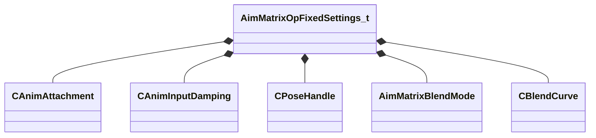

[Schemas](../../schemas.md) / [animgraphlib](../animgraphlib.md) / AimMatrixOpFixedSettings_t

# AimMatrixOpFixedSettings_t

**Kind:** class · **Size:** 240 bytes (`0xf0`) · **Align:** 16 · **Module:** animgraphlib

**Relationships:**

## Memory layout

13 fields (13 declared here, 0 inherited). Offsets are absolute from the object base.

| Offset | Field | Type | From | Annotations |
|--------|-------|------|------|-------------|
| `0x0` | `m_attachment` | [CAnimAttachment](../modellib/CAnimAttachment.md) |  |  |
| `0x80` | `m_damping` | [CAnimInputDamping](../animgraphlib/CAnimInputDamping.md) |  |  |
| `0x98` | `m_poseCacheHandles` | [CPoseHandle](../animgraphlib/CPoseHandle.md)[10] |  |  |
| `0xc0` | `m_eBlendMode` | [AimMatrixBlendMode](../!GlobalTypes/AimMatrixBlendMode.md) |  |  |
| `0xc4` | `m_flMaxYawAngle` | float32 |  |  |
| `0xc8` | `m_flMaxPitchAngle` | float32 |  |  |
| `0xcc` | `m_nSequenceMaxFrame` | int32 |  |  |
| `0xd0` | `m_nBoneMaskIndex` | int32 |  |  |
| `0xd4` | `m_bTargetIsPosition` | bool |  |  |
| `0xd5` | `m_bUseBiasAndClamp` | bool |  |  |
| `0xd8` | `m_flBiasAndClampYawOffset` | float32 |  |  |
| `0xdc` | `m_flBiasAndClampPitchOffset` | float32 |  |  |
| `0xe0` | `m_biasAndClampBlendCurve` | [CBlendCurve](../animgraphlib/CBlendCurve.md) |  |  |

KV3 class defaults

<pre>{
	&quot;m_attachment&quot;:
	{
		&quot;m_influenceRotations&quot;:
		[
			[
				0.000000,
				0.000000,
				0.000000,
				0.000000
			],
			[
				0.000000,
				0.000000,
				0.000000,
				0.000000
			],
			[
				0.000000,
				0.000000,
				0.000000,
				0.000000
			]
		],
		&quot;m_influenceOffsets&quot;:
		[
			[
				0.000000,
				0.000000,
				0.000000
			],
			[
				0.000000,
				0.000000,
				0.000000
			],
			[
				0.000000,
				0.000000,
				0.000000
			]
		],
		&quot;m_influenceIndices&quot;:
		[
			0,
			0,
			0
		],
		&quot;m_influenceWeights&quot;:
		[
			0.000000,
			0.000000,
			0.000000
		],
		&quot;m_numInfluences&quot;: 0
	},
	&quot;m_damping&quot;:
	{
		&quot;_class&quot;: &quot;CAnimInputDamping&quot;,
		&quot;m_speedFunction&quot;: &quot;NoDamping&quot;,
		&quot;m_fSpeedScale&quot;: 1.000000,
		&quot;m_fFallingSpeedScale&quot;: 1.000000
	},
	&quot;m_poseCacheHandles&quot;:
	[
		{
			&quot;m_nIndex&quot;: 65535,
			&quot;m_eType&quot;: &quot;POSETYPE_INVALID&quot;
		},
		{
			&quot;m_nIndex&quot;: 65535,
			&quot;m_eType&quot;: &quot;POSETYPE_INVALID&quot;
		},
		{
			&quot;m_nIndex&quot;: 65535,
			&quot;m_eType&quot;: &quot;POSETYPE_INVALID&quot;
		},
		{
			&quot;m_nIndex&quot;: 65535,
			&quot;m_eType&quot;: &quot;POSETYPE_INVALID&quot;
		},
		{
			&quot;m_nIndex&quot;: 65535,
			&quot;m_eType&quot;: &quot;POSETYPE_INVALID&quot;
		},
		{
			&quot;m_nIndex&quot;: 65535,
			&quot;m_eType&quot;: &quot;POSETYPE_INVALID&quot;
		},
		{
			&quot;m_nIndex&quot;: 65535,
			&quot;m_eType&quot;: &quot;POSETYPE_INVALID&quot;
		},
		{
			&quot;m_nIndex&quot;: 65535,
			&quot;m_eType&quot;: &quot;POSETYPE_INVALID&quot;
		},
		{
			&quot;m_nIndex&quot;: 65535,
			&quot;m_eType&quot;: &quot;POSETYPE_INVALID&quot;
		},
		{
			&quot;m_nIndex&quot;: 65535,
			&quot;m_eType&quot;: &quot;POSETYPE_INVALID&quot;
		}
	],
	&quot;m_eBlendMode&quot;: &quot;AimMatrixBlendMode_None&quot;,
	&quot;m_flMaxYawAngle&quot;: 45.000000,
	&quot;m_flMaxPitchAngle&quot;: 45.000000,
	&quot;m_nSequenceMaxFrame&quot;: 0,
	&quot;m_nBoneMaskIndex&quot;: -1,
	&quot;m_bTargetIsPosition&quot;: true,
	&quot;m_bUseBiasAndClamp&quot;: false,
	&quot;m_flBiasAndClampYawOffset&quot;: 1.000000,
	&quot;m_flBiasAndClampPitchOffset&quot;: 1.000000,
	&quot;m_biasAndClampBlendCurve&quot;:
	{
		&quot;m_flControlPoint1&quot;: 0.000000,
		&quot;m_flControlPoint2&quot;: 1.000000
	}
}</pre>

