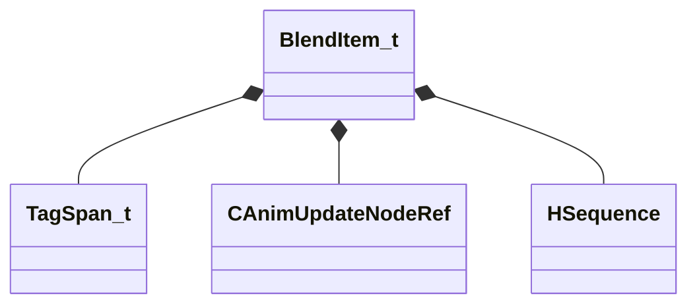

[Schemas](../../schemas.md) / [animgraphlib](../animgraphlib.md) / BlendItem_t

# BlendItem_t

> Source: **Build 25000182** · 2026-08-28 · `windows-x86_64` · schema `0.10.0`

**Kind:** class · **Size:** 64 bytes (`0x40`) · **Align:** 8 · **Module:** animgraphlib

**Relationships:**

## Memory layout

6 fields (6 declared here, 0 inherited). Offsets are absolute from the object base.

| Offset | Field | Type | From | Annotations |
|--------|-------|------|------|-------------|
| `0x0` | `m_tags` | CUtlVector< [TagSpan_t](../animgraphlib/TagSpan_t.md) > |  |  |
| `0x18` | `m_pChild` | [CAnimUpdateNodeRef](../animgraphlib/CAnimUpdateNodeRef.md) |  |  |
| `0x28` | `m_hSequence` | [HSequence](../animationsystem/HSequence.md) |  |  |
| `0x2c` | `m_vPos` | Vector2D |  |  |
| `0x34` | `m_flDuration` | float32 |  |  |
| `0x38` | `m_bUseCustomDuration` | bool |  |  |

KV3 class defaults

<pre>{
	&quot;m_tags&quot;:
	[
	],
	&quot;m_pChild&quot;:
	{
		&quot;m_nodeIndex&quot;: -1
	},
	&quot;m_hSequence&quot;: -1,
	&quot;m_vPos&quot;:
	[
		0.000000,
		0.000000
	],
	&quot;m_flDuration&quot;: 0.000000,
	&quot;m_bUseCustomDuration&quot;: false
}</pre>

