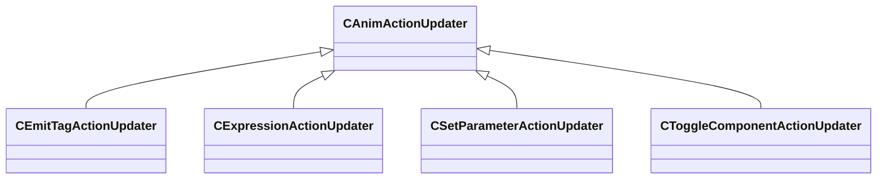

[Schemas](../../schemas.md) / [animgraphlib](../animgraphlib.md) / CAnimActionUpdater

# CAnimActionUpdater

**Kind:** class · **Size:** 24 bytes (`0x18`) · **Align:** 255 · **Module:** animgraphlib

**Derived by:** [CEmitTagActionUpdater](../animgraphlib/CEmitTagActionUpdater.md), [CExpressionActionUpdater](../animgraphlib/CExpressionActionUpdater.md), [CSetParameterActionUpdater](../animgraphlib/CSetParameterActionUpdater.md), [CToggleComponentActionUpdater](../animgraphlib/CToggleComponentActionUpdater.md)

**Relationships:**

