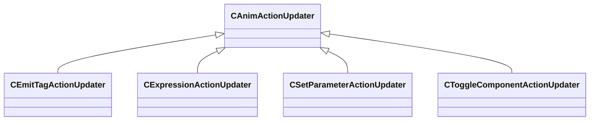

[Schemas](../../schemas.md) / [animgraphlib](../animgraphlib.md) / CAnimActionUpdater

# CAnimActionUpdater

> Source: **Build 25000182** · 2026-08-28 · `windows-x86_64` · schema `0.10.0`

**Kind:** class · **Size:** 24 bytes (`0x18`) · **Align:** n/a (unspecified) · **Module:** animgraphlib

**Derived by:** [CEmitTagActionUpdater](../animgraphlib/CEmitTagActionUpdater.md), [CExpressionActionUpdater](../animgraphlib/CExpressionActionUpdater.md), [CSetParameterActionUpdater](../animgraphlib/CSetParameterActionUpdater.md), [CToggleComponentActionUpdater](../animgraphlib/CToggleComponentActionUpdater.md)

**Relationships:**

## Memory layout

No schema-visible fields (24 bytes of opaque storage).
