[Schemas](../../schemas.md) / [animgraphlib](../animgraphlib.md) / CAnimComponentUpdater

# CAnimComponentUpdater

> Source: **Build 25000182** · 2026-08-28 · `windows-x86_64` · schema `0.10.0`

**Kind:** class · **Size:** 48 bytes (`0x30`) · **Align:** n/a (unspecified) · **Module:** animgraphlib

**Derived by:** [CActionComponentUpdater](../animgraphlib/CActionComponentUpdater.md), [CAnimScriptComponentUpdater](../animgraphlib/CAnimScriptComponentUpdater.md), [CCPPScriptComponentUpdater](../animgraphlib/CCPPScriptComponentUpdater.md), [CDampedValueComponentUpdater](../animgraphlib/CDampedValueComponentUpdater.md), [CDemoSettingsComponentUpdater](../animgraphlib/CDemoSettingsComponentUpdater.md), [CLODComponentUpdater](../animgraphlib/CLODComponentUpdater.md), [CLookComponentUpdater](../animgraphlib/CLookComponentUpdater.md), [CMovementComponentUpdater](../animgraphlib/CMovementComponentUpdater.md), [CPairedSequenceComponentUpdater](../animgraphlib/CPairedSequenceComponentUpdater.md), [CRagdollComponentUpdater](../animgraphlib/CRagdollComponentUpdater.md), [CRemapValueComponentUpdater](../animgraphlib/CRemapValueComponentUpdater.md), [CSlopeComponentUpdater](../animgraphlib/CSlopeComponentUpdater.md), [CStateMachineComponentUpdater](../animgraphlib/CStateMachineComponentUpdater.md)

**Relationships:**

```mermaid
classDiagram
    CAnimComponentUpdater <|-- CActionComponentUpdater
    CAnimComponentUpdater <|-- CAnimScriptComponentUpdater
    CAnimComponentUpdater <|-- CCPPScriptComponentUpdater
    CAnimComponentUpdater <|-- CDampedValueComponentUpdater
    CAnimComponentUpdater <|-- CDemoSettingsComponentUpdater
    CAnimComponentUpdater <|-- CLODComponentUpdater
    CAnimComponentUpdater <|-- CLookComponentUpdater
    CAnimComponentUpdater <|-- CMovementComponentUpdater
    CAnimComponentUpdater <|-- CPairedSequenceComponentUpdater
    CAnimComponentUpdater <|-- CRagdollComponentUpdater
    CAnimComponentUpdater <|-- CRemapValueComponentUpdater
    CAnimComponentUpdater <|-- CSlopeComponentUpdater
    CAnimComponentUpdater <|-- CStateMachineComponentUpdater
    CAnimComponentUpdater *-- AnimComponentID
    CAnimComponentUpdater *-- AnimNodeNetworkMode
```

## Memory layout

4 fields (4 declared here, 0 inherited). Offsets are absolute from the object base.

| Offset | Field | Type | From | Annotations |
|--------|-------|------|------|-------------|
| `0x18` | `m_name` | CUtlString |  |  |
| `0x20` | `m_id` | [AnimComponentID](../modellib/AnimComponentID.md) |  |  |
| `0x24` | `m_networkMode` | [AnimNodeNetworkMode](../animgraphlib/AnimNodeNetworkMode.md) |  |  |
| `0x28` | `m_bStartEnabled` | bool |  |  |
