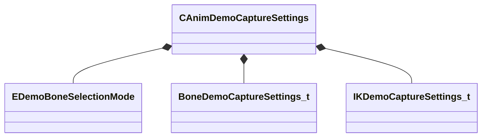

[Schemas](../../schemas.md) / [animgraphlib](../animgraphlib.md) / CAnimDemoCaptureSettings

# CAnimDemoCaptureSettings

**Kind:** class · **Size:** 128 bytes (`0x80`) · **Align:** 8 · **Module:** animgraphlib

**Relationships:**

## Memory layout

15 fields (15 declared here, 0 inherited). Offsets are absolute from the object base.

| Offset | Field | Type | From | Annotations |
|--------|-------|------|------|-------------|
| `0x0` | `m_vecErrorRangeSplineRotation` | Vector2D |  | `MPropertyFriendlyName Rotation Error Range` `MPropertyGroupName +Spline Settings` |
| `0x8` | `m_vecErrorRangeSplineTranslation` | Vector2D |  | `MPropertyFriendlyName Translation Error Range` `MPropertyGroupName +Spline Settings` |
| `0x10` | `m_vecErrorRangeSplineScale` | Vector2D |  | `MPropertyFriendlyName Scale Error Range` `MPropertyGroupName +Spline Settings` |
| `0x18` | `m_flIkRotation_MaxSplineError` | float32 |  | `MPropertyFriendlyName Max IK Rotation Error` `MPropertyGroupName +Spline Settings` |
| `0x1c` | `m_flIkTranslation_MaxSplineError` | float32 |  | `MPropertyFriendlyName Max IK Translation Error` `MPropertyGroupName +Spline Settings` |
| `0x20` | `m_vecErrorRangeQuantizationRotation` | Vector2D |  | `MPropertyFriendlyName Rotation Error Range` `MPropertyGroupName +Quantization Settings` |
| `0x28` | `m_vecErrorRangeQuantizationTranslation` | Vector2D |  | `MPropertyFriendlyName Translation Error Range` `MPropertyGroupName +Quantization Settings` |
| `0x30` | `m_vecErrorRangeQuantizationScale` | Vector2D |  | `MPropertyFriendlyName Scale Error Range` `MPropertyGroupName +Quantization Settings` |
| `0x38` | `m_flIkRotation_MaxQuantizationError` | float32 |  | `MPropertyFriendlyName Max IK Rotation Error` `MPropertyGroupName +Quantization Settings` |
| `0x3c` | `m_flIkTranslation_MaxQuantizationError` | float32 |  | `MPropertyFriendlyName Max IK Translation Error` `MPropertyGroupName +Quantization Settings` |
| `0x40` | `m_baseSequence` | CUtlString |  | `MPropertyAttributeChoiceName Sequence` `MPropertyFriendlyName Base Sequence` `MPropertyGroupName +Base Pose` |
| `0x48` | `m_nBaseSequenceFrame` | int32 |  | `MPropertyFriendlyName Base Sequence Frame` `MPropertyGroupName +Base Pose` |
| `0x4c` | `m_boneSelectionMode` | [EDemoBoneSelectionMode](../animgraphlib/EDemoBoneSelectionMode.md) |  | `MPropertyAutoRebuildOnChange` `MPropertyFriendlyName Bone Selection Mode` `MPropertyGroupName +Bones` |
| `0x50` | `m_bones` | CUtlVector< [BoneDemoCaptureSettings_t](../animgraphlib/BoneDemoCaptureSettings_t.md) > |  | `MPropertyAttrStateCallback` `MPropertyFriendlyName Bones` `MPropertyGroupName +Bones` |
| `0x68` | `m_ikChains` | CUtlVector< [IKDemoCaptureSettings_t](../animgraphlib/IKDemoCaptureSettings_t.md) > |  | `MPropertyFriendlyName IK Chains` |

KV3 class defaults

<pre>{
	&quot;m_vecErrorRangeSplineRotation&quot;:
	[
		0.100000,
		0.500000
	],
	&quot;m_vecErrorRangeSplineTranslation&quot;:
	[
		0.100000,
		0.500000
	],
	&quot;m_vecErrorRangeSplineScale&quot;:
	[
		0.100000,
		0.500000
	],
	&quot;m_flIkRotation_MaxSplineError&quot;: 0.030000,
	&quot;m_flIkTranslation_MaxSplineError&quot;: 0.300000,
	&quot;m_vecErrorRangeQuantizationRotation&quot;:
	[
		0.100000,
		0.500000
	],
	&quot;m_vecErrorRangeQuantizationTranslation&quot;:
	[
		0.100000,
		0.500000
	],
	&quot;m_vecErrorRangeQuantizationScale&quot;:
	[
		0.100000,
		0.500000
	],
	&quot;m_flIkRotation_MaxQuantizationError&quot;: 0.010000,
	&quot;m_flIkTranslation_MaxQuantizationError&quot;: 0.100000,
	&quot;m_baseSequence&quot;: &quot;&quot;,
	&quot;m_nBaseSequenceFrame&quot;: 0,
	&quot;m_boneSelectionMode&quot;: &quot;CaptureSelectedBones&quot;,
	&quot;m_bones&quot;:
	[
	],
	&quot;m_ikChains&quot;:
	[
	]
}</pre>

