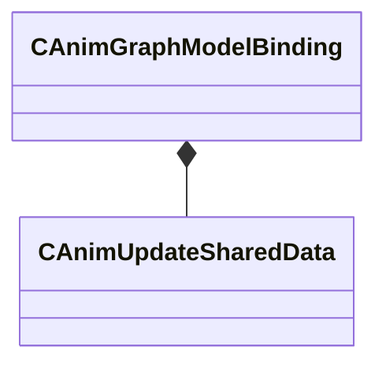

[Schemas](../../schemas.md) / [animgraphlib](../animgraphlib.md) / CAnimGraphModelBinding

# CAnimGraphModelBinding

> Source: **Build 25000182** · 2026-08-28 · `windows-x86_64` · schema `0.10.0`

**Kind:** class · **Size:** 40 bytes (`0x28`) · **Align:** 8 · **Module:** animgraphlib

**Relationships:**

## Memory layout

2 fields (2 declared here, 0 inherited). Offsets are absolute from the object base.

| Offset | Field | Type | From | Annotations |
|--------|-------|------|------|-------------|
| `0x8` | `m_modelName` | CUtlString |  |  |
| `0x10` | `m_pSharedData` | CSmartPtr< [CAnimUpdateSharedData](../animgraphlib/CAnimUpdateSharedData.md) > |  |  |

KV3 class defaults

<pre>{
	&quot;_class&quot;: &quot;CAnimGraphModelBinding&quot;,
	&quot;m_modelName&quot;: &quot;&quot;,
	&quot;m_pSharedData&quot;: null
}</pre>

