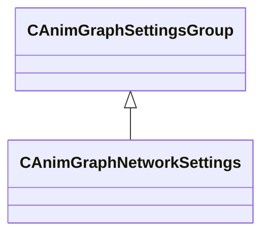

[Schemas](../../schemas.md) / [animgraphlib](../animgraphlib.md) / CAnimGraphNetworkSettings

# CAnimGraphNetworkSettings

> Source: **Build 25000182** · 2026-08-28 · `windows-x86_64` · schema `0.10.0`

**Kind:** class · **Size:** 40 bytes (`0x28`) · **Align:** 8 · **Module:** animgraphlib

**Inherits from:** [CAnimGraphSettingsGroup](../animgraphlib/CAnimGraphSettingsGroup.md)

**Metadata:** `MPropertyFriendlyName Networking`

**Relationships:**

## Memory layout

1 field (1 declared here, 0 inherited). Offsets are absolute from the object base.

| Offset | Field | Type | From | Annotations |
|--------|-------|------|------|-------------|
| `0x20` | `m_bNetworkingEnabled` | bool |  | `MPropertyFriendlyName Enable Networking` |

KV3 class defaults

<pre>{
	&quot;_class&quot;: &quot;CAnimGraphNetworkSettings&quot;,
	&quot;m_bNetworkingEnabled&quot;: true
}</pre>

