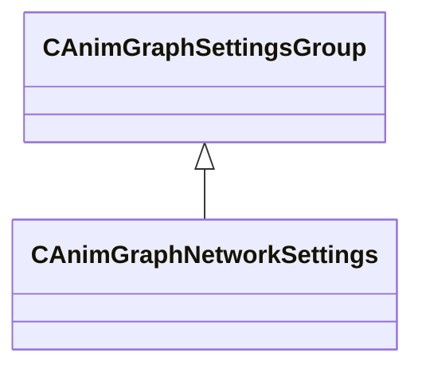

[Schemas](../../schemas.md) / [animgraphlib](../animgraphlib.md) / CAnimGraphSettingsGroup

# CAnimGraphSettingsGroup

> Source: **Build 25000182** · 2026-08-28 · `windows-x86_64` · schema `0.10.0`

**Kind:** class · **Size:** 32 bytes (`0x20`) · **Align:** 8 · **Module:** animgraphlib

**Derived by:** [CAnimGraphNetworkSettings](../animgraphlib/CAnimGraphNetworkSettings.md)

**Relationships:**

## Memory layout

No schema-visible fields (32 bytes of opaque storage).

KV3 class defaults

<pre>{
	&quot;_class&quot;: &quot;CAnimGraphSettingsGroup&quot;
}</pre>

