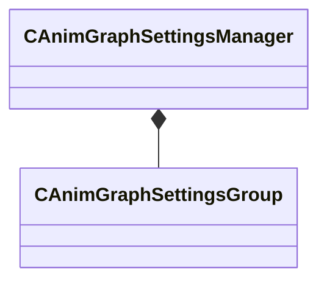

[Schemas](../../schemas.md) / [animgraphlib](../animgraphlib.md) / CAnimGraphSettingsManager

# CAnimGraphSettingsManager

> Source: **Build 25000182** · 2026-08-28 · `windows-x86_64` · schema `0.10.0`

**Kind:** class · **Size:** 48 bytes (`0x30`) · **Align:** 8 · **Module:** animgraphlib

**Relationships:**

## Memory layout

1 field (1 declared here, 0 inherited). Offsets are absolute from the object base.

| Offset | Field | Type | From | Annotations |
|--------|-------|------|------|-------------|
| `0x18` | `m_settingsGroups` | CUtlVector< CSmartPtr< [CAnimGraphSettingsGroup](../animgraphlib/CAnimGraphSettingsGroup.md) > > |  |  |

KV3 class defaults

<pre>{
	&quot;_class&quot;: &quot;CAnimGraphSettingsManager&quot;,
	&quot;m_settingsGroups&quot;:
	[
		{
			&quot;_class&quot;: &quot;CAnimGraphNetworkSettings&quot;,
			&quot;m_bNetworkingEnabled&quot;: true
		}
	]
}</pre>

