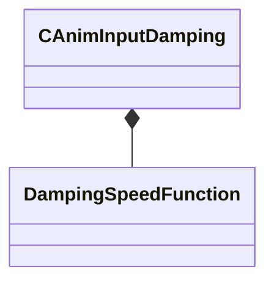

[Schemas](../../schemas.md) / [animgraphlib](../animgraphlib.md) / CAnimInputDamping

# CAnimInputDamping

> Source: **Build 25000182** · 2026-08-28 · `windows-x86_64` · schema `0.10.0`

**Kind:** class · **Size:** 24 bytes (`0x18`) · **Align:** 8 · **Module:** animgraphlib

**Metadata:** `MPropertyFriendlyName Damping`

**Relationships:**

## Memory layout

3 fields (3 declared here, 0 inherited). Offsets are absolute from the object base.

| Offset | Field | Type | From | Annotations |
|--------|-------|------|------|-------------|
| `0x8` | `m_speedFunction` | [DampingSpeedFunction](../animgraphlib/DampingSpeedFunction.md) |  | `MPropertyFriendlyName Speed Function` |
| `0xc` | `m_fSpeedScale` | float32 |  | `MPropertyFriendlyName Speed Scale` |
| `0x10` | `m_fFallingSpeedScale` | float32 |  | `MPropertyFriendlyName Falling Speed Scale` |

KV3 class defaults

<pre>{
	&quot;_class&quot;: &quot;CAnimInputDamping&quot;,
	&quot;m_speedFunction&quot;: &quot;NoDamping&quot;,
	&quot;m_fSpeedScale&quot;: 1.000000,
	&quot;m_fFallingSpeedScale&quot;: 1.000000
}</pre>

