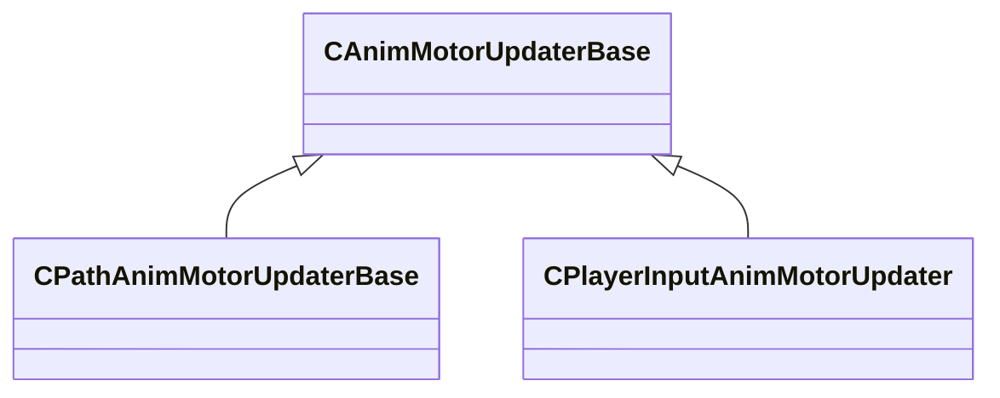

[Schemas](../../schemas.md) / [animgraphlib](../animgraphlib.md) / CAnimMotorUpdaterBase

# CAnimMotorUpdaterBase

> Source: **Build 25000182** · 2026-08-28 · `windows-x86_64` · schema `0.10.0`

**Kind:** class · **Size:** 32 bytes (`0x20`) · **Align:** n/a (unspecified) · **Module:** animgraphlib

**Derived by:** [CPathAnimMotorUpdaterBase](../animgraphlib/CPathAnimMotorUpdaterBase.md), [CPlayerInputAnimMotorUpdater](../animgraphlib/CPlayerInputAnimMotorUpdater.md)

**Relationships:**

## Memory layout

2 fields (2 declared here, 0 inherited). Offsets are absolute from the object base.

| Offset | Field | Type | From | Annotations |
|--------|-------|------|------|-------------|
| `0x10` | `m_name` | CUtlString |  |  |
| `0x18` | `m_bDefault` | bool |  |  |
