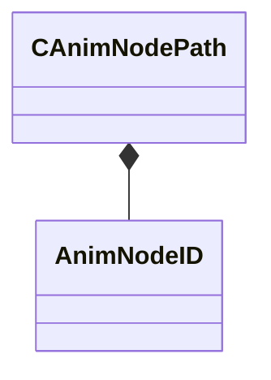

[Schemas](../../schemas.md) / [animgraphlib](../animgraphlib.md) / CAnimNodePath

# CAnimNodePath

> Source: **Build 25000182** · 2026-08-28 · `windows-x86_64` · schema `0.10.0`

**Kind:** class · **Size:** 48 bytes (`0x30`) · **Align:** 4 · **Module:** animgraphlib

**Relationships:**

## Memory layout

2 fields (2 declared here, 0 inherited). Offsets are absolute from the object base.

| Offset | Field | Type | From | Annotations |
|--------|-------|------|------|-------------|
| `0x0` | `m_path` | [AnimNodeID](../modellib/AnimNodeID.md)[11] |  |  |
| `0x2c` | `m_nCount` | int32 |  |  |

KV3 class defaults

<pre>{
	&quot;m_path&quot;:
	[
		{
			&quot;m_id&quot;: &lt;HIDDEN FOR DIFF&gt;,
		},
		{
			&quot;m_id&quot;: &lt;HIDDEN FOR DIFF&gt;,
		},
		{
			&quot;m_id&quot;: &lt;HIDDEN FOR DIFF&gt;,
		},
		{
			&quot;m_id&quot;: &lt;HIDDEN FOR DIFF&gt;,
		},
		{
			&quot;m_id&quot;: &lt;HIDDEN FOR DIFF&gt;,
		},
		{
			&quot;m_id&quot;: &lt;HIDDEN FOR DIFF&gt;,
		},
		{
			&quot;m_id&quot;: &lt;HIDDEN FOR DIFF&gt;,
		},
		{
			&quot;m_id&quot;: &lt;HIDDEN FOR DIFF&gt;,
		},
		{
			&quot;m_id&quot;: &lt;HIDDEN FOR DIFF&gt;,
		},
		{
			&quot;m_id&quot;: &lt;HIDDEN FOR DIFF&gt;,
		},
		{
			&quot;m_id&quot;: &lt;HIDDEN FOR DIFF&gt;,
		}
	],
	&quot;m_nCount&quot;: 0
}</pre>

