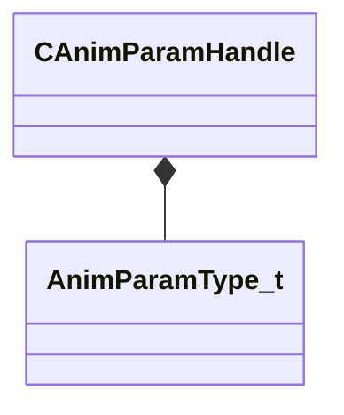

[Schemas](../../schemas.md) / [animgraphlib](../animgraphlib.md) / CAnimParamHandle

# CAnimParamHandle

> Source: **Build 25000182** · 2026-08-28 · `windows-x86_64` · schema `0.10.0`

**Kind:** class · **Size:** 2 bytes (`0x2`) · **Align:** 1 · **Module:** animgraphlib

**Relationships:**

## Memory layout

2 fields (2 declared here, 0 inherited). Offsets are absolute from the object base.

| Offset | Field | Type | From | Annotations |
|--------|-------|------|------|-------------|
| `0x0` | `m_type` | [AnimParamType_t](../animgraphlib/AnimParamType_t.md) |  |  |
| `0x1` | `m_index` | uint8 |  |  |

KV3 class defaults

<pre>{
	&quot;m_type&quot;: &quot;ANIMPARAM_UNKNOWN&quot;,
	&quot;m_index&quot;: 255
}</pre>

