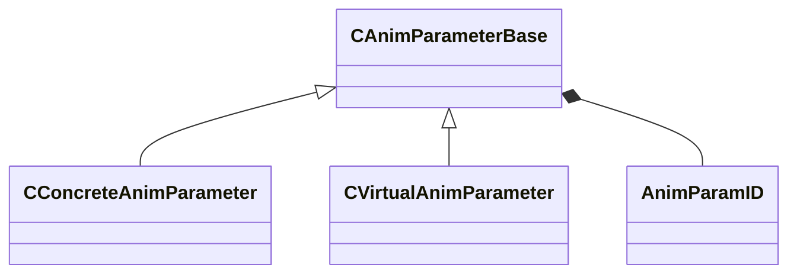

[Schemas](../../schemas.md) / [animgraphlib](../animgraphlib.md) / CAnimParameterBase

# CAnimParameterBase

**Kind:** class · **Size:** 112 bytes (`0x70`) · **Align:** 255 · **Module:** animgraphlib

**Derived by:** [CConcreteAnimParameter](../animgraphlib/CConcreteAnimParameter.md), [CVirtualAnimParameter](../animgraphlib/CVirtualAnimParameter.md)

**Relationships:**

## Memory layout

7 fields (7 declared here, 0 inherited). Offsets are absolute from the object base.

| Offset | Field | Type | From | Annotations |
|--------|-------|------|------|-------------|
| `0x18` | `m_name` | CGlobalSymbol |  | `MPropertyFriendlyName Name` `MPropertySortPriority 100` |
| `0x20` | `m_sComment` | CUtlString |  | `MPropertyAttributeEditor TextBlock()` `MPropertyFriendlyName Comment` `MPropertySortPriority -100` |
| `0x28` | `m_group` | CUtlString |  | `MPropertyReadOnly` `MPropertySortPriority -90` |
| `0x30` | `m_id` | [AnimParamID](../modellib/AnimParamID.md) |  | `MPropertyReadOnly` `MPropertySortPriority -90` |
| `0x48` | `m_componentName` | CUtlString |  | `MPropertyAutoRebuildOnChange` `MPropertySuppressField` |
| `0x68` | `m_bNetworkingRequested` | bool |  | `MPropertySuppressField` |
| `0x69` | `m_bIsReferenced` | bool |  | `MPropertySuppressField` |
