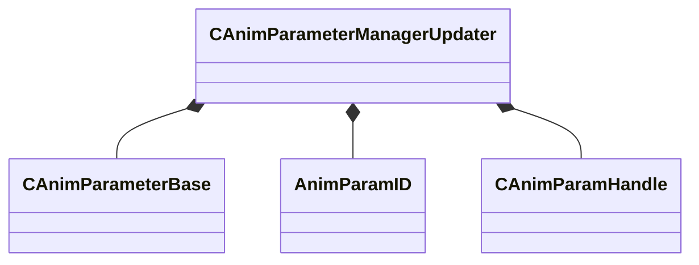

[Schemas](../../schemas.md) / [animgraphlib](../animgraphlib.md) / CAnimParameterManagerUpdater

# CAnimParameterManagerUpdater

**Kind:** class · **Size:** 256 bytes (`0x100`) · **Align:** 8 · **Module:** animgraphlib

**Relationships:**

## Memory layout

6 fields (6 declared here, 0 inherited). Offsets are absolute from the object base.

| Offset | Field | Type | From | Annotations |
|--------|-------|------|------|-------------|
| `0x18` | `m_parameters` | CUtlVector< CSmartPtr< [CAnimParameterBase](../animgraphlib/CAnimParameterBase.md) > > |  |  |
| `0x30` | `m_idToIndexMap` | CUtlHashtable< [AnimParamID](../modellib/AnimParamID.md), int32 > |  |  |
| `0x50` | `m_nameToIndexMap` | CUtlHashtable< CUtlString, int32 > |  |  |
| `0x70` | `m_indexToHandle` | CUtlVector< [CAnimParamHandle](../animgraphlib/CAnimParamHandle.md) > |  |  |
| `0x88` | `m_autoResetParams` | CUtlVector< std::pair< [CAnimParamHandle](../animgraphlib/CAnimParamHandle.md), CAnimVariant > > |  |  |
| `0xa0` | `m_autoResetMap` | CUtlHashtable< [CAnimParamHandle](../animgraphlib/CAnimParamHandle.md), int16 > |  |  |

KV3 class defaults

<pre>{
	&quot;_class&quot;: &quot;CAnimParameterManagerUpdater&quot;,
	&quot;m_parameters&quot;:
	[
	],
	&quot;m_idToIndexMap&quot;:
	[
	],
	&quot;m_nameToIndexMap&quot;:
	{
	},
	&quot;m_indexToHandle&quot;:
	[
	],
	&quot;m_autoResetParams&quot;:
	[
	],
	&quot;m_autoResetMap&quot;:
	[
	]
}</pre>

