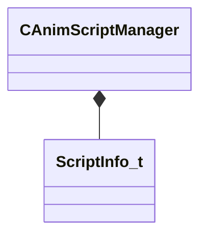

[Schemas](../../schemas.md) / [animgraphlib](../animgraphlib.md) / CAnimScriptManager

# CAnimScriptManager

> Source: **Build 25000182** · 2026-08-28 · `windows-x86_64` · schema `0.10.0`

**Kind:** class · **Size:** 416 bytes (`0x1a0`) · **Align:** 8 · **Module:** animgraphlib

**Relationships:**

## Memory layout

1 field (1 declared here, 0 inherited). Offsets are absolute from the object base.

| Offset | Field | Type | From | Annotations |
|--------|-------|------|------|-------------|
| `0x10` | `m_scriptInfo` | CUtlVector< [ScriptInfo_t](../animgraphlib/ScriptInfo_t.md) > |  |  |

KV3 class defaults

<pre>{
	&quot;_class&quot;: &quot;CAnimScriptManager&quot;,
	&quot;m_scriptInfo&quot;:
	[
	]
}</pre>

