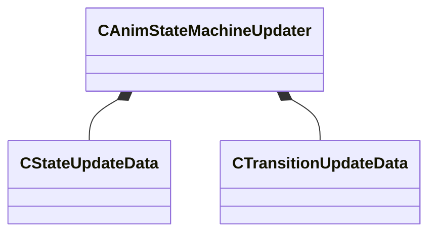

[Schemas](../../schemas.md) / [animgraphlib](../animgraphlib.md) / CAnimStateMachineUpdater

# CAnimStateMachineUpdater

**Kind:** class · **Size:** 88 bytes (`0x58`) · **Align:** 8 · **Module:** animgraphlib

**Relationships:**

## Memory layout

3 fields (3 declared here, 0 inherited). Offsets are absolute from the object base.

| Offset | Field | Type | From | Annotations |
|--------|-------|------|------|-------------|
| `0x8` | `m_states` | CUtlVector< [CStateUpdateData](../animgraphlib/CStateUpdateData.md) > |  |  |
| `0x20` | `m_transitions` | CUtlVector< [CTransitionUpdateData](../animgraphlib/CTransitionUpdateData.md) > |  |  |
| `0x50` | `m_startStateIndex` | int32 |  |  |

KV3 class defaults

<pre>{
	&quot;_class&quot;: &quot;CAnimStateMachineUpdater&quot;,
	&quot;m_states&quot;:
	[
	],
	&quot;m_transitions&quot;:
	[
	],
	&quot;m_startStateIndex&quot;: -1
}</pre>

