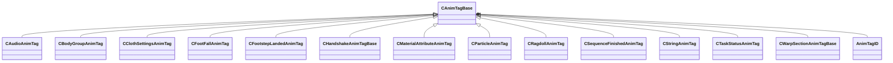

[Schemas](../../schemas.md) / [animgraphlib](../animgraphlib.md) / CAnimTagBase

# CAnimTagBase

**Kind:** class · **Size:** 80 bytes (`0x50`) · **Align:** 8 · **Module:** animgraphlib

**Derived by:** [CAudioAnimTag](../animgraphlib/CAudioAnimTag.md), [CBodyGroupAnimTag](../animgraphlib/CBodyGroupAnimTag.md), [CClothSettingsAnimTag](../animgraphlib/CClothSettingsAnimTag.md), [CFootFallAnimTag](../animgraphlib/CFootFallAnimTag.md), [CFootstepLandedAnimTag](../animgraphlib/CFootstepLandedAnimTag.md), [CHandshakeAnimTagBase](../animgraphlib/CHandshakeAnimTagBase.md), [CMaterialAttributeAnimTag](../animgraphlib/CMaterialAttributeAnimTag.md), [CParticleAnimTag](../animgraphlib/CParticleAnimTag.md), [CRagdollAnimTag](../animgraphlib/CRagdollAnimTag.md), [CSequenceFinishedAnimTag](../animgraphlib/CSequenceFinishedAnimTag.md), [CStringAnimTag](../animgraphlib/CStringAnimTag.md), [CTaskStatusAnimTag](../animgraphlib/CTaskStatusAnimTag.md), [CWarpSectionAnimTagBase](../animgraphlib/CWarpSectionAnimTagBase.md)

**Relationships:**

## Memory layout

5 fields (5 declared here, 0 inherited). Offsets are absolute from the object base.

| Offset | Field | Type | From | Annotations |
|--------|-------|------|------|-------------|
| `0x18` | `m_name` | CGlobalSymbol |  | `MPropertyFriendlyName Name` `MPropertySortPriority 100` |
| `0x20` | `m_sComment` | CUtlString |  | `MPropertyAttributeEditor TextBlock()` `MPropertyFriendlyName Comment` `MPropertySortPriority -100` |
| `0x28` | `m_group` | CGlobalSymbol |  | `MPropertySuppressField` |
| `0x30` | `m_tagID` | [AnimTagID](../modellib/AnimTagID.md) |  | `MPropertySuppressField` |
| `0x48` | `m_bIsReferenced` | bool |  | `MPropertySuppressField` |

KV3 class defaults

<pre>{
	&quot;_class&quot;: &quot;CAnimTagBase&quot;,
	&quot;m_name&quot;: &quot;Unnamed Tag&quot;,
	&quot;m_sComment&quot;: &quot;&quot;,
	&quot;m_group&quot;: &quot;&quot;,
	&quot;m_tagID&quot;:
	{
		&quot;m_id&quot;: &lt;HIDDEN FOR DIFF&gt;,
	},
	&quot;m_bIsReferenced&quot;: false
}</pre>

