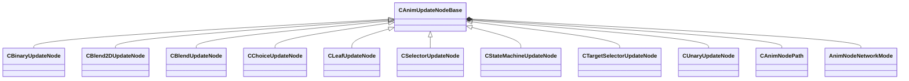

[Schemas](../../schemas.md) / [animgraphlib](../animgraphlib.md) / CAnimUpdateNodeBase

# CAnimUpdateNodeBase

> Source: **Build 25000182** · 2026-08-28 · `windows-x86_64` · schema `0.10.0`

**Kind:** class · **Size:** 88 bytes (`0x58`) · **Align:** n/a (unspecified) · **Module:** animgraphlib

**Derived by:** [CBinaryUpdateNode](../animgraphlib/CBinaryUpdateNode.md), [CBlend2DUpdateNode](../animgraphlib/CBlend2DUpdateNode.md), [CBlendUpdateNode](../animgraphlib/CBlendUpdateNode.md), [CChoiceUpdateNode](../animgraphlib/CChoiceUpdateNode.md), [CLeafUpdateNode](../animgraphlib/CLeafUpdateNode.md), [CSelectorUpdateNode](../animgraphlib/CSelectorUpdateNode.md), [CStateMachineUpdateNode](../animgraphlib/CStateMachineUpdateNode.md), [CTargetSelectorUpdateNode](../animgraphlib/CTargetSelectorUpdateNode.md), [CUnaryUpdateNode](../animgraphlib/CUnaryUpdateNode.md)

**Relationships:**

## Memory layout

3 fields (3 declared here, 0 inherited). Offsets are absolute from the object base.

| Offset | Field | Type | From | Annotations |
|--------|-------|------|------|-------------|
| `0x18` | `m_nodePath` | [CAnimNodePath](../animgraphlib/CAnimNodePath.md) |  |  |
| `0x48` | `m_networkMode` | [AnimNodeNetworkMode](../animgraphlib/AnimNodeNetworkMode.md) |  |  |
| `0x50` | `m_name` | CUtlString |  |  |
