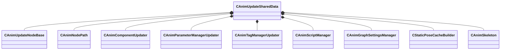

[Schemas](../../schemas.md) / [animgraphlib](../animgraphlib.md) / CAnimUpdateSharedData

# CAnimUpdateSharedData

**Kind:** class · **Size:** 256 bytes (`0x100`) · **Align:** 8 · **Module:** animgraphlib

**Relationships:**

## Memory layout

10 fields (10 declared here, 0 inherited). Offsets are absolute from the object base.

| Offset | Field | Type | From | Annotations |
|--------|-------|------|------|-------------|
| `0x10` | `m_nodes` | CUtlVector< CSmartPtr< [CAnimUpdateNodeBase](../animgraphlib/CAnimUpdateNodeBase.md) > > |  |  |
| `0x28` | `m_nodeIndexMap` | CUtlHashtable< [CAnimNodePath](../animgraphlib/CAnimNodePath.md), int32 > |  |  |
| `0x48` | `m_components` | CUtlVector< CSmartPtr< [CAnimComponentUpdater](../animgraphlib/CAnimComponentUpdater.md) > > |  |  |
| `0x60` | `m_pParamListUpdater` | CSmartPtr< [CAnimParameterManagerUpdater](../animgraphlib/CAnimParameterManagerUpdater.md) > |  |  |
| `0x68` | `m_pTagManagerUpdater` | CSmartPtr< [CAnimTagManagerUpdater](../animgraphlib/CAnimTagManagerUpdater.md) > |  |  |
| `0x70` | `m_scriptManager` | CSmartPtr< [CAnimScriptManager](../animgraphlib/CAnimScriptManager.md) > |  |  |
| `0x78` | `m_settings` | [CAnimGraphSettingsManager](../animgraphlib/CAnimGraphSettingsManager.md) |  |  |
| `0xa8` | `m_pStaticPoseCache` | CSmartPtr< [CStaticPoseCacheBuilder](../animgraphlib/CStaticPoseCacheBuilder.md) > |  |  |
| `0xb0` | `m_pSkeleton` | CSmartPtr< [CAnimSkeleton](../modellib/CAnimSkeleton.md) > |  |  |
| `0xb8` | `m_rootNodePath` | [CAnimNodePath](../animgraphlib/CAnimNodePath.md) |  |  |

KV3 class defaults

<pre>{
	&quot;_class&quot;: &quot;CAnimUpdateSharedData&quot;,
	&quot;m_nodes&quot;:
	[
	],
	&quot;m_nodeIndexMap&quot;:
	[
	],
	&quot;m_components&quot;:
	[
	],
	&quot;m_pParamListUpdater&quot;: null,
	&quot;m_pTagManagerUpdater&quot;: null,
	&quot;m_scriptManager&quot;: null,
	&quot;m_settings&quot;:
	{
		&quot;_class&quot;: &quot;CAnimGraphSettingsManager&quot;,
		&quot;m_settingsGroups&quot;:
		[
			{
				&quot;_class&quot;: &quot;CAnimGraphNetworkSettings&quot;,
				&quot;m_bNetworkingEnabled&quot;: true
			}
		]
	},
	&quot;m_pStaticPoseCache&quot;: null,
	&quot;m_pSkeleton&quot;: null,
	&quot;m_rootNodePath&quot;:
	{
		&quot;m_path&quot;:
		[
			{
				&quot;m_id&quot;: &lt;HIDDEN FOR DIFF&gt;,
			},
			{
				&quot;m_id&quot;: &lt;HIDDEN FOR DIFF&gt;,
			},
			{
				&quot;m_id&quot;: &lt;HIDDEN FOR DIFF&gt;,
			},
			{
				&quot;m_id&quot;: &lt;HIDDEN FOR DIFF&gt;,
			},
			{
				&quot;m_id&quot;: &lt;HIDDEN FOR DIFF&gt;,
			},
			{
				&quot;m_id&quot;: &lt;HIDDEN FOR DIFF&gt;,
			},
			{
				&quot;m_id&quot;: &lt;HIDDEN FOR DIFF&gt;,
			},
			{
				&quot;m_id&quot;: &lt;HIDDEN FOR DIFF&gt;,
			},
			{
				&quot;m_id&quot;: &lt;HIDDEN FOR DIFF&gt;,
			},
			{
				&quot;m_id&quot;: &lt;HIDDEN FOR DIFF&gt;,
			},
			{
				&quot;m_id&quot;: &lt;HIDDEN FOR DIFF&gt;,
			}
		],
		&quot;m_nCount&quot;: 0
	}
}</pre>

