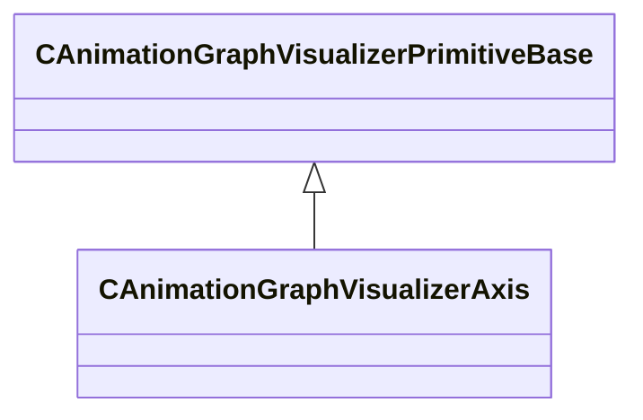

[Schemas](../../schemas.md) / [animgraphlib](../animgraphlib.md) / CAnimationGraphVisualizerAxis

# CAnimationGraphVisualizerAxis

> Source: **Build 25000182** · 2026-08-28 · `windows-x86_64` · schema `0.10.0`

**Kind:** class · **Size:** 112 bytes (`0x70`) · **Align:** 16 · **Module:** animgraphlib

**Inherits from:** [CAnimationGraphVisualizerPrimitiveBase](../animgraphlib/CAnimationGraphVisualizerPrimitiveBase.md)

**Relationships:**

## Memory layout

5 fields (2 declared here, 3 inherited). Offsets are absolute from the object base.

| Offset | Field | Type | From | Annotations |
|--------|-------|------|------|-------------|
| `0x8` | `m_Type` | [CAnimationGraphVisualizerPrimitiveType](../animgraphlib/CAnimationGraphVisualizerPrimitiveType.md) | [CAnimationGraphVisualizerPrimitiveBase](../animgraphlib/CAnimationGraphVisualizerPrimitiveBase.md) |  |
| `0xc` | `m_OwningAnimNodePaths` | [AnimNodeID](../modellib/AnimNodeID.md)[11] | [CAnimationGraphVisualizerPrimitiveBase](../animgraphlib/CAnimationGraphVisualizerPrimitiveBase.md) |  |
| `0x38` | `m_nOwningAnimNodePathCount` | int32 | [CAnimationGraphVisualizerPrimitiveBase](../animgraphlib/CAnimationGraphVisualizerPrimitiveBase.md) |  |
| `0x40` | `m_xWsTransform` | CTransform |  |  |
| `0x60` | `m_flAxisSize` | float32 |  |  |

KV3 class defaults

<pre>{
	&quot;_class&quot;: &quot;CAnimationGraphVisualizerAxis&quot;,
	&quot;m_Type&quot;: &quot;ANIMATIONGRAPHVISUALIZERPRIMITIVETYPE_Axis&quot;,
	&quot;m_OwningAnimNodePaths&quot;:
	[
		{
			&quot;m_id&quot;: &lt;HIDDEN FOR DIFF&gt;,
		},
		{
			&quot;m_id&quot;: &lt;HIDDEN FOR DIFF&gt;,
		},
		{
			&quot;m_id&quot;: &lt;HIDDEN FOR DIFF&gt;,
		},
		{
			&quot;m_id&quot;: &lt;HIDDEN FOR DIFF&gt;,
		},
		{
			&quot;m_id&quot;: &lt;HIDDEN FOR DIFF&gt;,
		},
		{
			&quot;m_id&quot;: &lt;HIDDEN FOR DIFF&gt;,
		},
		{
			&quot;m_id&quot;: &lt;HIDDEN FOR DIFF&gt;,
		},
		{
			&quot;m_id&quot;: &lt;HIDDEN FOR DIFF&gt;,
		},
		{
			&quot;m_id&quot;: &lt;HIDDEN FOR DIFF&gt;,
		},
		{
			&quot;m_id&quot;: &lt;HIDDEN FOR DIFF&gt;,
		},
		{
			&quot;m_id&quot;: &lt;HIDDEN FOR DIFF&gt;,
		}
	],
	&quot;m_nOwningAnimNodePathCount&quot;: 0,
	&quot;m_xWsTransform&quot;:
	[
		0.000000,
		0.000000,
		0.000000,
		0.000000,
		0.000000,
		0.000000,
		0.000000,
		0.000000
	],
	&quot;m_flAxisSize&quot;: 0.000000
}</pre>

