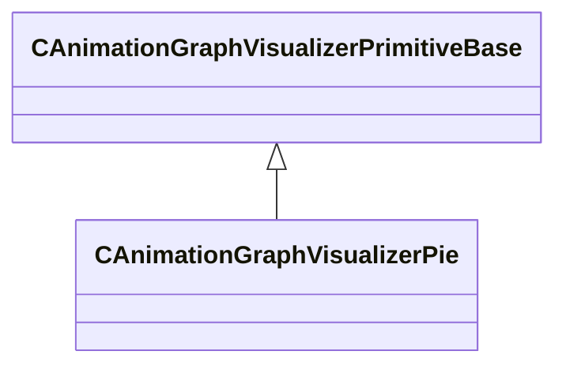

[Schemas](../../schemas.md) / [animgraphlib](../animgraphlib.md) / CAnimationGraphVisualizerPie

# CAnimationGraphVisualizerPie

**Kind:** class · **Size:** 128 bytes (`0x80`) · **Align:** 16 · **Module:** animgraphlib

**Inherits from:** [CAnimationGraphVisualizerPrimitiveBase](../animgraphlib/CAnimationGraphVisualizerPrimitiveBase.md)

**Relationships:**

## Memory layout

7 fields (4 declared here, 3 inherited). Offsets are absolute from the object base.

| Offset | Field | Type | From | Annotations |
|--------|-------|------|------|-------------|
| `0x8` | `m_Type` | [CAnimationGraphVisualizerPrimitiveType](../animgraphlib/CAnimationGraphVisualizerPrimitiveType.md) | [CAnimationGraphVisualizerPrimitiveBase](../animgraphlib/CAnimationGraphVisualizerPrimitiveBase.md) |  |
| `0xc` | `m_OwningAnimNodePaths` | [AnimNodeID](../modellib/AnimNodeID.md)[11] | [CAnimationGraphVisualizerPrimitiveBase](../animgraphlib/CAnimationGraphVisualizerPrimitiveBase.md) |  |
| `0x38` | `m_nOwningAnimNodePathCount` | int32 | [CAnimationGraphVisualizerPrimitiveBase](../animgraphlib/CAnimationGraphVisualizerPrimitiveBase.md) |  |
| `0x40` | `m_vWsCenter` | VectorAligned |  |  |
| `0x50` | `m_vWsStart` | VectorAligned |  |  |
| `0x60` | `m_vWsEnd` | VectorAligned |  |  |
| `0x70` | `m_Color` | Color |  |  |

KV3 class defaults

<pre>{
	&quot;_class&quot;: &quot;CAnimationGraphVisualizerPie&quot;,
	&quot;m_Type&quot;: &quot;ANIMATIONGRAPHVISUALIZERPRIMITIVETYPE_Pie&quot;,
	&quot;m_OwningAnimNodePaths&quot;:
	[
		{
			&quot;m_id&quot;: &lt;HIDDEN FOR DIFF&gt;,
		},
		{
			&quot;m_id&quot;: &lt;HIDDEN FOR DIFF&gt;,
		},
		{
			&quot;m_id&quot;: &lt;HIDDEN FOR DIFF&gt;,
		},
		{
			&quot;m_id&quot;: &lt;HIDDEN FOR DIFF&gt;,
		},
		{
			&quot;m_id&quot;: &lt;HIDDEN FOR DIFF&gt;,
		},
		{
			&quot;m_id&quot;: &lt;HIDDEN FOR DIFF&gt;,
		},
		{
			&quot;m_id&quot;: &lt;HIDDEN FOR DIFF&gt;,
		},
		{
			&quot;m_id&quot;: &lt;HIDDEN FOR DIFF&gt;,
		},
		{
			&quot;m_id&quot;: &lt;HIDDEN FOR DIFF&gt;,
		},
		{
			&quot;m_id&quot;: &lt;HIDDEN FOR DIFF&gt;,
		},
		{
			&quot;m_id&quot;: &lt;HIDDEN FOR DIFF&gt;,
		}
	],
	&quot;m_nOwningAnimNodePathCount&quot;: 0,
	&quot;m_vWsCenter&quot;:
	[
		0.000000,
		0.000000,
		0.000000
	],
	&quot;m_vWsStart&quot;:
	[
		0.000000,
		0.000000,
		0.000000
	],
	&quot;m_vWsEnd&quot;:
	[
		0.000000,
		0.000000,
		0.000000
	],
	&quot;m_Color&quot;:
	[
		0,
		0,
		0,
		0
	]
}</pre>

