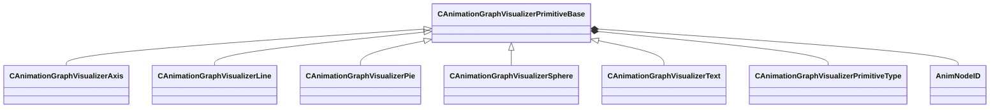

[Schemas](../../schemas.md) / [animgraphlib](../animgraphlib.md) / CAnimationGraphVisualizerPrimitiveBase

# CAnimationGraphVisualizerPrimitiveBase

> Source: **Build 25000182** · 2026-08-28 · `windows-x86_64` · schema `0.10.0`

**Kind:** class · **Size:** 64 bytes (`0x40`) · **Align:** 8 · **Module:** animgraphlib

**Derived by:** [CAnimationGraphVisualizerAxis](../animgraphlib/CAnimationGraphVisualizerAxis.md), [CAnimationGraphVisualizerLine](../animgraphlib/CAnimationGraphVisualizerLine.md), [CAnimationGraphVisualizerPie](../animgraphlib/CAnimationGraphVisualizerPie.md), [CAnimationGraphVisualizerSphere](../animgraphlib/CAnimationGraphVisualizerSphere.md), [CAnimationGraphVisualizerText](../animgraphlib/CAnimationGraphVisualizerText.md)

**Relationships:**

## Memory layout

3 fields (3 declared here, 0 inherited). Offsets are absolute from the object base.

| Offset | Field | Type | From | Annotations |
|--------|-------|------|------|-------------|
| `0x8` | `m_Type` | [CAnimationGraphVisualizerPrimitiveType](../animgraphlib/CAnimationGraphVisualizerPrimitiveType.md) |  |  |
| `0xc` | `m_OwningAnimNodePaths` | [AnimNodeID](../modellib/AnimNodeID.md)[11] |  |  |
| `0x38` | `m_nOwningAnimNodePathCount` | int32 |  |  |

KV3 class defaults

<pre>{
	&quot;_class&quot;: &quot;CAnimationGraphVisualizerPrimitiveBase&quot;,
	&quot;m_Type&quot;: &quot;ANIMATIONGRAPHVISUALIZERPRIMITIVETYPE_Text&quot;,
	&quot;m_OwningAnimNodePaths&quot;:
	[
		{
			&quot;m_id&quot;: &lt;HIDDEN FOR DIFF&gt;,
		},
		{
			&quot;m_id&quot;: &lt;HIDDEN FOR DIFF&gt;,
		},
		{
			&quot;m_id&quot;: &lt;HIDDEN FOR DIFF&gt;,
		},
		{
			&quot;m_id&quot;: &lt;HIDDEN FOR DIFF&gt;,
		},
		{
			&quot;m_id&quot;: &lt;HIDDEN FOR DIFF&gt;,
		},
		{
			&quot;m_id&quot;: &lt;HIDDEN FOR DIFF&gt;,
		},
		{
			&quot;m_id&quot;: &lt;HIDDEN FOR DIFF&gt;,
		},
		{
			&quot;m_id&quot;: &lt;HIDDEN FOR DIFF&gt;,
		},
		{
			&quot;m_id&quot;: &lt;HIDDEN FOR DIFF&gt;,
		},
		{
			&quot;m_id&quot;: &lt;HIDDEN FOR DIFF&gt;,
		},
		{
			&quot;m_id&quot;: &lt;HIDDEN FOR DIFF&gt;,
		}
	],
	&quot;m_nOwningAnimNodePathCount&quot;: 0
}</pre>

