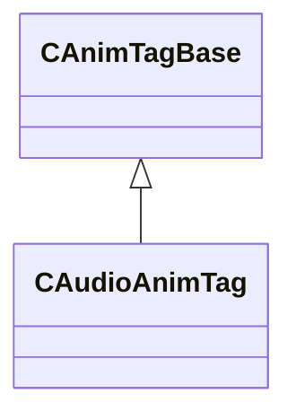

[Schemas](../../schemas.md) / [animgraphlib](../animgraphlib.md) / CAudioAnimTag

# CAudioAnimTag

> Source: **Build 25000182** · 2026-08-28 · `windows-x86_64` · schema `0.10.0`

**Kind:** class · **Size:** 112 bytes (`0x70`) · **Align:** 8 · **Module:** animgraphlib

**Inherits from:** [CAnimTagBase](../animgraphlib/CAnimTagBase.md)

**Metadata:** `MPropertyFriendlyName Audio Tag`

**Relationships:**

## Memory layout

12 fields (7 declared here, 5 inherited). Offsets are absolute from the object base.

| Offset | Field | Type | From | Annotations |
|--------|-------|------|------|-------------|
| `0x18` | `m_name` | CGlobalSymbol | [CAnimTagBase](../animgraphlib/CAnimTagBase.md) | `MPropertyFriendlyName Name` `MPropertySortPriority 100` |
| `0x20` | `m_sComment` | CUtlString | [CAnimTagBase](../animgraphlib/CAnimTagBase.md) | `MPropertyAttributeEditor TextBlock()` `MPropertyFriendlyName Comment` `MPropertySortPriority -100` |
| `0x28` | `m_group` | CGlobalSymbol | [CAnimTagBase](../animgraphlib/CAnimTagBase.md) | `MPropertySuppressField` |
| `0x30` | `m_tagID` | [AnimTagID](../modellib/AnimTagID.md) | [CAnimTagBase](../animgraphlib/CAnimTagBase.md) | `MPropertySuppressField` |
| `0x48` | `m_bIsReferenced` | bool | [CAnimTagBase](../animgraphlib/CAnimTagBase.md) | `MPropertySuppressField` |
| `0x58` | `m_clipName` | CUtlString |  | `MPropertyAttributeEditor SoundPicker()` `MPropertyFriendlyName Sound Event` |
| `0x60` | `m_attachmentName` | CUtlString |  | `MPropertyAttributeChoiceName Attachment` `MPropertyFriendlyName Attachment` |
| `0x68` | `m_flVolume` | float32 |  | `MPropertyAttributeRange 0 1` `MPropertyFriendlyName Volume` |
| `0x6c` | `m_bStopWhenTagEnds` | bool |  | `MPropertyFriendlyName Stop on Tag End` |
| `0x6d` | `m_bStopWhenGraphEnds` | bool |  | `MPropertyFriendlyName Stop When Graph Destroyed` |
| `0x6e` | `m_bPlayOnServer` | bool |  | `MPropertyFriendlyName Play on Server` |
| `0x6f` | `m_bPlayOnClient` | bool |  | `MPropertyFriendlyName Play on Client` |

KV3 class defaults

<pre>{
	&quot;_class&quot;: &quot;CAudioAnimTag&quot;,
	&quot;m_name&quot;: &quot;Unnamed Tag&quot;,
	&quot;m_sComment&quot;: &quot;&quot;,
	&quot;m_group&quot;: &quot;&quot;,
	&quot;m_tagID&quot;:
	{
		&quot;m_id&quot;: &lt;HIDDEN FOR DIFF&gt;,
	},
	&quot;m_bIsReferenced&quot;: false,
	&quot;m_clipName&quot;: &quot;&quot;,
	&quot;m_attachmentName&quot;: &quot;&quot;,
	&quot;m_flVolume&quot;: 1.000000,
	&quot;m_bStopWhenTagEnds&quot;: false,
	&quot;m_bStopWhenGraphEnds&quot;: true,
	&quot;m_bPlayOnServer&quot;: true,
	&quot;m_bPlayOnClient&quot;: true
}</pre>

