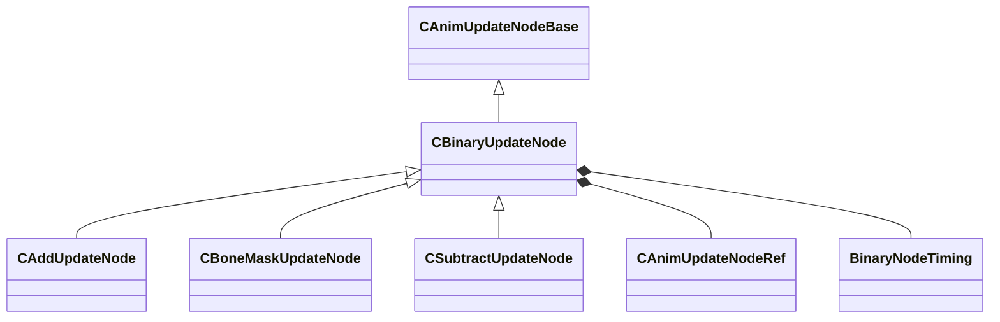

[Schemas](../../schemas.md) / [animgraphlib](../animgraphlib.md) / CBinaryUpdateNode

# CBinaryUpdateNode

> Source: **Build 25000182** · 2026-08-28 · `windows-x86_64` · schema `0.10.0`

**Kind:** class · **Size:** 144 bytes (`0x90`) · **Align:** n/a (unspecified) · **Module:** animgraphlib

**Inherits from:** [CAnimUpdateNodeBase](../animgraphlib/CAnimUpdateNodeBase.md)

**Derived by:** [CAddUpdateNode](../animgraphlib/CAddUpdateNode.md), [CBoneMaskUpdateNode](../animgraphlib/CBoneMaskUpdateNode.md), [CSubtractUpdateNode](../animgraphlib/CSubtractUpdateNode.md)

**Relationships:**

## Memory layout

9 fields (6 declared here, 3 inherited). Offsets are absolute from the object base.

| Offset | Field | Type | From | Annotations |
|--------|-------|------|------|-------------|
| `0x18` | `m_nodePath` | [CAnimNodePath](../animgraphlib/CAnimNodePath.md) | [CAnimUpdateNodeBase](../animgraphlib/CAnimUpdateNodeBase.md) |  |
| `0x48` | `m_networkMode` | [AnimNodeNetworkMode](../animgraphlib/AnimNodeNetworkMode.md) | [CAnimUpdateNodeBase](../animgraphlib/CAnimUpdateNodeBase.md) |  |
| `0x50` | `m_name` | CUtlString | [CAnimUpdateNodeBase](../animgraphlib/CAnimUpdateNodeBase.md) |  |
| `0x60` | `m_pChild1` | [CAnimUpdateNodeRef](../animgraphlib/CAnimUpdateNodeRef.md) |  |  |
| `0x70` | `m_pChild2` | [CAnimUpdateNodeRef](../animgraphlib/CAnimUpdateNodeRef.md) |  |  |
| `0x80` | `m_timingBehavior` | [BinaryNodeTiming](../animgraphlib/BinaryNodeTiming.md) |  |  |
| `0x84` | `m_flTimingBlend` | float32 |  |  |
| `0x88` | `m_bResetChild1` | bool |  |  |
| `0x89` | `m_bResetChild2` | bool |  |  |
